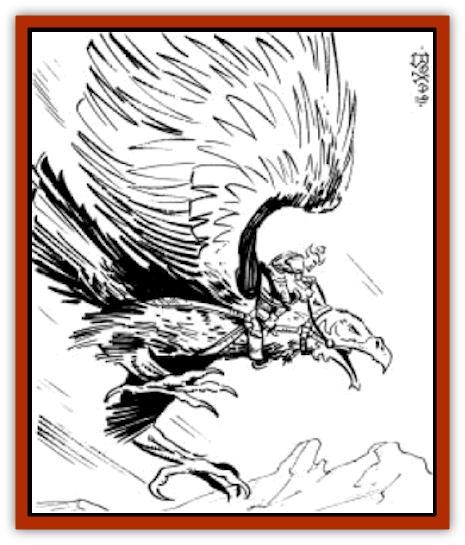

# Roc - Athas

| Statistic | **Roc (Athas)** |
| --- | --- |
| **Activity Cycle:** | Day |
| **Alignment:** | Neutral |
| **Armor Class:** | 6 |
| **Climate/Terrain:** | Mountains |
| **Damage/Attack:** | 3-18/3-18 or 5-30 |
| **Diet:** | Carnivore |
| **Frequency:** | Rare |
| **Hit Dice:** | 15 |
| **Intelligence:** | Animal (1) |
| **Magic Resistance:** | Nil |
| **Morale:** | Steady (11-12) |
| **Movement:** | 6, Fl 48 (D) |
| **No. Appearing:** | 1-2 |
| **No. of Attacks:** | 2 or 1 |
| **Organization:** | Family |
| **Size:** | G (50' long + wingspan) |
| **Special Attacks:** | Surprise, grip |
| **Special Defenses:** | Nil |
| **THAC0:** | 5 |
| **Treasure:** | C |
| **XP Value:** | 9,000 |

The Athasian [[Roc|Roc]] is a huge [[Bird|bird]] of prey that dwells in warm mountainous regions. It is known for carrying off large creatures ([[Kank_Wild|kanks]], [[Animal_Domestic_Athas_I|inix]], and [[Animal_Domestic_Athas_I|erdlu]]) for food.

Rocs resemble [[Eagle|large]] eagles with either dark brown or dirty white plumage. These giant birds are 50 feet long from beak to tail feathers, with wingspreads as wide as 100 feet.

A roc has a very limited language, useful only to warn its mate of danger or, more likely, the presence of food.

**Combat:** The roc swoops down on prey, grasps it in powerful talons, and carries it off to its nest to be devoured at its leisure. The resulting damage is 3d6 per claw. Most of the time (90%), a roc carries off prey only if both claws hit. If the prey was hit by only one claw, the roc usually lets go, then turns around and attempts another grab. Once the prey is securely in its grasp, the roc flies back to its lair. If the creature resists, the roc strikes with its sharp beak, inflicting 5d6 points of damage per hit.

Should a human, humanoid, or demi-human be captured, there is a 60% chance that the victim.s arms are both pinned to his sides, making impossible melee weapon attacks or spellcasting that requires somatic gestures. A roc lets go of its prey if it suffers damage equal to a quarter of its hit points. A roc can pick up two targets simultaneously if they are within 10 feet of each other.

A roc usually cruises at a height of about 3,000 feet, seeking out likely prey with its keen eyes. When a good target is found, the roc swoops down silently. This quiet attack imposes a -3 penalty to its opponents. surprise rolls.

**Habitat/Society:** Roc lairs are vast nests made of trees, branches, and the like. They inhabit the highest regions of the Ringing Mountains. Rocs are not given to nesting close to each other, with a nest rarely being located within 50 miles of another nest. There is a 25% chance of finding 1d3 + 1 eggs in a roc nest. These eggs sell for 2d6x100 ceramic pieces to merchants specializing in rare or exotic items. The price can be twice that to a trainer or potential roc-rider. As may be expected, rocs fight to the death to protect these nests and their contents, gaining a +1 bonus to their attack rolls when defending their nests.

The treasure of a roc is usually strewn about and below the nest, for the creature has no use for treasure. It is the residue from its victims. If the roc has been seizing pack animals, some of that treasure may be merchant's wares such as spices, rugs, perfumes, or even jewels.

**Ecology:** As mentioned before, rocs do not lair close to one another. Such a high concentration of predators would leave the area devastated. Rocs serve to keep down the number of large predators.

It is said that roc feathers are a vital ingredient in the manufacture of *wings* and *brooms of flying*. Using roc feathers in a *fly* spell will add 1d20 rounds to the duration of the spell. Not as well known is the fact that if a mage is scribing a *fly* spell on a scroll, using a perfect roc feather will allow him to double the number of spells that may be scribed with the same amount of ink. (A roc slain in combat usually has no more than 1d20 perfect feathers left, for they must be undamaged and perfectly clean to serve this purpose.)

Rocs are occasionally tamed and used as mounts. The following section details this practice.

**Becoming a Roc-rider**

  The preferred method for capturing a live roc is to stake out a large animal, probably an erdlu. Huge nets are hidden from sight, either magically or covered with sand. When the roc swoops down to grasp its prey, the nets are thrown over the roc, usually by means of attached ballista bolts, or, again, with magical aid. A netted roc struggles until it realizes it cannot fly, then it gives up. For purposes of tearing its way free of a net, a roc has a strength of 24, giving it a 95% chance to tear through an ordinary net. Therefore, the nets used must be very strong. A reinforced net with at least 1" thick ropes lowers the rocs chance to break free to only 60%. A net made entirely of [[Cha'thrang|cha'thrang]] lines works the best, giving the roc only a 40% chance to tear free. The amount of line required makes this type of net very difficult to acquire. Since the rocs have such good eyesight, concealment of the net and captors must be total. Unless the would-be captors are magically or psionically hidden, the roc receives a normal surprise roll. Unless it is surprised, it has detected something wrong and flies off to find other prey.

Another option, hatching and raising a roc, is time consuming and expensive. A roc egg must be kept warm and dry. The incubation period for a roc egg is three months, and it is up to the DM to decide how close the egg was to hatching when it was found. Once hatched, the baby bird is 5 feet long, with stubby wings spreading out to about 13 feet. The bird is voraciously hungry, and many a careless trainer has become his birds first meal. The chick must be fed at least four large animals a day; rocs seem to do best on erdlus. This continues for a year. During this time the roc must be fed only by one person, and that person must spend several hours a day (usually after feedings), talking to and "bonding" with the chick. After a year of this, the roc is ready to fly, and its training can begin. Such chicks "bond" to their trainers, never allowing anyone to ride them unless the trainer is present. Only the trainer can control the bird. A bonded roc fights to the death for its owner, even at only six months of age.

Difficult as it is, capturing or hatching a live roc is the easy part. Once captured, the roc must be trained. The would-be trainer had better have a herd of erdlus he can spare for food as well. An adult roc needs at least 200 pounds of meat every day, just to survive. It will eat twice that much if it can, and a trainer is better off overfeeding a roc or he may end up on the menu.

When captured as an adult, a roc takes three months just to calm down. During this time, if one person brings it food, talks to it (from the outside of a cage) and in general treats it well, the roc should allow him to approach without immediately trying to eat him. Another two months of contact, feeding, and care and the roc will allow itself to be ridden, but only by the trainer. Since adult rocs do not bond to their trainers, friendship is about the best that trainer can hope for.

When it is ready to ride, a special saddle must be placed on the roc. Such saddles have straps that loop around the lower chest and just behind the legs. A saddle generally has a seat for the trainer/rider as well as space to tie down cargo or other possessions. Otherwise, a roc can easily carry 8 man-sized creatures, and some saddles are constructed this way. It is entirely up to the trainer, since such saddles have to be fitted to the individual roc. Only the trainer can do the fitting, although he can have a hideworker or leatherworker assist in the actual crafting of the saddle. At first the roc must be fitted with blinders over its eyes, although it is capable of learning to follow verbal commands.

After all of this preparation comes the time for the first ride; the roc must be mounted and released into the air. This is a momentous occasion and determines the success or failure of the whole process.

At this time the DM makes a judgement as to the treatment received by the roc, taking into account feeding, care, and general affection shown by the trainer. If treatment is exemplary, the trainer may make a normal animal handling proficiency check. (Bonded riders receive a -5 bonus to the proficiency check.) If it is less than exemplary, the DM may impose a modifier of up to a -10 penalty on the roll. Success indicates that the trainer has won over the roc, and is able to work with it. Failure means that the roc rebels and tries to escape. It does barrel rolls, sudden dives, tries to reach the rider with its beak, whatever it can. This continues for one hour per point the check was failed by. If the rider can manage to stay on for the whole time, the roc finally gives up and accepts his rider.

The fastest and most dangerous method for taming a roc is to mount a saddle on it immediately after capturing it. The roc is then released, and the rider must do his best to stay on. The battle in the skies is something to see. The ride never lasts for less than a day and may last as much as two full days. (5d6+20 hours). For the first four hours the rider can do nothing but hang on. For each hour afterwards, he must talk to and attempt to sooth the roc. The rider must have the airborne riding proficiency and must roll a successful check each hour of the ride. He must also have the animal handling proficiency, but is not allowed a roll on the skill until six hours have passed. The roll is made at a -12 penalty, with an additional roll each hour. The number of hours spent riding is subtracted from the roll, one per three hours. If/when the roll is lower than the riders proficiency score, he has broken the roc.

There are stories of riders who succeeded in staying on, or tied themselves on, only to fall asleep during the ride. Such riders are usually never seen again, for the roc returns to its home, where its mate quickly makes a meal of the unsuspecting rider. A fresh rider should have no trouble staying awake for at least 15 hours, but must make a Constitution check each hour after that. This does not apply to [[Mul|muls]] or [[Thri-kreen|thri-kreen]], of course. Druids or others who can speak with animals can cut the riding time in half.

Once it has been trained, or broken, a roc can be taught to swoop and attack on command. This takes another two months. The saddle and harness interfere with beak attacks, so the preferred method is to have the roc pick something up, circle high, and drop the seized beings to their deaths. A roc in harness can attack with its beak, but it receives a -4 attack roll penalty, and the rider can do nothing but hang on. Melee weapons have little use for someone mounted on a roc, although a large lance can be a devastating weapon, doing double damage to other flying opponents or to large opponents on the ground. A gliding roc is also a fairly stable place from which to fire a crossbow. A roc can be trained to carry boulders and drop them on command. A roc can carry a pair of 200 pound boulders with no loss of speed or maneuverability. It receives a -4 penalty on its attack rolls when using boulders in this manner. Each such boulder does 5d10 points of damage.

A roc is also an excellent beast of burden. A roc with a single rider can carry a thousand pounds of cargo with no decrease in maneuverability or speed. In an emergency a roc can carry twice that much cargo, although its speed decreases to 36 and its maneuverability to E. A roc can even be trained to hunt for its master, returning to camp with its prey.

---
## Discovery & Documentation

**Source Publication:** MC12 Dark Sun Appendix I - Terrors of the Desert (1991)
**Campaign Setting:** Dark Sun
**Author(s):** Tom Prusa, Louis J. Prosperi, Walter M. Baas

### Other Creatures Found in This Source Book
   * [[Animal_Herd_Athas|Animal, Herd (Athas)]]
   * [[Animal_Household_Athas|Animal, Household (Athas)]]
   * [[Antloid_Desert|Antloid, Desert]]
   * [[Banshee_Dwarf|Banshee, Dwarf]]
   * [[Beetle_Agony|Beetle, Agony]]
   * [[Bog_Wader|Bog Wader]]
   * [[Brambleweed|Brambleweed]]
   * [[B'rohg|B'rohg]]
   * [[Burnflower|Burnflower]]
   * [[Cat_Psionic|Cat, Psionic]]
   * [[Cha'thrang|Cha'thrang]]
   * [[Cistern_Fiend|Cistern Fiend]]
   * [[Clam_Giant|Clam, Giant]]
   * [[Cloud_Ray|Cloud Ray]]
   * [[Drake_Athas_Air|Drake (Athas), Air]]
   * [[Drake_Athas_Earth|Drake (Athas), Earth]]
   * [[Drake_Athas_Fire|Drake (Athas), Fire]]
   * [[Drake_Athas_Water|Drake (Athas), Water]]
   * [[Dune_Runner|Dune Runner]]
   * [[Dune_Trapper|Dune Trapper]]
   * [[Elemental_Athas_Greater_Air|Elemental (Athas), Greater, Air]]
   * [[Elemental_Athas_Greater_Earth|Elemental (Athas), Greater, Earth]]
   * [[Elemental_Athas_Greater_Fire|Elemental (Athas), Greater, Fire]]
   * [[Elemental_Athas_Greater_Water|Elemental (Athas), Greater, Water]]
   * [[Elemental_Athas_Lesser_Air_Earth|Elemental (Athas), Lesser, Air/Earth]]
   * [[Elemental_Athas_Lesser_Fire_Water|Elemental (Athas), Lesser, Fire/Water]]
   * [[Elemental_Athas_General_Information|Elemental (Athas), General Information]]
   * [[Erdland|Erdland]]
   * [[Esperweed|Esperweed]]
   * [[Flailer|Flailer]]
   * [[Floater|Floater]]
   * [[Giant_Athas|Giant (Athas)]]
   * [[Golem_Athas_I|Golem (Athas) I]]
   * [[Golem_Athas_II|Golem (Athas) II]]
   * [[Golem_Athas_III|Golem (Athas) III]]
   * [[Golem_Athas_General_Information|Golem (Athas), General Information]]
   * [[Halfling_Renegade|Halfling, Renegade]]
   * [[Hej-kin|Hej-kin]]
   * [[Id_Fiend|Id Fiend]]
   * [[Insect_Swarm_Athas|Insect Swarm (Athas)]]
   * [[Kank_Wild|Kank, Wild]]
   * [[Kirre|Kirre]]
   * [[Megapede|Megapede]]
   * [[Mul_Wild|Mul, Wild]]
   * [[Nightmare_Beast|Nightmare Beast]]
   * [[Plant_Carnivorous_Athas|Plant, Carnivorous (Athas)]]
   * [[Pterran|Pterran]]
   * [[Pterrax|Pterrax]]
   * [[Pulp_Bee|Pulp Bee]]
   * [[Pyreen|Pyreen]]
   * [[Rasclinn|Rasclinn]]
   * [[Razorwing|Razorwing]]
   * [[Sand_Bride|Sand Bride]]
   * [[Sand_Cactus|Sand Cactus]]
   * [[Sand_Vortex|Sand Vortex]]
   * [[Scrab|Scrab]]
   * [[Silt_Horror|Silt Horror]]
   * [[Silt_Runner|Silt Runner]]
   * [[Sink_Worm|Sink Worm]]
   * [[Sloth_Athas|Sloth (Athas)]]
   * [[So-ut|So-ut]]
   * [[Spider_Cactus|Spider Cactus]]
   * [[Spider_Crystal|Spider, Crystal]]
   * [[Spirit_of_the_Land|Spirit of the Land]]
   * [[T'Chowb|T'Chowb]]
   * [[Thrax|Thrax]]
   * [[Tohr-kreen_I|Tohr-kreen I]]
   * [[Villichi|Villichi]]
   * [[Zhackal|Zhackal]]
   * [[Zombie_Plant|Zombie Plant]]
