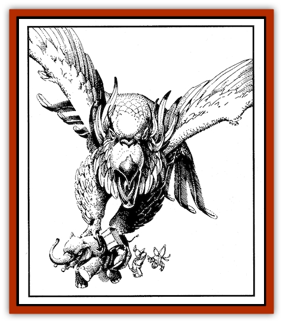

# Roc - Zakharan

| Statistic | **Common Roc** | **Great Roc** | **Two-headed Roc** |
| --- | --- | --- | --- |
| **Activity Cycle:** | Day | Day | Day |
| **Alignment:** | Neutral | Neutral | Chaotic evil |
| **Armor Class:** | 4 | 2 |  |
| **Climate/Terrain:** | Semitropical/mountains/ocean | Semitropical/mountains/ocean | Semitropical/mountains/ocean |
| **Damage/Attack:** | 3-18/3-18 or 4-24 (3d6/3d6 or 4d6) | 4-24/4-24 or 6-36 (4d6/4d6 or 6d6) | 3-18/3-18 or 4-24/4-24 (3d6/3d6 or 4d6/4d6) |
| **Diet:** | Omnivore | Omnivore | Omnivore |
| **Frequency:** | Rare | Very rare | Very rare |
| **Hit Dice:** | 18 | 24 | 16 |
| **Intelligence:** | Animal (1) | Low (5-7) | Low (5-7) |
| **Magic Resistance:** | Nil | Nil | Nil |
| **Morale:** | Steady (11) | Elite (13) | Elite (13) |
| **Movement:** | 3, Fl 30 (C) | 3, Fl 24 (C) | 34, FL 24 (C) |
| **No. Appearing:** | 1-2 | 1 | 1-2 |
| **No. of Attacks:** | 2 claw or 1 bite | 2 claw or 1 bite | 2 claw or 1 bite |
| **Organization:** | Solitary | Solitary | Solitary |
| **Size:** | G (60 ft. long, 120.ft. wingspan) | G (120 ft. long, 270-ft. wingspan) | G (60 ft. long, 120.ft. wingspan) |
| **Special Attacks:** | Swoop with -5 to opponent's surprise; snare (95% chance or better) | Boulder attack (3d10) | Boulder attack (3d10/3d10) |
| **Special Defenses:** | Nil | Nil | Nil |
| **THAC0:** | 5 | 5 | 5 |
| **Treasure:** | C | D | D |
| **XP Value:** | 12,000 | 18,000 | 14,000 |

Rocs are huge raptors that dwell in Zakharan mountains and on rocky, secluded islands. They frequent regions in which they can readily find large prey, such as the mountains bounding the Ruined Kingdoms and the island of Afyal. A few, for whom pickings are slim, have been seen soaring over desert wastes and open expanses of ocean.

In the Land of Fate, these birds have brilliant, multicolored plumage. Their wings and backs are typically a shade of green or gold, and females have snowy breasts. Their heavy, powerful beaks range from pale ivory to a rich shade of brass. The color of a roc's wing tips (the forward edge) distinguishes it from other species: crimson, common roc; azure, great roc; jet, two-headed roc. Males of each species have matching crests. Some adventurers claim to have seen rocs that are purely white, black, or red, but such creatures are so rare as to be legendary.

 Size also distinguishes the species. The common roc, still magnificent, measures roughly 60 feet from its beak to the tip of its tail. It has a wingspan of about 120 feet. In contrast, the great roc measures up to 120 feet from beak to tail and has a wingspan of 270 feet. Except for its black-tipped wings, the rare two-headed roc is the same general size and color as the common roc. However, its two heads—characterized by an evil disposition and increased intelligence - are an obvious distinguishing feature.

 Intelligent rocs speak their own language as well as Midani. In addition, they can communicate their wishes to lesser rocs (as in "we wish you to leave the area immediately").

**Combat:**The roc usually fights for two reasons: to feed or to protect its nest. If caught unaware and not hungry (a rare case), it uses its great speed to evade an equal or stronger opponent. Even on a full stomach, however, it may hold its ground and fight a pest who seems easy to destroy.

While hunting, rocs usually soar at a height of 300 to 500 feet, using their extremely sharp eyesight to spot prey on the ground. A roc's vision can penetrate ground fog, spray, dust storms, and shallow water. They can swoop down to seemingly "appear out of nowhere" and then disappear just as quickly, with little more than a gust of wind to mark their passage.

 All roc species share this hunting tactic: (1) swoop and attack with claws; (2) seize prey in claws, attempting to pin arms if necessary (65 percent chance, prevents spellcasting); and (3) carry prey to nest, using bites as needed to subdue victim. Victims of a sudden swoop attack suffer a -5 penalty to their surprise rolls. If the roc must swoop at the same target more than once to seize it, the penalty does not apply. Damage and snaring success vary with the roc species:

 A common or two-headed roc inflicts 3 to 18 (3d6) points of damage per claw. If both claws hit, the roc has a 95 percent chance to carry off its prey, which can be size Huge (up to 25 feet tall or long) or smaller.

 A great roc inflicts 4 to 24 (4d6) points of damage per claw. If either claw hits a target that is size Large or smaller, the roc can carry it off automatically (if desired). If both claws strike a Gigantic creature, the great roc has a 95 percent chance of carrying it off.

 If a seized victim attempts a counterattack, the bird will maintain its hold while punishing the quarry with bites (4d6 damage per strike). Regardless of its size, a roc won't release its prey until the roc suffers damage equaling 25 percent of its hit points (based on its total when combat began). Sufficient damage convinces the roc that the meal at hand isn't worth the effort. A morale check determines whether the roc flees.

 Given a choice of two succulent or easy targets, rocs usually select the larger (a camel instead of its rider, for example). However, any roc can seize two different targets with its claws, provided the targets are within 10 feet of one another. The twoheaded roc can also attack two targets within 10 feet - choosing either two bite attacks or two claw attacks.

 Given their intelligence, the great roc and two-headed roc may use rather sophisticated combat tactics. To prevent annoyances, for example, a great roc may scatter or destroy pesky shepherds before settling down to dine upon livestock.

 The more intelligent species also use large boulders as "nutcrackers," dropping the stones from the air to sink ships or demolish structures, exposing the "softer meat" inside. Such boulders inflict 3 to 30 (3d10) points of damage normally, and require ships, walls, and towers to make saving throws vs. crushing blow or be destroyed. A two-headed roc can make two boulder attacks per round.

**Habitat/Society:**All roc species share a number of traits. They build their nests upon the tallest mountain, rocky outcrop, or perch in their territory, using branches and even whole trees in the construction. They are not social creatures. Each is highly territorial, especially against invasions by other rocs (excluding a suitable mate) and other large, flying creatures (such as the occasional dragon). A typical roc territory is a circle with a 10- mile radius, placing at least 20 miles between two nests.

If a roc nest is found, there is a 15 percent chance that it contains either 1d4 +1 eggs or 1d4 +1 hatchlings. (Roll 1d100; 01-50 indicates eggs, and 51-00 indicates hatchlings.) Hatchlings are 4 HD each, but relatively helpless, with an AC of 10 and no attacks. Adults will fight to the death (morale of fearless, 18) to protect their eggs or young, gaining a +1 bonus to attacks. After six months in the nest, a roc has grown enough to leave it, and the roc gains the combat statistics of an adult.

 All rocs feed at least three times daily: just after sunrise, at midday, and an hour before sunset. If there are young in the nest, there will be a midafternoon feeding flight as well. Heroes accustomed to being raised from the dead after mischances in the wilderness should beware: like many other birds, rocs partially digest their prey for their chicks, grinding it in a stone-filled gullet before they regurgitate it. While this has no effect on their chances of being raised, adventurers should plan on a long (and unpleasant) recovery period thereafter.

 When dealing with humans or humanoids, great rocs tend to imperious, quickly becoming bored and hungry. Two-headed are more sly and (given their own evil bent) may be persuade aid in some villainy if the result will be a lot of dead herd animals.

 Rocs do not value treasure except for its value as a shiny bauble. Male two-headed rocs build nests and festoon them with such treasure in hopes of attracting mates. A cheap but gleaming gem appeals to these males more than a dull but priceless ore. Common and great rocs have no such compulsion; they leave their riches strewn carelessly about their nests like trash. Most of their treasures are the inedible remains of pack animals-tack and harness, rugs, silks, tapestries, clothing, spices, perfume, caravan bells, and the occasional bar of metal or gemstone.

**Ecology:** All rocs are difficult to raise, given their independent nature and huge appetites. Individual adventurers have been known to train roc chicks. Some sorcerers have ensnared rocs magically. According to legend, a tribe of jann near the World Pillars has even used rocs as mounts, but the story's veracity is questionable.

 Rocs prey on the largest surmountable creatures they can find in their area. On land, they attack elephants, camels, purple worm ankhegs, and giants, and few rocs will pass up a light snack of undefended humans. At sea, they hunt like ospreys, snagging dolphins, elephant seals, and sharks from the water. The great rocs will even carry off kraken, giant squid, sea serpents, and whales, in addition to attacking ships. Even mated pairs of common rocs have been known to attack a sailing vessel or a dragon.

 Roc eggs are valued as an exotic item or curiosity, and as a component for magical potions and oils. The egg of a common roc is the color of ivory. A great roc's stunning eggs are dappled with shades of turquoise and indigo, while a two-headed roc's are jet black. A merchant will pay 2d6 x 100 gp for the egg of an ordinary roc, twice that for the egg of a two-headed roc, and twice that again (2d6 x 400) for the egg of a great roc. Such eggs must be kept continually warm if they are to hatch, for the unborn chicks are sensitive to cold, and without the protection of their parent on the nest would soon perish. The inability to hatch does not diminish an egg's value as a curiosity, however.

---
## Discovery & Documentation

**Source Publication:** Land of Fate Box Set (1992)
**Campaign Setting:** Al-Qadim (Forgotten Realms)
**Author(s):** Jeff Grubb, Andria Hayday, Fred Fields, Karl Waller, David C. Sutherland III, Robin Raab, Stephanie Tabat, Dori Watry, Angelika Lokotz, John Knecht, Julia Martin, Jon Pickens, John Rateliff, Dori Watry, Thomas Reid, Michele Carter, Tim Beach, David Hirsch, Slade Henson.

### Other Creatures Found in This Source Book
   * [[Genie_of_Zakhara_Dao|Genie of Zakhara, Dao]]
   * [[Genie_of_Zakhara_Djinni|Genie of Zakhara, Djinni]]
   * [[Genie_of_Zakhara_Efreeti|Genie of Zakhara, Efreeti]]
   * [[Genie_of_Zakhara_Janni|Genie of Zakhara, Janni]]
   * [[Genie_of_Zakhara_Marid|Genie of Zakhara, Marid]]
   * [[Giant_Island|Giant, Island]]
   * [[Giant_Ogre|Giant, Ogre]]
   * [[Yak-Man|Yak-Man]]
