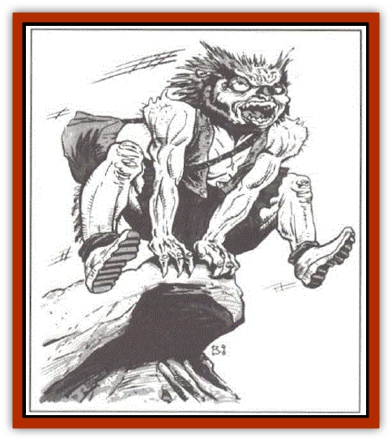

# Rock Hopper

| Statistic | **Rock Hopper** |
| --- | --- |
| **Activity Cycle:** | Day |
| **Alignment:** | Lawful good |
| **Armor Class:** | 7 |
| **Climate/Terrain:** | Asteroids |
| **Damage/Attack:** | 1-6 |
| **Diet:** | Omnivore |
| **Frequency:** | Common |
| **Hit Dice:** | 2 |
| **Intelligence:** | Average (8-10) |
| **Magic Resistance:** | Nil |
| **Morale:** | Average (8-10) |
| **Movement:** | 6 |
| **No. Appearing:** | 5-12 per skiff |
| **No. of Attacks:** | 1 |
| **Organization:** | Clan/crew |
| **Size:** | S (3' tall) |
| **Special Attacks:** | Nil |
| **Special Defenses:** | Multiple bodies |
| **THAC0:** | 19 |
| **Treasure:** | U |
| **XP Value:** | 35 |

Rock Hoppers are small humanoids about the size of [[Gnome|gnomes]]. Their backs and the backs of their arms and legs are covered with very short, white hair. A much thicker, stiffer mane of hair grows across the top of their heads. Their noses are small, pointy, and covered by a hard shell, almost like a beak. Overall, they have a very [[Owl|owl]]ish appearance.

Typical rock hopper dress consists of a short leather skirt or kilt, a stiff vest, leather arm guards, and sandals or low boots. They always carry a variety of tools in a shoulder bag; they often wield knives or short swords.

Rock hoppers are almost never encountered far from their skiffs. If they aren't traveling, they are making repairs, camped alongside, or gathering or exploring nearby.

**Combat:** Rock hoppers are not combative by nature. They generally do not attack strangers unless they clearly present a threat. Given an avenue of escape. rock hoppers usually choose discretion over valor. This is not out of cowardice, but simple, honest realization of the fact that they are weaker than most other wildspace travelers.

Rock hoppers live in asteroid fields. They are nomadic, so they rarely build permanent bases. When they do, they excavate rooms and tunnels into the asteroids, often including hangars for their skiffs.

Rock hoppers build skiffs that they use to travel between the asteroids. These skiffs are not magical and do not carry spelljamming helms. Instead they are powered by propellers that operate from a turncrank attached to foot pedals. The pedalers sit on benches in much the same way that rowers sit in a Viking longboat. A system of gears transmits their effort to a central drive shaft that runs the length of the skiff to one or sometime two propellers at the rear. This propeller churns through the air inside the skiff's air envelope and moves the skiff forward. (Several scholars who have examined the rock hopper propulsion system have declared that it simply cannot work. These sages' only response to the fact that it obviously does work is that there is no reason why it should, and therefore it cannot.)

Using their skiffs, rock hoppers travel from asteroid to asteroid (their skiffs carry too little air for longer voyages). Upon reaching a likely-looking spot, they raise their colorful awnings to shield themselves from the sun, explore, maintain their skiffs, and hunt. Their main source of food is the herds of [[Scavver|scavvers]] they presumably cultivated at some time in the past, but which now roam freely throughout the asteroids. The rock hoppers follow these herds on their migrations, pedaling out to hunt them with harpoons when the need arises. They hunt gray and night scavvers primarily for food, while they hunt brown scavvers for poison. They hunt void scavvers for sport and to protect themselves.

Each rock hopper skiff carries a small cask of brown starver poison for use in special circumstances. Primarily, this is reserved for those rare times when the rock hoppers encounter a [[Kindori|kindori]]. Though they do not seek out these space whales, they have been known to kill kindori with poisoned harpoons in chases lasting days or even weeks.

**Ecology:** Sages do not believe that rock hoppers are native to the asteroids. Rather they were transplanted there long ago by some unknown agency. It is known that they will not trade with the [[Arcane|arcane]], and many sages believe that therein lies the secret of their condition.

---
## Discovery & Documentation

**Source Publication:** MC7 Spelljammer Appendix I (1990)
**Campaign Setting:** Advanced Dungeons & Dragons 2nd Edition
**Author(s):** various

### Other Creatures Found in This Source Book
   * [[Aartuk|Aartuk]]
   * [[Albari|Albari]]
   * [[Ancient_Mariner|Ancient Mariner]]
   * [[Argos|Argos]]
   * [[Beholder_Abomination_Astereater|Beholder (Abomination), Astereater]]
   * [[Blazozoid|Blazozoid]]
   * [[Chattur|Chattur]]
   * [[Chevall|Chevall]]
   * [[Clockwork_Horror|Clockwork Horror]]
   * [[Colossus|Colossus]]
   * [[Delphinid|Delphinid]]
   * [[Dizantar|Dizantar]]
   * [[Dog|Dog]]
   * [[Dog_Bog_Hound|Dog, Bog Hound]]
   * [[Esthetic|Esthetic]]
   * [[Focoid|Focoid]]
   * [[Fractine|Fractine]]
   * [[Giant_Spacesea|Giant, Spacesea]]
   * [[Golem_Furnace|Golem, Furnace]]
   * [[Golem_Radiant|Golem, Radiant]]
   * [[Gravislayer|Gravislayer]]
   * [[Grommam|Grommam]]
   * [[Hadozee|Hadozee]]
   * [[Hamster_Giant_Space|Hamster, Giant Space]]
   * [[Jammer_Leech|Jammer Leech]]
   * [[Lakshu|Lakshu]]
   * [[Lumineaux|Lumineaux]]
   * [[Lutum|Lutum]]
   * [[Mimic_Space|Mimic, Space]]
   * [[Misi|Misi]]
   * [[Moon_Rogue|Moon, Rogue]]
   * [[Mortiss|Mortiss]]
   * [[Murderoid|Murderoid]]
   * [[Nay-Churr|Nay-Churr]]
   * [[Phlog-Crawler|Phlog-Crawler]]
   * [[Plasman|Plasman]]
   * [[Plasmoid_DeGleash|Plasmoid, DeGleash]]
   * [[Plasmoid_DelNoric|Plasmoid, DelNoric]]
   * [[Plasmoid_General_Information|Plasmoid, General Information]]
   * [[Plasmoid_Ontalak|Plasmoid, Ontalak]]
   * [[Puffer|Puffer]]
   * [[Q'nidar|Q'nidar]]
   * [[Rastipede|Rastipede]]
   * [[Reigar|Reigar]]
   * [[Slinker|Slinker]]
   * [[Spider_Asteroid|Spider, Asteroid]]
   * [[Spiritjam|Spiritjam]]
   * [[Survivor|Survivor]]
   * [[Syllix|Syllix]]
   * [[Symbiont_Power|Symbiont, Power]]
   * [[Vine_Infinity|Vine, Infinity]]
   * [[Wiggle|Wiggle]]
   * [[Wizshade|Wizshade]]
   * [[Wryback|Wryback]]
   * [[Zard|Zard]]
   * [[Zodar|Zodar]]
