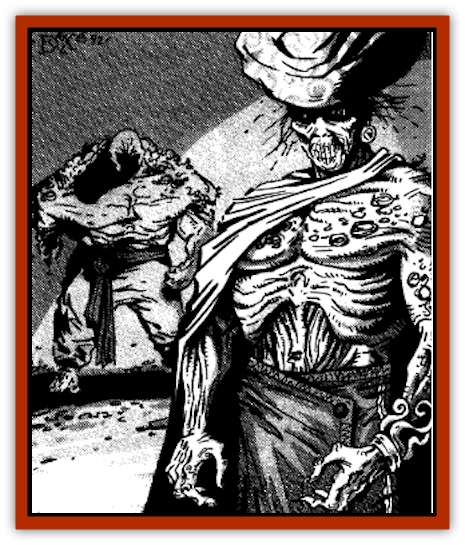

# Rom

| Statistic | **Rom** |
| --- | --- |
| **Activity Cycle:** | Night |
| **Alignment:** | Lawful evil |
| **Armor Class:** | 1 |
| **Climate/Terrain:** | Subterranean wilderness |
| **Damage/Attack:** | 1d10+8 |
| **Diet:** | None |
| **Frequency:** | Rare |
| **Hit Dice:** | 15+1 |
| **Intelligence:** | Low (5-7) |
| **Magic Resistance:** | Nil |
| **Morale:** | Fearless (19) |
| **Movement:** | 12 |
| **No. Appearing:** | 1-8 |
| **No. of Attacks:** | 1 |
| **Organization:** | Tribal |
| **Size:** | H (17' tall) |
| **Special Attacks:** | Throwing rocks, strength drain, fear |
| **Special Defenses:** | See below |
| **THAC0:** | 2 (5) |
| **Treasure:** | R (D) |
| **XP Value:** | 10,000 |

The rom are a race of subterranean, undead [[Giant_Zakhara_General_Information|giants]] that withdrew from the surface world in the distant past. They are sullen, malicious, and angry creatures, attacking any who disturb their final dwelling places or cairns.

Rom are all male. They have tall, muscular physiques, similar to humans in proportion, with thinning, bone-white hair, sunken, glassy eyes, long, curling fingernails, and ashen-gray skin. They stand about 17' tall, retaining the supernatural Strength they possessed in life (20). They speak with sad, resonant voices. All are talented singers, poets, and musicians.

The rom, like most living giants, carry some of their belongings in a large sack. Their more valuable treasures remain hidden safely in their cairns. A rom's sack will typically include 1-12 throwing rocks, some treasure, and 1-8 personal items (including a musical instrument of some sort, usually a flute).

Rom speak their own language and that of [[Giant_Desert|desert giants]] and [[Giant_Jungle|jungle giants]]. Most (75%) can also speak Common.

**Combat:** The rom are terrifying enemies. Intruding upon their cairns uninvited is a good way to earn their enmity and an early demise. A single blow from their strong arm inflicts 1d10+8 points of damage and drains the victim of 1-4 points of Strength. When a victim's Strength drops below 0, he is slain, drained of life force by the rom's chilling touch. Lost Strength points return at a rate of 1 point per day of rest.

In addition, rom radiate an *aura of fear* in a 30-foot radius. Creatures of less than 2 Hit Dice automatically flee (no save). All others in the area of effect are entitled to a saving throw vs. spells. Those who make their saves can attack the rom without penalty; those who fail suffer a -2 penalty to their attack and damage rolls and a +2 penalty to their Armor Class.

Although rom rarely have the opportunity to throw rocks in their subterranean crypts, they have been known to hurl them at retreating intruders or while defending their lairs against an assault. They can throw rocks up to 300 yards, inflicting 2-24 points of damage with a successful hit.

Rom can only be affected by +2 or better magical weapons. Enchantment/charm and cold-based spells have no effect on them. Like all undead, they are immune to poison and paralysis. They are turned as "Special" undead.

**Habitat/Society:** Rom are thought to be all that remains of an ancient race of giant herdsmen. They lived in the hills and on the plains where their giant cows could graze, some practicing a limited form of agriculture. They were a quiet, peace-loving people whose end came when their wives produced only male children; there were no further generations.

Shaking their fists at the sad destiny Fate had passed upon them, they built enormous stone cairns for themselves, fashioned out of monolithic granite slabs. Entire clans of rom descended into their self-made tombs, burying themselves alive. However, so great was their collective self-pity and anger at Fate, that their existence persisted beyond death.

Their granite cairns can still be found today, towering over the plains or nestled among the hills. They are shunned by all forms of animal and insect life. Nearby vegetation appears stunted and lacks its usual color. All is quiet near these tombs during the day, but at night, one can hear a loud lamentation rising from within the cold, stone cairns, a plaintive cry against Fate.

The giants are known to receive brave visitors during the night, who politely knock on the entrance to the tombs and humbly request hospitality for the evening. Those who brashly intrude on the giants during the night, or who break into a cairn during the day, will be immediately attacked by the 1-8 rom present in the tomb. They will throw any corpses outside as a warning to others against further unwarranted intrusions.

**Ecology:** As undead, the rom no longer play a part in the world's ecology. They remain buried in their tombs, never venturing outside except to punish uncivil intruders.

The rom are a musical and poetic race. Brave bards who have visited with them for only a short while are said to have been inspired to compose a masterful, if tragic, song or epic poem. If recited or sung at night, it will have the same effect on the audience as if the bard were playing pipes of haunting. The performance is so emotionally demanding on the bard that it can only be attempted once per week.

---
## Discovery & Documentation

**Source Publication:** MC13 Al-Qadim Appendix (1992)
**Campaign Setting:** Al-Qadim (Forgotten Realms)
**Author(s):** C. Terry Phillips

### Other Creatures Found in This Source Book
   * [[Ammut|Ammut]]
   * [[Ashira|Ashira]]
   * [[Asuras|Asuras]]
   * [[Black_Cloud_of_Vengeance|Black Cloud of Vengeance]]
   * [[Buraq|Buraq]]
   * [[Camel|Camel]]
   * [[Camel_of_the_Pearl|Camel of the Pearl]]
   * [[Centaur_Desert|Centaur, Desert]]
   * [[Copper_Automaton|Copper Automaton]]
   * [[Debbi|Debbi]]
   * [[Elephant_Bird|Elephant Bird]]
   * [[Gen|Gen]]
   * [[Genie_Noble_Dao|Genie, Noble Dao]]
   * [[Genie_Noble_Djinni|Genie, Noble Djinni]]
   * [[Genie_Noble_Efreeti|Genie, Noble Efreeti]]
   * [[Genie_Noble_Marid|Genie, Noble Marid]]
   * [[Genie_Tasked_Architect_Builder|Genie, Tasked, Architect/Builder]]
   * [[Genie_Tasked_Artist|Genie, Tasked, Artist]]
   * [[Genie_Tasked_Guardian|Genie, Tasked, Guardian]]
   * [[Genie_Tasked_Herdsman|Genie, Tasked, Herdsman]]
   * [[Genie_Tasked_Slayer|Genie, Tasked, Slayer]]
   * [[Genie_Tasked_Warmonger|Genie, Tasked, Warmonger]]
   * [[Genie_Tasked_Winemaker|Genie, Tasked, Winemaker]]
   * [[Ghost_Mount|Ghost Mount]]
   * [[Ghul|Ghul]]
   * [[Giant_Desert|Giant, Desert]]
   * [[Giant_Jungle|Giant, Jungle]]
   * [[Giant_Reef|Giant, Reef]]
   * [[Giant_Zakhara_General_Information|Giant (Zakhara), General Information]]
   * [[Hama|Hama]]
   * [[Heway|Heway]]
   * [[Living_Idol|Living Idol]]
   * [[Lycanthrope_Werehyena|Lycanthrope, Werehyena]]
   * [[Lycanthrope_Werelion|Lycanthrope, Werelion]]
   * [[Markeen|Markeen]]
   * [[Maskhi|Maskhi]]
   * [[Mason_Wasp_Giant|Mason Wasp, Giant]]
   * [[Nasnas|Nasnas]]
   * [[Pahari|Pahari]]
   * [[Sabu_Lord|Sabu Lord]]
   * [[Sakina|Sakina]]
   * [[Serpent_Lord|Serpent Lord]]
   * [[Serpent_Winged|Serpent, Winged]]
   * [[Silat|Silat]]
   * [[Simurgh|Simurgh]]
   * [[Stone_Maiden|Stone Maiden]]
   * [[Vishap|Vishap]]
   * [[Zaratan|Zaratan]]
   * [[Zin|Zin]]
