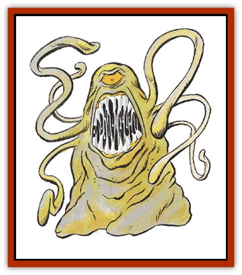

# Roper

| Statistic | **Roper** |
| --- | --- |
| **Activity Cycle:** | Darkness |
| **Alignment:** | Chaotic evil |
| **Armor Class:** | 0 |
| **Climate/Terrain:** | Subterranean |
| **Damage/Attack:** | 5-20 |
| **Diet:** | Carnivore |
| **Frequency:** | Rare |
| **Hit Dice:** | 10-12 |
| **Intelligence:** | Exceptional (15-16) |
| **Magic Resistance:** | 80% |
| **Morale:** | Champion (15) |
| **Movement:** | 3 |
| **No. Appearing:** | 1-3 |
| **No. of Attacks:** | 1 |
| **Organization:** | Solitary |
| **Size:** | L (9' long) |
| **Special Attacks:** | Strands, strength drain |
| **Special Defenses:** | See below |
| **THAC0:** | 10 HD: 11 / 11-12 HD: 9 |
| **Treasure:** | See below |
| **XP Value:** | 10 HD: 10,000 / 11 HD: 11,000 / 12 HD: 12,000 |

A roper resembles a rocky outcropping. The creature's hide is yellowish gray and rough, and its body very malleable. They are usually pillar-like in shape, 9 feet tall, about 3 feet in diameter at the base, and about 1 foot in diameter at the top. The roper has a single yellow eye, and a maw ringed with sharp teeth.

Halfway up its body are small bumps which are the sources of the strands it fires at opponents (see below). Ropers have the same body temperature as their surroundings.

**Combat:** A roper can stand upright to resemble a stalagmite, lie on the ground to imitate a boulder, or even flatten itself to look like a lump on a cavern floor. They can change color a little, enough to blend into rocky backgrounds. Opponents suffer a -2 penalty to surprise rolls when faced by a roper.

Ropers attack by shooting strong, sticky strands at opponents. They can shoot a total of six strands, one per round, as far as 50 feet; each strand can extend (1d4+1)x10 feet and pull up to 750 pounds. Each time a strand hits (requiring a normal attack roll), the victim must make a successful saving throw vs. poison or lose half its Strength (round fractions down). Strength loss occurs 1d3 round after a hit, is cumulative for multiple hits, and lasts for 2d4 turns.

If a roper's prey cannot break free, it is pulled 10 feet closer per round; when it reaches the roper, the creature bites the victim for 5d4 points of damage (automatic hit against a victim held by a strand). A strand can be pulled off or broken by a character who makes a successful open doors roll. A strand can also be cut; it is AC 0, and it must take at least 6 points damage from a single hit of an edged weapon to be severed.

Ropers are unaffected by lightning and take only half damage from cold-based attacks. They have a -4 penalty to saving throws vs. fire.

**Habitat/Society:** Ropers are not social and rarely cooperate with one another, though a group of them may be found in a good hunting spot. A group of ropers has been named a "cluster" by scholars with nothing better to do.

Ropers reproduce asexually by shedding some of their material in the form of a seed. Drawing nutrients from the cavern floor (and perhaps siphoning magical energies from deep within the earth), the infant roper grows to maturity in 2d4 weeks. Until that time has passed, the roper is indistinguishable from a boulder.

Ropers move using large, cilia-like appendages on their undersides, which also allow them to cling to walls and ceilings. They seldom leave the caverns, but may migrate to a new feeding ground when prey population drops too low in its current home. Migration usually occurs through underground tunnels, but when this is not possible, ropers travel late at night, sometimes giving rise to stories of walking stones.

**Ecology:** Ropers eat any meat but prefer demihumans and humans. [[Gnome|Gnomes]], [[Dwarf|dwarves]], and other mining races often serve as prey for ropers.

A roper has a gizzard-like organ which often holds undigested treasure. Platinum and gems cannot be digested by a roper, so its gizzard holds 3d6 platinum pieces, and has a 35% chance of holding 5d4 gems.

The glue from a roper's strands is prized by alchemists, as are its digestive acids, which must be stored in platinum vials.

**Storoper**

  A "stone-roper" is a roper with a more stony, less flexible exterior; it resembles a statue of a roper. Its rocky tentacles are always extended at least 20 feet, and can shoot to 50 feet to attack prey. The storoper can attack with all its tentacles at the same time, preferring to attack two victims with three tentacles each. Twice per day, the storoper can inject venom through its tentacles. Victims must make a successful saving throw vs. poison or be paralyzed for one round, then fight to aid the storoper; the venom lasts for 10 turns. Storopers' stony exteriors give them total protection from normal missiles. Storopers have 6 HD, but have all the other abilities and statistics of a 10 HD roper.

---
## Discovery & Documentation

**Source Publication:** MC2 Volume II (1993)
**Campaign Setting:** Advanced Dungeons & Dragons 2nd Edition
**Author(s):** Jay Batista, Scott Bennie, Grant Boucher, William W. Connors, Steve Gilbert, Heike Kubasch, James Lowder, David Edward Martin, Bruce Nesmith, Jean Rabe, Rick Swan, John J. Terra, Gary L. Thomas

### Other Creatures Found in This Source Book
   * [[Ant|Ant]]
   * [[Ant_Lion_Giant|Ant Lion, Giant]]
   * [[Ape_Carnivorous|Ape, Carnivorous]]
   * [[Baboon|Baboon]]
   * [[Badger|Badger]]
   * [[Barracuda|Barracuda]]
   * [[Beetle_Giant|Beetle, Giant]]
   * [[Bulette|Bulette]]
   * [[Bullywug|Bullywug]]
   * [[Dwarf_Duergar|Dwarf, Duergar]]
   * [[Dwarf_Gully|Dwarf, Gully]]
   * [[Eagle|Eagle]]
   * [[Eel|Eel]]
   * [[Elemental_Air_Kin|Elemental, Air Kin]]
   * [[Elemental_Water_Kin|Elemental, Water Kin]]
   * [[Elemental_Water_Kin_Water_Weird|Elemental, Water Kin, Water Weird]]
   * [[Firestar|Firestar]]
   * [[Firetail|Firetail]]
   * [[Fish_Giant|Fish, Giant]]
   * [[Frog|Frog]]
   * [[Gorgon|Gorgon]]
   * [[Hawk|Hawk]]
   * [[Heucuva|Heucuva]]
   * [[Hippocampus|Hippocampus]]
   * [[Hippogriff|Hippogriff]]
   * [[Kelpie|Kelpie]]
   * [[Kenku|Kenku]]
   * [[Killmoulis|Killmoulis]]
   * [[Kuo-Toa|Kuo-Toa]]
   * [[Lamia|Lamia]]
   * [[Lammasu|Lammasu]]
   * [[Lamprey|Lamprey]]
   * [[Leech|Leech]]
   * [[Leprechaun|Leprechaun]]
   * [[Leucrotta|Leucrotta]]
   * [[Locathah|Locathah]]
   * [[Lycanthrope_Wereboar|Lycanthrope, Wereboar]]
   * [[Lycanthrope_Werefox|Lycanthrope, Werefox]]
   * [[Mammal_Minimal|Mammal, Minimal]]
   * [[Mammal_Small|Mammal, Small]]
   * [[Mimic|Mimic]]
   * [[Morkoth|Morkoth]]
   * [[Muckdweller|Muckdweller]]
   * [[Myconid|Myconid]]
   * [[Naga|Naga]]
   * [[Obliviax|Obliviax]]
   * [[Octopus_Giant|Octopus, Giant]]
   * [[Otyugh|Otyugh]]
   * [[Piranha|Piranha]]
   * [[Plant_Dangerous_I|Plant, Dangerous I]]
   * [[Plant_Intelligent|Plant, Intelligent]]
   * [[Poltergeist|Poltergeist]]
   * [[Porcupine|Porcupine]]
   * [[Rat_Osquip|Rat, Osquip]]
   * [[Roc|Roc]]
   * [[Rot_Grub|Rot Grub]]
   * [[Rust_Monster|Rust Monster]]
   * [[Sahuagin|Sahuagin]]
   * [[Sea_Lion|Sea Lion]]
   * [[Sea_Horse_Giant|Sea Horse, Giant]]
   * [[Shambling_Mound|Shambling Mound]]
   * [[Shark|Shark]]
   * [[Sphinx|Sphinx]]
   * [[Squid_Giant|Squid, Giant]]
   * [[Stirge|Stirge]]
   * [[Swanmay|Swanmay]]
   * [[Tarrasque|Tarrasque]]
   * [[Tasloi|Tasloi]]
   * [[Triton|Triton]]
   * [[Troglodyte|Troglodyte]]
   * [[Urchin|Urchin]]
   * [[Urd|Urd]]
   * [[Weasel|Weasel]]
   * [[Wolverine|Wolverine]]
   * [[Yellow_Musk_Creeper|Yellow Musk Creeper]]
