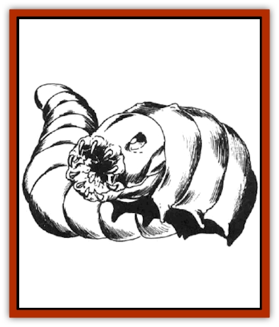

# Rot Grub

| Statistic | **Rot Grub** |
| --- | --- |
| **Activity Cycle:** | Any |
| **Alignment:** | Neutral |
| **Armor Class:** | 9 |
| **Climate/Terrain:** | Any land |
| **Damage/Attack:** | Nil |
| **Diet:** | Scavenger |
| **Frequency:** | Uncommon |
| **Hit Dice:** | 1 hp |
| **Intelligence:** | Non- (0) |
| **Magic Resistance:** | Nil |
| **Morale:** | Unsteady (5) |
| **Movement:** | 1 |
| **No. Appearing:** | 5-20 |
| **No. of Attacks:** | 0 |
| **Organization:** | Swarm |
| **Size:** | T (1&rdquo; long) |
| **Special Attacks:** | See below |
| **Special Defenses:** | Nil |
| **THAC0:** | 0 |
| **Treasure:** | Nil |
| **XP Value:** | 15 |

Rot grubs are disgusting little creatures that resemble maggots. They would be considered inconsequential if not for their horrifying attack form.

Rot grubs' color ranges from maggot white to dung brown. They are differentiated from maggots by the two tiny antennae nubs on their heads. Their size ranges from ½ inch to two inches long, with some unusual specimens getting as long as three inches. Most of the time (75%), rot grubs are mistaken for regular worms or maggots.

**Combat:** These small creatures will viciously burrow into any living flesh that touches them, for they greatly enjoy such fare to dine upon. The attack is automatically successful - no attack roll is necessary provided they have been touched by bare skin. If there is any question of whether or not bare skin has been exposed to a rot grub, multiply the would-be victim's Armor Class by 10, not counting shields. This is the chance, rolled on percentile dice, that the rot grubs are touching bare skin.

The victim must immediately apply flame to the wound (1d6 points of damage per application) or have a *cure disease* spell cast upon him. Flame kills 2d10 grubs per application, while a *cure disease* kills all of them. Unless these measures are taken, the rot grubs burrow to their host's heart and kill him in 1-3 turns.The most insidious aspect of the rot grubs is the anesthetic secretions that they use on their victims. Often this dulls the burrowed area, making the victim completely unaware that he has been invaded. Victims should roll Wisdom checks on 1d20 in order to realize that something is gravely wrong. This roll can be made every round, but time is of the essence! Within 1d6 rounds, the rot grubs are deep enough that they cannot be affected by the flames.

**Habitat/Society:** Rot grub swarms are occasionally found in heaps of offal or dung. They are seldom found in ceilings, floors, or walls, but it is possible. Sometimes, undead such as [[Ghoul|ghouls]], [[Ghoul|ghasts]], [[Zombie|zombies]], or [[Wight|wights]] carry rot grubs, though the little beasts have no effect on these undead hosts. In jungle and swamp areas, rot grubs can be found in heaps of rotting plants. Anyone who is so foolish as to walk barefoot in such areas gets what he deserves!

Once the host is dead, rot grubs use the corpse as a nesting place for their eggs. These creatures lack both treasure and the intellect to collect treasure. Still, on a rare (1%) chance, rot grubs are encountered while still inside a recently killed victim. In such rare cases, the chance of treasure is handled under treasure type I, K, L, and M.

As mentioned earlier, rot grub are fond of living flesh, though they have been known to eat dead flesh. plants, and other things best left not mentioned. Still, if they have a choice, they will always choose living tissue.

**Ecology:** Rot grubs are often sought by assassins. Placing one or two of these on a sleeping victim usually ensures a quick, quiet death. Furthermore, unless a physican knows what to look for, the cause of death cannot be determined.

[[Ant|Giant ants]], [[Centipede|centipedes]], and [[Spider|spiders]] include rot grubs in their diet. What is worse, however, is that certain subterranean races such as [[Mind_Flayer|illithids]], [[Kuo-Toa|kuo-toa]], [[Troll|trolls]], and [[Troglodyte|troglodytes]] savor rot grubs as delicacies, eating them much the same as one would eat meal worms.

Alchemists have tried to devise a means of extracting the juice from rot grubs in hopes of coming up with a workable anesthetic. Thus far all attempts have been unsuccessful. There are rumors that rot grubs are used as material components in certain harm-causing spells, usually the reverse versions of healing and restorative spells.

---
## Discovery & Documentation

**Source Publication:** MC2 Volume II (1993)
**Campaign Setting:** Advanced Dungeons & Dragons 2nd Edition
**Author(s):** Jay Batista, Scott Bennie, Grant Boucher, William W. Connors, Steve Gilbert, Heike Kubasch, James Lowder, David Edward Martin, Bruce Nesmith, Jean Rabe, Rick Swan, John J. Terra, Gary L. Thomas

### Other Creatures Found in This Source Book
   * [[Ant|Ant]]
   * [[Ant_Lion_Giant|Ant Lion, Giant]]
   * [[Ape_Carnivorous|Ape, Carnivorous]]
   * [[Baboon|Baboon]]
   * [[Badger|Badger]]
   * [[Barracuda|Barracuda]]
   * [[Beetle_Giant|Beetle, Giant]]
   * [[Bulette|Bulette]]
   * [[Bullywug|Bullywug]]
   * [[Dwarf_Duergar|Dwarf, Duergar]]
   * [[Dwarf_Gully|Dwarf, Gully]]
   * [[Eagle|Eagle]]
   * [[Eel|Eel]]
   * [[Elemental_Air_Kin|Elemental, Air Kin]]
   * [[Elemental_Water_Kin|Elemental, Water Kin]]
   * [[Elemental_Water_Kin_Water_Weird|Elemental, Water Kin, Water Weird]]
   * [[Firestar|Firestar]]
   * [[Firetail|Firetail]]
   * [[Fish_Giant|Fish, Giant]]
   * [[Frog|Frog]]
   * [[Gorgon|Gorgon]]
   * [[Hawk|Hawk]]
   * [[Heucuva|Heucuva]]
   * [[Hippocampus|Hippocampus]]
   * [[Hippogriff|Hippogriff]]
   * [[Kelpie|Kelpie]]
   * [[Kenku|Kenku]]
   * [[Killmoulis|Killmoulis]]
   * [[Kuo-Toa|Kuo-Toa]]
   * [[Lamia|Lamia]]
   * [[Lammasu|Lammasu]]
   * [[Lamprey|Lamprey]]
   * [[Leech|Leech]]
   * [[Leprechaun|Leprechaun]]
   * [[Leucrotta|Leucrotta]]
   * [[Locathah|Locathah]]
   * [[Lycanthrope_Wereboar|Lycanthrope, Wereboar]]
   * [[Lycanthrope_Werefox|Lycanthrope, Werefox]]
   * [[Mammal_Minimal|Mammal, Minimal]]
   * [[Mammal_Small|Mammal, Small]]
   * [[Mimic|Mimic]]
   * [[Morkoth|Morkoth]]
   * [[Muckdweller|Muckdweller]]
   * [[Myconid|Myconid]]
   * [[Naga|Naga]]
   * [[Obliviax|Obliviax]]
   * [[Octopus_Giant|Octopus, Giant]]
   * [[Otyugh|Otyugh]]
   * [[Piranha|Piranha]]
   * [[Plant_Dangerous_I|Plant, Dangerous I]]
   * [[Plant_Intelligent|Plant, Intelligent]]
   * [[Poltergeist|Poltergeist]]
   * [[Porcupine|Porcupine]]
   * [[Rat_Osquip|Rat, Osquip]]
   * [[Roc|Roc]]
   * [[Roper|Roper]]
   * [[Rust_Monster|Rust Monster]]
   * [[Sahuagin|Sahuagin]]
   * [[Sea_Lion|Sea Lion]]
   * [[Sea_Horse_Giant|Sea Horse, Giant]]
   * [[Shambling_Mound|Shambling Mound]]
   * [[Shark|Shark]]
   * [[Sphinx|Sphinx]]
   * [[Squid_Giant|Squid, Giant]]
   * [[Stirge|Stirge]]
   * [[Swanmay|Swanmay]]
   * [[Tarrasque|Tarrasque]]
   * [[Tasloi|Tasloi]]
   * [[Triton|Triton]]
   * [[Troglodyte|Troglodyte]]
   * [[Urchin|Urchin]]
   * [[Urd|Urd]]
   * [[Weasel|Weasel]]
   * [[Wolverine|Wolverine]]
   * [[Yellow_Musk_Creeper|Yellow Musk Creeper]]
