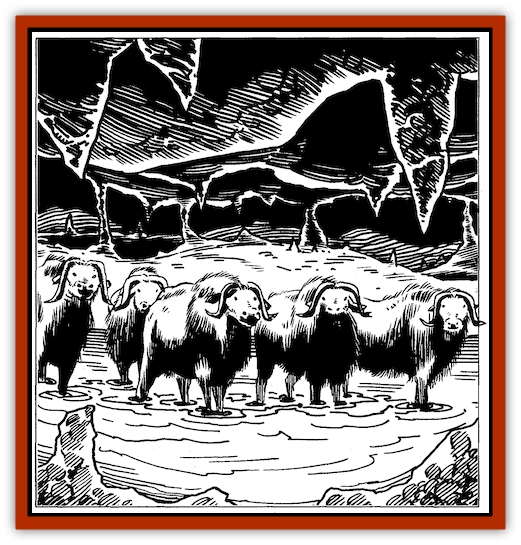

# Rothe - Deep

| Statistic | **Rothe, Deep** |
| --- | --- |
| **Activity Cycle:** | Any |
| **Alignment:** | Neutral |
| **Armor Class:** | 7 |
| **Climate/Terrain:** | Any/subterranean |
| **Damage/Attack:** | 1-3/1-3/1-8 |
| **Diet:** | Herbivore |
| **Frequency:** | Uncommon |
| **Hit Dice:** | 2 |
| **Intelligence:** | Animal (1) |
| **Magic Resistance:** | Nil |
| **Morale:** | Average (10) |
| **Movement:** | 9 |
| **No. Appearing:** | 2-20 |
| **No. of Attacks:** | 3 + special |
| **Organization:** | Herd |
| **Size:** | M (4' high) |
| **Special Attacks:** | Charge |
| **Special Defenses:** | See below |
| **THAC0:** | 19 |
| **Treasure:** | Nil |
| **XP Value:** | 65 |

Rothe (pronounced "roth-AY") are squat, strongly-built creatures who resemble musk [[Mammal_Herd_II|oxen]] - with curving horns, cloven hooves, and long, shaggy coats of thick hair. They have evolved into two very similar strains: the smaller, magically-gifted subterranean or "deep" rothe, and the larger "surface" rothe.

Rothe have dirty brown coats, darkening to almost black on the legs and underbelly, and have dark green or black hooves and horns (ivory color if freshly broken off or growing back). Their eyes tend to be yellow or pinkish, and they communicate with snorts, grunts, and sniffs. "Ghost" rothe have white coats, and can employ temporary silence (see below). Rothe regularly regenerate lost horns, and can even, over time (usually a season or so), regenerate lost limbs. The sexes appear identical unless the rothe have been sheared.

**Combat:** Rothe bite for 1-8 points of damage ("ghost" rothe do 2-8), and slash with their horns (those of deep rothe do 1-3 each, those of their surface cousins 2-5 each, and ghost rothe deal 2-8 each). The curvature of the horns makes goring with them almost impossible, except against opponents above the rothe's head (such as stirges, would-be riders, reckless folk attempting to slay the rothe with a dagger, and so on). If a rothe scores an attack against a foe in such a position, it will gore, doing maximum possible horn damage.

Rothe are not particularly intelligent, but have an instinctive wariness of being surrounded or penned in. Beings who try to surround them, herd them, or raise nets and barriers around them learn that rothe instinctively react to any observed encircling movement (and there are always rothe on watch) by drifting away from such traps, while grazing. Rothe always scout the areas in which they graze - they know where precipices and gorges are to be found, and unlike buffalo, cannot easily be stampeded into killing falls.

If panicked by harrying attacks or successful entrapment, rothe will try to break free of creatures who are harrying or herding them by outrunning them. If this is impossible, the rothe always turn to face those working against them, and charge in a solid wedge of packed flesh. The impact of such a charge has been known to shatter stone walls, uproot trees, and do creatures standing against it 2d4+1 points of impact damage per rothe involved in the charge. Rothe have such strength and determination, when panicked, that the destruction or immobilization of the frontrunners in a charge will not turn the charge aside or end it. Those behind trample their disabled comrades and continue on. The charge of a herd of 8 or more rothe automatically hits, unless targets can get out of its way.

The charge of a lone rothe requires at least a straight, level or descending path or route at least 60' in length. It counts as an extra attack, delivered at THAC0 13, and does 2d4 shock damage per current hit die of the rothe (round down). A rothe, even if it runs onto impaling spears or the like in its charge is never stunned by the force of its own impact. Even if it is dying from the damage it has taken in that round, the rothe gets its usual three attacks, all at +1 to hit.

The churning hooves and weight of a charging rothe do 4d4 hp damage (surface rothe) or 2d4 damage (deep rothe). Victims are allowed to save for half damage.

Rothe have minds of such determination that *charm*, *sleep*, *hold* and similar magics directed against them, even if successful, require 1d4+1 rounds to take effect. A wizard rarely has time to charm a rothe charging against him, and turn it away!

**Habitat/Society:** Rothe dislike bright light, and normally make their lairs in caves, overhangs screened by dense thickets, or subterranean cavern networks. They are nimble rock-climbers, leaping from ledge to ledge with skill and uncanny balance. They will often escape up a cliff face from pursuers, sometimes galloping across loose scree to deliberately start a rockslide. Such slides typically carry pursuers backwards/downhill 6d10 feet in a round. Victims caught in the slide suffer 6d6 rock-impact damage (or 2d6 mud-and-stones damage), half that if a Dexterity Check succeeds.

Although rothe depend on the presence of abundant water to support the mosses, lichens, and ferns they so like to eat, they do not enjoy swimming or immersion in water-and creatures who keep herds of domesticated rothe often confine them on islands, knowing that the water will prove a strong ally in keeping a herd from wandering.

Rothe always band together with others of their kind to form a herd. They never fight with others of their own kind (unlike cattle, rothe bulls never fight for dominance). Rothe work together in herds, the stronger escorting and guarding the weak and the young. Some individuals remain alert and on watch at all times, while others feed or sleep. Rothe sleep standing up, and if caught in severe weather or conditions (such as a blizzard on the surface, or a mudslide underground), they stand together in a solid wedge of flesh.

Rothe young are AC7; MV 10 (deep) or 15 (surface); 1 HD; #AT 3; 1/1/1-4; THAC0 19; and are visibly smaller than adults. They tend to be more inquisitive, but are seldom left unescorted-and will always obey the grunts and head-gestures of their adult escorts.

**Ecology:** Rothe are raised by many subterranean races asfood.

Those who hunt rothe prize not only their beef-like flesh, but make their shaggy hides into tents, cloaks, and other garments that provide warm protection against bonechilling cold and biting winds. Some traders in the North call rothe hide, with its thick fur or hair still attached, "shield-against-the-winds-fur."

Rothe-bone is tremendously strong and durable, but slowly dries out to become brittle; in hard usage, bone implements rarely last more than six years. Boiled or steamed rothe bones become temporarily flexible and can be woven into iron-strong frameworks, to form a base for shields or tents (whose fabric is often rothe hide, interwoven with what wood or metal scraps the barbarians can salvage). Rothe horns, cleaned and polished, can serve as drinking-jacks or hunting horns. Large, splendid ones are highly prized in the North.

When trained, rothe can serve as steeds for dwarves and smaller beings. They are raised for their meat, and to serve as beasts of burden by merchants and farmers, in all areas where they are found.

Training a rothe to simple ploughing or hauling tasks is a process of leading and rewarding (with sweetgrass, berries, and flowers, their favorite foods), which takes about a "ride" (ten days). Training a rothe to serve as a steed takes four to seven rides, depending on the number of commands and manoeuvers it is expected to master. Training times will be lengthened if the rothe becomes ill or seriously upset (by seeing another rothe or other livestock violently killed, or being confined near a large fire) during the process.

Rendered rothe fat is an alternative ingredient in the making of *potions of vitality*.

**Deep Rothe**

The staple diet of many [[Elf_Drow|drow]] and [[Dwarf_Duergar|duergar]] communities, these herd animals of the Underdark are small, standing only 4' high at the shoulder when fully grown. They are powerfully built, being on average just as wide as they are tall.

Deep rothe have 90' infravision, and eat fungi, lichens and mosses. They are immune to all known mold and fungi spore or contact effects. The cold damp of even the deepest ice-locked caves of the north is as nothing to them. Used to attacks by blood-drinking bats and stirges, rothe are adept at rolling or ramming their shoulders and heads into rocky walls with sudden speed to crush and/or dislodge such opponents; half charge damage applies, with no damagelessening saving throws allowed.

Each deep rothe can manifest *dancing lights* to signal its fellows twice per day, 140-yard range. This is used to signal its location, the presence of food, danger, and so on. Different messages are communicated by subtle differences in the hue and movement of the lights. These lights are often mistaken by adventurers for will o' wisps or the work of unseen mages.

---
## Discovery & Documentation

**Source Publication:** The Drow of the Underdark (1991)
**Campaign Setting:** Forgotten Realms
**Author(s):** Ed Greenwood

### Other Creatures Found in This Source Book
   * [[Bat_Deep|Bat, Deep]]
   * [[Dragon_Deep|Dragon, Deep]]
   * [[Myrlochar|Myrlochar]]
   * [[Pedipalp|Pedipalp]]
   * [[Solifugid|Solifugid]]
   * [[Spider_Subterranean|Spider, Subterranean]]
   * [[Spitting_Crawler|Spitting Crawler]]
   * [[Yochlol_Underdark|Yochlol (Underdark)]]
