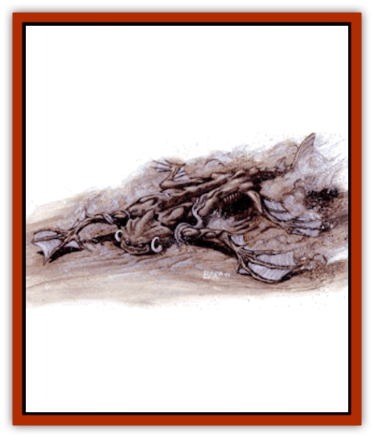

# Ruktoi

| Statistic | **Ruktoi** |
| --- | --- |
| **Activity Cycle:** | Night |
| **Alignment:** | Neutral |
| **Armor Class:** | 3 |
| **Climate/Terrain:** | Sea of Silt, silt basins |
| **Damage/Attack:** | 1d12 |
| **Diet:** | Carnivore |
| **Frequency:** | Very rare |
| **Hit Dice:** | 12 |
| **Intelligence:** | Animal (1) |
| **Magic Resistance:** | Nil |
| **Morale:** | Steady (11-12) |
| **Movement:** | 9, Sw 15 |
| **No. Appearing:** | 1 |
| **No. of Attacks:** | 1 |
| **Organization:** | Solitary |
| **Size:** | H (20' long) |
| **Special Attacks:** | Smother |
| **Special Defenses:** | Cloud, levitation |
| **THAC0:** | 9 |
| **Treasure:** | Nil |
| **XP Value:** | 3,000 |

The ruktoi is solitary sentinel of the silt sea, able to paddle along its surface or lurk just beneath patiently awaiting prey. Some ruktoi have been captured and either domesticated or controlled to ferry passengers or small cargos across the endless silt basin.

The ruktoi's limbs each end in three long, splayed digits, webbed for use as paddles. The tail ends in a broad flap of skin that aids in navigating across the surface of the Sea of Silt. When stationary, the ruktoi's light gray skin makes it almost impossible to see in the silt. Often the ruktoi hovers just below the surface with only its snout and eyes exposed.

Ruktoi have no spoken language. They communicate with each other through body motions and scent.

**Combat:** The ruktoi uses its silt-borne mobility to chase down less agile prey. The creature's broad body and limbs aren't enough to keep the animal afloat in the silt. The ruktoi can *levitate*, as the spell, at will. The levitation ability does not allow it to rise above the surface of the silt.

The ruktoi can attack once per round with its bite, inflicting 1-12 (1d12) points of damage. It can use its powerful limbs to immobilize an opponent and smother it beneath the silt. This requires a successful attack roll. If successful, the ruktoi has grabbed its opponent. The target must successfully save vs. petrification at -3 (allowed once per round) or be pulled beneath the surface.

While struggling to free itself from the grip of a ruktoi, an opponent can hold its breath, see the *Player's Handbook* for rules on holding one's breath. The opponent can escape the grip of the ruktoi if a Bend Bars/Lift Gates roll is successful.

If the ruktoi loses half its total hit points in damage it kicks up a cloud of silt to cover its escape. For that round its movement is 9. All opponents must successfully save vs. spells or be blinded for a round and lose sight of the ruktoi. Those who fail cannot pursue the ruktoi that round. If they have no other means of tracking the animal's movements, the ruktoi escapes into the expanses of the Sea of Silt.

**Habitat/Society:** Ruktoi are denizens of the Sea of Silt and the various silt basins near its shore. In the wild, they are solitary hunters that prey upon [[Floater|floaters]] and unsuspecting [[Silt_Runner|silt runners]].

**Ecology:** Ruktoi associate with each other only to mate. The female lays a dispersed pattern of 10-30 eggs that sink to the bottom of the silt. Those that survive the rigors of the silt hatch after six weeks and float to the surface. The young ruktoi reach adult size in just six weeks.

---
## Discovery & Documentation

**Source Publication:** Dark Sun Appendix II - Terrors Beyond Tyr (1991)
**Campaign Setting:** Dark Sun
**Author(s):** Jim Atkiss, Steve Brown, Timothy B. Brown, Andrew P. Morris, Bruce Nesmith, Wes Nicholson, Bill Slavicsek

### Other Creatures Found in This Source Book
   * [[Aarakocra_Athas|Aarakocra (Athas)]]
   * [[Animal_Domestic_Athas_II|Animal, Domestic (Athas) II]]
   * [[Aviarag|Aviarag]]
   * [[Baazrag|Baazrag]]
   * [[Baazrag_Boneclaw|Baazrag, Boneclaw]]
   * [[Bloodgrass|Bloodgrass]]
   * [[Cactus_Hunting|Cactus, Hunting]]
   * [[Cactus_Rock|Cactus, Rock]]
   * [[Cilops|Cilops]]
   * [[Crodlu|Crodlu]]
   * [[Dagorran|Dagorran]]
   * [[Dhaot|Dhaot]]
   * [[Drake_Lesser_Athas_General_Information|Drake, Lesser (Athas), General Information]]
   * [[Drake_Lesser_Athas_Magma|Drake, Lesser (Athas), Magma]]
   * [[Drake_Lesser_Athas_Rain|Drake, Lesser (Athas), Rain]]
   * [[Drake_Lesser_Athas_Silt|Drake, Lesser (Athas), Silt]]
   * [[Drake_Lesser_Athas_Sun|Drake, Lesser (Athas), Sun]]
   * [[Dray|Dray]]
   * [[Drik|Drik]]
   * [[Dune_Reaper|Dune Reaper]]
   * [[Dwarf_Athas|Dwarf (Athas)]]
   * [[Elemental_Beast_Athas_Air|Elemental Beast (Athas), Air]]
   * [[Elemental_Beast_Athas_Earth|Elemental Beast (Athas), Earth]]
   * [[Elemental_Beast_Athas_Fire|Elemental Beast (Athas), Fire]]
   * [[Elemental_Beast_Athas_Water|Elemental Beast (Athas), Water]]
   * [[Elf_Athas|Elf (Athas)]]
   * [[Fael|Fael]]
   * [[Feylaar|Feylaar]]
   * [[Fordorran|Fordorran]]
   * [[Giant_Half-giant|Giant, Half-giant]]
   * [[Giant_Shadow|Giant, Shadow]]
   * [[Golem_Athas_Magma|Golem (Athas), Magma]]
   * [[Golem_Athas_Salt|Golem (Athas), Salt]]
   * [[Golem_Athas_General_Information|Golem (Athas), General Information]]
   * [[Gorak|Gorak]]
   * [[Halfling_Athas|Halfling (Athas)]]
   * [[Human_Athas|Human (Athas)]]
   * [[Jhakar|Jhakar]]
   * [[Kaisharga|Kaisharga]]
   * [[Kes'trekel|Kes'trekel]]
   * [[Klar|Klar]]
   * [[Krag|Krag]]
   * [[Kragling|Kragling]]
   * [[Lirr|Lirr]]
   * [[Mastyrial|Mastyrial]]
   * [[Meorty|Meorty]]
   * [[Mul|Mul]]
   * [[Nikaal|Nikaal]]
   * [[Paraelemental_Beast_General_Information|Paraelemental Beast, General Information]]
   * [[Paraelemental_Beast_Magma|Paraelemental Beast, Magma]]
   * [[Paraelemental_Beast_Rain|Paraelemental Beast, Rain]]
   * [[Paraelemental_Beast_Silt|Paraelemental Beast, Silt]]
   * [[Paraelemental_Beast_Sun|Paraelemental Beast, Sun]]
   * [[Pakubrazi|Pakubrazi]]
   * [[Psionocus|Psionocus]]
   * [[Psurlon|Psurlon]]
   * [[Raaig|Raaig]]
   * [[Retriever_Obsidian|Retriever, Obsidian]]
   * [[Ruvoka_Athas|Ruvoka (Athas)]]
   * [[Sand_Howler|Sand Howler]]
   * [[Scorpion_Athas|Scorpion (Athas)]]
   * [[Seed_Brain|Seed, Brain]]
   * [[Silt_Horror_Black|Silt Horror, Black]]
   * [[Silt_Horror_Magma|Silt Horror, Magma]]
   * [[Silt_Horror_Red|Silt Horror, Red]]
   * [[Silt_Spawn|Silt Spawn]]
   * [[Slig|Slig]]
   * [[Spider_Athas|Spider (Athas)]]
   * [[Spinewyrm|Spinewyrm]]
   * [[Ssurran|Ssurran]]
   * [[Stalking_Horror|Stalking Horror]]
   * [[Tarek|Tarek]]
   * [[Tari|Tari]]
   * [[Thri-kreen|Thri-kreen]]
   * [[T'liz|T'liz]]
   * [[Tohr-kreen_II|Tohr-kreen II]]
   * [[Tohr-kreen_III|Tohr-kreen III]]
   * [[Trin|Trin]]
   * [[Tul'k|Tul'k]]
   * [[Undead_Athas_General_Information|Undead (Athas), General Information]]
   * [[Wraith_Athas|Wraith (Athas)]]
   * [[Xerichou|Xerichou]]
   * [[Zombie_Thinking|Zombie, Thinking]]
