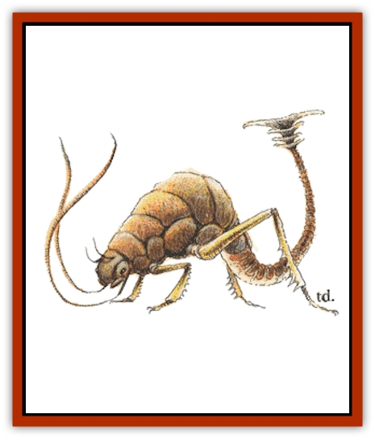

# Rust Monster

| Statistic | **Rust Monster** |
| --- | --- |
| **Activity Cycle:** | Night |
| **Alignment:** | Neutral |
| **Armor Class:** | 2 |
| **Climate/Terrain:** | Subterranean |
| **Damage/Attack:** | Nil |
| **Diet:** | Metalavore |
| **Frequency:** | Uncommon |
| **Hit Dice:** | 5 |
| **Intelligence:** | Animal (1) |
| **Magic Resistance:** | Nil |
| **Morale:** | Average (9) |
| **Movement:** | 18 |
| **No. Appearing:** | 1-2 |
| **No. of Attacks:** | 2 |
| **Organization:** | Solitary |
| **Size:** | M (5' long) |
| **Special Attacks:** | See below |
| **Special Defenses:** | Nil |
| **THAC0:** | 15 |
| **Treasure:** | Q |
| **XP Value:** | 270 |

Rust monsters are subterranean creatures with an appetite for all sorts of metals. These unique creatures, though generally inoffensive, are the bane of fighters everywhere.

The average rust monster measures 5 feet long and 3 feet high at the shoulder. It has a strange tail that appears armor plated and ends in an odd-looking bony projection that resembles a double-ended paddle. Two prehensile antennae are located under the thing's two eyes. The hide of the rust monster is rough, covered with lumpy projections. Coloration varies from a yellowish tan on the underside and legs, to a rust red upper back. Rust monsters smell like wet, oxidized metal.

**Combat:** Rust monsters are placid by nature, but when they get within scent range of metal, they become excited and immediately dash toward the source. Rust monsters can smell metal up to 90 feet away. If the rust monster's antennae touch metal (determined by a successful attack roll), the metal rusts. Magical items have a chance of being unaffected equal to 10% for each plus (a +2 weapon or armor has a 20% chance of not being affected). Any affected metal rusts or corrodes and immediately falls to pieces that are easily eaten and digested by the creature. Metal weapons striking a rust monster are affected just as if the creature's antennae had touched them. Should a nonweapon metallic magical item happen to make contact with a rust monster, treat it as a +2 magical weapon for purposes of determining whether or not it breaks up.

Rust monsters, being none too bright, stop pursuing a fleeing party for one round to devour metallic items, such as a handful of iron spikes, a mace or a hammer, if the party throws them behind. Rust monsters go after ferrous metals such as iron, steel, and magical steel alloys, such as mithril and adamantite. They choose such metals over valuable metals such as copper, gold, silver, or platinum. In fact, they would continue to pursue a party that just dropped a fistful of copper coins, for example, in hopes of getting the much-preferred ferrous metal of armor and weapons.

Sometimes (30% chance), a rust monster will even pause for one round during combat in order to eat. Rust monsters are not known for being tacticians, just ravenously hungry metal-eaters. Feeding time always takes one round regardless of the size of the metal meal.

**Habitat/Society:** Rust monsters dwell only in dark, subterranean places such as caverns and underground structures. They are not disposed to groups; often a lair comprises one or two rust monsters, with a 5% chance of encountering a single offspring, which acts as a half-strength rust monster with a full-strength appetite. These creatures have been known to range the length and breadth of an underground complex, searching for supplies of metal. Though it will eat raw ore, a rust monster always prefers the refined, forged metal (just as a human would prefer fresh, filtered water over swamp water).

The creature's relatively inoffensive nature makes it an unlikely target. There have been many accounts of mages approaching a rust monster and the only reaction from the beast was a cursory sniff, then a leisurely departure. [[Dwarf|Dwarves]] and [[Gnome|gnomes]], known for metalworking and mining, have no sympathy for rust monsters, and will do anything to get rid of them.

The only treasure to be found in a rust monster lair is gems, usually the sort used for decoration on armor or sword pommels. Rust monsters have no grand designs, only the wish to keep well-fed.

**Ecology:** Rust monsters help in removing metallic junk and clutter from underground fastnesses. In fact, it is not unusual to find a rust monster and a [[Carrion_Crawler|carrion crawler]] working in a symbiotic relationship, with the latter eating the organic litter and the former consuming the metal castoffs.

---
## Discovery & Documentation

**Source Publication:** MC2 Volume II (1993)
**Campaign Setting:** Advanced Dungeons & Dragons 2nd Edition
**Author(s):** Jay Batista, Scott Bennie, Grant Boucher, William W. Connors, Steve Gilbert, Heike Kubasch, James Lowder, David Edward Martin, Bruce Nesmith, Jean Rabe, Rick Swan, John J. Terra, Gary L. Thomas

### Other Creatures Found in This Source Book
   * [[Ant|Ant]]
   * [[Ant_Lion_Giant|Ant Lion, Giant]]
   * [[Ape_Carnivorous|Ape, Carnivorous]]
   * [[Baboon|Baboon]]
   * [[Badger|Badger]]
   * [[Barracuda|Barracuda]]
   * [[Beetle_Giant|Beetle, Giant]]
   * [[Bulette|Bulette]]
   * [[Bullywug|Bullywug]]
   * [[Dwarf_Duergar|Dwarf, Duergar]]
   * [[Dwarf_Gully|Dwarf, Gully]]
   * [[Eagle|Eagle]]
   * [[Eel|Eel]]
   * [[Elemental_Air_Kin|Elemental, Air Kin]]
   * [[Elemental_Water_Kin|Elemental, Water Kin]]
   * [[Elemental_Water_Kin_Water_Weird|Elemental, Water Kin, Water Weird]]
   * [[Firestar|Firestar]]
   * [[Firetail|Firetail]]
   * [[Fish_Giant|Fish, Giant]]
   * [[Frog|Frog]]
   * [[Gorgon|Gorgon]]
   * [[Hawk|Hawk]]
   * [[Heucuva|Heucuva]]
   * [[Hippocampus|Hippocampus]]
   * [[Hippogriff|Hippogriff]]
   * [[Kelpie|Kelpie]]
   * [[Kenku|Kenku]]
   * [[Killmoulis|Killmoulis]]
   * [[Kuo-Toa|Kuo-Toa]]
   * [[Lamia|Lamia]]
   * [[Lammasu|Lammasu]]
   * [[Lamprey|Lamprey]]
   * [[Leech|Leech]]
   * [[Leprechaun|Leprechaun]]
   * [[Leucrotta|Leucrotta]]
   * [[Locathah|Locathah]]
   * [[Lycanthrope_Wereboar|Lycanthrope, Wereboar]]
   * [[Lycanthrope_Werefox|Lycanthrope, Werefox]]
   * [[Mammal_Minimal|Mammal, Minimal]]
   * [[Mammal_Small|Mammal, Small]]
   * [[Mimic|Mimic]]
   * [[Morkoth|Morkoth]]
   * [[Muckdweller|Muckdweller]]
   * [[Myconid|Myconid]]
   * [[Naga|Naga]]
   * [[Obliviax|Obliviax]]
   * [[Octopus_Giant|Octopus, Giant]]
   * [[Otyugh|Otyugh]]
   * [[Piranha|Piranha]]
   * [[Plant_Dangerous_I|Plant, Dangerous I]]
   * [[Plant_Intelligent|Plant, Intelligent]]
   * [[Poltergeist|Poltergeist]]
   * [[Porcupine|Porcupine]]
   * [[Rat_Osquip|Rat, Osquip]]
   * [[Roc|Roc]]
   * [[Roper|Roper]]
   * [[Rot_Grub|Rot Grub]]
   * [[Sahuagin|Sahuagin]]
   * [[Sea_Lion|Sea Lion]]
   * [[Sea_Horse_Giant|Sea Horse, Giant]]
   * [[Shambling_Mound|Shambling Mound]]
   * [[Shark|Shark]]
   * [[Sphinx|Sphinx]]
   * [[Squid_Giant|Squid, Giant]]
   * [[Stirge|Stirge]]
   * [[Swanmay|Swanmay]]
   * [[Tarrasque|Tarrasque]]
   * [[Tasloi|Tasloi]]
   * [[Triton|Triton]]
   * [[Troglodyte|Troglodyte]]
   * [[Urchin|Urchin]]
   * [[Urd|Urd]]
   * [[Weasel|Weasel]]
   * [[Wolverine|Wolverine]]
   * [[Yellow_Musk_Creeper|Yellow Musk Creeper]]
