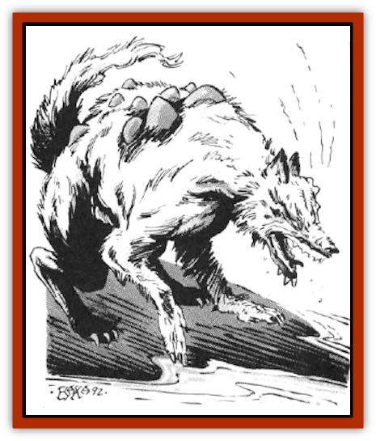

# Ruve

| Statistic | **Ruve** |
| --- | --- |
| **Activity Cycle:** | Any |
| **Alignment:** | Lawful good |
| **Armor Class:** | 5 |
| **Climate/Terrain:** | Any |
| **Damage/Attack:** | 1-6 |
| **Diet:** | Omnivore |
| **Frequency:** | Uncommon |
| **Hit Dice:** | 4+4 |
| **Intelligence:** | Highly to genius (13-18) |
| **Magic Resistance:** | 15% |
| **Morale:** | Very Steady (13-14) |
| **Movement:** | 18 |
| **No. Appearing:** | 1-10 |
| **No. of Attacks:** | 1 |
| **Organization:** | Pack |
| **Size:** | S (3' high at shoulder) |
| **Special Attacks:** | Psionics |
| **Special Defenses:** | Psionics |
| **THAC0:** | 16 |
| **Treasure:** | Nil |
| **XP Value:** | 975 |

**Psionics Summary**

| Level | Dis/Sci/Dev | Attack/Defense | Score | PSPs |
| --- | --- | --- | --- | --- |
| 4 | 3/3/11 | EW,PB/TS,MBr,TW | =Int | 100 |

**Psychokinesis -** *Sciences:* telekinesis, detonate; *Devotions:* animate object, control body, control flames.

**Telepathy -** *Sciences:* mind link, probe; *Devotions:* conceal thoughts, contact, invisibility, mental barrier, send thoughts, truthear.

**Psychoportation -** *Science:* probability travel; *Devotion:* time/space anchor.

Ruve are a breed of [[Dog|dog]] which possesses formidable intelligence and psionic powers. Their coloring ranges from a sandy brown to glossy black, and they are often mistaken for [[Dog|wild dogs]] or [[Dog|war dogs]]. The eyes of a ruve show an alertness that goes beyond normal canine levels.

Typical rove are quite polite and disciplined, though they will often act like regular dogs in order to ascertain the intentions of a party. Normally, they reveal themselves as ruve only to parties that appear to be of predominantly good alignment. Ruve understand Common, but cannot speak it.

**Combat:** Ruve do not like to bite opponents, as they consider this to be beastly behavior, preferring instead to use their psionic powers against hostiles. They act and fight in well-trained packs, using complex strategies and tactics to maneuver opponents into a disadvantageous position.

As a rule, ruve are not bloodthirsty, and are content with knocking out or driving away an enemy. Despite this, if the ruve are against an identifiably evil opponent, they will attack to kill. In melee situations, ruve are bold and daring, and not easily intimidated.

**Habitat/Society:** The location of the ruve's homeworlds is unrevealed, but their wanderings have led them to other planes and worlds. Their ability to adapt is remarkable, and their temperament adjusts to suit the world in which they find themselves.

Warm, dry caves are the choice lairs for ruve. Females fight as well as males. A mated pair of rove can produce a yearly litter of 2d4 pups, each with 2+2 Hit Die, and only the discipline of telepathy and its accompanying abilities. Ruve reach maturity in one year.

Ruve are extremely intelligent and have a well-developed culture. They use their psychokinetic powers to create works of art, and will often gather to howl their soaring and hauntingly beautiful compositions.

Unfortunately, this sense of culture has made the ruve snobbish. They look down on other species of special dogs such as [[Dog|blink dogs]] or the [[Lhee|lhee]] of Wildspace, considering them rustic peasants. Mundane dogs such as wild dogs, war dogs, or normal domestic breeds are beneath insulting. If a ruve connects with a human or demi-human mind that is less intelligent than itself, that poor individual will never hear the end of it. The most obnoxious ruve are found on Krynn, Oerth, Toril, and in Wildspace. Small packs roam about, telling people about their original home, a barren desert world where metal is scarce. Many people, however, dismiss the ruve's reminiscences as tall tales.

Ruve often have the tendency to mentally send trivia facts to adventurers, regardless of the situation.

Sages or high-level mages are often the target of sudden visits by the ruve, since the pack is always interested in seeking out new knowledge and little-known facts.

**Ecology:** Ruve are well-suited for trimming the number of evil psionic monsters. They are natural enemies of [[Intellect_Devourer|intellect devourers]], [[Mind_Flayer|illithids]], [[Su-Monster|su monsters]], and [[Thought_Eater|thought eaters]]. When faced with these opponents, all snobbery is forgotten and they attack with a feral intensity borne of instinctive hatred.

Although they do not get fleas, ruve sometimes acquire cerebral parasites. Any ruve encountered have a 35% chance of each dog having 1d4 parasites.

Paladins and lawful good clerics or psionicists seek out the company of ruve as loyal companions. No one else seems to have the patience required to stand the ruve's intellectual posturing.

---
## Discovery & Documentation

**Source Publication:** MC14 Fiend Folio Appendix (1992)
**Campaign Setting:** Fiends Folio
**Author(s):** Don Bingle, John Terra, Wes Nicholson, Tim Beach, Steve Hardinger, Kris Hardinger, Rob Nicholls, Greg Swedberg, Al Boyce, Vince Garcia, Norm Ritchie

### Other Creatures Found in This Source Book
   * [[Aballin|Aballin]]
   * [[Achaierai|Achaierai]]
   * [[Adherer|Adherer]]
   * [[Algoid|Algoid]]
   * [[Al-Mi'raj|Al-Mi'raj]]
   * [[Apparition|Apparition]]
   * [[Caterwaul|Caterwaul]]
   * [[Coffer_Corpse|Coffer Corpse]]
   * [[Crabman|Crabman]]
   * [[Dark_Creeper|Dark Creeper]]
   * [[Dark_Stalker|Dark Stalker]]
   * [[Darter|Darter]]
   * [[Denzelian|Denzelian]]
   * [[Dune_Stalker|Dune Stalker]]
   * [[Dwarf_Urdunnir|Dwarf, Urdunnir]]
   * [[Falcon_Fire|Falcon, Fire]]
   * [[Faux_Faerie|Faux Faerie]]
   * [[Flawder|Flawder]]
   * [[Fyrefly|Fyrefly]]
   * [[Gambado|Gambado]]
   * [[Garbug|Garbug]]
   * [[Giant_Fhoimorien|Giant, Fhoimorien]]
   * [[Gibberling|Gibberling]]
   * [[Gorbel|Gorbel]]
   * [[Grimlock|Grimlock]]
   * [[Hellcat|Hellcat]]
   * [[Ice_Lizard|Ice Lizard]]
   * [[Iron_Cobra|Iron Cobra]]
   * [[Khargra|Khargra]]
   * [[Mantari|Mantari]]
   * [[Penanggalan|Penanggalan]]
   * [[Pernicon|Pernicon]]
   * [[Phantom_Stalker|Phantom Stalker]]
   * [[Retriever|Retriever]]
   * [[Scathe|Scathe]]
   * [[Sheet_Ghoul_Sheet_Phantom|Sheet Ghoul/Sheet Phantom]]
   * [[Shocker|Shocker]]
   * [[Spanner|Spanner]]
   * [[Stwinger|Stwinger]]
   * [[Sussurus|Sussurus]]
   * [[Symbiotic_Jelly|Symbiotic Jelly]]
   * [[Terithran|Terithran]]
   * [[Thunder_Children|Thunder Children]]
   * [[Troll_Ice|Troll, Ice]]
   * [[Tween|Tween]]
   * [[Umpleby|Umpleby]]
   * [[Volt|Volt]]
   * [[Xill|Xill]]
   * [[Xvart|Xvart]]
   * [[Zygraat|Zygraat]]
