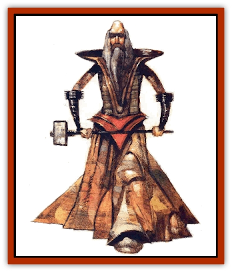

# Ruvoka

| Statistic | **Ruvoka** |
| --- | --- |
| **Activity Cycle:** | Any |
| **Alignment:** | Neutral |
| **Armor Class:** | 6 or better |
| **Climate/Terrain:** | Inner Planes |
| **Damage/Attack:** | By weapon (+2 to +6 for Str) |
| **Diet:** | Omnivore |
| **Frequency:** | Very rare |
| **Hit Dice:** | 3+ |
| **Intelligence:** | High (13-14) |
| **Magic Resistance:** | Nil |
| **Morale:** | Elite to fanatic (14-18) |
| **Movement:** | 12 (18 within element) |
| **No. Appearing:** | 1 |
| **No. of Attacks:** | 1 |
| **Organization:** | Solitary (tribal) |
| **Size:** | M-L (7-12' tall) |
| **Special Attacks:** | Spells |
| **Special Defenses:** | Spells |
| **THAC0:** | 17 or better |
| **Treasure:** | See below |
| **XP Value:** | 3 HD: 975 / 4 HD: 1,400 / 5 HD: 2,000 / 6 HD: 3,000 / 7+ HD: 4,000 + 1,000/HD |

As if [[Genie|geniekind]], elemental grues, [[Animental|animentals]], Archomentals, and, of course, [[Elemental_General_Information|elementals]] themselves weren't enough, the Elemental Planes are also the home of the ruvoka. Fact is, these tall, gaunt humanoid creatures're known to inhabit almost all or the Inner Planes, even those as far-flung and inhospitable as Vacuum or Lightning. Only the two energy planes seem to be without 'em, though it just may be that they haven't been discovered there yet. Simply put, the ruvoka're tough bashers, able to survive just about anywhere. While they can be killed, they don't age or die of natural causes.

The ruvoka are identified by thc tribe to which they belong. Some of the most well-known tribes're the brajeti and the zathosi of Earth, the cthilum of Air, the kaltori of Fire, the ramoka of Steam, and the sartarin of Ash. Each tribe has its own language, though all ruvoka possess a form of telepathy that allows them to communicate with any intelligent creature.

**Combat:** Ruvoka begin their lives with 3 Hit Dice, but as they mature and grow more skilled during their incredibly long existences, they gain more and more power. Individuals of 15 or more Hit Dice have been encountered.

Ruvoka use weapons in combat. and often they're enchanted and imbued with elemental energy. Each ruvoka has a 5% chance per HD of possessing one of these special weapons, which inflict 2d4 or 2d6 additional points of related elemental damage - kaltori tridents, for example, forged on the plane of Fire, cause extra heat damage. The tough elemental flesh of the ruvoka grants them a natural Armor Class of 6, but most wear some kind of armor anyway. As before, each has a 5% chance per HD of owning magical armor. (Note that a ruvoka's chance of having an enchanted weapon is separate from his chance of wearing enchanted armor.)

Ruvoka are druids as well as warriors, though they're not limited by any druidic strictures. That is, they don't face the weapon and armor restrictions of that class. Each ruvoka operates as a druid of a level equal to twice his total Hit Dice, but no higher than 20th level. Each has major access to a sphere appropriate to his element (or one that's very close) and may have minor access to a sphere of a related element. For example, the brajeti, who once lived on the quasiplane of Dust but have since migrated to the plane of Earth, have major access to the sphere of elemental earth but retain minor access to that of elemental air. The vandesh of the Paraelemental Plane of Ice have major access to the sphere of water and minor access to that of air.

All ruvoka are immune to any harm caused by their own element and can move through it with ease. Those of Air can fly, those of Earth can phase through stone like a [[Xorn|xorn]], and so on.

**Habitat/Society:** The ruvoka organize themselves into tribes, with many tribes per plane. Each group has a different appearance, language, manner of dress, choice of weapon, and set of customs. For example, the brajeti of Earth resemble large, tanned, hairless humans, and they use shining bronze armor and weapons. The zathosi, also of Earth, resemble tall humans with gray skin that's so wrinkled it makes them look like old men. They wear robes that appear to be made of stone and wield huge, heavy mauls.

Despite their tribal structure, the ruvoka are particularly insular and isolated as a rule. When planewalkers stumble across members of the race, they usually find only a single individual on a mysterious errand. Sometimes, one of these traveling ruvoka will approach other creatures to ask for help in accomplishing his goals. Generally, those who offer their aid can expect to be rewarded with a minor bit of elemental magic, or perhaps even the ruvoka's help in achieving some end of their own. However, they shouldn't expect to learn what the ruvoka's up to - he won't reveal the ultimate purpose of his mission.

Occasionally, these mysterious cutters show up on planes other than their own, even the Prime Material. Some tie themselves to particular areas of the Prime related to their element, but no one knows the dark of it. The ruvoka aren't interested in any affairs but their own, and they don't seem willing to share their secrets.

**Ecology:** Chant is the ruvoka aren't a planar race at all, but merely transformed prime-material bloods who've adapted themselves to the Inner Planes. Still, even if that were true of the first ruvoka, they've since produced offspring who're genuine natives of their respective planes.

One story of the origin of the ruvoka tells of a mortal prime named Garat who traveled to the Elemental Plane of Fire and accidentally wandered into the palace of Calif Alibashal, a powerful [[Genie_Noble_Efreeti|efreeti lord]]. Rather than being angry, the calif was amused by the intruder, and decided to inflict upon the sod the irony that he so enjoyed.

"Little mortal, I have summoned you," the calif lied. "Now you must grant me one wish."

This announcement surprised and worried Garat, yet he was canny enough not to contradict the efreeti. "Wise and wondrous Calif," the prime said, bowing low, "grant me the pleasure of hearing your request."

The efreeti lord smiled a toothy grin as his jest took form. "Ah, little man, I wish you to bring me the head of Baashizar, my rival."

"Your words are wise and your wish is just. With your leave, I shall make your desires reality." With that, Garat departed from the palace, fully intending to give it the laugh and never return. But he suddenly became curious. The efreeti was obviously playing a joke, but what would he do if Garat actually fulfilled his wish? The mortal came from the prime-material world of Athas, after all; he knew he was a strong and capable warrior and a clever spellcaster. He decided that he'd try.

Garat traveled many days across the plane of Fire to the lair of the efreeti known as Baashizar, then found his way through the lord's traps and guardians. Suprising the efreeti at his own dinner table, Garat leapt at Baashizar and a terrible battle ensued that lasted for many hours.

Days later, Garat appeared again at the palace of Calif Alibashal. He held the head of Baashizar aloft. "Great and powerful Calif, as you have spoken, so have I done. Your wish was my command!"

Alibashal was so surprised and impressed that he called the mortal before him. "You are far more capable and loyal than I had dreamed, little man. Unlike the geniekind who are summoned to your worlds and forced to grant the wishes of others, you have done so willingly and efficiently. That is something worthy of respect. For your deed, I grant you immortality and life forever here in my realm. Further, those like you who follow in your steps shall gain homes throughout all the elemental spheres. We shall welcome such as you as our own."

Garat, then, became the first of the ruvoka. And from then on, supposedly, mighty druids from tile Prime (a great many from Athas) journeyed to the Inner Planes and adopted them as their homes.

---
## Discovery & Documentation

**Source Publication:** Planescape III (1996)
**Campaign Setting:** Planescape
**Author(s):** Monte Cook

### Other Creatures Found in This Source Book
   * [[Animental|Animental]]
   * [[Archomental_Evil|Archomental, Evil]]
   * [[Archomental_Good|Archomental, Good]]
   * [[Belker|Belker]]
   * [[Bzastra|Bzastra]]
   * [[Chososion|Chososion]]
   * [[Darklight|Darklight]]
   * [[Devete|Devete]]
   * [[Devourer_Planescape|Devourer (Planescape)]]
   * [[Dharum_Suhn|Dharum Suhn]]
   * [[Egarus|Egarus]]
   * [[Elemental_Athas_Lesser_Air_Earth|Elemental (Athas), Lesser, Air/Earth]]
   * [[Elemental_Athas_Lesser_Fire_Water|Elemental (Athas), Lesser, Fire/Water]]
   * [[Elemental_Fire_Kin_Salamander_II|Elemental, Fire Kin, Salamander II]]
   * [[Entrope|Entrope]]
   * [[Facet|Facet]]
   * [[Frost_Salamander|Frost Salamander]]
   * [[Fundamental_Air_Earth|Fundamental, Air/Earth]]
   * [[Fundamental_Fire_Water|Fundamental, Fire/Water]]
   * [[Fundamental_All_Elements|Fundamental, All Elements]]
   * [[Garmorm|Garmorm]]
   * [[Homunculus_Elemental|Homunculus, Elemental]]
   * [[Immoth|Immoth]]
   * [[Khargra|Khargra]]
   * [[Klyndes|Klyndes]]
   * [[Magran|Magran]]
   * [[Menglis|Menglis]]
   * [[Nathri|Nathri]]
   * [[Ooze_Sprite|Ooze Sprite]]
   * [[Paraelemental|Paraelemental]]
   * [[Phirblas|Phirblas]]
   * [[Psurlon|Psurlon]]
   * [[Quasielemental_Negative|Quasielemental, Negative]]
   * [[Quasielemental_Positive|Quasielemental, Positive]]
   * [[Rast|Rast]]
   * [[Ravid|Ravid]]
   * [[Scile|Scile]]
   * [[Shad|Shad]]
   * [[Shocker|Shocker]]
   * [[Sislan|Sislan]]
   * [[Suisseen|Suisseen]]
   * [[Terithran|Terithran]]
   * [[Thoqqua|Thoqqua]]
   * [[Trilloch|Trilloch]]
   * [[Tsnng|Tsnng]]
   * [[Ungulosin|Ungulosin]]
   * [[Vacuous|Vacuous]]
   * [[Wavefire|Wavefire]]
   * [[Xag-Ya_Xeg-Yi|Xag-Ya/Xeg-Yi]]
   * [[Xill|Xill]]
