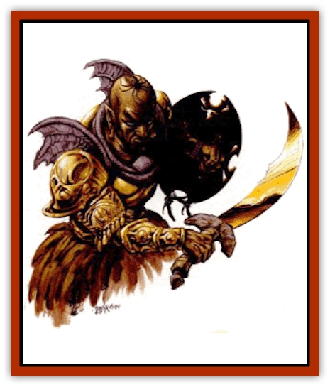

# Ruvoka - Athas

| Statistic | **Brajeti** | **Ethilum** | **Kaltori** | **Zathosi** |
| --- | --- | --- | --- | --- |
| **Activity Cycle:** | Day | Day | Day | Day |
| **Alignment:** | Neutral | Neutral | Neutral | Neutral |
| **Armor Class:** | 3 | 6 | 2 | 4 |
| **Climate/Terrain:** | Sands | Winds | Volcanos | Mountains |
| **Damage/Attack:** | 3d6+2 | 2d6+2 | 4d6+6 | 4d8+8 |
| **Diet:** | Omnivore | Omnivore | Omnivore | Omnivore |
| **Frequency:** | Rare | Very rare | Very rare | Very rare |
| **Hit Dice:** | 10+3 | 6+3 | 9+3 | 14+3 |
| **Intelligence:** | High (13-14) | High (13-14) | High (13-14) | High (13-14) |
| **Magic Resistance:** | Nil | Nil | Nil | Nil |
| **Morale:** | Champion (15-16) | Champion (15-16) | Fanatic (17) | Fanatic (18) |
| **Movement:** | 18, Fl 18 (B) | 12, Fl 24 (A) | 12, Fl 15 (B) | 9, F1 18 (B) |
| **No. Appearing:** | 1 | 1 | 1 | 1 |
| **No. of Attacks:** | 1 | 1 | 1 | 1 |
| **Organization:** | Solitary | Solitary | Solitary | Solitary |
| **Size:** | L (10' tall) | L (12' tall) | L (8' tall) | M (7' tall) |
| **Special Attacks:** | See below | See below | See below | See below |
| **Special Defenses:** | See below | See below | See below | See below |
| **THAC0:** | 11 | 15 | 11 | 7 |
| **Treasure:** | Nil | Nil | Nil | Nil |
| **XP Value:** | 8,000 | 3,000 | 9,000 | 14,000 |

[[Ruvoka|Ruvoka]] are creatures from the elemental planes. They travel the planes easily, even the Astral Plane, but on Athas they are bound to certain locations. They often work with druids. It is said druids who reach 18th-level or higher can become ruvoka. Ruvoka have their own language, but with other intelligent beings use a limited form of telepathy.

The four best known ruvoka are the brajeti, ethilum, kaltori, and zathosi. Brajeti resemble large, well-tanned, hairless humans who dress in bronze armor and carry bronze swords and shields. Ethilum resemble large, pale blue, elflike beings with white feathered wings and long, flowing hair, wearing only white clothing and armed with whips and javelins. Kaltori are bearded, red-skinned, stocky, human-looking beings wearing searing hot plate armor and bearing fiery red tridents. Zathosi are large, gray-skinned, wrinkled humanlike creatures resembling old men. Zathosi wear stone-colored robes and carry mauls of stone.

**Combat:** Brajeti attack with their swords. Ethilum attack with their javelins or whips. Kaltori attack with their tridents doing an additional 2-12 (2d6) points of damage from its magical heat. Zathosi attack with their mauls. Their mauls require a Strength of 21 to lift and use effectively. All ruvoka weapons are considered +2 magical weapons.

All ruvoka can cast spells as druids of 20th level. Brajeti have major access to the Sphere of Earth and minor access to the Sphere of Air. Ethilum have major access to the Sphere of Air. Kaltori have major access to the Sphere of Fire and minor access to the Sphere of Earth. Zathosi have major access to the sphere of Earth.

**Habitat/Society:** Ruvoka are extremely secretive and little is known about their homes.

**Ecology:** Ruvoka are elemental creatures that are outside the ecology of Athas.

---
## Discovery & Documentation

**Source Publication:** Dark Sun Appendix II - Terrors Beyond Tyr (1991)
**Campaign Setting:** Dark Sun
**Author(s):** Jim Atkiss, Steve Brown, Timothy B. Brown, Andrew P. Morris, Bruce Nesmith, Wes Nicholson, Bill Slavicsek

### Other Creatures Found in This Source Book
   * [[Aarakocra_Athas|Aarakocra (Athas)]]
   * [[Animal_Domestic_Athas_II|Animal, Domestic (Athas) II]]
   * [[Aviarag|Aviarag]]
   * [[Baazrag|Baazrag]]
   * [[Baazrag_Boneclaw|Baazrag, Boneclaw]]
   * [[Bloodgrass|Bloodgrass]]
   * [[Cactus_Hunting|Cactus, Hunting]]
   * [[Cactus_Rock|Cactus, Rock]]
   * [[Cilops|Cilops]]
   * [[Crodlu|Crodlu]]
   * [[Dagorran|Dagorran]]
   * [[Dhaot|Dhaot]]
   * [[Drake_Lesser_Athas_General_Information|Drake, Lesser (Athas), General Information]]
   * [[Drake_Lesser_Athas_Magma|Drake, Lesser (Athas), Magma]]
   * [[Drake_Lesser_Athas_Rain|Drake, Lesser (Athas), Rain]]
   * [[Drake_Lesser_Athas_Silt|Drake, Lesser (Athas), Silt]]
   * [[Drake_Lesser_Athas_Sun|Drake, Lesser (Athas), Sun]]
   * [[Dray|Dray]]
   * [[Drik|Drik]]
   * [[Dune_Reaper|Dune Reaper]]
   * [[Dwarf_Athas|Dwarf (Athas)]]
   * [[Elemental_Beast_Athas_Air|Elemental Beast (Athas), Air]]
   * [[Elemental_Beast_Athas_Earth|Elemental Beast (Athas), Earth]]
   * [[Elemental_Beast_Athas_Fire|Elemental Beast (Athas), Fire]]
   * [[Elemental_Beast_Athas_Water|Elemental Beast (Athas), Water]]
   * [[Elf_Athas|Elf (Athas)]]
   * [[Fael|Fael]]
   * [[Feylaar|Feylaar]]
   * [[Fordorran|Fordorran]]
   * [[Giant_Half-giant|Giant, Half-giant]]
   * [[Giant_Shadow|Giant, Shadow]]
   * [[Golem_Athas_Magma|Golem (Athas), Magma]]
   * [[Golem_Athas_Salt|Golem (Athas), Salt]]
   * [[Golem_Athas_General_Information|Golem (Athas), General Information]]
   * [[Gorak|Gorak]]
   * [[Halfling_Athas|Halfling (Athas)]]
   * [[Human_Athas|Human (Athas)]]
   * [[Jhakar|Jhakar]]
   * [[Kaisharga|Kaisharga]]
   * [[Kes'trekel|Kes'trekel]]
   * [[Klar|Klar]]
   * [[Krag|Krag]]
   * [[Kragling|Kragling]]
   * [[Lirr|Lirr]]
   * [[Mastyrial|Mastyrial]]
   * [[Meorty|Meorty]]
   * [[Mul|Mul]]
   * [[Nikaal|Nikaal]]
   * [[Paraelemental_Beast_General_Information|Paraelemental Beast, General Information]]
   * [[Paraelemental_Beast_Magma|Paraelemental Beast, Magma]]
   * [[Paraelemental_Beast_Rain|Paraelemental Beast, Rain]]
   * [[Paraelemental_Beast_Silt|Paraelemental Beast, Silt]]
   * [[Paraelemental_Beast_Sun|Paraelemental Beast, Sun]]
   * [[Pakubrazi|Pakubrazi]]
   * [[Psionocus|Psionocus]]
   * [[Psurlon|Psurlon]]
   * [[Raaig|Raaig]]
   * [[Retriever_Obsidian|Retriever, Obsidian]]
   * [[Ruktoi|Ruktoi]]
   * [[Sand_Howler|Sand Howler]]
   * [[Scorpion_Athas|Scorpion (Athas)]]
   * [[Seed_Brain|Seed, Brain]]
   * [[Silt_Horror_Black|Silt Horror, Black]]
   * [[Silt_Horror_Magma|Silt Horror, Magma]]
   * [[Silt_Horror_Red|Silt Horror, Red]]
   * [[Silt_Spawn|Silt Spawn]]
   * [[Slig|Slig]]
   * [[Spider_Athas|Spider (Athas)]]
   * [[Spinewyrm|Spinewyrm]]
   * [[Ssurran|Ssurran]]
   * [[Stalking_Horror|Stalking Horror]]
   * [[Tarek|Tarek]]
   * [[Tari|Tari]]
   * [[Thri-kreen|Thri-kreen]]
   * [[T'liz|T'liz]]
   * [[Tohr-kreen_II|Tohr-kreen II]]
   * [[Tohr-kreen_III|Tohr-kreen III]]
   * [[Trin|Trin]]
   * [[Tul'k|Tul'k]]
   * [[Undead_Athas_General_Information|Undead (Athas), General Information]]
   * [[Wraith_Athas|Wraith (Athas)]]
   * [[Xerichou|Xerichou]]
   * [[Zombie_Thinking|Zombie, Thinking]]
