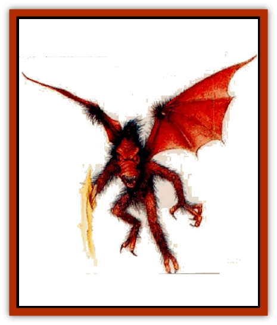

# Sabreclaw

| Statistic | **Sabreclaw** |
| --- | --- |
| **Activity Cycle:** | Night |
| **Alignment:** | Lawful evil |
| **Armor Class:** | 2 |
| **Climate/Terrain:** | Any nonarid Ruins |
| **Damage/Attack:** | 1d12 (claw) |
| **Diet:** | Carnivore |
| **Frequency:** | Very rare |
| **Hit Dice:** | 5 |
| **Intelligence:** | Semi- (2) |
| **Magic Resistance:** | Nil |
| **Morale:** | Champion (16) |
| **Movement:** | 12, Fl 36 (D) |
| **No. Appearing:** | 1d4+1 wings of 2d10 members |
| **No. of Attacks:** | 1 |
| **Organization:** | Wing |
| **Size:** | M (6' tall) |
| **Special Attacks:** | Attacks as a 9 HD creature; dive, grab |
| **Special Defenses:** | Shared hit points |
| **THAC0:** | 11 |
| **Treasure:** | D |
| **XP Value:** | 1,400 per wing |

Saberclaws are large, hairy, flying creatures magically created from tainted waters through an ancient spell. These magical creatures act as agents for the evil wizards and priests who create them.

Saberclaws have slick, greasy, black fur on their 6-foot-tall bodies. The stench of soggy fur and raw sewage hangs about them. Their wings are leathery membranes of a reddish brown color. Saberclaws get their name from the large, swordlike, bony extension that grows in place of a right arm. The eyes of a saberclaw glow a feral red.

Saberclaws speak no true language, though they can understand the orders of their masters. Saberclaws communicate with each other through loud shrieks of varying pitch and intensiw.

**Combat:** Saberclaws fight to serve their masters, often acting as bodyguards or hunters. When hunting at the behest of a master, saberclaws usually attack whatever living creatures they see.

Saberclaws are always created in a wing consisting of 2d10 members. Saberclaws always travel in a wing because all members of a wing share their life force in the form of hit points. Any damage inflicted upon a saberclaw is magically distributed, so that all wing members suffer a portion of the damage.

Each saberclaw contributes 25 hit points to a wing's total; no saberclaw dies until the wing's hit point total has been reduced to 0. For example, a wing of eight saberclaws has 200 hit points; the members of the wing die only when 200 points of damage have been inflicted to the group, even if all damage is directed at a single creature.

When the wing's hit point total reaches 0, each saberclaw issues a hideous death shriek and bursts into a foul black cloud of greasy smoke.

In addition to the shared hit points, the unity of the wing also grants saberclaws increased attack abilities. Saberclaws possess a slight telepathic ability, allowing them to communicate silently with each other in battle. This allows them to anticipate the actions of an opponent, accounting for their low Armor Class and increased chances to hit opponents.

A saberclaw attacks with its swordlike arm, attacking as a creature with 9 Hit Dice and causing 1d12 points of damage. A saberclaw can dive at an opponent; this is considered a charging attack, giving the saberclaw a +2 bonus to attack rolls and a +1 penalty to Armor Class, while giving opponents a -2 bonus to initiative. A saberclaw inflicts double damage on an opponent with a successful diving attack.

Saberclaws enjoy grabbing opponents and lifting them into the air. Two saberclaws can lift one fully-equipped adult human. An opponent of size S or smaller can be picked up by a single saberclaw. Size large or huge creatures require four or six saberclaws, respectively; the number of saberclaws needed to pick up a gargantuan creature is at least 10, but might be higher depending on the victim's size and weight.

Once a victim is lifted, saberclaws attempt to carry it to great heights and drop it. If the saberclaws' master has instructed the creatures to fetch an individual, the wing will not engage in this sport but will obey its instructions faithfully.

Because of their enchanted origin, saberclaws are difficult to affect with magic. They are completely immune to all spells of 1st through 3rd level. They are also immune to poisons. A saberclaw's saving throws also benefit from the unity of the wing; each saberclaw makes saving throws as if it were a 5 Hit Die creature, plus a +1 bonus for every four members of the wing.

Saberclaws can see invisible, ethereal, and hidden creatures and objects as if they possessed the ability of *true seeing*.

**Habitat/Society:** To a saberclaw, life is the wing. Individuality is something foreign to these horrid creatures. Saberclaws fight, fly, eat, and sleep as a unit.

Creating a wing of saberclaws requires a fully stocked laboratory, an ancient forbidden spell, and ingredients and components worth a minimum of 60,000 gold pieces. The spell is known only to a few spellcasters who are reluctant to share their power by teaching the spell to others.

A wing of saberclaws can be created by a wizard of at least 12th level or a priest of at least 11th level; the process requires at least a month of preparation before the spell is cast (which takes 1d6+12 hours of continuous casting). Once created, the wing obeys the creator. Should the creator die, the wing hunts down the killers, slays them, then dissolves into black mist.

**Ecology:** Saberclaws are unnatural, artificial life forms that neither contribute to nor take away from the environment around them. They are created solely to serve a master.

---
## Discovery & Documentation

**Source Publication:** Mystara Appendix (1994)
**Campaign Setting:** Mystara
**Author(s):** John Nephew, Teeuwynn Woodruff, John Terra, Skip Williams

### Other Creatures Found in This Source Book
   * [[Actaeon|Actaeon]]
   * [[Agarat|Agarat]]
   * [[Ash_Crawler|Ash Crawler]]
   * [[Baldandar|Baldandar]]
   * [[Bargda|Bargda]]
   * [[Bhut|Bhut]]
   * [[Bird_Mystara|Bird (Mystara)]]
   * [[Blackball|Blackball]]
   * [[Choker|Choker]]
   * [[Coltpixie|Coltpixie]]
   * [[Crone_of_Chaos|Crone of Chaos]]
   * [[Darkhood|Darkhood]]
   * [[Darkwing|Darkwing]]
   * [[Decapus|Decapus]]
   * [[Deep_Glaurant|Deep Glaurant]]
   * [[Diabolus|Diabolus]]
   * [[Dimensional_Warper|Dimensional Warper]]
   * [[Dragon_Mystara_Crystalline|Dragon (Mystara), Crystalline]]
   * [[Dragon_Mystara_Jade|Dragon (Mystara), Jade]]
   * [[Dragon_Mystara_Onyx|Dragon (Mystara), Onyx]]
   * [[Dragon_Mystara_Ruby|Dragon (Mystara), Ruby]]
   * [[Drake_Mystara|Drake (Mystara)]]
   * [[Dragonfly|Dragonfly]]
   * [[Dusanu|Dusanu]]
   * [[Elemental_of_Chaos_Air_Earth|Elemental of Chaos, Air/Earth]]
   * [[Elemental_of_Chaos_Fire_Water|Elemental of Chaos, Fire/Water]]
   * [[Elemental_of_Law_Air_Earth|Elemental of Law, Air/Earth]]
   * [[Elemental_of_Law_Fire_Water|Elemental of Law, Fire/Water]]
   * [[Familiar_Mystara|Familiar (Mystara)]]
   * [[Frost_Salamander|Frost Salamander]]
   * [[Fundamental_Air_Earth|Fundamental, Air/Earth]]
   * [[Fundamental_Fire_Water|Fundamental, Fire/Water]]
   * [[Gargantua_Mystara|Gargantua (Mystara)]]
   * [[Geonid|Geonid]]
   * [[Ghostly_Horde|Ghostly Horde]]
   * [[Giant_Athach|Giant, Athach]]
   * [[Giant_Hephaeston|Giant, Hephaeston]]
   * [[Golem_Drolem|Golem, Drolem]]
   * [[Golem_Mystara_I|Golem (Mystara) I]]
   * [[Golem_Mystara_II|Golem (Mystara) II]]
   * [[Golem_Mystara_III|Golem (Mystara) III]]
   * [[Gray_Philosopher|Gray Philosopher]]
   * [[Guardian_Warrior|Guardian Warrior]]
   * [[Gyerian|Gyerian]]
   * [[Herex|Herex]]
   * [[Hivebrood|Hivebrood]]
   * [[Horde|Horde]]
   * [[Hsiao|Hsiao]]
   * [[Huptzeen|Huptzeen]]
   * [[Hutaakan|Hutaakan]]
   * [[Imp_Mystara|Imp (Mystara)]]
   * [[Jellyfish_Giant_Mystara|Jellyfish, Giant (Mystara)]]
   * [[Kna|Kna]]
   * [[Kopru|Kopru]]
   * [[Lizard_Mystara|Lizard (Mystara)]]
   * [[Lizard-kin_Mystara|Lizard-kin (Mystara)]]
   * [[Lupin|Lupin]]
   * [[Lycanthrope_Werejaguar_Mystara|Lycanthrope, Werejaguar (Mystara)]]
   * [[Lycanthrope_Wereswine|Lycanthrope, Wereswine]]
   * [[Magen|Magen]]
   * [[Manikin|Manikin]]
   * [[Mek|Mek]]
   * [[Mujina|Mujina]]
   * [[Nagpa|Nagpa]]
   * [[Neh-thalggu|Neh-thalggu]]
   * [[Nightshade_Mystara|Nightshade (Mystara)]]
   * [[Nuckalavee|Nuckalavee]]
   * [[Pegataur|Pegataur]]
   * [[Phanaton|Phanaton]]
   * [[Plant_Dangerous_Mystara|Plant, Dangerous (Mystara)]]
   * [[Plasm|Plasm]]
   * [[Rakasta|Rakasta]]
   * [[Rock_Man|Rock Man]]
   * [[Sacrol|Sacrol]]
   * [[Scamille|Scamille]]
   * [[Shapeshifter|Shapeshifter]]
   * [[Shargugh|Shargugh]]
   * [[Shark-kin|Shark-kin]]
   * [[Sollux|Sollux]]
   * [[Spectral_Death|Spectral Death]]
   * [[Spectral_Hound|Spectral Hound]]
   * [[Spider-kin|Spider-kin]]
   * [[Spirit_Mystara|Spirit (Mystara)]]
   * [[Statue_Living|Statue, Living]]
   * [[Surtaki|Surtaki]]
   * [[Tabi|Tabi]]
   * [[Thoul|Thoul]]
   * [[Thunderhead|Thunderhead]]
   * [[Tiger_Ebon|Tiger, Ebon]]
   * [[Topi|Topi]]
   * [[Tortle|Tortle]]
   * [[Vampire_Velya|Vampire, Velya]]
   * [[White_Fang|White Fang]]
   * [[Worm_Mystara|Worm (Mystara)]]
   * [[Wyrd|Wyrd]]
   * [[Yowler|Yowler]]
   * [[Zombie_Lightning|Zombie, Lightning]]
