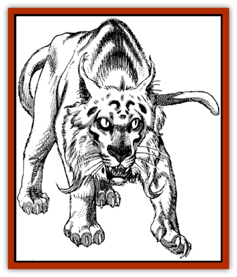

# Sabu Lord

| Statistic | **Sabu Lord** |
| --- | --- |
| **Activity Cycle:** | Day |
| **Alignment:** | Neutral |
| **Armor Class:** | 3 (males), 4 (females) |
| **Climate/Terrain:** | Tropical/Plains and savannah |
| **Damage/Attack:** | 1-6/1-6/2-16 |
| **Diet:** | Carnivore |
| **Frequency:** | Rare |
| **Hit Dice:** | 8+8 |
| **Intelligence:** | Very (11-12) |
| **Magic Resistance:** | Nil |
| **Morale:** | Champion (16) |
| **Movement:** | 12, Jp 6 |
| **No. Appearing:** | 1-2 |
| **No. of Attacks:** | 3 |
| **Organization:** | Solitary |
| **Size:** | L (12-16' long) |
| **Special Attacks:** | Roar, summoning |
| **Special Defenses:** | See below |
| **THAC0:** | 13 |
| **Treasure:** | F |
| **XP Value:** | 4,000 |

Sabu lords, or Lion Lords, are proud giant cats that live on the arid plains and savannahs of Zakhara. These intelligent [[Cat_Great|lions]] are extremely territorial and will harass those who travel through their domains without first asking permission.

Sabu lords are larger and much stronger cats than their smaller cousins. They all have bright golden fur, while males are also distinguished by their flowing, golden-red manes. These giant predators measure 5-6' at the shoulder and have a deafening roar that can be heard for miles in all directions.

Sabu lords speak the languages of all cats as well as Midani.

**Combat:** Lion lords rarely enter into combat alone. They are always attended by 2-12 common lions with maximum hit points, who will fight to the death if ordered by their sovereign.

Like their common cousins, the senses of sabu lords are incredibly keen, and they have a +2 bonus on their surprise rolls. They physically attack with their claws and bite and can leap as far as 60'.

Sabu lords can deliver a powerful roar, which has a 60' long, cone-shaped area of effect and is similar to an *enhanced shout* spell. The roar affects all creatures within its area of effect, causing 3-18 points of damage and permanent deafness. A successful save versus paralyzation reduces the damage by half and limits the deafness to a duration of 1-4 turns. Any exposed brittle or crystal substance can be shattered by the roar. (Objects in a creature's possession are entitled to a save vs. crushing blow.) Deafened creatures receive a +1 penalty to surprise and initiative rolls, while those casting spells with verbal components have a 25 % chance of miscasting them. A lion lord can only use its special roar three times a day.

In addition to the effects described above, the roar of a sabu lord will summon all [[Cat_Great|great cats]] in a 15-mile radius. On the plains, this means 1-4 cheetahs and 2-12 common lions will respond within 1 turn, with a like number arriving 2-5 turns later. If the boundaries of a forest are nearby, the roar will also bring 1-2 jaguars, 1-2 leopards, and 1-4 wild tigers in 2-5 turns. This small army of great cats will follow the commands of the summoning sabu lord to the death.

**Habitat/Society:** Sabu lords are haughty and vain creatures. The common lions in a lord's continual attendance provide for his or her sustenance, although they may all hunt together occasionally for entertainment. Sabu lords typically claim all lands within a 15-mile radius of their lair as their domain. All cats dwelling therein are considered to be loyal subjects, while other beings (sentient or not) are considered to be either guests or potential meals.

The arrogance of a sabu lord is such that any adult will never be found in another lord's territory. Mating takes place rather briefly at the boundary between two domains. The product of such a union is usually a single cub, which is fostered at the mother's "court" until it reaches adulthood, after which it must leave and establish its own domain. If an encounter with two sabu lords is called for, one will be a female and the other a cub (with 1-7 hit dice).

Anyone traveling through a sabu lord's domain is viewed as a trespasser unless he pays homage to the feline sovereign and begs for permission to pass through the cat's lands. It is not uncommon for merchants to leave gifts of gold, gems, and food for the sabu lord as tribute, although a poor traveler with a flattering tongue may just as easily gain safe passage. Even a large, well-armed caravan is not immune to the wrath of an unappeased sabu lord. A small army of great cats will be sent to stalk and terrify the trespassers. At night, the cats' roars will foster sleeplessness, and lightning-swift raids will deprive even the most vigilant of parties of a few mounts. Voyagers traveling in small numbers can expect even more harassment. Poorly-armed or solitary travelers will be repeatedly attacked by the great cats.

**Ecology:** Superstitious people consider the sabu lord to be a summoner of evil spirits. Anyone spending a night with a dozen lions, cheetahs, tigers, and jaguars roaring just beyond the light of their campfire would be hard pressed to deny such a rumor.

The pelt of a sabu lord is rumored to avert evil spirits and curses, in particular the *evil eye*. In fact, if the hair from a sabu lord's mane is woven into a braid, it will protect the owner with the effects of a continual *avert evil eye* spell for 60 days.

---
## Discovery & Documentation

**Source Publication:** MC13 Al-Qadim Appendix (1992)
**Campaign Setting:** Al-Qadim (Forgotten Realms)
**Author(s):** C. Terry Phillips

### Other Creatures Found in This Source Book
   * [[Ammut|Ammut]]
   * [[Ashira|Ashira]]
   * [[Asuras|Asuras]]
   * [[Black_Cloud_of_Vengeance|Black Cloud of Vengeance]]
   * [[Buraq|Buraq]]
   * [[Camel|Camel]]
   * [[Camel_of_the_Pearl|Camel of the Pearl]]
   * [[Centaur_Desert|Centaur, Desert]]
   * [[Copper_Automaton|Copper Automaton]]
   * [[Debbi|Debbi]]
   * [[Elephant_Bird|Elephant Bird]]
   * [[Gen|Gen]]
   * [[Genie_Noble_Dao|Genie, Noble Dao]]
   * [[Genie_Noble_Djinni|Genie, Noble Djinni]]
   * [[Genie_Noble_Efreeti|Genie, Noble Efreeti]]
   * [[Genie_Noble_Marid|Genie, Noble Marid]]
   * [[Genie_Tasked_Architect_Builder|Genie, Tasked, Architect/Builder]]
   * [[Genie_Tasked_Artist|Genie, Tasked, Artist]]
   * [[Genie_Tasked_Guardian|Genie, Tasked, Guardian]]
   * [[Genie_Tasked_Herdsman|Genie, Tasked, Herdsman]]
   * [[Genie_Tasked_Slayer|Genie, Tasked, Slayer]]
   * [[Genie_Tasked_Warmonger|Genie, Tasked, Warmonger]]
   * [[Genie_Tasked_Winemaker|Genie, Tasked, Winemaker]]
   * [[Ghost_Mount|Ghost Mount]]
   * [[Ghul|Ghul]]
   * [[Giant_Desert|Giant, Desert]]
   * [[Giant_Jungle|Giant, Jungle]]
   * [[Giant_Reef|Giant, Reef]]
   * [[Giant_Zakhara_General_Information|Giant (Zakhara), General Information]]
   * [[Hama|Hama]]
   * [[Heway|Heway]]
   * [[Living_Idol|Living Idol]]
   * [[Lycanthrope_Werehyena|Lycanthrope, Werehyena]]
   * [[Lycanthrope_Werelion|Lycanthrope, Werelion]]
   * [[Markeen|Markeen]]
   * [[Maskhi|Maskhi]]
   * [[Mason_Wasp_Giant|Mason Wasp, Giant]]
   * [[Nasnas|Nasnas]]
   * [[Pahari|Pahari]]
   * [[Rom|Rom]]
   * [[Sakina|Sakina]]
   * [[Serpent_Lord|Serpent Lord]]
   * [[Serpent_Winged|Serpent, Winged]]
   * [[Silat|Silat]]
   * [[Simurgh|Simurgh]]
   * [[Stone_Maiden|Stone Maiden]]
   * [[Vishap|Vishap]]
   * [[Zaratan|Zaratan]]
   * [[Zin|Zin]]
