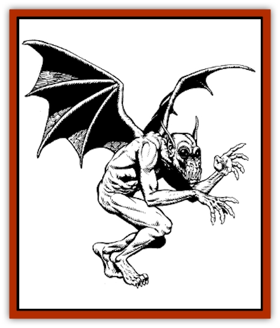

# Sacaanti

| Statistic | **Sacaanti** |
| --- | --- |
| **Activity Cycle:** | Any |
| **Alignment:** | Any evil |
| **Armor Class:** | 2 |
| **Climate/Terrain:** | Any |
| **Damage/Attack:** | 1d3/1d3/1d3+1 |
| **Diet:** | Carnivore |
| **Frequency:** | Very rare |
| **Hit Dice:** | 4 |
| **Intelligence:** | Average (8-10) |
| **Magic Resistance:** | 25% |
| **Morale:** | Steady (11-12) |
| **Movement:** | 6, Fl 24 (B) |
| **No. Appearing:** | 1 |
| **No. of Attacks:** | 3 |
| **Organization:** | Solitary |
| **Size:** | S (2' tall) |
| **Special Attacks:** | Poison bite, wizard spells |
| **Special Defenses:** | Etherealness, regeneration |
| **THAC0:** | 17 |
| **Treasure:** | T |
| **XP Value:** | 2,000 |

A sacaanti is a magical amalgamation of an [[Imp|imp]] and a [[Imp|quasit]]. Sacaantis are used by evil Zhentarim wizards as utterly loyal familiars. Only through powerful magic can a sacaanti be created.

Sacaantis look similar to both imps and quasits, except they do not have a tail. Most sacaantis are 2 to 3 feet tall, possess batlike wings, a thick leathery hide, and a fiendish appearance. To make up for the lack of a poison tail, sacaantis have more powerful wings than a normal imp. These give them a greater flight range and speed. Sacaantis do not have the ability to polymorph as an imp, but have the ability to cast spells.

**Combat:** Sacaantis attack with their two claws and sharp fangs. Although they do not have a poison tail, sacaantis have a poisonous bite. The victim of such a bite must make a successful saving throw vs. poison with a +2 bonus or suffer a massive heart attack, dying the next round. Sacaantis have 60-foot infravision.

Sacaantis are usually trained as wizards by their masters. Their effective spellcasting level is limited to one-third of their masters' level, rounded down. Melee combat is not the first choice of a sacaanti, and the creature often casts offensive spells from a distance or sneaks in close using *invisibility* or other such spells.

The master of a sacaanti can also cast spells through the creature, using it as a magical conduit. However, this is dangerous to the sacaanti, causing it 1 point of damage for every level of the spell. For instance, a wizard could cast *fireball* through his sacaanti familiar, using the sacaanti's sensory impressions to target the spell. The range limitations are treated as if the sacaanti originated the spell, but the sacaanti would suffer 3 points of damage (because fireball is a 3rd-level spell).

A sacaanti can become ethereal, at will, a number of times per day equal to the level of its master. If the creature chooses to do this instead of an attack in a combat round, then the sacaanti becomes ethereal before any attacks occur.

Sacaantis regenerate 1 hit point per turn, and confer this ability on their masters as long as they are within a mile. Many of the immunities of imps and quasits (such as to cold, fire, and normal weapons) are lost in the creature's creation. In exchange, sacaantis are not affected by holy symbols, the spell *holy word*, or other magical manifestations that banish extraplanar creatures from the Prime Material Plane.

**Habitat/Society:** First created in the magical labs of the Zhentarim nearly a century ago, sacaantis are extremely rare. Both imps and quasits are difficult to summon, and keeping the two in the same room is a near-impossible feat. Sacaantis are created when, with two successful *polymorph other* spells and a carefully worded *wish*, an imp and quasit are joined together. This process is dangerous, and sometimes ends with the death of the two beings to be joined. Only half of the joined creatures survive. However, once a sacaanti comes into being, it becomes an unswerving ally of the spellcaster who created it - something one can never expect from an imp or a quasit.

From the moment of its creation the sacaanti is in telepathic contact with its master. The longer the link remains, the more the two become extensions of each other. If a sacaanti's master is knocked unconscious, the creature can take control of its master's motor functions and command the body to walk, run, or perform other tasks (excluding the casting of spells). When they wish to, both the sacaanti and its master can receive each other's sensory impressions (including infravision).

The death of a master or his sacaanti is devastating to the other. If a sacaanti dies while linked to his master, the wizard loses one level plus one level for every decade the two were joined. If this reduces the wizard below 1st level, the mage dies. If the two were joined less than a decade, the master falls into a coma 24 hours after the sacaanti's death for a number of weeks equal to the number of years the two were joined. If the master of a sacaanti dies, then the creature has 24 hours to enact its revenge before it too dies. This life-or-death link sets in immediately after the sacaanti is created.

Sacaantis and their masters dislike remaining apart for more than a few days. Sacaantis are always evil in alignment, but are either lawful, neutral, or chaotic, depending on the alignment of their masters.

**Ecology:** Sacaantis are more than errand boys or pets for Zhentarim wizards. They actually become extensions of the wizards, and the bond between the them is considered to be stronger than that between a wizard and a familiar. In many ways a sacaanti becomes the child a wizard never had, in addition to being a powerful tool of the spellcaster.

Sacaantis live on a diet of raw meat and must eat daily. The creatures have no need for sleep. They are surprisingly neat and clean, considering their origins.

---
## Discovery & Documentation

**Source Publication:** Ruins of Zhentil Keep (1995)
**Campaign Setting:** Forgotten Realms
**Author(s):** John Terra and Kevin Melka

### Other Creatures Found in This Source Book
   * [[Banedead|Banedead]]
   * [[Banelich|Banelich]]
   * [[Burnbones|Burnbones]]
   * [[Elemental_Nature|Elemental, Nature]]
   * [[Gargoyle_Guardgoyle|Gargoyle, Guardgoyle]]
   * [[Golem_Magic|Golem, Magic]]
   * [[Golem_Vault_Guardian|Golem, Vault Guardian]]
   * [[Hybsil|Hybsil]]
   * [[Magedoom|Magedoom]]
   * [[Mist_Scarlet_Dancer|Mist, Scarlet Dancer]]
   * [[Orc_Ondonti|Orc, Ondonti]]
   * [[Rat_Zhentish_Sewer|Rat, Zhentish Sewer]]
   * [[Render|Render]]
   * [[Snake_Messenger|Snake, Messenger]]
   * [[Zhentarim_Spirit|Zhentarim Spirit]]
