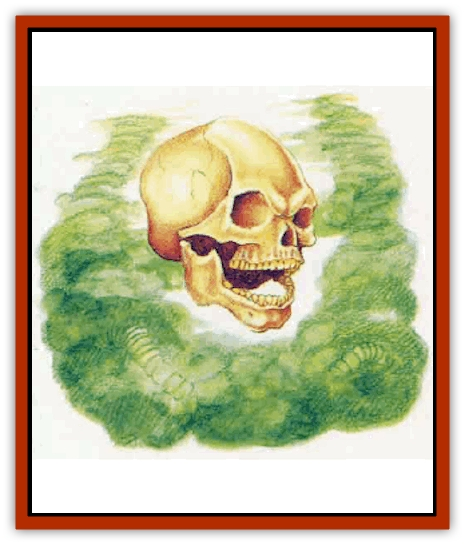

# Sacrol

| Statistic | **Sacrol** |
| --- | --- |
| **Activity Cycle:** | Night |
| **Alignment:** | Chaotic evil |
| **Armor Class:** | 5 |
| **Climate/Terrain:** | Any |
| **Damage/Attack:** | 2d8 (tentacle)/2d8 (tentacle) |
| **Diet:** | Special |
| **Frequency:** | Very rare |
| **Hit Dice:** | 8 |
| **Intelligence:** | Low (7) |
| **Magic Resistance:** | Nil |
| **Morale:** | Fearless (20) |
| **Movement:** | 18 |
| **No. Appearing:** | 1 |
| **No. of Attacks:** | 2 |
| **Organization:** | Solitary |
| **Size:** | S (4' across) |
| **Special Attacks:** | Level drain |
| **Special Defenses:** | Hit only by +1 or better weapon |
| **THAC0:** | 13 |
| **Treasure:** | Nil |
| **XP Value:** | 6,000 |

Sacrols are undead entities of fearsome power and overwhelming hatred. They are spawned in sites of great death, and they exist solely to bring more living creatures into the realm of the dead. They aggressively attack anyone unfortunate enough to encounter them.

A sacrol looks like a large skull surrounded by a constantly shifting, multi-colored mist. The skull resembles one creature whose life force is captured in the sacrol. The mist is the body of the sacrol. It attacks with two long, ropelike tentacles that are composed of mist and are suggestive of entrails.

Sacrols radiate a cold, clammy aura. They do not have language, but they communicate through howls. Their cries sound like the shrill death shrieks of many creatures in their death throes. If one listens closely, the individual cries can be distinguished.

**Combat:** Sacrols use their two ropy tentacles against their victims. A sacrol may attack two victims in one round, but may not direct both tentacles at the same victim.

A successful tentacle hit inflicts 2d8 points of damage and immediately drains one level from the victim. The tentacle wraps around the victim's neck and begins a chokehold in the following round, inflicting 2d4 points of damage in that that round and every subsequent round until either the victim or the sacrol is dead. The chokehold can be broken by a successful bend bars roll.

Once per day, a sacrol can emit a powerful shriek that acts as a *slay living* spell against one victim. If the sacrol is somehow magically silenced, or if a bard is singing, the voice attack is neutralized.

Like most other undead, sacrols are immune to mind-affecting spells such as *sleep* and *charm*, and to cold-based attacks.

Sacrols can be hit only by weapons of +1 or greater enchantment. Holy water inflicts 1d4+1 points of damage on a sacrol. They are turned as spectres. A priest of good alignment can destroy a sacrol with an *exorcism* or *dispel evil* spell. Those spells will actually bring peace to the departed life forces that make up the sacrol, releasing them from the evil restlessness.

A sacrol can occasionally cast an *animate dead* spell to create and control a number of creatures equal to 8 Hit Dice. The sacrol cannot cast the spell again until those undead servants are destroyed.

**Habitat/Society:** Sacrols are the collected angry spirits of the dead. They have great hatred for the living, especially for their slayers, if any.

Sacrols arise in places of mass death, such as battlefields, sacked temples, and plague-ridden cities or countrysides. Such a creature is forever bound to its death site unless it follows its killers in the hope of achieving vengeance. The sacrol can unerringly track the killers of those who became part of the sacrol. Wise travelers know to hide from a wandering sacrol, for even though it pursues its killers, the sacrol will slay any living thing in its path.

It seems odd that even lawful good victims can become part of an evil sacrol, but it is speculated among religious scholars that the sacrol's great hatred is the result of death trauma coupled with a chance closeness to a rift in the Negative Energy Plane.

If a sacrol manages to avenge itself against its killers, it must return to its death site and haunt it forever.

**Ecology:** Sacrols feed on the life energies of their victims; this is the only sustenance they require.

Some priests have been known to collect the ectoplasmic remains of sacrols and use this as an ingredient in a *potion of undead control*.

---
## Discovery & Documentation

**Source Publication:** Mystara Appendix (1994)
**Campaign Setting:** Mystara
**Author(s):** John Nephew, Teeuwynn Woodruff, John Terra, Skip Williams

### Other Creatures Found in This Source Book
   * [[Actaeon|Actaeon]]
   * [[Agarat|Agarat]]
   * [[Ash_Crawler|Ash Crawler]]
   * [[Baldandar|Baldandar]]
   * [[Bargda|Bargda]]
   * [[Bhut|Bhut]]
   * [[Bird_Mystara|Bird (Mystara)]]
   * [[Blackball|Blackball]]
   * [[Choker|Choker]]
   * [[Coltpixie|Coltpixie]]
   * [[Crone_of_Chaos|Crone of Chaos]]
   * [[Darkhood|Darkhood]]
   * [[Darkwing|Darkwing]]
   * [[Decapus|Decapus]]
   * [[Deep_Glaurant|Deep Glaurant]]
   * [[Diabolus|Diabolus]]
   * [[Dimensional_Warper|Dimensional Warper]]
   * [[Dragon_Mystara_Crystalline|Dragon (Mystara), Crystalline]]
   * [[Dragon_Mystara_Jade|Dragon (Mystara), Jade]]
   * [[Dragon_Mystara_Onyx|Dragon (Mystara), Onyx]]
   * [[Dragon_Mystara_Ruby|Dragon (Mystara), Ruby]]
   * [[Drake_Mystara|Drake (Mystara)]]
   * [[Dragonfly|Dragonfly]]
   * [[Dusanu|Dusanu]]
   * [[Elemental_of_Chaos_Air_Earth|Elemental of Chaos, Air/Earth]]
   * [[Elemental_of_Chaos_Fire_Water|Elemental of Chaos, Fire/Water]]
   * [[Elemental_of_Law_Air_Earth|Elemental of Law, Air/Earth]]
   * [[Elemental_of_Law_Fire_Water|Elemental of Law, Fire/Water]]
   * [[Familiar_Mystara|Familiar (Mystara)]]
   * [[Frost_Salamander|Frost Salamander]]
   * [[Fundamental_Air_Earth|Fundamental, Air/Earth]]
   * [[Fundamental_Fire_Water|Fundamental, Fire/Water]]
   * [[Gargantua_Mystara|Gargantua (Mystara)]]
   * [[Geonid|Geonid]]
   * [[Ghostly_Horde|Ghostly Horde]]
   * [[Giant_Athach|Giant, Athach]]
   * [[Giant_Hephaeston|Giant, Hephaeston]]
   * [[Golem_Drolem|Golem, Drolem]]
   * [[Golem_Mystara_I|Golem (Mystara) I]]
   * [[Golem_Mystara_II|Golem (Mystara) II]]
   * [[Golem_Mystara_III|Golem (Mystara) III]]
   * [[Gray_Philosopher|Gray Philosopher]]
   * [[Guardian_Warrior|Guardian Warrior]]
   * [[Gyerian|Gyerian]]
   * [[Herex|Herex]]
   * [[Hivebrood|Hivebrood]]
   * [[Horde|Horde]]
   * [[Hsiao|Hsiao]]
   * [[Huptzeen|Huptzeen]]
   * [[Hutaakan|Hutaakan]]
   * [[Imp_Mystara|Imp (Mystara)]]
   * [[Jellyfish_Giant_Mystara|Jellyfish, Giant (Mystara)]]
   * [[Kna|Kna]]
   * [[Kopru|Kopru]]
   * [[Lizard_Mystara|Lizard (Mystara)]]
   * [[Lizard-kin_Mystara|Lizard-kin (Mystara)]]
   * [[Lupin|Lupin]]
   * [[Lycanthrope_Werejaguar_Mystara|Lycanthrope, Werejaguar (Mystara)]]
   * [[Lycanthrope_Wereswine|Lycanthrope, Wereswine]]
   * [[Magen|Magen]]
   * [[Manikin|Manikin]]
   * [[Mek|Mek]]
   * [[Mujina|Mujina]]
   * [[Nagpa|Nagpa]]
   * [[Neh-thalggu|Neh-thalggu]]
   * [[Nightshade_Mystara|Nightshade (Mystara)]]
   * [[Nuckalavee|Nuckalavee]]
   * [[Pegataur|Pegataur]]
   * [[Phanaton|Phanaton]]
   * [[Plant_Dangerous_Mystara|Plant, Dangerous (Mystara)]]
   * [[Plasm|Plasm]]
   * [[Rakasta|Rakasta]]
   * [[Rock_Man|Rock Man]]
   * [[Sabreclaw|Sabreclaw]]
   * [[Scamille|Scamille]]
   * [[Shapeshifter|Shapeshifter]]
   * [[Shargugh|Shargugh]]
   * [[Shark-kin|Shark-kin]]
   * [[Sollux|Sollux]]
   * [[Spectral_Death|Spectral Death]]
   * [[Spectral_Hound|Spectral Hound]]
   * [[Spider-kin|Spider-kin]]
   * [[Spirit_Mystara|Spirit (Mystara)]]
   * [[Statue_Living|Statue, Living]]
   * [[Surtaki|Surtaki]]
   * [[Tabi|Tabi]]
   * [[Thoul|Thoul]]
   * [[Thunderhead|Thunderhead]]
   * [[Tiger_Ebon|Tiger, Ebon]]
   * [[Topi|Topi]]
   * [[Tortle|Tortle]]
   * [[Vampire_Velya|Vampire, Velya]]
   * [[White_Fang|White Fang]]
   * [[Worm_Mystara|Worm (Mystara)]]
   * [[Wyrd|Wyrd]]
   * [[Yowler|Yowler]]
   * [[Zombie_Lightning|Zombie, Lightning]]
