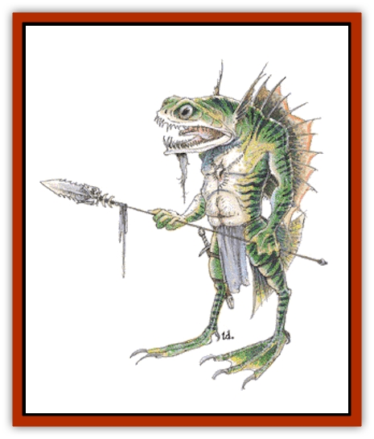

# Sahuagin

| Statistic | **Sahuagin** |
| --- | --- |
| **Activity Cycle:** | Night |
| **Alignment:** | Lawful evil |
| **Armor Class:** | 5 |
| **Climate/Terrain:** | Temperate/Salt water |
| **Damage/Attack:** | 1-2/1-2/1-4/1-4/1-4 or weapon type |
| **Diet:** | Carnivore |
| **Frequency:** | Uncommon |
| **Hit Dice:** | 2+2 |
| **Intelligence:** | High (13-14) |
| **Magic Resistance:** | Nil |
| **Morale:** | Steady (12) |
| **Movement:** | 12, Sw 24 |
| **No. Appearing:** | 20-80 |
| **No. of Attacks:** | 1 or see below |
| **Organization:** | Tribal |
| **Size:** | M (6'), some L (9') |
| **Special Attacks:** | See below |
| **Special Defenses:** | See below |
| **THAC0:** | 19 |
| **Treasure:** | N (I,O,P,Q&times;10,X,Y) |
| **XP Value:** | 175 / Lieutenant: 270 / Chieftain: 420 / Priestess: 650 / Baron: 975 / Prince: 2,000 |

Sahuagin are a vicious, predatory race of fish-men that live in warm coastal waters. They are highly organized and greatly enjoy raiding shore communities for food and sport.

Typical sahuagins are blackish green on their backs, shading to green on their bellies, with black fins. Their great, staring eyes are deep, shining black. They have scaly skin, with webbed fingers and toes, and their mouths are filled with sharp fangs. About 1 in 216 sahuagin is a mutation with four usable arms. These specimens are usually black shading to gray. Females are indistinguishable from males, except that they are slightly smaller. Hatchlings are a light green color, but they darken and attain full growth approximately one to two months after hatching.

Sahuagin speak their own tongue.

**Combat:** Though they wear no armor, their scales are tough and equal to AC 5. Sahuagin wear a harness to carry their personal gear and weapons. A group of these creatures is typically armed as follows:

<ul><li>Heavy crossbow &amp; dagger 20%</li><li>Spear &amp; dagger 30%</li><li>Trident, net &amp; dagger 50%</li></ul>Spears are used only as thrusting weapons. Nets are set with dozens of hooks that make escape virtually impossible for unarmored victims or creatures not able to grasp and tear with a Strength of 16 or greater. Nets are replaced by three javelins when the band forays onto land. The crossbows fire a maximum of 30 feet underwater and normal ranges on the surface. Tridents have three uses - to spear small prey, to pin prey trapped in nets, and to hold threatening opponents at bay.

Sahuagin are well-equipped to attack even without weapons, for their webbed hands each end in long, sharp claws that can inflict 1-2 points of damage per attack. Their powerful rear legs are likewise taloned, and if they kick an opponent with them, they inflict 1d4 points of damage with each hit from either foot. The sharp teeth of the sahuagin cause 1d4 points of damage if a bite is scored on a victim. Thus, it is possible for an unarmed sahuagin to attack three or five times in a melee round causing 1-2/1-2/1-4 and an extra 1-4/1-4 if the legs can rake.

The eyes and ears of these monsters are particularly keen. They can see for 300 feet underwater at depths of up to 100 feet. For each 100 feet of greater depth, their vision is reduced by 10 feet (e.g., when 500 feet deep they can see 260 feet; when 1,000 feet deep they can see 210 feet). Their ears are so sharp as to be able to detect the clinking of metal at one mile, or a boat oar splashing at twice that distance.

A band of sahuagin is always led by a chieftain. He has one lieutenant for every ten members of the group. The chieftain has 4+4 Hit Dice, and his lieutenants have 3+3 Hit Dice. All are in addition to the normal sahuagin in the group.

When raiding villages, sahuagin attack en masse, with leaders in the second rank. As long as there is no truly spirited resistance, they continue in their plunder and violence.

Underwater, in their natural element, the sahuagin are far more confident. Using the three-dimensional aspect of underwater fighting, they sometimes dive down on a group of underwater explorers, coming in from behind, and swooping down and past them, dropping nets on their intended victims.

When sahuagin attack ships, they swarm up from all sides and try to overwhelm with numbers. They often grab their opponents and hurl them into the sea, where at least a fourth of the raiding party lurks, waiting for such an action or as reinforcements. Some leaders carry a conch shell, which when sounded gives the signal for the group of sahuagin in reserve to enter the fray.

Sahuagin have an almost paralyzing fear of spellcasters. They direct their strongest attacks toward anyone who uses spells or spell-like powers, such as the functions of some magical items. Their saving throws vs. fire-based spells suffer a -2 penalty, and they receive an additional point of damage per die of damage from such attacks.

**Habitat/Society:** The sahuagin are sometimes referred to as "sea devils" or "devil men of the deep". They dwell in warm salt waters at depths of 100 to 1,500 feet. Sahuagin are predatory in the extreme, and they pose a threat to all living things because they kill for sport and pleasure as well as for food. They abhor fresh water. They dislike light, and bright light such as that created by a *continual light* spell is harmful to their eyes.

The social structure of the sahuagin is based upon rule by a king who holds court in a vast city deep beneath the waves. This overlord's domain is divided into nine provinces, each ruled by a prince. Each prince has 2d10+10 nobles underneath him. Each noble controls the small groups of sahuagin dwelling in his fief. The sahuagin worship a great devil-shark. Sahuagin priests above 5th level are very rare.

The king is supposed to dwell in a city somewhere at the greatest depth that a sahuagin can exist. This place is supposedly built in an undersea canyon, with palaces and dwellings built along either face. There, fully 5,000 of these monsters live, not counting the king's retinue of queens, concubines, nobles, guards, etc., said to number 1,000 or more. The sahuagin king is reported to be of enormous size (10 Hit Dice + 10 hit points), and of greatest evil. The king is always accompanied by nine noble guards (9+9 Hit Dice) and the evil high priestess of all sahuagin (9+9 Hit Dice) with its retinue of nine underpriestesses (7th-level clerics).

If sahuagin are encountered in their lair, there are the following additional sahuagin:

<ul><li>1 baron (6+6 Hit Dice)</li><li>Nine guards (3+3 Hit Dice)</li><li>3d4 x 10 females (2 Hit Dice)</li><li>1d4 x 10 hatchlings (1 Hit Die)</li><li>2d4 x 10 eggs</li></ul>Also, there is a 10% chance per 10 male sahuagin that there is an evil priestess and 1d4 assistant priestesses, for the religious life of these creatures is dominated by the females. If a priestess is with the group in the lair, it is of 1d4+1 level ability, and the lesser clerics are 3rd or 4th level.

There are always 2d4 [[Shark|sharks]] in a sahuagin lair. Sahuagin are able to make these monsters obey simple one- or two-word commands. Whenever a sahuagin lair is encountered, there is a 5% chance that it is the stronghold of a prince. The prince has 8+8 Hit Dice plus nine guards of chieftain strength. There are also one 8th-level sahuagin evil high priestess and four 4th-level underpriestesses. The numbers of males, females, hatchlings and eggs in a prince's lair are double the numbers given above. There are 4d6 sharks present at all times.

Sahuagin lairs are actual villages or towns, constructed of stone. The buildings are domed, and the seaweed and similar marine plants growing around and on these buildings make them hard to detect.

Few persons have survived capture by the sahuagin, for prisoners are usually quickly tortured and eaten. Any creatures taken alive from raids or intercepting unwelcome visitors are brought to the sahuagins' lair and confined in cells. Although sahuagin are able to stay out of water for up to four hours, there is no air in the confinement areas in the typical village, but in the towns of the nobles there are special quarters to maintain air-breathing creatures. The sahuagin set aside a few prisoners to torture and provide sport - typically a fight to the death between two different creatures in an arena. The bulk of captives are simply killed and eaten. It is seldom that any prisoner escapes, although the sahuagin find sport in allowing captives to think that they have found freedom, only to be encircled by sadistic guards while a school of sharks moves in for the kill.

The sahuagin are cruel and brutal, and the strongest always bully the weaker. Any injured, disabled, or infirm specimen is slain and eaten by these cannibalistic monsters. Even imperfect hatchlings are dealt with in this fashion. This strict law has developed a strong race, however, and any leader is subject to a challenge. Sahuagin never stop growing, although they grow very slowly, and death comes to most before the years allow growth to large size. Leaders are always the largest and strongest. It is reported that the nine sahuagin princes are each of the four-armed sort, as is the king. In any event, the loser of a challenge is always slain, either during combat or afterward. Sometimes the loser winds up as the main course at the victory feast.

Duels are fought without weapons, only fang and claw being permitted.

The sahuagin are chronicled because of their great evil, having time and again raided the land, desolating whole coasts, and destroying passing ships continually. The exact origin of the sahuagin is unknown. It is suggested that they were created from a nation of particularly evil humans by the most powerful lawful evil gods in order to preserve them when the great deluge came upon the earth. Some sages claim that they are degenerate humans who formerly dwelt on the seacoasts, whose evil and depravity was so great that they eventually devolved into fish-folk and sought the darkness of the ocean depths. The [[Triton|tritons]], however, are purported to have believe that sahuagin are distantly related to [[Elf_Aquatic|sea elves]], claiming that the [[Elf_Drow|drow]] spawned the sahuagin.

Sahuagin range as far as 50 miles from their lairs. Most of their lairs are located 2d10+20 miles from coastal shores. Some of these creatures enjoy collecting pearls and coral formations, fashioning them into jewelry. This jewelry is worn as a status symbol. They are fond of wealth, which they use as a measure of influence, and for sacrifice to the deities that they worship in exchange for granted powers and other favors. Most of the treasure found in a sahuagin lair belonged to former victims. There is usually a high concentration of water-related items, such as magical boats, tridents, helms, potions, necklaces, etc. These were gained from adventurers who explored underwater too close to the sahuagin community.

These creatures want nothing less than full control of the sea coasts, collecting as much wealth and power as possible in the process while maintaining the secrecy of their lairs' locations. Those who attempt escape are obsessively hunted down, for fear that the former prisoners may reveal the location of the sahuagins' city.

**Ecology:** Sahuagin venture ashore on dark, moonless nights to raid and plunder human coastal towns. They hate even the evil [[Ixitxachitl|ixitxachitl]], and only sharks are befriended by them.

The feuds and outright warfare between the sahuagin and ixitxachitl have indirectly contributed to preventing the ascendancy of the spellcasting, manta ray-like race. Sahuagin are also fond of eating [[Squid_Giant|giant squid]] and [[Squid_Giant|kraken]]. Their hunting of these monsters of the deep has kept the squid and kraken numbers down to a safe level. Conversely, these beasts enjoy eating sahuagin, which prevents the sahuagin from overrunning coastal areas.

Of all the sea-dwelling races, tritons, sea elves, [[Dolphin|dolphins]], and [[Hippocampus|hippocampi]] are the most implacable enemies of the sahuagin. In fact, the few air-breathers that have escaped the sahuagin owe their freedom to such beings that bravely aided the captives.

---
## Discovery & Documentation

**Source Publication:** MC2 Volume II (1993)
**Campaign Setting:** Advanced Dungeons & Dragons 2nd Edition
**Author(s):** Jay Batista, Scott Bennie, Grant Boucher, William W. Connors, Steve Gilbert, Heike Kubasch, James Lowder, David Edward Martin, Bruce Nesmith, Jean Rabe, Rick Swan, John J. Terra, Gary L. Thomas

### Other Creatures Found in This Source Book
   * [[Ant|Ant]]
   * [[Ant_Lion_Giant|Ant Lion, Giant]]
   * [[Ape_Carnivorous|Ape, Carnivorous]]
   * [[Baboon|Baboon]]
   * [[Badger|Badger]]
   * [[Barracuda|Barracuda]]
   * [[Beetle_Giant|Beetle, Giant]]
   * [[Bulette|Bulette]]
   * [[Bullywug|Bullywug]]
   * [[Dwarf_Duergar|Dwarf, Duergar]]
   * [[Dwarf_Gully|Dwarf, Gully]]
   * [[Eagle|Eagle]]
   * [[Eel|Eel]]
   * [[Elemental_Air_Kin|Elemental, Air Kin]]
   * [[Elemental_Water_Kin|Elemental, Water Kin]]
   * [[Elemental_Water_Kin_Water_Weird|Elemental, Water Kin, Water Weird]]
   * [[Firestar|Firestar]]
   * [[Firetail|Firetail]]
   * [[Fish_Giant|Fish, Giant]]
   * [[Frog|Frog]]
   * [[Gorgon|Gorgon]]
   * [[Hawk|Hawk]]
   * [[Heucuva|Heucuva]]
   * [[Hippocampus|Hippocampus]]
   * [[Hippogriff|Hippogriff]]
   * [[Kelpie|Kelpie]]
   * [[Kenku|Kenku]]
   * [[Killmoulis|Killmoulis]]
   * [[Kuo-Toa|Kuo-Toa]]
   * [[Lamia|Lamia]]
   * [[Lammasu|Lammasu]]
   * [[Lamprey|Lamprey]]
   * [[Leech|Leech]]
   * [[Leprechaun|Leprechaun]]
   * [[Leucrotta|Leucrotta]]
   * [[Locathah|Locathah]]
   * [[Lycanthrope_Wereboar|Lycanthrope, Wereboar]]
   * [[Lycanthrope_Werefox|Lycanthrope, Werefox]]
   * [[Mammal_Minimal|Mammal, Minimal]]
   * [[Mammal_Small|Mammal, Small]]
   * [[Mimic|Mimic]]
   * [[Morkoth|Morkoth]]
   * [[Muckdweller|Muckdweller]]
   * [[Myconid|Myconid]]
   * [[Naga|Naga]]
   * [[Obliviax|Obliviax]]
   * [[Octopus_Giant|Octopus, Giant]]
   * [[Otyugh|Otyugh]]
   * [[Piranha|Piranha]]
   * [[Plant_Dangerous_I|Plant, Dangerous I]]
   * [[Plant_Intelligent|Plant, Intelligent]]
   * [[Poltergeist|Poltergeist]]
   * [[Porcupine|Porcupine]]
   * [[Rat_Osquip|Rat, Osquip]]
   * [[Roc|Roc]]
   * [[Roper|Roper]]
   * [[Rot_Grub|Rot Grub]]
   * [[Rust_Monster|Rust Monster]]
   * [[Sea_Lion|Sea Lion]]
   * [[Sea_Horse_Giant|Sea Horse, Giant]]
   * [[Shambling_Mound|Shambling Mound]]
   * [[Shark|Shark]]
   * [[Sphinx|Sphinx]]
   * [[Squid_Giant|Squid, Giant]]
   * [[Stirge|Stirge]]
   * [[Swanmay|Swanmay]]
   * [[Tarrasque|Tarrasque]]
   * [[Tasloi|Tasloi]]
   * [[Triton|Triton]]
   * [[Troglodyte|Troglodyte]]
   * [[Urchin|Urchin]]
   * [[Urd|Urd]]
   * [[Weasel|Weasel]]
   * [[Wolverine|Wolverine]]
   * [[Yellow_Musk_Creeper|Yellow Musk Creeper]]
