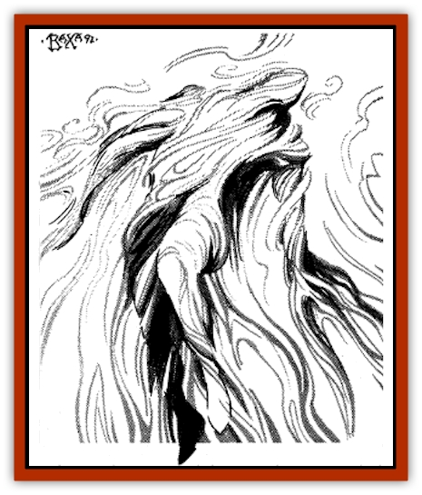

# Sakina

| Statistic | **Sakina** |
| --- | --- |
| **Activity Cycle:** | Any |
| **Alignment:** | Chaotic good |
| **Armor Class:** | 0, -4 when invisible |
| **Climate/Terrain:** | Any |
| **Damage/Attack:** | 3-18 |
| **Diet:** | Special |
| **Frequency:** | Very rare |
| **Hit Dice:** | 7+7 |
| **Intelligence:** | High (13-14) |
| **Magic Resistance:** | 50% |
| **Morale:** | Champion (16) |
| **Movement:** | Fl 48 (A) |
| **No. Appearing:** | 1 |
| **No. of Attacks:** | 1 |
| **Organization:** | Solitary |
| **Size:** | M (5-6' tall) |
| **Special Attacks:** | See below |
| **Special Defenses:** | Invisibility, +1 or better weapons to hit. |
| **THAC0:** | 13 |
| **Treasure:** | Nil |
| **XP Value:** | 5,000 |

Sakina are friendly air sprites, faerie creatures native to Zakhara. They roam the skies looking for interesting scents and amusing adventures. They have no ties to the Elemental Plane of Air and are not considered [[Elemental_General_Information|elementals]].

Sakina are creatures of the wind and normally invisible; they receive all bonuses attributed to invisible creatures, including a -4 bonus to AC. By controlling the humidity of their bodies and drawing in moisture from the surrounding air, they can become partially visible, appearing like a man-shaped patch of cloud or mist. Because of their incredible speed in the air, they have a natural AC of 0 (- 4 when invisible).

They communicate with other sakina using their own language. Many (60%) also know Midani.

**Combat:** Sakina are dangerous opponents. Their normal attack is a compressed wave of air that buffets the target for 3-18 points of damage. The victim of an attack must make a Dexterity check or be blown backward automatically losing initiative in the following round.

More often, however, a sakina attacks using magic. They can make up to 7 creatures, each weighing no more than 700 lbs., as light as the air for up to 7 turns (unless the victims save vs. magic); this is similar in effect to a *ride the wind* spell. Affected creatures will rise into the air and be blown away in the direction and speed of the prevailing winds. They can prevent movement only by grasping onto something stationary (a tree branch or cliff face, for instance). The sakina can control the victims' altitude at will (but not speed and direction, which depends on the wind conditions), raising or lowering their victims at a movement rate of up to 120' per round. Victims drop to the ground after 7 turns (1d6 points of damage per 10. fallen). Sakina can invoke this power three times a day. They often bestow this on befriended or endangered land-dwellers, or they use the spell offensively to blow away their enemies. Sakina have been known to cast this spell on other creatures simply for the sake of amusement.

Sakina can also *control winds* (as per the 5th-level clerical spell), casting the spell three times a day at the 14th level of experience. This power is often used in conjunction with their ability to make others *ride the wind*.

They can also carry a single human-sized passenger tirelessly at full movement rate, covering up to 300 miles in a single day.

All sakina possess 50% magic resistance and can only be harmed by magical weapons.

**Habitat/Society:** The sky is home to all sakina. They are solitary wanderers who claim no lair and hoard no treasure.

Sakina sustain themselves by ingesting particulate nourishment in the form of smells. While a human might eat a roast pheasant, sakina can feed solely on its aroma. They can just as easily dine on the aroma of perfume and scented oils, such as the bouquet of a rose.

A ritual is known among wind elemental mages for summoning a sakina. It is not a summoning spell per se, but rather the burning of expensive incense, spices, and fragrances that the air sprites consider especially delectable (including cinnamon, cloves, rose oil, myrrh, and saffron). Once the components have been assembled and ignited in a brazier, sooner or later (usually within 2-5 days) a sakina will arrive to feast on the bouquet of aromas. The DM should assume that a day's worth of components costs 100-400 gp.

If approached respectfully just before he has finished dining on the smells, a sakina will usually agree to help the "summoner" by providing aerial transportation to a distant location (no more than a few days' travel). The sakina will almost never accompany a wizard or other recent friend on any prolonged journey. These chaotic creatures rarely stay attached to any plan or acquaintance for very long.

**Ecology:** The sakina are widely known for their helpful, if mercurial, demeanor. They are friendly to all nonevil aerial creatures, especially [[Simurgh|simurghs]] and [[Genie|djinn]]. They are the staunch allies of the [[Buraq|buraq]] and are known to answer their summons and requests for assistance immediately.

A few magical items related to flight can be enchanted using a sakina's whisper as a prime component. In addition, their essence can be used to concoct a *potion of flying*.

---
## Discovery & Documentation

**Source Publication:** MC13 Al-Qadim Appendix (1992)
**Campaign Setting:** Al-Qadim (Forgotten Realms)
**Author(s):** C. Terry Phillips

### Other Creatures Found in This Source Book
   * [[Ammut|Ammut]]
   * [[Ashira|Ashira]]
   * [[Asuras|Asuras]]
   * [[Black_Cloud_of_Vengeance|Black Cloud of Vengeance]]
   * [[Buraq|Buraq]]
   * [[Camel|Camel]]
   * [[Camel_of_the_Pearl|Camel of the Pearl]]
   * [[Centaur_Desert|Centaur, Desert]]
   * [[Copper_Automaton|Copper Automaton]]
   * [[Debbi|Debbi]]
   * [[Elephant_Bird|Elephant Bird]]
   * [[Gen|Gen]]
   * [[Genie_Noble_Dao|Genie, Noble Dao]]
   * [[Genie_Noble_Djinni|Genie, Noble Djinni]]
   * [[Genie_Noble_Efreeti|Genie, Noble Efreeti]]
   * [[Genie_Noble_Marid|Genie, Noble Marid]]
   * [[Genie_Tasked_Architect_Builder|Genie, Tasked, Architect/Builder]]
   * [[Genie_Tasked_Artist|Genie, Tasked, Artist]]
   * [[Genie_Tasked_Guardian|Genie, Tasked, Guardian]]
   * [[Genie_Tasked_Herdsman|Genie, Tasked, Herdsman]]
   * [[Genie_Tasked_Slayer|Genie, Tasked, Slayer]]
   * [[Genie_Tasked_Warmonger|Genie, Tasked, Warmonger]]
   * [[Genie_Tasked_Winemaker|Genie, Tasked, Winemaker]]
   * [[Ghost_Mount|Ghost Mount]]
   * [[Ghul|Ghul]]
   * [[Giant_Desert|Giant, Desert]]
   * [[Giant_Jungle|Giant, Jungle]]
   * [[Giant_Reef|Giant, Reef]]
   * [[Giant_Zakhara_General_Information|Giant (Zakhara), General Information]]
   * [[Hama|Hama]]
   * [[Heway|Heway]]
   * [[Living_Idol|Living Idol]]
   * [[Lycanthrope_Werehyena|Lycanthrope, Werehyena]]
   * [[Lycanthrope_Werelion|Lycanthrope, Werelion]]
   * [[Markeen|Markeen]]
   * [[Maskhi|Maskhi]]
   * [[Mason_Wasp_Giant|Mason Wasp, Giant]]
   * [[Nasnas|Nasnas]]
   * [[Pahari|Pahari]]
   * [[Rom|Rom]]
   * [[Sabu_Lord|Sabu Lord]]
   * [[Serpent_Lord|Serpent Lord]]
   * [[Serpent_Winged|Serpent, Winged]]
   * [[Silat|Silat]]
   * [[Simurgh|Simurgh]]
   * [[Stone_Maiden|Stone Maiden]]
   * [[Vishap|Vishap]]
   * [[Zaratan|Zaratan]]
   * [[Zin|Zin]]
