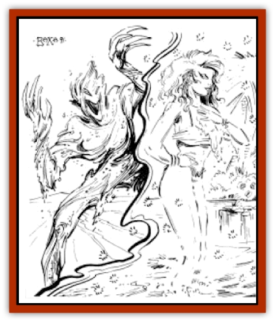
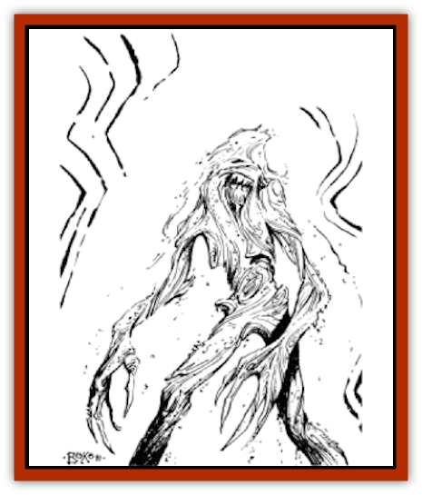

# Sand Bride

| Statistic | **Sand Bride** | **Sand Mother** |
| --- | --- | --- |
| **Activity Cycle:** | Night | Night |
| **Alignment:** | Chaotic evil | Chaotic evil |
| **Armor Class:** | 0 | -1 |
| **Climate/Terrain:** | Sandy wastes | Sandy wastes |
| **Damage/Attack:** | 1-10/1-10 | 1-12/1-12 |
| **Diet:** | Special | Special |
| **Frequency:** | Rare | Very rare |
| **Hit Dice:** | 7 | 9 |
| **Intelligence:** | Average (8-10) | Very (11-12) |
| **Magic Resistance:** | Nil | Nil |
| **Morale:** | Champion (15-16) | Champion (15-16) |
| **Movement:** | 24, Br 12 | 24, Br 12 |
| **No. Appearing:** | 1 | 1 |
| **No. of Attacks:** | 2 | 2 |
| **Organization:** | Solitary | Solitary |
| **Size:** | M (6' tall) | M (6' tall) |
| **Special Attacks:** | Energy Drain | Energy Drain |
| **Special Defenses:** | See below | See below |
| **THAC0:** | 13 | 11 |
| **Treasure:** | C | B,W |
| **XP Value:** | 3,000 | 5,000 |

The sand bride is a negative material plane creature trapped on Athas. It uses its powers of illusion to lure victims to a cold death. The sand bride usually creates the illusion of an oasis, with itself as a beautiful woman (or more rarely, a man). It feeds on the life force of intelligent beings.

The sand bride is made entirely of sand. It has a humanoid shape and two glowing red eyes.

Sand brides speak a small number (1d6) of human or demihuman languages.

**Combat:** A sand bride has a burning hatred for intelligent creatures, but it is tempered with a high degree of cunning. Sand brides can move through the sand at their normal movement rate, and use this ability to scout out prospective victims in the area. A sand bride is intelligent enough to recognize a party with water trouble. Such a party is almost certain to be targeted. Only if the party is large and well-provisioned will a sand bride leave them alone. One of the sand bride's favorite ploys is to wait until someone is lagging behind the party. This being then comes upon an oasis where he expected to find none. This might seem suspicious, but to a man dying of thirst, a pool of water overcomes many misgivings.

The sand bride attempts to lure victims in; when they are refreshing themselves at the illusionary pool, it drops its illusion and seeks to attack with surprise.

The sand bride has the ability to cast *hallucinatory terrain* once a day and a *seeming* spell twice a day. These spells are cast at 10th level. It always uses these spells to cover its own appearance and the appearance of its surroundings. The oasis illusion is almost perfect; only druids and rangers of greater than 5th level are allowed a saving throw to disbelieve. The *seeming* spell is also very good (saving throws to disbelieve are at a penalty of -2). If a victim can be lured into an illusory oasis, the bride invites him to refresh himself. When the prey is bent over drinking, the sand bride drops the illusion and attacks, receiving a +4 attack roll bonus on the first attack.

Anyone who converses with a sand bride has a chance to notice that something is wrong. For every round spent in conversation with a sand bride, a being is allowed a saving throw to disbelieve. Sand brides are not very good at making polite conversation. Most of their information is out of date or just plain wrong. However, a sand bride's first suggestion is almost always "have a drink, then we can talk". It tries to attack while the unsuspecting victim is filling its mouth with sand.

A being who believes the sand bride, and tries to drink, has other problems besides the sand bride to contend with. For one thing, his mouth and throat are coated with sand. Until he can spend a round washing the sand out, he attacks and defends at a penalty of -2. Also, casting spells with verbal components cannot be done.

Since the sand bride is made entirely of sand, swords and spears pass right through it. Only enchanted weapons do any real damage; other weapons just spray a bit of sand around. But, the sand bride will act as though a regular weapon causes damage, even falling back for a round to further the illusion. It tries to keep opponents from finding out its weakness, but clever parties may notice that it does not get any smaller as it takes damage. Only magic weapons can permanently destroy a sand bride. Regular water is harmful to them, but not permanently. Each gallon splashed on a sand bride causes 1d6 points of damage. This damage is temporary, and the sand bride reforms after a day. If the damage is caused by a combination of magical weapons and water, the sand bride still reforms in 24 hours.

In melee the sand bride attacks with its two powerful arms. Each causes 1d10 points of damage and drains one level. A creature drained of all of its life force by a sand bride becomes a dried-out husk. In two days time the husk dissolves into sand and dust, and the victim is irrecoverable by any means short of a *wish*. Before that, a combination of *remove curse* and *raise dead* spells will return the victim to life, but with no memories of his earlier life (including a total loss of experience points). Memories can be regained only by the use of a properly worded *wish*.

If a battle is going badly for a sand bride, it can just melt into the sand, taking one round to disappear completely. If the opponents do not immediately leave the area, the sand bride may (50% chance) rise up from the sand behind someone and attack again.

A sand bride fears nothing, though it has been suggested that they constantly search for someone who can kill them, to send them back to their dark plane. This is contradicted by the cunning they use in their attacks, including letting large parties go unmolested. Still, the sand bride is as likely to masquerade as a (short) female giant as a human. Anything with at least low intelligence is potential prey to a sand bride.

**Habitat/Society:** Sand brides are solitary creatures, having no contact with others of their kind. They are creatures trapped here, and they suffer as much as their victims, if not more. They were trapped here when a defiler opened a rift to the negative material plane.

A sand bride roams a considerable territory, its boundaries limited only by the sand. Sand brides do not like to cross areas other than sand. They can cross silt, but their movement rate is halved. They will not move across other types of terrain. A sand bride's lair is usually well hidden in a pocket beneath the sand. And though they have no use for them, sand brides lust after the possessions of men. Therefore, a sand bride's treasure has twice the normal chance to contain magical items, and three times the chance to contain gems.

**Ecology:** The sand bride has no natural enemies. They prey on anyone they can, seeming to know no limit to their lust for life force. They are especially fond of the life force of preservers.

## 

Sand Mother

A sand mother, or mother of the bride, is a very old and powerful version of the sand bride. Its normal appearance is identical to that of the sand bride. It is not known if the sand mother is a unique creature or if a sand bride can somehow evolve into a sand mother.

**Combat:** The mother of the bride uses the same illusionary powers as the sand bride. Instead of appearing as a beautiful young lady, it chooses to appear as an older, motherly type of creature. The matronly figure welcomes thirsty adventurers, offering to care for them until they are recovered. A sand mother has learned about its weakness in conversation and has developed the ability to mask it. It does this by showing plenty of concern for the "dear young ones" of the party.

The sand mother is very intelligent, it does not attack until conditions are favorable. Before attacking, it tries to discover if anyone is carrying any magical weapons or if there is a preserver in the party. The sand mother always tries to attack the most dangerous member of the party first, with surprise if possible.

Sand mothers cast their illusions at 12th level, and they are very well crafted. Only a druid or ranger of 7th level or higher is allowed a chance to disbelieve the *hallucinatory terrain*, and the *seeming* spell has a -4 penalty to disbelieve.

A sand mother's oasis is always chosen with care. If it can find a pit or sinkhole, it uses that as the center of its *hallucinatory terrain*. Dangerous opponents can then be pushed in while they are drinking. If an opponent is kneeling and "drinking", a successful attack roll for the sand mother automatically pushes the unsuspecting victim in. The victim takes falling damage in addition to the damage for the attack.

In melee the sand mother attacks twice with her powerful fists of sand. Each attack causes 1d12 points of damage and drains one level. Once engaged in melee, the sand mother fights intelligently. It can divide its attacks between two opponents, if they are next to each other. Like the sand bride, it only takes permanent damage from magical weapons, but against the sand mother, these weapons must have at least a +2 bonus. If brought to zero hit points by magical weapons of +1 or less, it reforms in one day. Normal water does no damage to a sand mother.

Sand mothers possess an additional power - the ability to cast a *destroy water* (reversed create water), as a 9th-level priest, once per day. This destroys up to 4½ gallons of water with each use. The sand mother, after trailing a party, will typically use this power against the party as it runs short of water.

The sand bride's hatred for preservers is shared by the sand mother. It always attacks if a preserver is present and usually portrays itself as very interested in the "good mages". It is intelligent enough to know that magic is very dangerous to it, so it usually attacks a preserver first. If the party splits up and runs away, the preserver is still the one the sand mother pursues.

**Habitat/Society:** The sand mother usually resides in a cave deep under the sand. It collects magical items and gems, and a sand mother's treasure is sure to be a valuable one. There is double the normal chance for any magic item, meaning that there is always a magical item in the treasure. This item may very well be useless, particularly if it is a potion or something that does not age well. Finding a sand mother's lair may be an adventure by itself and should never be easy.

**Ecology:** The sand mother's lust for life force exceeds even that of the sand bride. It much prefers intelligent life force, but beasts will be drained of all life, if nothing better is available.

---
## Discovery & Documentation

**Source Publication:** MC12 Dark Sun Appendix I - Terrors of the Desert (1991)
**Campaign Setting:** Dark Sun
**Author(s):** Tom Prusa, Louis J. Prosperi, Walter M. Baas

### Other Creatures Found in This Source Book
   * [[Animal_Herd_Athas|Animal, Herd (Athas)]]
   * [[Animal_Household_Athas|Animal, Household (Athas)]]
   * [[Antloid_Desert|Antloid, Desert]]
   * [[Banshee_Dwarf|Banshee, Dwarf]]
   * [[Beetle_Agony|Beetle, Agony]]
   * [[Bog_Wader|Bog Wader]]
   * [[Brambleweed|Brambleweed]]
   * [[B'rohg|B'rohg]]
   * [[Burnflower|Burnflower]]
   * [[Cat_Psionic|Cat, Psionic]]
   * [[Cha'thrang|Cha'thrang]]
   * [[Cistern_Fiend|Cistern Fiend]]
   * [[Clam_Giant|Clam, Giant]]
   * [[Cloud_Ray|Cloud Ray]]
   * [[Drake_Athas_Air|Drake (Athas), Air]]
   * [[Drake_Athas_Earth|Drake (Athas), Earth]]
   * [[Drake_Athas_Fire|Drake (Athas), Fire]]
   * [[Drake_Athas_Water|Drake (Athas), Water]]
   * [[Dune_Runner|Dune Runner]]
   * [[Dune_Trapper|Dune Trapper]]
   * [[Elemental_Athas_Greater_Air|Elemental (Athas), Greater, Air]]
   * [[Elemental_Athas_Greater_Earth|Elemental (Athas), Greater, Earth]]
   * [[Elemental_Athas_Greater_Fire|Elemental (Athas), Greater, Fire]]
   * [[Elemental_Athas_Greater_Water|Elemental (Athas), Greater, Water]]
   * [[Elemental_Athas_Lesser_Air_Earth|Elemental (Athas), Lesser, Air/Earth]]
   * [[Elemental_Athas_Lesser_Fire_Water|Elemental (Athas), Lesser, Fire/Water]]
   * [[Elemental_Athas_General_Information|Elemental (Athas), General Information]]
   * [[Erdland|Erdland]]
   * [[Esperweed|Esperweed]]
   * [[Flailer|Flailer]]
   * [[Floater|Floater]]
   * [[Giant_Athas|Giant (Athas)]]
   * [[Golem_Athas_I|Golem (Athas) I]]
   * [[Golem_Athas_II|Golem (Athas) II]]
   * [[Golem_Athas_III|Golem (Athas) III]]
   * [[Golem_Athas_General_Information|Golem (Athas), General Information]]
   * [[Halfling_Renegade|Halfling, Renegade]]
   * [[Hej-kin|Hej-kin]]
   * [[Id_Fiend|Id Fiend]]
   * [[Insect_Swarm_Athas|Insect Swarm (Athas)]]
   * [[Kank_Wild|Kank, Wild]]
   * [[Kirre|Kirre]]
   * [[Megapede|Megapede]]
   * [[Mul_Wild|Mul, Wild]]
   * [[Nightmare_Beast|Nightmare Beast]]
   * [[Plant_Carnivorous_Athas|Plant, Carnivorous (Athas)]]
   * [[Pterran|Pterran]]
   * [[Pterrax|Pterrax]]
   * [[Pulp_Bee|Pulp Bee]]
   * [[Pyreen|Pyreen]]
   * [[Rasclinn|Rasclinn]]
   * [[Razorwing|Razorwing]]
   * [[Roc_Athas|Roc (Athas)]]
   * [[Sand_Cactus|Sand Cactus]]
   * [[Sand_Vortex|Sand Vortex]]
   * [[Scrab|Scrab]]
   * [[Silt_Horror|Silt Horror]]
   * [[Silt_Runner|Silt Runner]]
   * [[Sink_Worm|Sink Worm]]
   * [[Sloth_Athas|Sloth (Athas)]]
   * [[So-ut|So-ut]]
   * [[Spider_Cactus|Spider Cactus]]
   * [[Spider_Crystal|Spider, Crystal]]
   * [[Spirit_of_the_Land|Spirit of the Land]]
   * [[T'Chowb|T'Chowb]]
   * [[Thrax|Thrax]]
   * [[Tohr-kreen_I|Tohr-kreen I]]
   * [[Villichi|Villichi]]
   * [[Zhackal|Zhackal]]
   * [[Zombie_Plant|Zombie Plant]]
