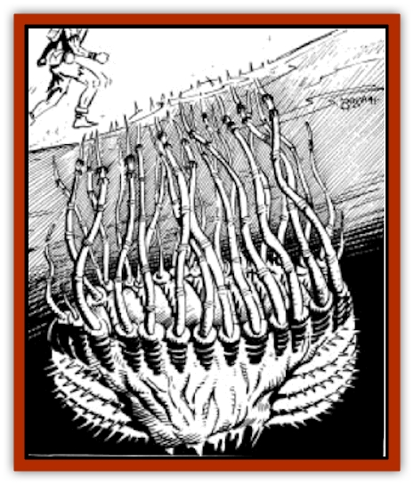

# Sand Cactus

| Statistic | **Sand Cactus** |
| --- | --- |
| **Activity Cycle:** | Any |
| **Alignment:** | Neutral |
| **Armor Class:** | 8 (body) 3 (needles) |
| **Climate/Terrain:** | Sandy wastes |
| **Damage/Attack:** | 1-3 |
| **Diet:** | Special |
| **Frequency:** | Rare |
| **Hit Dice:** | 5-8 |
| **Intelligence:** | Non- (0) |
| **Magic Resistance:** | Nil |
| **Morale:** | N/A |
| **Movement:** | Special |
| **No. Appearing:** | 1 |
| **No. of Attacks:** | 1 (per appendage) |
| **Organization:** | Solitary |
| **Size:** | M (6' across) |
| **Special Attacks:** | Blood Drain |
| **Special Defenses:** | Camouflage |
| **THAC0:** | 5-6 HD: 15 / 7-8 HD: 13 |
| **Treasure:** | Incidental |
| **XP Value:** | 5 HD: 975 / 6 HD: 1,400 / 7 HD: 2,000 / 8 HD: 3,000 |

Sand Cacti are a vile form of plant life that dwells anywhere there is sand. It feeds on the blood of its victims.

Sand cacti are well protected; the entire plant (except the needles) is hidden below the sand. The body is from 5-8 feet across and about 4 feet thick. It has many barbed needles attached to it with long, thin, fibrous strands. The bulbous body of the plant and the strands are sickly white, while the needles very closely resemble the color of the sand in the area.

**Combat:** A sand cactus attacks very passively. Its needles lie thrust up an inch out of the sand. Since the needle exactly resembles the sand around it, there is only a 10% chance of noticing the needles, 20% for those actively searching for them. A sand cactus has 26-50 (HDx5+1d10) needles in a circumference equal to its Hit Dice times 3 feet. Anyone who walks over a sandy area with sand cacti has a 25 % chance of stepping on a needle. If this happens, the sand cactus then makes an attack roll. For AC purposes, only magic that protects the whole body is considered. (A set of *hide armor +2* would not add a magical plus to the victim's Armor Class, but a *ring of protection* would. Also, no dexterity adjustments to AC are made. A [[Thri-kreen|thri-kreen]] is treated at its natural AC of 5, unless it wears magical protection.) A hit indicates that a needle has gone far enough into the appendage (about ½"), for its "barbs" to spring out. The needle is very thin going in (about the size of a pin), but the barbs spread out to about an inch across.

When the cactus hits, it causes 1d3 points of damage and snags a barbed needle in the victim's foot/appendage. On each successive round, it drains blood from its victim. It drains 1d3 points of blood per round, only stopping when a victim is dead. The strands connecting the needles to the plant are very tough and nearly impossible to break by pulling. The needle can be pulled free of the victim's foot, but such an action causes 1d6 points of damage. Since the barbs actually hook onto nerve tissue, this also causes the victim quite a lot of pain. The victim must make a system shock roll or pass out from the pain. Unconsciousness lasts for 5-10 (1d6+4) rounds. Pulling the needle out requires an Open Doors roll. The strands can be cut, requiring 1 point of damage against an AC 2.

A victim who is cut free still has the needle in his foot. If not removed it will fester. Removing it can be accomplished by the casting *cure disease* on the wound, which dries up the needle, or by cutting it free, which causes 1d6 points of damage to the victim. If it is not removed, the victim eventually gets blood poisoning, weakens and dies. The blood poisoning may take up to a week (1d6+1 days) to kill the victim. Once the victim is dead, a new sand cactus sprouts from the body.

When a needle lodges in an appendage, the victim feels a sharp pain and his appendage is snared. Bipedal creatures must make a Dexterity check or fall down in the midst of the sand cactus. This subjects the victim to 0-5 (1d6-1) more attacks from other needles in the area. When blood drain reaches 50% of the victim's hit points, the victim must make a system shock roll each round or pass out due to blood loss. A victim who is rescued from a sand cactus after passing out from blood loss recovers normally. All attacks, defense, and proficiencies suffer a penalty of -2 until the victim has a chance to rest and recover, such recovery taking 2d4 days. This recovery time is cut one day for every level of healing spell cast upon the victim. (i.e., four days of weakness requires four *cure light wounds* or one *cure serious wounds*.)

The cactus is very difficult to attack since its body is 5-10 (1d6+4) feet below the sand. If the body is exposed, the sand cactus is easy to kill. Unless it is dug out by magical means, however, diggers are exposed to attacks from 0-5 (d6-1) needles for each round of digging.

**Habitat/Society:** The sand cactus is a solitary creature, existing wherever the sand blows.

**Ecology:** The sand cactus is a trapper, existing on any food that comes along. It is unable to digest [[Kank_Wild|kank]] blood; a cactus releases a snagged kank after one round of blood draining. Anything else is fair game.

---
## Discovery & Documentation

**Source Publication:** MC12 Dark Sun Appendix I - Terrors of the Desert (1991)
**Campaign Setting:** Dark Sun
**Author(s):** Tom Prusa, Louis J. Prosperi, Walter M. Baas

### Other Creatures Found in This Source Book
   * [[Animal_Herd_Athas|Animal, Herd (Athas)]]
   * [[Animal_Household_Athas|Animal, Household (Athas)]]
   * [[Antloid_Desert|Antloid, Desert]]
   * [[Banshee_Dwarf|Banshee, Dwarf]]
   * [[Beetle_Agony|Beetle, Agony]]
   * [[Bog_Wader|Bog Wader]]
   * [[Brambleweed|Brambleweed]]
   * [[B'rohg|B'rohg]]
   * [[Burnflower|Burnflower]]
   * [[Cat_Psionic|Cat, Psionic]]
   * [[Cha'thrang|Cha'thrang]]
   * [[Cistern_Fiend|Cistern Fiend]]
   * [[Clam_Giant|Clam, Giant]]
   * [[Cloud_Ray|Cloud Ray]]
   * [[Drake_Athas_Air|Drake (Athas), Air]]
   * [[Drake_Athas_Earth|Drake (Athas), Earth]]
   * [[Drake_Athas_Fire|Drake (Athas), Fire]]
   * [[Drake_Athas_Water|Drake (Athas), Water]]
   * [[Dune_Runner|Dune Runner]]
   * [[Dune_Trapper|Dune Trapper]]
   * [[Elemental_Athas_Greater_Air|Elemental (Athas), Greater, Air]]
   * [[Elemental_Athas_Greater_Earth|Elemental (Athas), Greater, Earth]]
   * [[Elemental_Athas_Greater_Fire|Elemental (Athas), Greater, Fire]]
   * [[Elemental_Athas_Greater_Water|Elemental (Athas), Greater, Water]]
   * [[Elemental_Athas_Lesser_Air_Earth|Elemental (Athas), Lesser, Air/Earth]]
   * [[Elemental_Athas_Lesser_Fire_Water|Elemental (Athas), Lesser, Fire/Water]]
   * [[Elemental_Athas_General_Information|Elemental (Athas), General Information]]
   * [[Erdland|Erdland]]
   * [[Esperweed|Esperweed]]
   * [[Flailer|Flailer]]
   * [[Floater|Floater]]
   * [[Giant_Athas|Giant (Athas)]]
   * [[Golem_Athas_I|Golem (Athas) I]]
   * [[Golem_Athas_II|Golem (Athas) II]]
   * [[Golem_Athas_III|Golem (Athas) III]]
   * [[Golem_Athas_General_Information|Golem (Athas), General Information]]
   * [[Halfling_Renegade|Halfling, Renegade]]
   * [[Hej-kin|Hej-kin]]
   * [[Id_Fiend|Id Fiend]]
   * [[Insect_Swarm_Athas|Insect Swarm (Athas)]]
   * [[Kank_Wild|Kank, Wild]]
   * [[Kirre|Kirre]]
   * [[Megapede|Megapede]]
   * [[Mul_Wild|Mul, Wild]]
   * [[Nightmare_Beast|Nightmare Beast]]
   * [[Plant_Carnivorous_Athas|Plant, Carnivorous (Athas)]]
   * [[Pterran|Pterran]]
   * [[Pterrax|Pterrax]]
   * [[Pulp_Bee|Pulp Bee]]
   * [[Pyreen|Pyreen]]
   * [[Rasclinn|Rasclinn]]
   * [[Razorwing|Razorwing]]
   * [[Roc_Athas|Roc (Athas)]]
   * [[Sand_Bride|Sand Bride]]
   * [[Sand_Vortex|Sand Vortex]]
   * [[Scrab|Scrab]]
   * [[Silt_Horror|Silt Horror]]
   * [[Silt_Runner|Silt Runner]]
   * [[Sink_Worm|Sink Worm]]
   * [[Sloth_Athas|Sloth (Athas)]]
   * [[So-ut|So-ut]]
   * [[Spider_Cactus|Spider Cactus]]
   * [[Spider_Crystal|Spider, Crystal]]
   * [[Spirit_of_the_Land|Spirit of the Land]]
   * [[T'Chowb|T'Chowb]]
   * [[Thrax|Thrax]]
   * [[Tohr-kreen_I|Tohr-kreen I]]
   * [[Villichi|Villichi]]
   * [[Zhackal|Zhackal]]
   * [[Zombie_Plant|Zombie Plant]]
