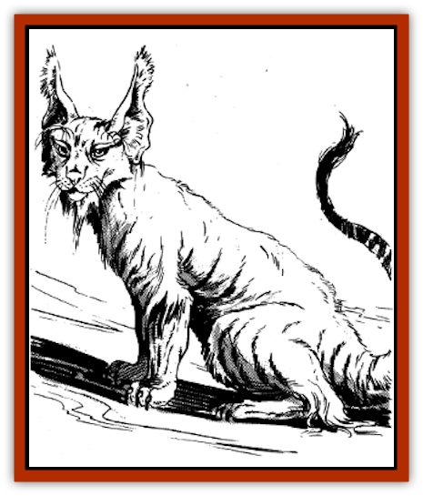

# Sand Cat

| Statistic | **Sand Cat** |
| --- | --- |
| **Activity Cycle:** | Night |
| **Alignment:** | Neutral |
| **Armor Class:** | 8 |
| **Climate/Terrain:** | Desert or dry steppe |
| **Damage/Attack:** | 1-4/ 1-3/ 1-3 |
| **Diet:** | Carnivore |
| **Frequency:** | Uncommon |
| **Hit Dice:** | 1+1 |
| **Intelligence:** | Animal (1) |
| **Magic Resistance:** | Nil |
| **Morale:** | Average (8-10) |
| **Movement:** | 15 |
| **No. Appearing:** | 1-4 |
| **No. of Attacks:** | 3 |
| **Organization:** | Den |
| **Size:** | S (2-3') |
| **Special Attacks:** | Rear claws 1-2, surprise |
| **Special Defenses:** | Surprise |
| **THAC0:** | 19 |
| **Treasure:** | Nil |
| **XP Value:** | 120 |

The sand cat is a small desert feline that preys on many of the small mammals of the desert and dry steppe regions. Slightly larger than a regular [[Cat_Small|house cat]], it is a sandy brown color. The ears are long and pointed, ending in a long, white tuft. The tip of the tail is a darker brown than the rest of the body.

**Combat:** Although the sand cat is a predator, its prey is not man or other humanoid creatures. It will not attack a person under normal circumstances. However, if forced to fight (cornered, etc.), it attacks savagely. The sand cat is a small and stealthy creature and so applies a -1 to all opponents' surprise rolls. At the same time, its keen senses make it very hard to surprise, giving it a +1 on all surprise rolls.

When the cat attacks, it springs toward its target. The sand cat can leap 5' upward and 10' forward, with a running start. It strikes with both front claws. If both of these hit, the rear claws automatically rake the victim for 1-2 points damage each. Thereafter it will bat and bite as much as possible.

The sand cat seldom fights to the death, instead trying to escape any opponent stronger than it. However, a mother will not abandon her young unless it is to lure an attacker away. If the sand cat is defending its young, it gains a +1 on its THAC0 and damage rolls.

**Habitat/Society:** The sand cat lives in a small family group called a den. Depending on the time of year, the den will have two to seven individuals: two adults and kittens. Sand cats mate for a single season and the male remains with the female until the young are grown, which takes about 10 months to a year.

The sand cat makes its lair in a small cave, sheltered overhang, or abandoned burrow. The latter is preferred if there is one available. The lair is normally occupied only while there are young to be raised. During this time, one adult always remains near the kittens.

Sand cats are very territorial. They hunt over a range of 5 to 10 square miles. They are nighttime predators and mostly bring down small mammals. They are seldom a threat to larger creatures.

**Ecology:** The sand cat is a natural force in the local ecology, keeping down the numbers of small vermin in a region. Unfortunately, the sand cat is also valued by humans. The kittens, if taken young enough, can be trained. Among the tribes of the desert and steppe, sand cats trained to hunt are the gifts of sheiks and khans. These animals can run down hares and other game for their masters. Others are sold to traders, who in turn sell the little cats in the cities. Here they are raised as pets - dangerous and savage little pets. A sand cat kitten is easily worth 500 to 2,000 gold pieces.

---
## Discovery & Documentation

**Source Publication:** MC11 Forgotten Realms Appendix II (1991)
**Campaign Setting:** Advanced Dungeons & Dragons 2nd Edition
**Author(s):** Tim Beach, Tim Brown, William W. Connors, Dale Donovan, Ed Greenwood, Jeff Grubb, Bruce Heard, Slade Henson, Rob King, Colin McComb, Roger E. Moore, Bruce Nesmith, Jon Pickens, Jean Rabe, Dori Watry, Skip Williams

### Other Creatures Found in This Source Book
   * [[Alaghi|Alaghi]]
   * [[Alguduir|Alguduir]]
   * [[Beguiler|Beguiler]]
   * [[Bird_Toril|Bird (Toril)]]
   * [[Cantobele|Cantobele]]
   * [[Carapace|Carapace]]
   * [[Cat_Toril|Cat (Toril)]]
   * [[Chitine|Chitine]]
   * [[Cildabrin|Cildabrin]]
   * [[Dimensional_Warper|Dimensional Warper]]
   * [[Dragon_Deep|Dragon, Deep]]
   * [[Fachan_Toril|Fachan (Toril)]]
   * [[Fael|Fael]]
   * [[Feyr|Feyr]]
   * [[Firetail|Firetail]]
   * [[Frost|Frost]]
   * [[Gaund|Gaund]]
   * [[Gloomwing|Gloomwing]]
   * [[Golden_Ammonite|Golden Ammonite]]
   * [[Golem_Lightning|Golem, Lightning]]
   * [[Hamadryad|Hamadryad]]
   * [[Harrier|Harrier]]
   * [[Harrla|Harrla]]
   * [[Haun|Haun]]
   * [[Haundar|Haundar]]
   * [[Hendar|Hendar]]
   * [[Inquisitor|Inquisitor]]
   * [[Lhiannan_Shee|Lhiannan Shee]]
   * [[Loxo|Loxo]]
   * [[Manni|Manni]]
   * [[Manscorpion|Manscorpion]]
   * [[Mara|Mara]]
   * [[Morin|Morin]]
   * [[Naga_Dark|Naga, Dark]]
   * [[Orpsu|Orpsu]]
   * [[Plant_Carnivorous_Black_Willow|Plant, Carnivorous, Black Willow]]
   * [[Plant_Carnivorous_Toril|Plant, Carnivorous (Toril)]]
   * [[Plant_Dangerous_I|Plant, Dangerous I]]
   * [[Ring-Worm|Ring-Worm]]
   * [[Rohch|Rohch]]
   * [[Saurial|Saurial]]
   * [[Sha'az|Sha'az]]
   * [[Silver_Dog|Silver Dog]]
   * [[Simpathetic|Simpathetic]]
   * [[Skuz|Skuz]]
   * [[Spider_Monkey|Spider, Monkey]]
   * [[Tren|Tren]]
