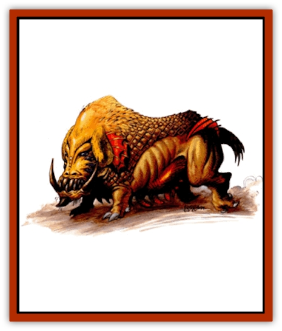

# Sand Howler

| Statistic | **Sand Howler** |
| --- | --- |
| **Activity Cycle:** | Any |
| **Alignment:** | Neutral |
| **Armor Class:** | 5 |
| **Climate/Terrain:** | Sand wastes, Tablelands |
| **Damage/Attack:** | 1d3/1d3/1d6 |
| **Diet:** | Carnivore |
| **Frequency:** | Uncommon |
| **Hit Dice:** | 4+2 |
| **Intelligence:** | Animal (1) |
| **Magic Resistance:** | Nil |
| **Morale:** | Average (8-10) |
| **Movement:** | 12 |
| **No. Appearing:** | 2-16 (2d8) |
| **No. of Attacks:** | 3 |
| **Organization:** | Pack |
| **Size:** | M (4' long) |
| **Special Attacks:** | Paralyzing gaze |
| **Special Defenses:** | Nil |
| **THAC0:** | 17 |
| **Treasure:** | Nil |
| **XP Value:** | 420 |

Sand howlers are desert-dwelling creatures that hunt in packs. They are known for their terrible howls that they use to signal each other when tracking down then prey. Worse than their howls are their eight terrible eyes that are capable of paralyzing anyone who gazes upon them.

Sand howlers are [[Lizard|lizard]]like creatures who resemble [[Dog|dogs]] except for their eight eyes. They have oversized heads in order to support their many eyes. They have large yellow tusks. Sand howlers are dark brown to light brown in color, though the rare ones have white skin.

**Combat:** Sand howlers attack with their two foreclaws, each causing 1-3 points of damage, and with their bite that causes 1-6 (1d6) points of damage. Sand howlers try to remain unseen until they are all ready to close in on their prey by surprise. They circle their victims and close in on them, trying to wear them down. Those who look into their many eyes become paralyzed unless they make a successful save vs. paralyzation. The effects last for 2-8 (2d4) rounds or until a *remove paralysis* spell is cast on the victim.

Sand howlers prefer smaller prey, but when hungry they attack creatures as large as themselves. They prefer single victims rather than groups and only attack a group of intended victims if they outnumber the victims two to one and have the benefit of surprise over them.

Often single sand howlers go out on their own to track down food. Once they find potential prey, they let out a series of howls that signal the other members of their pack. The pack signals back and joins the scout. Victims almost never see the individual scouts, as sand howlers are adept at stalking and remaining out of sight, but they can hear the howls and might be able to follow their tracks should they find them.

**Habitat/Society:** Sand howlers live and hunt in packs. Each pack is led by a single, large, male sand howler. This dominant male has full hit points and his attacks are at +1 to attack and damage. The other sand howlers also hold positions within the pack's hirerarchy of dominance. There is a 20% chance that a pair of howlers has one or two young. These young sand howlers are too young to fight, but they can be captured and trained to serve as war beasts or hunting animals.

Sand howlers are rarely encountered alone and are seldom seen except by their intended prey. Sand howlers make their dens in desolate areas since they do not like to compete with other predators for food. Then dens are deep, labyrinthine tunnel systems where they hide from the surface heat and where they hibernate for short periods of time. They often drag their prey back to their dens. Occasionally there is treasure among the remains of past victims.

**Ecology:** Sand howler pups can be trained as guards or tracking beasts. Their hunting skills are remarkable and their keen sense of smell makes them among the best desert trackers available. Many mercenaries in Athas capture them and train them to chase down runaway slaves. In the Tableland they have been hunted to near extinction in the last few years by those who fear them and those who would domesticate them.

The pelts of white sand howlers often bring about 150 gp because of their rarity, beauty, and protection they provide from heat.

---
## Discovery & Documentation

**Source Publication:** Dark Sun Appendix II - Terrors Beyond Tyr (1991)
**Campaign Setting:** Dark Sun
**Author(s):** Jim Atkiss, Steve Brown, Timothy B. Brown, Andrew P. Morris, Bruce Nesmith, Wes Nicholson, Bill Slavicsek

### Other Creatures Found in This Source Book
   * [[Aarakocra_Athas|Aarakocra (Athas)]]
   * [[Animal_Domestic_Athas_II|Animal, Domestic (Athas) II]]
   * [[Aviarag|Aviarag]]
   * [[Baazrag|Baazrag]]
   * [[Baazrag_Boneclaw|Baazrag, Boneclaw]]
   * [[Bloodgrass|Bloodgrass]]
   * [[Cactus_Hunting|Cactus, Hunting]]
   * [[Cactus_Rock|Cactus, Rock]]
   * [[Cilops|Cilops]]
   * [[Crodlu|Crodlu]]
   * [[Dagorran|Dagorran]]
   * [[Dhaot|Dhaot]]
   * [[Drake_Lesser_Athas_General_Information|Drake, Lesser (Athas), General Information]]
   * [[Drake_Lesser_Athas_Magma|Drake, Lesser (Athas), Magma]]
   * [[Drake_Lesser_Athas_Rain|Drake, Lesser (Athas), Rain]]
   * [[Drake_Lesser_Athas_Silt|Drake, Lesser (Athas), Silt]]
   * [[Drake_Lesser_Athas_Sun|Drake, Lesser (Athas), Sun]]
   * [[Dray|Dray]]
   * [[Drik|Drik]]
   * [[Dune_Reaper|Dune Reaper]]
   * [[Dwarf_Athas|Dwarf (Athas)]]
   * [[Elemental_Beast_Athas_Air|Elemental Beast (Athas), Air]]
   * [[Elemental_Beast_Athas_Earth|Elemental Beast (Athas), Earth]]
   * [[Elemental_Beast_Athas_Fire|Elemental Beast (Athas), Fire]]
   * [[Elemental_Beast_Athas_Water|Elemental Beast (Athas), Water]]
   * [[Elf_Athas|Elf (Athas)]]
   * [[Fael|Fael]]
   * [[Feylaar|Feylaar]]
   * [[Fordorran|Fordorran]]
   * [[Giant_Half-giant|Giant, Half-giant]]
   * [[Giant_Shadow|Giant, Shadow]]
   * [[Golem_Athas_Magma|Golem (Athas), Magma]]
   * [[Golem_Athas_Salt|Golem (Athas), Salt]]
   * [[Golem_Athas_General_Information|Golem (Athas), General Information]]
   * [[Gorak|Gorak]]
   * [[Halfling_Athas|Halfling (Athas)]]
   * [[Human_Athas|Human (Athas)]]
   * [[Jhakar|Jhakar]]
   * [[Kaisharga|Kaisharga]]
   * [[Kes'trekel|Kes'trekel]]
   * [[Klar|Klar]]
   * [[Krag|Krag]]
   * [[Kragling|Kragling]]
   * [[Lirr|Lirr]]
   * [[Mastyrial|Mastyrial]]
   * [[Meorty|Meorty]]
   * [[Mul|Mul]]
   * [[Nikaal|Nikaal]]
   * [[Paraelemental_Beast_General_Information|Paraelemental Beast, General Information]]
   * [[Paraelemental_Beast_Magma|Paraelemental Beast, Magma]]
   * [[Paraelemental_Beast_Rain|Paraelemental Beast, Rain]]
   * [[Paraelemental_Beast_Silt|Paraelemental Beast, Silt]]
   * [[Paraelemental_Beast_Sun|Paraelemental Beast, Sun]]
   * [[Pakubrazi|Pakubrazi]]
   * [[Psionocus|Psionocus]]
   * [[Psurlon|Psurlon]]
   * [[Raaig|Raaig]]
   * [[Retriever_Obsidian|Retriever, Obsidian]]
   * [[Ruktoi|Ruktoi]]
   * [[Ruvoka_Athas|Ruvoka (Athas)]]
   * [[Scorpion_Athas|Scorpion (Athas)]]
   * [[Seed_Brain|Seed, Brain]]
   * [[Silt_Horror_Black|Silt Horror, Black]]
   * [[Silt_Horror_Magma|Silt Horror, Magma]]
   * [[Silt_Horror_Red|Silt Horror, Red]]
   * [[Silt_Spawn|Silt Spawn]]
   * [[Slig|Slig]]
   * [[Spider_Athas|Spider (Athas)]]
   * [[Spinewyrm|Spinewyrm]]
   * [[Ssurran|Ssurran]]
   * [[Stalking_Horror|Stalking Horror]]
   * [[Tarek|Tarek]]
   * [[Tari|Tari]]
   * [[Thri-kreen|Thri-kreen]]
   * [[T'liz|T'liz]]
   * [[Tohr-kreen_II|Tohr-kreen II]]
   * [[Tohr-kreen_III|Tohr-kreen III]]
   * [[Trin|Trin]]
   * [[Tul'k|Tul'k]]
   * [[Undead_Athas_General_Information|Undead (Athas), General Information]]
   * [[Wraith_Athas|Wraith (Athas)]]
   * [[Xerichou|Xerichou]]
   * [[Zombie_Thinking|Zombie, Thinking]]
