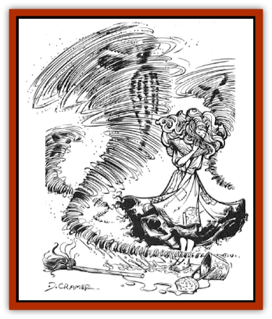
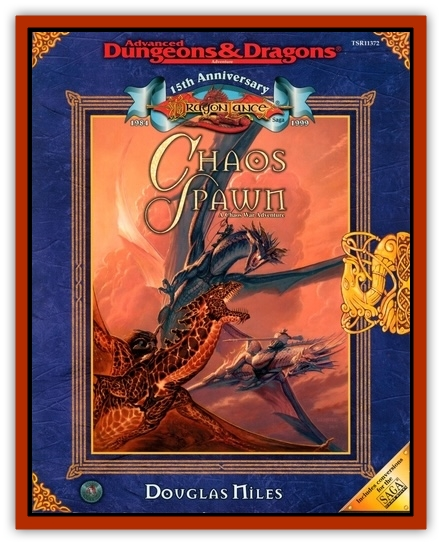

# Sand Spawn

| Statistic | **Sand Spawn** |
| --- | --- |
| **Activity Cycle:** | Any |
| **Alignment:** | Chaotic evil |
| **Armor Class:** | 2 |
| **Climate/Terrain:** | Special |
| **Damage/Attack:** | 1d12 |
| **Diet:** | None |
| **Frequency:** | Rare |
| **Hit Dice:** | 5 |
| **Intelligence:** | Low (6) |
| **Magic Resistance:** | Nil |
| **Morale:** | Fanatic (18) |
| **Movement:** | 15 |
| **No. Appearing:** | 3d8 |
| **No. of Attacks:** | 1 |
| **Organization:** | Pack |
| **Size:** | M (6' tall) |
| **Special Attacks:** | Cause blindness |
| **Special Defenses:** | +1 or better weapons needed to hit |
| **THAC0:** | 15 |
| **Treasure:** | R |
| **XP Value:** | 975 |

Sand spawn can be raised by the power of the [[Daemonlord|Daemonlord]], either in his direct presence or by the use of his Chaos meteors. They resemble small tornadoes, with a top that is about 3 feet in diameter and which tapers to a narrow bottom. They remain in contact with the ground as they sweep rapidly along.

**Combat:** Sand spawn spread out to attack so that every one of these Chaos creatures can get in on the action. If possible, they encircle their enemies, or at least try to come at the foe from two or three different directions.

Sand spawn attack with a lashing tendril of sand, which is a whiplike strand that can slice flesh and inflict deep, painful wounds. In addition, the blast of sand associated with the presence of these swirling monsters can cause a stinging blast in the victim's eyes that results in temporary blindness. Any time a sand spawn attacks the front of a hero, and the "to hit" die roll is 16 or better the hero might be blinded. The victim can roll a saving throw vs. breath weapons, with success meaning that the blindness is avoided. If the saving throw fails, however, the hero's eyes are clogged with sand, and he or she cannot see for 1d6+1 rounds. The duration of the blindness can be shortened in that any victim who spends a round rinsing his face with water (or immersing it) can wash away the sand and can see in the next round.

**Habitat/Society:** Sand spawn must be created on a solace of sand; however, once created, they can move across any other type of surface, so long as it is dry. Sand spawn lose 1 hit point per round spent over marshy or wet ground, and are instantly destroyed if they move over open water. Once created, a band of sand spawn survives for 2d10+20 hours. All the spawn in a single group last for the same amount of time; when their life span is up, the winds simply fade and the sand that formed them settles to the ground.

**Ecology:** Sand spawn are mindlessly destructive, although they possess a kind of cunning that allows them to try and encircle their enemies, or to move at an angle so as to cut of their victims' retreat.

---
## Discovery & Documentation

**Source Publication:** Chaos Spawn (1999)
**Campaign Setting:** Dragonlance
**Author(s):** Douglas Niles

### Other Creatures Found in This Source Book
   * [[Cedar_Spawn|Cedar Spawn]]
   * [[Daemonlord|Daemonlord]]
   * [[Scavenger_Spawn|Scavenger Spawn]]
