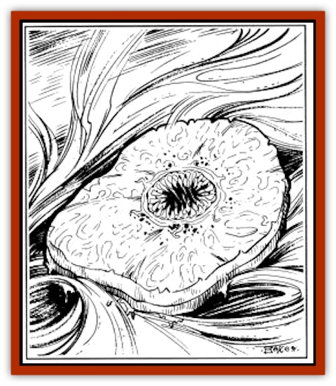

# Sand Vortex

| Statistic | **Sand Vortex** |
| --- | --- |
| **Activity Cycle:** | Day |
| **Alignment:** | Neutral |
| **Armor Class:** | 2 |
| **Climate/Terrain:** | Sea of Silt |
| **Damage/Attack:** | 5-20 |
| **Diet:** | Carnivore |
| **Frequency:** | Rare |
| **Hit Dice:** | 15 |
| **Intelligence:** | Animal (1) |
| **Magic Resistance:** | Nil |
| **Morale:** | Steady (11-12) |
| **Movement:** | 0 |
| **No. Appearing:** | 1 |
| **No. of Attacks:** | 1 |
| **Organization:** | Solitary |
| **Size:** | H (40' across) |
| **Special Attacks:** | Whirlwind |
| **Special Defenses:** | See below |
| **THAC0:** | 5 |
| **Treasure:** | Q |
| **XP Value:** | 12,000 |

**Psionics Summary**

| Level | Dis/Sci/Dev | Attack/Defense | Score | PSPs |
| --- | --- | --- | --- | --- |
| 3 | 2/3/4 | -/M- | 13 | 84 |

**Telepathy -** *Sciences:* nil; *Devotions:* mind blank, life detection, mental barrier.

**Psychokinesis -** *Sciences:* telekinesis, whirlwind, project force; *Devotions:* control winds, levitation.

Whirlwind: Cost 15 PSP, Maintenance 5 PSPs/round

The sand vortex, or silt vortex as it is sometimes called, is a huge creature that lies in wait for unsuspecting prey crossing the Sea of Silt. It lies beneath the silt, but even fliers are not safe from the sudden whirlwind that may suck them down into the waiting maw of the creature.

The sand vortex is pancake shaped and has a light gray skin that blends in very well with the silt. It is about 40' across and 5' thick.

**Combat:** The sand vortex attacks with a special psionic power, whirlwind. It lies in wait, using its life detection power until a creature walks or flies overhead. Then a sudden whirlwind engulfs the unfortunate creature, sucking him down into range for the vortex to attack. Of course it also raises a huge cloud of silt with a 200' radius. The victim is allowed a saving throw versus breath weapons to avoid being sucked in. The saving throw is modified by a -4 penalty if the victim was on the ground. Creatures larger than giants ([[Roc_Athas|Athasian rocs]], [[Cloud_Ray|cloud rays]], etc.) are allowed a +4 bonus to the save. A creature in the cloud may also be blinded (save vs. paralysis to avoid). Blinded creatures have only a 50% chance of flying out of the vortex, 75% for very large creatures. A wading giant has a chance to notice that he has stepped on a pancake-shaped beast instead of the rock floor. Wading creatures are allowed a surprise roll. If they are not surprised, and immediately retreat, they are not subject to the whirlwind effect, although they may still be affected by the vortex's other psionic powers.

Once the vortex has sucked in a victim, that being is vulnerable to an attack by the center maw. Man-sized creatures are swallowed whole on a successful attack. Larger creatures still take damage if hit. Few indeed are the giants that have escaped once they have stepped onto a sand vortex. The vortex is nearly mindless and continues to try to entrap its prey.

If a victim is inside the vortex, but hasn't been, or can't be, swallowed, he may try to attack. The spinning of the vortex, as well as the silt in the air, causes all attacks to be made at a penalty of -4. Blindness may cause another -4 penalty, so the intended victim is in serious trouble.

Should a vengeful giant or adventurer try to sneak in from the side, the vortex is not helpless. In addition to the silt in the air, the vortex's life detection power means that it usually knows exactly where a foe is. It won't react to someone attacking from the side, but should such a being begin to hurt the vortex, the sand vortex attempts to defend itself. It uses telekinesis to throw clouds of silt at anyone on the sides. In addition to the possibility for blindness, the silt causes 1 point of abrasion damage per round to exposed skin. At the same time, the vortex uses its project force to attempt to knock the victim into the silt. A successful power check forces the intended victim to make a saving throw versus breath or be dumped on its back in the silt. If this fails, the vortex merely levitates into the air and drifts with the wind to an area where it can feed undisturbed.

**Habitat/Society:** The silt vortex is a solitary creature. It lives only to eat. Anything that passes in range is a target.

**Ecology:** The silt vortex inhabits only the Sea of Silt. It is active only during the day, seeming to prefer the heat of the sun. At night, it rests and recovers PSPs.

The sand vortex is thought to live for about 60 years, at which time it splits into two smaller vortexes. These smaller creatures begin with 7 Hit Dice, gaining one Hit Die every 2 years until they reach full growth. They have all the psionic powers of their parent, and are nearly as dangerous. There are rumors of a huge vortex, over 100' across, near the center of the Sea of Silt.

---
## Discovery & Documentation

**Source Publication:** MC12 Dark Sun Appendix I - Terrors of the Desert (1991)
**Campaign Setting:** Dark Sun
**Author(s):** Tom Prusa, Louis J. Prosperi, Walter M. Baas

### Other Creatures Found in This Source Book
   * [[Animal_Herd_Athas|Animal, Herd (Athas)]]
   * [[Animal_Household_Athas|Animal, Household (Athas)]]
   * [[Antloid_Desert|Antloid, Desert]]
   * [[Banshee_Dwarf|Banshee, Dwarf]]
   * [[Beetle_Agony|Beetle, Agony]]
   * [[Bog_Wader|Bog Wader]]
   * [[Brambleweed|Brambleweed]]
   * [[B'rohg|B'rohg]]
   * [[Burnflower|Burnflower]]
   * [[Cat_Psionic|Cat, Psionic]]
   * [[Cha'thrang|Cha'thrang]]
   * [[Cistern_Fiend|Cistern Fiend]]
   * [[Clam_Giant|Clam, Giant]]
   * [[Cloud_Ray|Cloud Ray]]
   * [[Drake_Athas_Air|Drake (Athas), Air]]
   * [[Drake_Athas_Earth|Drake (Athas), Earth]]
   * [[Drake_Athas_Fire|Drake (Athas), Fire]]
   * [[Drake_Athas_Water|Drake (Athas), Water]]
   * [[Dune_Runner|Dune Runner]]
   * [[Dune_Trapper|Dune Trapper]]
   * [[Elemental_Athas_Greater_Air|Elemental (Athas), Greater, Air]]
   * [[Elemental_Athas_Greater_Earth|Elemental (Athas), Greater, Earth]]
   * [[Elemental_Athas_Greater_Fire|Elemental (Athas), Greater, Fire]]
   * [[Elemental_Athas_Greater_Water|Elemental (Athas), Greater, Water]]
   * [[Elemental_Athas_Lesser_Air_Earth|Elemental (Athas), Lesser, Air/Earth]]
   * [[Elemental_Athas_Lesser_Fire_Water|Elemental (Athas), Lesser, Fire/Water]]
   * [[Elemental_Athas_General_Information|Elemental (Athas), General Information]]
   * [[Erdland|Erdland]]
   * [[Esperweed|Esperweed]]
   * [[Flailer|Flailer]]
   * [[Floater|Floater]]
   * [[Giant_Athas|Giant (Athas)]]
   * [[Golem_Athas_I|Golem (Athas) I]]
   * [[Golem_Athas_II|Golem (Athas) II]]
   * [[Golem_Athas_III|Golem (Athas) III]]
   * [[Golem_Athas_General_Information|Golem (Athas), General Information]]
   * [[Halfling_Renegade|Halfling, Renegade]]
   * [[Hej-kin|Hej-kin]]
   * [[Id_Fiend|Id Fiend]]
   * [[Insect_Swarm_Athas|Insect Swarm (Athas)]]
   * [[Kank_Wild|Kank, Wild]]
   * [[Kirre|Kirre]]
   * [[Megapede|Megapede]]
   * [[Mul_Wild|Mul, Wild]]
   * [[Nightmare_Beast|Nightmare Beast]]
   * [[Plant_Carnivorous_Athas|Plant, Carnivorous (Athas)]]
   * [[Pterran|Pterran]]
   * [[Pterrax|Pterrax]]
   * [[Pulp_Bee|Pulp Bee]]
   * [[Pyreen|Pyreen]]
   * [[Rasclinn|Rasclinn]]
   * [[Razorwing|Razorwing]]
   * [[Roc_Athas|Roc (Athas)]]
   * [[Sand_Bride|Sand Bride]]
   * [[Sand_Cactus|Sand Cactus]]
   * [[Scrab|Scrab]]
   * [[Silt_Horror|Silt Horror]]
   * [[Silt_Runner|Silt Runner]]
   * [[Sink_Worm|Sink Worm]]
   * [[Sloth_Athas|Sloth (Athas)]]
   * [[So-ut|So-ut]]
   * [[Spider_Cactus|Spider Cactus]]
   * [[Spider_Crystal|Spider, Crystal]]
   * [[Spirit_of_the_Land|Spirit of the Land]]
   * [[T'Chowb|T'Chowb]]
   * [[Thrax|Thrax]]
   * [[Tohr-kreen_I|Tohr-kreen I]]
   * [[Villichi|Villichi]]
   * [[Zhackal|Zhackal]]
   * [[Zombie_Plant|Zombie Plant]]
