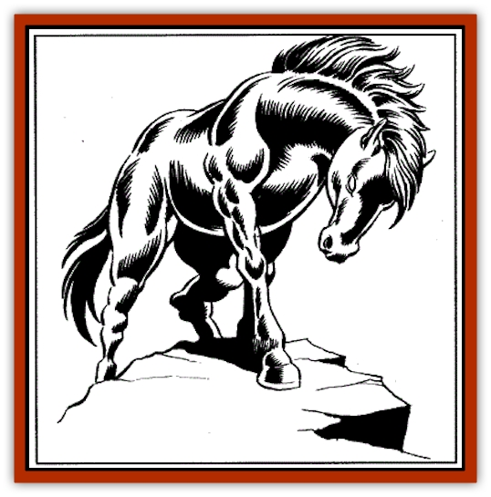

# Sandiraksiva - The Black Courser

| Statistic | **Sandiraksiva, The Black Courser** |
| --- | --- |
| **Activity Cycle:** | Day |
| **Alignment:** | Neutral |
| **Armor Class:** | 2 |
| **Climate/Terrain:** | High mountain meadow/tundra |
| **Damage/Attack:** | 1-8+7/1-8+7/ or 5-30 (breath) |
| **Diet:** | Special |
| **Frequency:** | Very Rare (unique) |
| **Hit Dice:** | 8 (45 hit points) |
| **Intelligence:** | Average (8-10) |
| **Magic Resistance:** | 55% |
| **Morale:** | Fanatic (19) |
| **Movement:** | 28, Fl 30 |
| **No. Appearing:** | 1 |
| **No. of Attacks:** | 2 or breath weapon |
| **Organization:** | Solitary or herd |
| **Size:** | L (8' at shoulder) |
| **Special Attacks:** | Breath weapon |
| **Special Defenses:** | Only hit by +1 or better weapon |
| **THAC0:** | 13 |
| **Treasure:** | None |
| **XP Value:** | 5,000 |

While accompanying Prince Surtava on his search for enlightenment, Gaumahavi (see her entry) bore a litter of cubs. Like its mother, one of those cubs developed an animal soul and began a series of reincarnations. That cub was Sandiraksiva.

Currently, the cub's enchanted soul inhabits the bodyof a supernatural black stallion. Unfortunately for Sandiraksiva,this fact has not eluded the Raja of Solon, AmbucharDevayam. The Raja captured Sandiraksiva andused him to coerce his mother, Gaumahavi, into aidinghim in the first war between Solon and Ra-Khati. Duringthat war, Sandiraksiva was captured by the Dalai Lama,who had no idea of the stallion's true nature.

As his great size might suggest, Sandiraksiva is exceptionally strong, and he can carry or pull as much as any two normal draft horses. He is also extremely fast, and can easily outrun even the fleetest riding horse. Unlike most horses, he has split hooves and can climb the rocky environment of the Katakoro Mountains with ease.

**Combat:** Sandiraksiva is not aggressive by nature, but will fight tenaciously for his freedom. In combat, he uses his forehooves to lash out, and will resort to his breath weapon when pressed.

In addition to his great strength, Sandiraksiva has several special abilities. Every other round, he can fly up to 800 yards (then he must pause and rest for a round). His most potent weapon is the fireball he can breathe once per day for 5d6 points of damage (save vs. breath weapon for half damage).

Because of his enchanted nature, Sandiraksiva cannot be hurt by anything short of magic or magical weapons of +1 or better.

**Habitat/Society:** Although he would prefer to graze the high altitude meadows and tundra lands of the Katakoro Mountains, Sandiraksiva has been imprisoned by either the Raja of Solon or the Dalai Lama for the last 50 years

**Ecology:** Like most horses, Sandiraksiva eats grass, grains, hay, and the like. However, the Black Courser's supernatural strength, speed, and powers are energized by the light of the moon. If he is not exposed to moonlight for a substantial period each night, he begins to lose his strength. This loss corresponds roughly to the amount of moonlight he missed. For example, a 30% reduction in exposure results in a 30% loss of movement, damage, flight capability, etc. On totally moonless nights he lapses into complete inactivity, but since he knows when they will be, takes precautions beforehand, when possible. Strength is recovered in 1d6 rounds as soon as he returns to full moonlight.

---
## Discovery & Documentation

**Source Publication:** FRA3 Blood Charge (1990)
**Campaign Setting:** Forgotten Realms
**Author(s):** Troy Denning, Anne Brown, Paul Abrams

### Other Creatures Found in This Source Book
   * [[Ambuchar_Devayam_Tan_Chin|Ambuchar Devayam/Tan Chin]]
   * [[Dowagu|Dowagu]]
   * [[Gaumahavi_Greater_Purple_Dragon|Gaumahavi, Greater Purple Dragon]]
