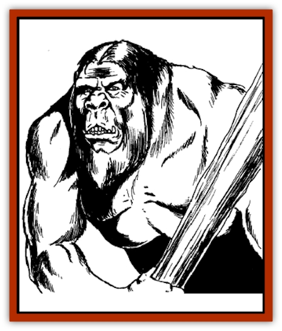

# Saqualaminoi

| Statistic | **Saqualaminoi** |
| --- | --- |
| **Activity Cycle:** | Day |
| **Alignment:** | Neutral |
| **Armor Class:** | 5 |
| **Climate/Terrain:** | Cold mountains |
| **Damage/Attack:** | 2d8/2d8 |
| **Diet:** | Carnivore |
| **Frequency:** | Very rare |
| **Hit Dice:** | 8 |
| **Intelligence:** | Low (5-7) |
| **Magic Resistance:** | Nil |
| **Morale:** | Average (10) |
| **Movement:** | 9 |
| **No. Appearing:** | 1d6 |
| **No. of Attacks:** | 2 |
| **Organization:** | Family groups |
| **Size:** | L (10') |
| **Special Attacks:** | Nil |
| **Special Defenses:** | Immune to cold |
| **THAC0:** | 13 |
| **Treasure:** | (R,W) |
| **XP Value:** | 2,000 |

The saqualaminoi are a race of humanoid creatures, hulking in height. Adapted to the harsh conditions of the high frozen mountains, their bodies are covered with white or gray fur. This is especially thick on the soles of their feet and even covers their palms. Their heads seem to be squashed between their shoulders. Their facial features are small and flat to prevent frostbite. They have prominent fangs, but do not attack with these. They are intelligent although extremely primitive.

**Combat:** The saqualaminoi are not subtle or particularly clever fighters. They have never had to be, since their size and power has generally assured they are the biggest creatures in their habitat. Furthermore, although fearsome in appearance, they are actually rather peaceful. They only attack for food or in self-defense.

In combat, they fight with their powerful fists, striking smashing blows capable of felling an ordinary man. A few have learned to make simple bone, wood, and stone clubs. These weapons cause 2d6+4 points of damage, but the creature can make only one attack per round.

Being well-adapted to snow and cold, saqualaminoi are immune to cold-based attacks, normal or magical (although they still suffer from falling pieces of ice, etc.) Furthermore, their broad feet and claws enable them to move across snow and ice with no movement penalties.

**Habitat/Society:** The saqualaminoi live in the highest mountain ranges either just below or on the fringes of the great glaciers that fill these peaks. Here they make their homes in the ice caves and crevasses that break the frozen wall. Their lives are simple, organized around small family units. Each bull takes a female and together they raise their young. Several families living in the same area form a community. This is nothing more than a loose assemblage of families that only occasionally bands together for the common good.

The most common cooperative action is hunting. The creatures are carnivores, but are not particularly fierce. They prey mostly on the sheep, mountain goats, and marmots found at high altitudes. They do not attack other humanoids, but do fight in defense. They do not normally attack humanoids. Instead they tend co be very curious about creatures of similar appearance.

In times of bad weather or poor food, the saqualaminoi are forced to raid outside their range. Since the fierce winter storms frequently drive away game, these raids most often occur during periods of foul weather. Thus the saqualaminoi have earned the reputation as monsters that come out of the snowstorms to raid and kill.

The saqualaminoi are an intelligent people. They have a simple language of grunts and howls. They make very simple stone and wood tools. They do not have a written language or many highly developed concepts of good or evil, but they tend to be good by nature.

**Ecology:** The saqualaminoi are primitive predators. Fortunately, their pelts are too coarse to be of value. The little treasure they collect comes from the minor baubles they find interesting.

---
## Discovery & Documentation

**Source Publication:** MC4 Dragonlance Appendix (w/binder #2) (1989)
**Campaign Setting:** Dragonlance
**Author(s):** Rick Swan

### Other Creatures Found in This Source Book
   * [[Anemone_Giant_Sea|Anemone, Giant Sea]]
   * [[Bear_Ice|Bear, Ice]]
   * [[Beast_Undead|Beast, Undead]]
   * [[Bird_Krynn|Bird (Krynn)]]
   * [[Disir|Disir]]
   * [[Draconian_Aurak|Draconian, Aurak]]
   * [[Draconian_Baaz|Draconian, Baaz]]
   * [[Draconian_Bozak|Draconian, Bozak]]
   * [[Draconian_Kapak|Draconian, Kapak]]
   * [[Draconian_General_Information|Draconian, General Information]]
   * [[Draconian_Sivak|Draconian, Sivak]]
   * [[Draconian_Proto-_Traag|Draconian, Proto-, Traag]]
   * [[Dragon_Amphi|Dragon, Amphi]]
   * [[Dragon_Astral|Dragon, Astral]]
   * [[Dragon_Kodragon|Dragon, Kodragon]]
   * [[Dragon_Krynn_Othlorx_General_Information|Dragon (Krynn), Othlorx, General Information]]
   * [[Dragon_Krynn_General_Information|Dragon (Krynn), General Information]]
   * [[Dragon_Sea|Dragon, Sea]]
   * [[Dreamshadow|Dreamshadow]]
   * [[Dreamwraith|Dreamwraith]]
   * [[Dwarf_Daergar|Dwarf, Daergar]]
   * [[Dwarf_Hill_Neidar|Dwarf, Hill, Neidar]]
   * [[Dwarf_Mountain_Hylar|Dwarf, Mountain, Hylar]]
   * [[Dwarf_Theiwar|Dwarf, Theiwar]]
   * [[Dwarf_Zakhar|Dwarf, Zakhar]]
   * [[Elf_Half-|Elf, Half-]]
   * [[Elf_High_Qualinesti|Elf, High, Qualinesti]]
   * [[Elf_High_Silvanesti|Elf, High, Silvanesti]]
   * [[Elf_Sea_Dargonesti|Elf, Sea, Dargonesti]]
   * [[Elf_Sea_Dimernesti|Elf, Sea, Dimernesti]]
   * [[Elf_Wild_Kagonesti|Elf, Wild, Kagonesti]]
   * [[Eyewing|Eyewing]]
   * [[Fetch|Fetch]]
   * [[Fire_Minion|Fire Minion]]
   * [[Fireshadow|Fireshadow]]
   * [[Gnome_Tinker|Gnome, Tinker]]
   * [[Gurik_Cha'ahl|Gurik Cha'ahl]]
   * [[Haunt_Knight|Haunt, Knight]]
   * [[Horax|Horax]]
   * [[Human_Krynn|Human (Krynn)]]
   * [[Imp_Blood_Sea|Imp, Blood Sea]]
   * [[Kalothagh|Kalothagh]]
   * [[Kani_Doll|Kani Doll]]
   * [[Kender|Kender]]
   * [[Kyrie|Kyrie]]
   * [[Lizard_Man_Krynn|Lizard Man (Krynn)]]
   * [[Minotaur_Krynn|Minotaur, Krynn]]
   * [[Ogre_High|Ogre, High]]
   * [[Ogre_Krynn|Ogre (Krynn)]]
   * [[Phaethon|Phaethon]]
   * [[Shadowperson|Shadowperson]]
   * [[Shimmerweed|Shimmerweed]]
   * [[Skrit|Skrit]]
   * [[Spectral_Minion|Spectral Minion]]
   * [[Spider_Krynn|Spider (Krynn)]]
   * [[Stag|Stag]]
   * [[Tayling|Tayling]]
   * [[Thanoi|Thanoi]]
   * [[Tylor|Tylor]]
   * [[Wichtlin|Wichtlin]]
   * [[Wyndlass|Wyndlass]]
   * [[Yaggol|Yaggol]]
