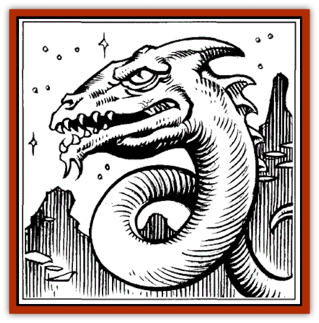
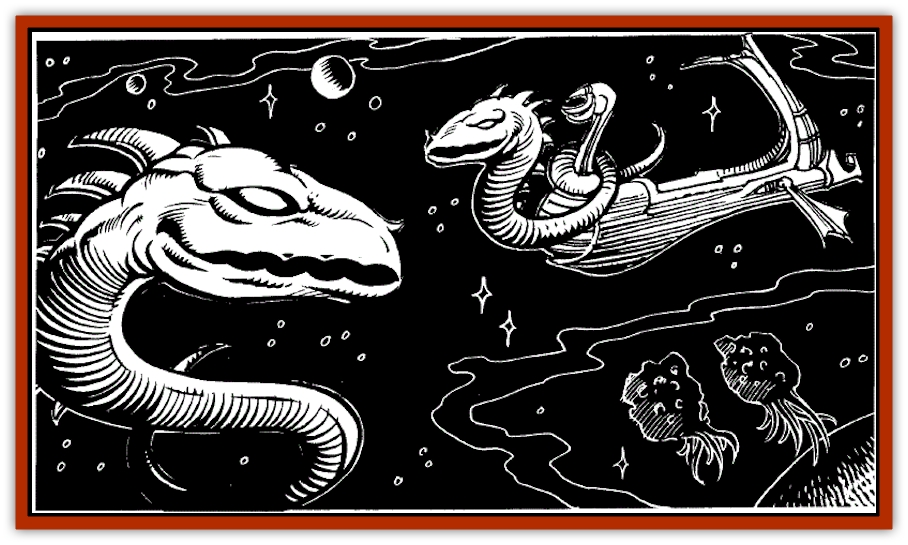

# Sarphardin - Watcher

| Statistic | **Sarphardin (Watcher)** |
| --- | --- |
| **Activity Cycle:** | Any |
| **Alignment:** | Chaotic good |
| **Armor Class:** | 5 |
| **Climate/Terrain:** | Any space, very rarely worlds |
| **Damage/Attack:** | 2-12/2 per round/1-2 |
| **Diet:** | Gems and refined metals |
| **Frequency:** | Rare |
| **Hit Dice:** | 8+8 |
| **Intelligence:** | Supra-genius (20) |
| **Magic Resistance:** | 36% plus intelligence-related spell immunities |
| **Morale:** | Elite (15-16) |
| **Movement:** | 6, Fl 20 (A), Sw 18 |
| **No. Appearing:** | 1 or 1-4 |
| **No. of Attacks:** | 2 |
| **Organization:** | Solitary (telepathic clan links) |
| **Size:** | H (16'-24' long) |
| **Special Attacks:** | Spell use |
| **Special Defenses:** | Regeneration (see below) |
| **THAC0:** | 13 |
| **Treasure:** | V,T,X |
| **XP Value:** | 6,000 |

Sarphardin resemble nagas, with snakelike prehensile bodies and huge dragon-like reptilian heads. They are curious and whimsical in nature, and have the natural ability to travel through space by spelljamming (without helm or ship, although one can carry a ship of 20 tons or less with it, as long as it remains in direct physical contact with the vessel). Groups of sarphardin working together can move vessels of up to 100 tons through space. They cannot cooperate with *spelljamming helms* or other power sources to increase the SR of a ship, but can use any helm they touch as though they were human spellcasters.

This ability has made them very helpful to adventurers in need of rescue-and deadly pursuers when they hunt down and slay foes.

Sarphardin regenerate damage at the rate of 1 hit point every four rounds.

**Combat:** In battle, sarphardin use their strong jaws (2-12 dmg) to bite opponents, whom they entangle or slap (1-2 dmg, plus successful Strength Check or be knocked over; if drifting in space, sent tumbling head-over-heels).

A sarphardin is scaled, and its head is covered with bony plates and ridges (hence the more-agile body and the morearmored head share the same armor class).

A sarphardin can make an entangle attempt once per round by making a successful attack roll. Entangled targets can be hit automatically by all sarphardin attacks (bite and spell use). At the end of the first round of entanglement and every round thereafter, however, a target is allowed a Strength Check to break free. If it succeeds, freedom is gained, and only 1 point of constriction damage is suffered that round. If it fails, 2 points of constriction damage are suffered, and constriction continues.

In addition to its physical attacks, a sarphardin can cast one spell per round. The spell-power of a sarphardin is equal to that of a 7th-level wizard: four 1st-level, three 2nd-level, and two 3rd-level spells, and one 4th-level spell.

Sarphardin use verbal-only spells, which they largely acquire by using *invisibility* spells to spy on world-bound beings using spells, and bringing treasures to world-bound beings in exchange for tutoring in a new, desired spell in verbal-only form. Sarphardin speak the common tongue and a hissing, purring language of their own.

Sarphardin can also use potions, scrolls, and all magical items allowed to both warriors (e.g., magic swords) and wizards (e.g., most wands) that they can hold in their prehensile tails and command verbally or by effort of will.

The high intelligence and wisdom of sarphardin renders them immune to illusion spells of 1st-3rd level, and to the spells cause *fear*, *command*, *forget*, *friends*, *hypnotism*, *ray of enfeeblement*, and scare. They are not "persons" for the purposes of charm and hold magics, but can be affected by the stronger "monster" versions of those spells.

**Habitat/Society:** Sarphardin are almost always encountered in space as solitary wanderers, watching others. Watching sarphardin will do nothing except cock their heads, bob and weave to see better, and emit a purring 'mmm-hmmm' noise. They will defend themselves if attacked, but often merely dodge 'warning shots' or hurled objects, and drift a little closer to watch with renewed interest.

Sarphardin are essentially passive. They approach life as an entertainment, and each sarphardin is determined to see the best ongoing show it can. Space-battles and large-scale disasters often attract a crowd of calmly-watching, floating sarphardin.

Sarphardin never fight others of their kind. They cannot be coerced or duped into doing so; illusions or magical controls will be shattered if an attempt is made, for a sarphardin can always tell another sarphardin, however disguised.

Sarphardin are bisexual, and give live birth to tiny, softscaled young. Mating and child-rearing take place in wellhidden enclaves in jungles on obscure worlds, or in deep caverns in rogue planets drifting in little-traveled areas of the flow. Sarphardin in these places will hide from or avoid intruders, using their magic to escape if necessary.

All sarphardin are 'family;' that is, all are members of a single clan, to which all sarphardin are intensely loyal. Sarphardin have in the past pretended to be willing to provide others of their kind to neogi and illithid slavers-but invariably the slavers (who planned to seize the bargaining sarphardin as well) have found themselves maneuvered into the ambush of an elven armada, or the midst of a beholder flotilla.

Of all the races of space, elvenkind have the closest dealings with sarphardin. Dwarves, gnomes, and humans are regarded as less trustworthy, but better (particularly the latter two races) at providing a sarphardin with entertainment.

**Ecology:** Sarphardin require little air, and can tolerate a wide variety of atmospheres, breathing fouled atmospheres as if they were clean, and deadly air as if it was merely foul. When spelljamming, they typically slow down to skim planetary atmospheres from time to time (If one is acting as the spelljamming figurehead of a ship, it will be considerate enough to choose an atmosphere breathable by those aboard the ship).

Sarphardin eat minerals, both gems and refined metals (such as coinage), and will always want to be paid to effect a rescue, spelljam a ship, or aid someone in battle (worth about 1,000 gp to a sarphardin, 3,000-4,000 gp, and 2,500- 5,000, respectively).

Sarphardin prefer to bargain first, perform, then get payment in full-spelljamming a ship to a world where the captain and crew have money stashed to pay for the 'jamming would be fine. Someone who declines to pay after reaching a bargain with a sarphardin will simply be ignored, forever after, by all sarphardin. They will not speak to, bargain with, or aid such an individual, and if the black-listed being is rescued with others, the fee will be at least 1,000 gp higher (in rare cases, this ban has been lifted after the transgressor has pleadingly and handsomely made amends-called "kissing the snake" in spacer lingo).

Sarphardin have a 2-mile-range telepathy with other sarphardin. Others can join this communications network by exercise of natural power or by magic, but it occurs on a level where other telepathy is not usually found, and must be magically or mentally searched for, for at least 1d4 rounds, to establish contact.

Sarphardin brains are used in spell inks for spells concerned with mental communications, and some whisper that the Arcane work with sarphardin to make helms (the two races have amicable relations, sarphardin often carrying Arcane through space).

Sarphardin skin, scaly and tough in life, shrivels to uselessness upon death. The flesh beneath, however, is said to be very nourishing (a 10 pound chunk can feed an active warrior for one month), decays very slowly, and is prized by alchemists and wizards.

When spelljamming, sarphardin have a personal Ship Rating of 4, and give a towed ship this SR (If two sarphardin combine to tow a ship of larger than 30 tons, it has an SR of 3 while under tow).

**Skullsnake** 

Undead sarphardin have been encountered. Skeletal and evil, seeking to destroy all non-sarphardin life, these are believed to have been created by evil humans and magic-using [[Beholder_and_Beholder-kin_I|beholders]].

Skullsnakes retain the use of their spells and physical attacks, and their skeletal bites gain an additional ldlO points of life-force-draining, chilling damage. Their morale rises to Fearless ( 19-20); they turn as "Special." Their rate of regeneration slows to 1 hit point per turn. The XP Value of a Skullsnake is 7,000.

---
## Discovery & Documentation

**Source Publication:** SJR1 Lost Ships (1990)
**Campaign Setting:** Spelljammer
**Author(s):** Ed Greenwood, Paul Jaquays, Anne Brown, Dell Barras, Brom, Jeff Grubb

### Other Creatures Found in This Source Book
   * [[Beholder_Undead_Death_Tyrant|Beholder, Undead (Death Tyrant)]]
   * [[Flow_Barnacle|Flow Barnacle]]
   * [[Lich_Arch|Lich, Arch]]
   * [[Neogi:_Undead_Old_Master|Neogi: Undead Old Master]]
   * [[Shadowsponge_Air_Stealer|Shadowsponge (Air Stealer)]]
   * [[Beholder_Eater_Thagar_Grimgobbler|Beholder Eater, Thagar (Grimgobbler)]]
   * [[Tinkerer_Giant_Bubble|Tinkerer (Giant Bubble)]]
   * [[Men:_Wonderseeker|Men: Wonderseeker]]
   * [[Spaceworm|Spaceworm]]
