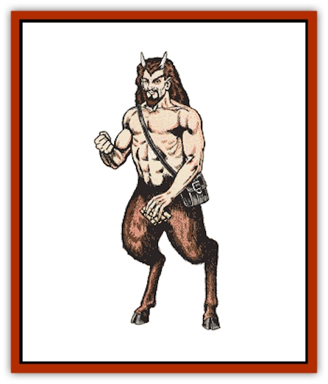

# Satyr

| Statistic | **Satyr** |
| --- | --- |
| **Activity Cycle:** | Any |
| **Alignment:** | Neutral |
| **Armor Class:** | 5 |
| **Climate/Terrain:** | Temperate sylvan woodlands |
| **Damage/Attack:** | 2-8 or by weapon |
| **Diet:** | Omnivore |
| **Frequency:** | Uncommon |
| **Hit Dice:** | 5 |
| **Intelligence:** | Very (11-12) |
| **Magic Resistance:** | 50% |
| **Morale:** | Elite (13) |
| **Movement:** | 18 |
| **No. Appearing:** | 2-8 (2d4) |
| **No. of Attacks:** | 1 |
| **Organization:** | Band |
| **Size:** | M (5' tall) |
| **Special Attacks:** | See below |
| **Special Defenses:** | See below |
| **THAC0:** | 15 |
| **Treasure:** | I,S,X |
| **XP Value:** | 975 |

Also called *fauns*, satyrs are a pleasure loving race of half-human, half-goat creatures. They symbolize nature's carefree ways.

Satyrs have the torso, head, and arms of a man, and the hind legs of a goat. The human head is surmounted by two sharp horns that poke through the satyr's coarse, curly hair. The skin of the upper body ranges from tan to light brown, with rare individuals (1%) with red skin. A satyr's hair is medium, reddish, or dark brown. The horns and hooves are black.

Satyrs have their own tongue and can speak elven and Common. Satyrs living near [[Centaur|centaurs]] are 80% likely to be friendly with them and speak their language. Rarely (5%), satyrs are found with [[Korred|korred]].

**Combat:** Satyrs have keen senses, so they gain a +2 bonus on surprise rolls. They can be almost silent, and can blend with foliage so as to be 90% undetectable; this gives opponents a -2 penalty to surprise rolls. Satyrs have infravision to a distance of 60 feet.

A satyr attacks by butting with its sharp horns. Some (20%) use +1 magical weapons, especially long or short swords, daggers, or short bows. Before resorting to combat, a satyr often plays a tune on its pipes, an instrument only a satyr can use properly. Using these pipes, the satyr can cast *charm*, *sleep*, or *cause fear*, affecting all within 60 feet, unless they make a successful saving throw vs. spell.

Usually, only one satyr per band has pipes. If comely females (Charisma 15+) are in a group met by satyrs, the piping will be to *charm*. Should the intruders be relatively inoffensive, the piping casts *sleep*, and the satyrs steal all of the victims' choice food and drink, as well as weapons, valuables, and magical items. If intruders are hostile, the piping is used to *cause fear*. The effects of the piping lasts 1d6 hours or until dispelled. Any creature that saves vs. piping is not affected by additional music from the same pipes in that encounter. A bard's singing can nullify the pipe's music before it takes effect.

**Habitat/Society:** Satyrs are interested only in sport: frolicking, piping, chasing wood nymphs, and other pleasures. They resent intrusions and drive away any creature that offends them. A lucky wanderer may stumble on a woodland celebration, which will contain an equal number of [[Dryad|dryads]] and fauns plus 3d8 other woodland creatures and a 25% chance of 2d6 centaurs. Strangers are welcomed only if they contribute some good food and drink, especially superior (10+ gp per bottle) wines. Such wine can also be used to lure or bribe satyrs. If a group includes [[Elf|elves]], they have a better chance of being welcomed.

These celebrations last all night in warm months, with newcomers waking up the next morning with massive headaches, minus a few valuables, and not a woodland creature (nor their tracks) to be found.

Shying away from the trappings of an organized society, a colony of satyrs usually includes young numbering 50% of the adults. Satyrs live in comfortable caves and hollow trees. There are no female satyrs and sages believe that dryads are the female counterparts of the satyr, and that satyrs mate with dryads to produce more satyrs and dryads. Satyrs share the dryads' affection for humans of the opposite sex, but a female charmed by a satyr might return after 1d4 weeks (10% chance).

Satyrs are an inoffensive, fun-loving race. They rarely venture more than 10 miles from their homes, most often doing so to gather food. They are fond of venison and small game but also eat plants and fruits.

**Ecology:** Satyrs in sylvan woodlands keep game animal populations at normal levels; they never hunt to excess or despoil plants.

---
## Discovery & Documentation

**Source Publication:** MC1 Volume I (w/binder #1) (1991)
**Campaign Setting:** Advanced Dungeons & Dragons 2nd Edition
**Author(s):** Jay Batista, Scott Bennie, Grant Boucher, William W. Connors, Steve Gilbert, Heike Kubasch, James Lowder, David Edward Martin, Bruce Nesmith, Jean Rabe, Rick Swan, John J. Terra, Gary L. Thomas

### Other Creatures Found in This Source Book
   * [[Bat|Bat]]
   * [[Bear|Bear]]
   * [[Behir|Behir]]
   * [[Boar|Boar]]
   * [[Bookworm|Bookworm]]
   * [[Brownie|Brownie]]
   * [[Bugbear|Bugbear]]
   * [[Carrion_Crawler|Carrion Crawler]]
   * [[Cat_Great|Cat, Great]]
   * [[Catoblepas|Catoblepas]]
   * [[Dragon_General_Information|Dragon, General Information]]
   * [[Dragonfish|Dragonfish]]
   * [[Elemental_Air_Kin_Aerial_Servant|Elemental, Air Kin, Aerial Servant]]
   * [[Elemental_Earth_Kin_Sandling|Elemental, Earth Kin, Sandling]]
   * [[Elephant|Elephant]]
   * [[Gnoll|Gnoll]]
   * [[Hobgoblin|Hobgoblin]]
   * [[Homunculus|Homunculus]]
   * [[Hornet_Giant|Hornet, Giant]]
   * [[Horse|Horse]]
   * [[Hyena|Hyena]]
   * [[Jackal|Jackal]]
   * [[Jackalwere|Jackalwere]]
   * [[Korred|Korred]]
   * [[Lich|Lich]]
   * [[Lizard|Lizard]]
   * [[Lizard_Man|Lizard Man]]
   * [[Lycanthrope_General_Information|Lycanthrope, General Information]]
   * [[Lycanthrope_Seawolf|Lycanthrope, Seawolf]]
   * [[Lycanthrope_Werebear|Lycanthrope, Werebear]]
   * [[Lycanthrope_Weretiger|Lycanthrope, Weretiger]]
   * [[Lycanthrope_Werewolf|Lycanthrope, Werewolf]]
   * [[Manticore|Manticore]]
   * [[Medusa|Medusa]]
   * [[Mind_Flayer|Mind Flayer]]
   * [[Minotaur|Minotaur]]
   * [[Mudman|Mudman]]
   * [[Mummy|Mummy]]
   * [[Nixie|Nixie]]
   * [[Nymph|Nymph]]
   * [[Ogre|Ogre]]
   * [[Ooze_Slime_Jelly_I|Ooze/Slime/Jelly I]]
   * [[Ooze_Slime_Jelly_II|Ooze/Slime/Jelly II]]
   * [[Orc|Orc]]
   * [[Owl|Owl]]
   * [[Owlbear_I|Owlbear I]]
   * [[Pegasus|Pegasus]]
   * [[Piercer|Piercer]]
   * [[Pudding_Deadly|Pudding, Deadly]]
   * [[Rakshasa|Rakshasa]]
   * [[Rat|Rat]]
   * [[Ray|Ray]]
   * [[Remorhaz|Remorhaz]]
   * [[Scorpion|Scorpion]]
   * [[Selkie|Selkie]]
   * [[Shadow|Shadow]]
   * [[Skeleton|Skeleton]]
   * [[Skunk|Skunk]]
   * [[Snake|Snake]]
   * [[Spectre|Spectre]]
   * [[Spider|Spider]]
   * [[Sprite|Sprite]]
   * [[Toad_Giant|Toad, Giant]]
   * [[Treant|Treant]]
   * [[Troll|Troll]]
   * [[Umber_Hulk|Umber Hulk]]
   * [[Unicorn|Unicorn]]
   * [[Vampire|Vampire]]
   * [[Wight|Wight]]
   * [[Will_O'Wisp|Will O'Wisp]]
   * [[Wolf|Wolf]]
   * [[Wolfwere|Wolfwere]]
   * [[Wraith|Wraith]]
   * [[Wyvern|Wyvern]]
   * [[Yeti|Yeti]]
   * [[Yuan-ti|Yuan-ti]]
   * [[Zombie|Zombie]]
