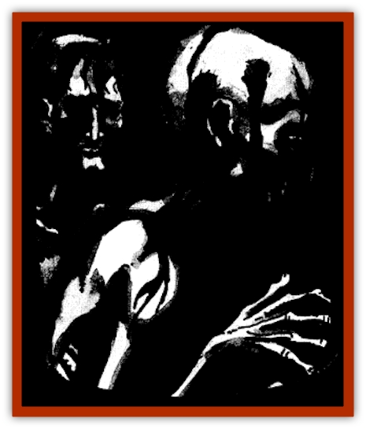

# Saugh - Dearg-Due

| Statistic | **Saugh, Dearg-Due** |
| --- | --- |
| **Activity Cycle:** | Night |
| **Alignment:** | Neutral evil |
| **Armor Class:** | 8 |
| **Climate/Terrain:** | The Shadow Rift |
| **Damage/Attack:** | 1d8 (headman's axe) |
| **Diet:** | Human blood |
| **Frequency:** | Uncommon |
| **Hit Dice:** | 5 |
| **Intelligence:** | Average (8-10) |
| **Magic Resistance:** | Nil |
| **Morale:** | Fearless (20) |
| **Movement:** | 12 |
| **No. Appearing:** | 2d6 |
| **No. of Attacks:** | 1 |
| **Organization:** | The Saugh (Loht's Army) |
| **Size:** | M (6' tall) |
| **Special Attacks:** | Choking cloud |
| **Special Defenses:** | Spell immunity |
| **THAC0:** | 15 |
| **Treasure:** | Nil |
| **XP Value:** | 650 |

The saugh are an army of the dead created by Loht, Prince of the [[Arak_Sith|Sith]], to serve him when he moves against the lands of mankind. The [[Ghoul|ghoulish]] dearg-due serve as the front ranks of this menacing army. Their true master is Gwydion, but Loht does not know that, and for now they obey his commands.

Dearg-due look much like living men, but they have grown gaunt with their time in the grave. While they are clearly undead creatures with flesh drawn tight across their features, they have not decayed in the slightest. The faces of dearg-due are unsettling, for their eyes have been plucked from their sockets, leaving only empty holes through which they somehow see.

Dearg-due are able to speak as they did in life, although their words are slurred and slow in forming. Few have ever conversed with these dark creatures, however, for they have little to do with mortals outside of combat.

**Combat:** Though dearg-due move about at the command of Loht, they are not mindless creatures. In fact, these cunning creatures often strike from hiding or under the guise of parlay.

In battle, the dearg-due wield great axes with broad blades that resemble those employed by an executioner at a beheading. They employ these weapons with great skill, inflicting 1d8 points of damage with each blow.

Though they can be hit by any sort of weapon, cold iron inflicts double damage on these vile creatures. Any blow that strikes a dearg-due is as dangerous to the attacker as it is to its target. When the skin of these fetid creatures is broken, a foul mist boils out from the wound in a five foot radius around the dearg-due. This acidic cloud burns the skin, eyes, and lungs of those within range. If the attacker fails a saving throw vs. breath weapon, he or she suffers a number of points of damage equal to half those inflicted on the dearg-due by his or her weapon (or normal damage if using cold iron); he or she suffers no damage on a successful save.

Being undead, dearg-due are immune to the effects of *charm*, *sleep*, *hold*, and other life- and mind-affecting spells. Similarly, diseases and toxins have no power over them.

**Habitat/Society:** These horrifying creatures dwell in and around the mountain which holds the Obsidian Gate, guarding this structure for their dark master. As stated above, Loht believes that this army, created by his sith and sithkin, is his to command, but this state of affairs lasts only until Gwydion returns.

**Ecology:** Though they need not eat to survive, these creatures delight in feeding on the flesh of corpses. After battle, the dearg-due ravenously consume all casualties.

---
## Discovery & Documentation

**Source Publication:** The Shadow Rift (1998)
**Campaign Setting:** Ravenloft
**Author(s):** William W. Connors, John D. Rateliff, Cindi Rice

### Other Creatures Found in This Source Book
   * [[Arak_General_Information|Arak, General Information]]
   * [[Arak_Alven|Arak, Alven]]
   * [[Arak_Brag|Arak, Brag]]
   * [[Arak_Fir|Arak, Fir]]
   * [[Arak_Muryan|Arak, Muryan]]
   * [[Arak_Portune|Arak, Portune]]
   * [[Arak_Powrie|Arak, Powrie]]
   * [[Arak_Shee|Arak, Shee]]
   * [[Arak_Sith|Arak, Sith]]
   * [[Arak_Teg|Arak, Teg]]
   * [[Avanc|Avanc]]
   * [[Changeling_Kin|Changeling (Kin)]]
   * [[Crimson_Bones|Crimson Bones]]
   * [[Grim|Grim]]
   * [[Saugh_Gossamer|Saugh, Gossamer]]
   * [[Treant_Evil_Blackroot|Treant, Evil (Blackroot)]]
