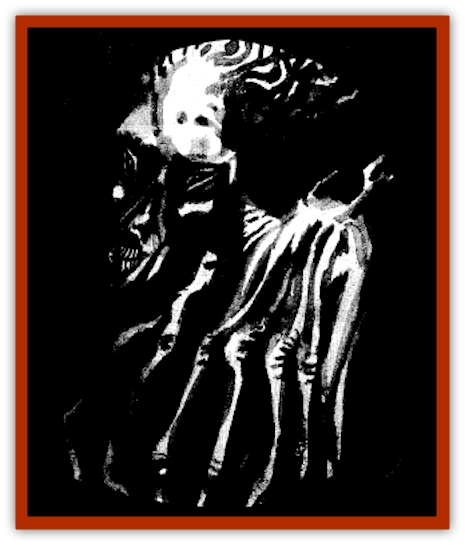

# Saugh - Gossamer

| Statistic | **Saugh, Gossamer** |
| --- | --- |
| **Activity Cycle:** | Night |
| **Alignment:** | Neutral evil |
| **Armor Class:** | 0 |
| **Climate/Terrain:** | The Shadow Rift |
| **Damage/Attack:** | 1d8 (touch) |
| **Diet:** | Life energy |
| **Frequency:** | Uncommon |
| **Hit Dice:** | 3 |
| **Intelligence:** | Average (8-10) |
| **Magic Resistance:** | Nil |
| **Morale:** | Fearless (19) |
| **Movement:** | Fl 12 (A) |
| **No. Appearing:** | 2d6 |
| **No. of Attacks:** | 1 |
| **Organization:** | The Saugh (Loht's Army) |
| **Size:** | M (6' tall) |
| **Special Attacks:** | Surprise, energy drain |
| **Special Defenses:** | +1 or better magical weapon to hit, spell immunities, wraithform |
| **THAC0:** | 17 |
| **Treasure:** | Nil |
| **XP Value:** | 2,000 |

Gossamers are spectral creatures that feed upon the life energy of their victims. They are counted among Loht's host of the dead, or saugh. Although they are not uncommon in the dark corners of the Shadow Rift, they are seldom encountered in the mortal world above.

A gossamer appears as an elongated, distorted image of its form in life. Transparent and shimmering, the spirit drifts about as if carried on the wind while wisps of vapor and curls of light encircle it.

Gossamers can speak just as they did in life, so most of them are fluent in the common language of their homeland. All of their words, however, are hollow and haunting. They seldom speak with mortals unless compelled to do so by magical means.

**Combat:** Gossamers take full advantage of their ghostly nature when engaging in combat. They swoop about, dart through solid walls, and plunge into the ground, if it serves to confuse their enemies.

Gossamers often lurk beneath the ground, waiting for their victims to pass overhead. When they hear talking or otherwise sense the presence of living creatures, they soar from the earth and attack. When attacking in this fashion, a -2 penalty is imposed on the enemy's surprise roll.

The primary attack of a gossamer is its energy-draining touch. A successful attack roll by the gossamer indicates that it swoops through the body of its enemy. In so doing, it inflicts 1d8 points of damage and drains away 1 point of the target's Constitution. Victims regain lost Constitution points at a rate of one point per day.

Each Constitution point absorbed by a gossamer allows it to regenerate a number of hit points. The number of points regained is determined by rolling a die of the same type that the victim uses to determine his or her hit point total. Thus, draining a point from a warrior allows the gossamer to regain 1d10 points while a drained wizard restores only 1d4 points.

Gossamers are ethereal creatures with no physical forms. Normal weapons, no matter how well crafted, are useless against them. They can be hit by only +1 or better magical weapons. In addition, as undead creatures, gossamers are immune to all manner of mind and life-affecting magic. They cannot be affected by *charm*, *sleep*, *hold*, or similar spells. Poisons, diseases, and similar mortal hazards do not endanger the gossamer either.

**Habitat/Society:** The gossamer is counted among the saugh, Loht's army of undead creatures. They assemble when and where he orders and carry out whatever instructions he gives them. When they are not so needed by the lord of the [[Arak_General_Information|Arak]], the gossamer are consigned to the Black Marsh in the Shadow Rift. However, unknown to Loht they are actually controlled by Gwydion exerting his influence from inside the Obsidian Gate and their first loyalty is to the shadow-fiend; they obey Loht's orders only so long as it pleases their true master for them to do so. Should Gwydion escape, the gossamer and all the saugh revert directly to his control.

**Ecology:** Like most undead, these spirits have little effect upon world of the living. The corpses that they have left behind, however, can be used as a means to destroy them. If the body from which a gossamer's spirit is drawn is cast into a fire of yew wood, the [[Ghost|ghost]] is destroyed in 3d4 rounds. During this time, the gossamer feels great pain and tries to do all the harm it can before finally being annihilated.

---
## Discovery & Documentation

**Source Publication:** The Shadow Rift (1998)
**Campaign Setting:** Ravenloft
**Author(s):** William W. Connors, John D. Rateliff, Cindi Rice

### Other Creatures Found in This Source Book
   * [[Arak_General_Information|Arak, General Information]]
   * [[Arak_Alven|Arak, Alven]]
   * [[Arak_Brag|Arak, Brag]]
   * [[Arak_Fir|Arak, Fir]]
   * [[Arak_Muryan|Arak, Muryan]]
   * [[Arak_Portune|Arak, Portune]]
   * [[Arak_Powrie|Arak, Powrie]]
   * [[Arak_Shee|Arak, Shee]]
   * [[Arak_Sith|Arak, Sith]]
   * [[Arak_Teg|Arak, Teg]]
   * [[Avanc|Avanc]]
   * [[Changeling_Kin|Changeling (Kin)]]
   * [[Crimson_Bones|Crimson Bones]]
   * [[Grim|Grim]]
   * [[Saugh_Dearg-Due|Saugh, Dearg-Due]]
   * [[Treant_Evil_Blackroot|Treant, Evil (Blackroot)]]
