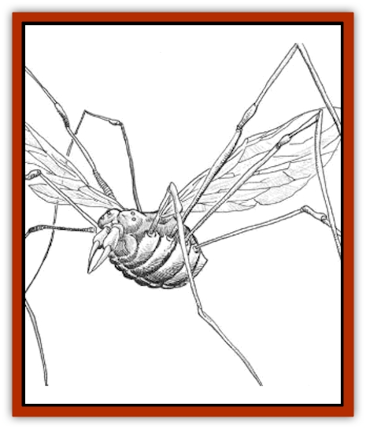

# Sawfly - Demonic

| Statistic | **Sawfly, Demonic** |
| --- | --- |
| **Activity Cycle:** | Any |
| **Alignment:** | Neutral evil |
| **Armor Class:** | 7 |
| **Climate/Terrain:** | Temperate/Any |
| **Damage/Attack:** | 1-4 |
| **Diet:** | Blood |
| **Frequency:** | Rare |
| **Hit Dice:** | 2 |
| **Intelligence:** | Semi- (2-4) |
| **Magic Resistance:** | Nil |
| **Morale:** | Steady (11-12) |
| **Movement:** | 12, Fly 12 (B) |
| **No. Appearing:** | 1-6 |
| **No. of Attacks:** | 1 |
| **Organization:** | Swarm |
| **Size:** | M (5-6' long) |
| **Special Attacks:** | Blood drain, insect swarm |
| **Special Defenses:** | Shrinking |
| **THAC0:** | 19 |
| **Treasure:** | J,K,L |
| **XP Value:** | 175 |

These creatures were let into the world accidentally by foolish practitioners of black magic. They resemble reddish-brown daddy longlegs with wings, and they can stand upright on their spindly limbs (giving them a height of 5 or 6 feet).

**Combat:** A sawfly bites for 1-4 points of damage, and on the following round it causes 1-4 points of damage automatically due to blood drainage. Afterward it attempts to bite again. Once per day a sawfly can summon a swarm of gnats and flies to assault its enemies (the equivalent of a *summon swarm* spell). A sawfly can shrink at will to the size of an ordinary insect. If a sawfly loses more than 50% of its hit points, it shrinks automatically. If any normal gnats or flies are in the area, it mingles with them and becomes nearly impossible to spot. Searchers can detect them by making a successful Intelligence check on 1d100. In its diminutive state, the sawfly can dodge any attack if it makes a successful saving throw vs. wands. However, any successful hit crushes it. It cannot attack in small form.

**Habitat/Society:** Demonic sawflies instinctively desire to swarm with others of their kind, but such swarms are rare on the Prime Material Plane. Unlike most insects, the females lay merely one or two eggs per year, so only a handful of sawflies are found in any one area. To make up for this low population density, sawflies join normal swarms of gnats and flies and follow them on their rounds. They need blood to survive, however, so they will abandon their adopted swarms to feed.

Sawflies live longer than most insects, up to fifty years. They go into hibernation in times of need, and they can survive in this condition for as long as one century. The passage of any warm-blooded creature within 20 feet of a hibernating sawfly awakens it, and the insect attacks ravenously.

Since demonic sawflies lay eggs infrequently, they guard their broods jealously. Sawfly eggs can be found hidden in out-of-the-way nooks and crannies of buildings, castles, and other relatively dry shelters. A sawfly defending its eggs gains a +2 bonus on all attacks and saving throws.

**Ecology:** Demonic sawflies might have been parasites on the monstrous inhabitants of another plane, as mosquitoes and fleas are parasites on the Prime Material Plane. Due to their shrinking ability, sawflies infiltrate castles and houses as easily as ordinary insects. They are smart enough to realize that some cunning is needed to attack humans and other intelligent creatures. They often hide in cupboards, closets, or cabibets, ready to spring out on unsuspecting victims. Such hiding places might contain a small amount of treasure.

The blood and eggs of a demonic sawfly can be used in *enlarge* or *reduce* spells or potions. Its wings, ground up, can be used as components of spells such as *summon swarm*.

---
## Discovery & Documentation

**Source Publication:** Dungeon #76 (1999)
**Campaign Setting:** Dungeon Magazine
**Author(s):** Raymond E. Dyer, Toren Atkinson

### Other Creatures Found in This Source Book
   * [[Chraal|Chraal]]
   * [[Death_Linnen|Death Linnen]]
   * [[Living_Hair|Living Hair]]
