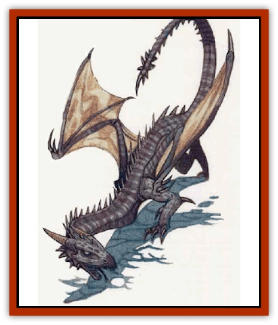

# Scalamagdrion

| Statistic | **Scalamagdrion** |
| --- | --- |
| **Activity Cycle:** | Any |
| **Alignment:** | Neutral |
| **Armor Class:** | 6 |
| **Climate/Terrain:** | Subarctic caverns |
| **Damage/Attack:** | 1d6/1d6/2d6/3d4 or 1d6/1d6/1d6/1d6/2d6/3d4 |
| **Diet:** | Carnivore |
| **Frequency:** | Very rare |
| **Hit Dice:** | 6+6 |
| **Intelligence:** | Average (8-10) |
| **Magic Resistance:** | Nil |
| **Morale:** | Fearless (19-20) |
| **Movement:** | 15, Fl 9(C) |
| **No. Appearing:** | 1 |
| **No. of Attacks:** | 4 or 6 |
| **Organization:** | Solitary |
| **Size:** | H (20' long) |
| **Special Attacks:** | Pin |
| **Special Defenses:** | Spell turning, silence |
| **THAC0:** | 13 |
| **Treasure:** | (S,Q,V&times;3) |
| **XP Value:** | 5,000 |

The scalamagdrion resembles a gray-scaled, green-eyed [[Dragon_General_Information|dragon]] with stubby wings and a long, bone-spiked prehensile tail. The creature's overall build is like that of a [[Dragon_Metallic_Silver|silver dragon]].

While many people believe this creature to be unique, it is actually part of a race of like beasts. The most famous of the scalamagdrions is Ningulfim, the one usually pictured in the book known as The Scalamagdrion (the book was named for the creature). A scalamagdrion is sometimes called a "Guardian of the Tome" by those unaware of its actual name or the name of the book in which it is found.

Certain sages have suggested that scalamagdrions have a language of their own, a silent language conveyed by movements of mouth, claws, and wings. Scalamagdrions have been reported to make motions not unlike those associated with speech and sign language. However, because such creatures are very aggressive and completely silent, there has been little opportunity to study their means of communication.

**Combat:** If possible, a scalamagdrion attacks by pouncing from a height or by briefly hovering and then pouncing. In this case, the creature uses its four claws, its bite, and its tail. Each claw rake causes 1d6 points of damage, while the bite inflicts 2d6 points, and the tail causes 3d4 points of damage. If hovering, the scalamagdrion can make only one pouncing attack before either landing or flying off. Its wings are not well constructed for hovering and cannot support such a maneuver for long.

If possible, the scalamagdrion tries to pin a single opponent by landing upon it. This requires a normal attack roll, but the victim is considered AC 10 (adjusted by Dexterity and magical bonuses). This maneuver can be used on any size creature and causes 2d6 points of damage to the victim. Only creatures of size S or M can be pinned effectively; larger beings cannot be held by the scalamagdrion's body weight, and smaller creatures cannot be attacked while pinned (though they can be held).

A pinned creature can try to get free each round after becoming pinned, and a successful bend bars roll indicates that the creature struggles free. A pinned creature receives no Dexterity bonus to AC and suffers a -4 penalty to attack rolls. The creature cannot use a weapon that requires two hands. Drawing a weapon might require a successful Dexterity check (DM's discretion).

While the scalamagdrion has a pinned victim, or if it is fighting while on the ground, it attacks normally with its front claws, bite, and tail. The creature's tail is quite flexible and can be used to attack opponents to the side or front of the beast.

The creature is immune to all gasses and to extremes of heat and cold. In addition, the scalamagdrion radiates *silence 15' radius* about itself (to 15' from any part of its body) and has a natural spell turning ability (as a *ring of spell turning*, including gaining a saving throw for spells for which there is normally none). This makes it a deadly foe for mages. Indeed, none have yet prevailed against the scalamagdrion known as Ningulfim, a creature of great cunning, with maximum hit points and other, undisclosed magical powers. Some mages claim to have defeated other scalamagdrions, with the help of several companions. A few sages suggest that a scalamagdrion can absorb power from any mages it consumes, so any individual might have other spell-like powers.

The scalamagdrion is fearless and enjoys the taste of human flesh. Still, it is cunning enough to take a victim's body, items and all, back to its lair to avoid being caught while eating.

**Habitat/Society:** As shown in the illustration within The Scalarnagdrion, the creature inhabits an extensive network of caverns. Adventurers have claimed to encounter multiple scalamagdrions beneath the Great Glacier, in a cavern network accessible from Vaasa and Sossal. The monster and the gate to and from its abode cannot be destroyed or harmed by tearing out or destroying the page on which it appears, although any attempt at such activities certainly causes it to issue forth. The scalamagdrion can choose when to activate its gate; no other living creature has successfully traveled through it.

**Ecology:** Several wands and rings can be seen amid the bones upon which the scalamagdrion crouches. If a scalamagdrion absorbs magical energy from its kills, a specimen could prove very useful in the manufacture of magical items.

---
## Discovery & Documentation

**Source Publication:** Monstrous Compendium, 1996 Annual, Volume 3 (1995)
**Campaign Setting:** Advanced Dungeons & Dragons 2nd Edition
**Author(s):** Jon Pickens

### Other Creatures Found in This Source Book
   * [[Alaghi|Alaghi]]
   * [[Alhoon|Alhoon]]
   * [[Aranea_Savage_Coast|Aranea (Savage Coast)]]
   * [[Arcane_Head|Arcane Head]]
   * [[Banedead|Banedead]]
   * [[Banelich|Banelich]]
   * [[Bat_Bonebat|Bat, Bonebat]]
   * [[Beetle|Beetle]]
   * [[Belgoi|Belgoi]]
   * [[Bladeling|Bladeling]]
   * [[Braxat|Braxat]]
   * [[Bunyip|Bunyip]]
   * [[Burbur|Burbur]]
   * [[Bvanen|Bvanen]]
   * [[Cat_Great_Snow_Tiger|Cat, Great, Snow Tiger]]
   * [[Chosen_One|Chosen One]]
   * [[Chronovoid|Chronovoid]]
   * [[Cildabrin|Cildabrin]]
   * [[Coffer_Corpse|Coffer Corpse]]
   * [[Disenchanter|Disenchanter]]
   * [[Dog_Temporal|Dog, Temporal]]
   * [[Dragon_Cerilia|Dragon (Cerilia)]]
   * [[Dragon_Ghost|Dragon, Ghost]]
   * [[Dragon_Lesser_Undead|Dragon, Lesser Undead]]
   * [[Dragon_Neutral_Amber|Dragon, Neutral, Amber]]
   * [[Dread_Warrior|Dread Warrior]]
   * [[Dreamweaver|Dreamweaver]]
   * [[Dream_Spawn_Greater_Ennui|Dream Spawn, Greater, Ennui]]
   * [[Dream_Spawn_Lesser_Morph|Dream Spawn, Lesser, Morph]]
   * [[Dwarf_Arctic|Dwarf, Arctic]]
   * [[Dwarf_Urdunnir|Dwarf, Urdunnir]]
   * [[Eel_Giant_Moray|Eel, Giant Moray]]
   * [[Elemental_Fire_Kin_Tome_Guardian|Elemental, Fire Kin, Tome Guardian]]
   * [[Elf_Rockseer|Elf, Rockseer]]
   * [[Ethyk|Ethyk]]
   * [[Faerie_Faerie_Fiddler|Faerie, Faerie Fiddler]]
   * [[Faerie_Petty_Bramble|Faerie, Petty, Bramble]]
   * [[Faerie_Petty_Gorse|Faerie, Petty, Gorse]]
   * [[Faerie_Petty|Faerie, Petty]]
   * [[Firenewt|Firenewt]]
   * [[Formian|Formian]]
   * [[Gargoyle_II|Gargoyle II]]
   * [[Giant_Cerilia|Giant (Cerilia)]]
   * [[Goblin_Cerilia|Goblin (Cerilia)]]
   * [[Golem_Magic|Golem, Magic]]
   * [[Golem_Shaboath|Golem, Shaboath]]
   * [[Hag_Bheur|Hag, Bheur]]
   * [[Hamadryad|Hamadryad]]
   * [[Hound_of_Ill-Omen|Hound of Ill-Omen]]
   * [[Human_Cerilia|Human (Cerilia)]]
   * [[Hybsil|Hybsil]]
   * [[Ibrandlin|Ibrandlin]]
   * [[Imp_Chaos|Imp, Chaos]]
   * [[Ixitxachitl_Ixzan|Ixitxachitl, Ixzan]]
   * [[Jabberwock|Jabberwock]]
   * [[Kyton|Kyton]]
   * [[Kyuss_Son_of|Kyuss, Son of]]
   * [[Lillend|Lillend]]
   * [[Life-Shaped_Creation_Guardian|Life-Shaped Creation, Guardian]]
   * [[Life-Shaped_Creation_Transport|Life-Shaped Creation, Transport]]
   * [[Lycanthrope_Werecrocodile|Lycanthrope, Werecrocodile]]
   * [[Lycanthrope_Werespider|Lycanthrope, Werespider]]
   * [[Magedoom|Magedoom]]
   * [[Manotaur|Manotaur]]
   * [[Mastiff_Shadow|Mastiff, Shadow]]
   * [[Meazel|Meazel]]
   * [[Mist_Scarlet_Dancer|Mist, Scarlet Dancer]]
   * [[Needleman|Needleman]]
   * [[Orc_Neo-Orog|Orc, Neo-Orog]]
   * [[Orc_Ondonti|Orc, Ondonti]]
   * [[Owlbear_II|Owlbear II]]
   * [[Pegataur|Pegataur]]
   * [[Phaerimm|Phaerimm]]
   * [[Reggelid|Reggelid]]
   * [[Render|Render]]
   * [[Saurial|Saurial]]
   * [[Sharn|Sharn]]
   * [[Snake_Messenger|Snake, Messenger]]
   * [[Spirit_Forest_Uthraki|Spirit, Forest, Uthraki]]
   * [[Spirit_Forest_Wood_Man|Spirit, Forest, Wood Man]]
   * [[Spirit_Ice_Orglash|Spirit, Ice, Orglash]]
   * [[Spirit_Rock_Thomil|Spirit, Rock, Thomil]]
   * [[Strider_Giant|Strider, Giant]]
   * [[Tembo|Tembo]]
   * [[Temporal_Glider|Temporal Glider]]
   * [[Temporal_Stalker|Temporal Stalker]]
   * [[Tether_Beast|Tether Beast]]
   * [[Thessalmonster|Thessalmonster]]
   * [[Time_Dimensional|Time Dimensional]]
   * [[Tomb_Tapper|Tomb Tapper]]
   * [[Undead_Dragon_Slayer|Undead Dragon Slayer]]
   * [[Unicorn_Black_Toril|Unicorn, Black (Toril)]]
   * [[Vaath|Vaath]]
   * [[Vortex_Spider|Vortex Spider]]
   * [[Weredragon|Weredragon]]
   * [[Zhentarim_Spirit|Zhentarim Spirit]]
