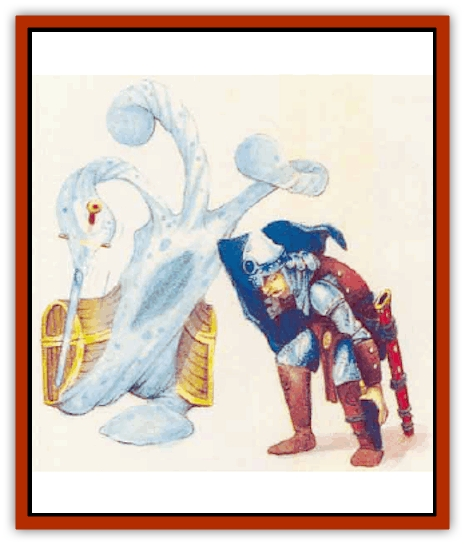

# Scamille

| Statistic | **Scamille** |
| --- | --- |
| **Activity Cycle:** | Any |
| **Alignment:** | Neutral |
| **Armor Class:** | 5 |
| **Climate/Terrain:** | Subterranean |
| **Damage/Attack:** | 8d6 each (pseudopods) |
| **Diet:** | Omnivore |
| **Frequency:** | Very rare |
| **Hit Dice:** | 10 |
| **Intelligence:** | Average (8) |
| **Magic Resistance:** | Nil |
| **Morale:** | Elite (13) |
| **Movement:** | 8 |
| **No. Appearing:** | 1d4 |
| **No. of Attacks:** | 6 |
| **Organization:** | Solitary |
| **Size:** | M-L (6-10' across) |
| **Special Attacks:** | See below |
| **Special Defenses:** | Nil |
| **THAC0:** | 11 |
| **Treasure:** | Nil |
| **XP Value:** | 8,000 |

Scamilles are amorphous, amoeba-like creatures that can change their shapes. They dwell in subterranean areas and are related to [[Ooze_Slime_Jelly_II|ochre jellies]]. Unlike ochre jellies, scamilles are intelligent and can camouflage themselves.

In their normal forms, scamilles resemble giant amoebas. Each has a black nucleus surrounded by a mass of rock-gray protoplasm. The protoplasm extrudes six pseudopods. A scamille has a slightly acidic odor, though the scamille does not attack with acid.

Scamilles use their pliable form to create mouths. They can speak Common, which is their preferred language. Scamilles do not have their own language.

In general, scamilles are not aggressive. They will wait and observe a party to determine whether it is a threat. If a party is "interesting" (perhaps clever or eloquent), the scamilles will continue to watch for a while.

**Combat:** When at rest, a scamille takes the form of some inanimate object such as a rock, door, wall, table, chair, or chest. Scamilles cannot take the form of living creatures. The ability to change shape is limited, and is not done through conscious effort; when tired, the scamille simply draws its body together. Each scamille can assume the form of only one inanimate object. Though the scamille can change color slightly, a close examination will reveal such an "item" to be suspect. A camouflaged scamille gives opponents a -1 penalty to surprise rolls.

Scamilles attack with their six pseudopods, each causing 3d6 points of damage.

A scamille can cause one pseudopod at a time to become sticky. If a victim is successfully hit with the sticky pseudopod, it is stuck fast. A stuck victim can attack only with a weapon that was already in hand at the time of the scamille's successful assault. A victim attacking in this fashion suffers a -4 penalty to attack rolls. Once a victim is held, the scamille attacks with the remaining five pseudopods, though these have no adhesive quality to them. Attacks on a held victim automatically hit. Spells that require material components cannot be used by a held victim.

In order to pull free of the sticky pseudopod, the victim must make 2 successfull bend bars rolls. One attempt can be made per round, in place of any attacks the victim might wish to make.

A scamille can choose to let go of a stuck victim. Otherwise, a victim who fails its bend bars rolls can be freed only by an application of *oil of slipperiness* or the death of the scamille.

Once a victim dies, the scamille draws the victim's body into its own and secretes a powerful acid that dissolves the victim and all possessions in 1d4 rounds.

Scamilles are vulnerable to light. If a *light* spell is cast upon a scamille, it loses the ability to form pseudopods for one round. If cast on a camouflaged scamille, the *light* spell causes it to assume its amoebalike form.

**Habitat/Society:** Scamilles dwell in dark places such as caves and fissures. They rarely venture above ground, even at night.

Though scamilles can be found in small groups, there is no group mentaliy. Each scamille acts as it pleases, free of interference from its brethren.

Scamilles are asexual beings, dividing like amoeba once every five years or so, when enough raw material has been gathered to allow the split. A typical scamille lives 120 years.

Scamilles like to learn secrets, and because of their camouflage ability, they are in an ideal situation to eavesdrop on other underground dwellers.

When found in a good mood, a scamille may offer information in exchange for food. However, scamilles are subject to profound mood swings.

**Ecology:** Scamilles keep cavern floors clear of obstructions, especially absorbing the remains of intruders to the subterranean world.

In addition to animal and plant material, scamilles eat small quantities of minerals and rocks, and even derive some sustenance from the remains of a dead victim's equipment. Scamilles enjoy scraps of what humans and demihumans consider food. To a scamille, such scraps are a special taste treat.

---
## Discovery & Documentation

**Source Publication:** Mystara Appendix (1994)
**Campaign Setting:** Mystara
**Author(s):** John Nephew, Teeuwynn Woodruff, John Terra, Skip Williams

### Other Creatures Found in This Source Book
   * [[Actaeon|Actaeon]]
   * [[Agarat|Agarat]]
   * [[Ash_Crawler|Ash Crawler]]
   * [[Baldandar|Baldandar]]
   * [[Bargda|Bargda]]
   * [[Bhut|Bhut]]
   * [[Bird_Mystara|Bird (Mystara)]]
   * [[Blackball|Blackball]]
   * [[Choker|Choker]]
   * [[Coltpixie|Coltpixie]]
   * [[Crone_of_Chaos|Crone of Chaos]]
   * [[Darkhood|Darkhood]]
   * [[Darkwing|Darkwing]]
   * [[Decapus|Decapus]]
   * [[Deep_Glaurant|Deep Glaurant]]
   * [[Diabolus|Diabolus]]
   * [[Dimensional_Warper|Dimensional Warper]]
   * [[Dragon_Mystara_Crystalline|Dragon (Mystara), Crystalline]]
   * [[Dragon_Mystara_Jade|Dragon (Mystara), Jade]]
   * [[Dragon_Mystara_Onyx|Dragon (Mystara), Onyx]]
   * [[Dragon_Mystara_Ruby|Dragon (Mystara), Ruby]]
   * [[Drake_Mystara|Drake (Mystara)]]
   * [[Dragonfly|Dragonfly]]
   * [[Dusanu|Dusanu]]
   * [[Elemental_of_Chaos_Air_Earth|Elemental of Chaos, Air/Earth]]
   * [[Elemental_of_Chaos_Fire_Water|Elemental of Chaos, Fire/Water]]
   * [[Elemental_of_Law_Air_Earth|Elemental of Law, Air/Earth]]
   * [[Elemental_of_Law_Fire_Water|Elemental of Law, Fire/Water]]
   * [[Familiar_Mystara|Familiar (Mystara)]]
   * [[Frost_Salamander|Frost Salamander]]
   * [[Fundamental_Air_Earth|Fundamental, Air/Earth]]
   * [[Fundamental_Fire_Water|Fundamental, Fire/Water]]
   * [[Gargantua_Mystara|Gargantua (Mystara)]]
   * [[Geonid|Geonid]]
   * [[Ghostly_Horde|Ghostly Horde]]
   * [[Giant_Athach|Giant, Athach]]
   * [[Giant_Hephaeston|Giant, Hephaeston]]
   * [[Golem_Drolem|Golem, Drolem]]
   * [[Golem_Mystara_I|Golem (Mystara) I]]
   * [[Golem_Mystara_II|Golem (Mystara) II]]
   * [[Golem_Mystara_III|Golem (Mystara) III]]
   * [[Gray_Philosopher|Gray Philosopher]]
   * [[Guardian_Warrior|Guardian Warrior]]
   * [[Gyerian|Gyerian]]
   * [[Herex|Herex]]
   * [[Hivebrood|Hivebrood]]
   * [[Horde|Horde]]
   * [[Hsiao|Hsiao]]
   * [[Huptzeen|Huptzeen]]
   * [[Hutaakan|Hutaakan]]
   * [[Imp_Mystara|Imp (Mystara)]]
   * [[Jellyfish_Giant_Mystara|Jellyfish, Giant (Mystara)]]
   * [[Kna|Kna]]
   * [[Kopru|Kopru]]
   * [[Lizard_Mystara|Lizard (Mystara)]]
   * [[Lizard-kin_Mystara|Lizard-kin (Mystara)]]
   * [[Lupin|Lupin]]
   * [[Lycanthrope_Werejaguar_Mystara|Lycanthrope, Werejaguar (Mystara)]]
   * [[Lycanthrope_Wereswine|Lycanthrope, Wereswine]]
   * [[Magen|Magen]]
   * [[Manikin|Manikin]]
   * [[Mek|Mek]]
   * [[Mujina|Mujina]]
   * [[Nagpa|Nagpa]]
   * [[Neh-thalggu|Neh-thalggu]]
   * [[Nightshade_Mystara|Nightshade (Mystara)]]
   * [[Nuckalavee|Nuckalavee]]
   * [[Pegataur|Pegataur]]
   * [[Phanaton|Phanaton]]
   * [[Plant_Dangerous_Mystara|Plant, Dangerous (Mystara)]]
   * [[Plasm|Plasm]]
   * [[Rakasta|Rakasta]]
   * [[Rock_Man|Rock Man]]
   * [[Sabreclaw|Sabreclaw]]
   * [[Sacrol|Sacrol]]
   * [[Shapeshifter|Shapeshifter]]
   * [[Shargugh|Shargugh]]
   * [[Shark-kin|Shark-kin]]
   * [[Sollux|Sollux]]
   * [[Spectral_Death|Spectral Death]]
   * [[Spectral_Hound|Spectral Hound]]
   * [[Spider-kin|Spider-kin]]
   * [[Spirit_Mystara|Spirit (Mystara)]]
   * [[Statue_Living|Statue, Living]]
   * [[Surtaki|Surtaki]]
   * [[Tabi|Tabi]]
   * [[Thoul|Thoul]]
   * [[Thunderhead|Thunderhead]]
   * [[Tiger_Ebon|Tiger, Ebon]]
   * [[Topi|Topi]]
   * [[Tortle|Tortle]]
   * [[Vampire_Velya|Vampire, Velya]]
   * [[White_Fang|White Fang]]
   * [[Worm_Mystara|Worm (Mystara)]]
   * [[Wyrd|Wyrd]]
   * [[Yowler|Yowler]]
   * [[Zombie_Lightning|Zombie, Lightning]]
