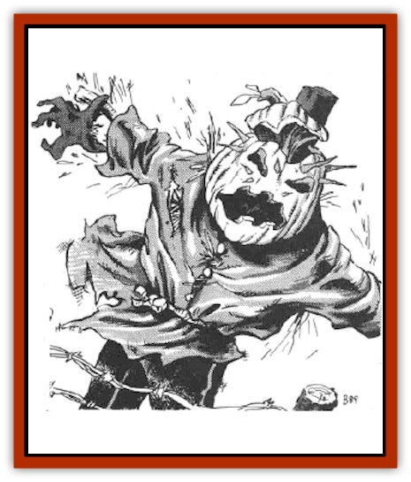

# Scarecrow

| Statistic | **Scarecrow** |
| --- | --- |
| **Activity Cycle:** | Any |
| **Alignment:** | Any evil |
| **Armor Class:** | 6 |
| **Climate/Terrain:** | Any/Land |
| **Damage/Attack:** | 1-6 + charm |
| **Diet:** | None |
| **Frequency:** | Very rare |
| **Hit Dice:** | 5 |
| **Intelligence:** | Non- (0) |
| **Magic Resistance:** | Nil |
| **Morale:** | Elite (13-14) (if conscious) |
| **Movement:** | 6 |
| **No. Appearing:** | 1 |
| **No. of Attacks:** | 1 + gaze |
| **Organization:** | Solitary |
| **Size:** | M (6' tall) |
| **Special Attacks:** | Charm (see below) |
| **Special Defenses:** | See below |
| **THAC0:** | 15 |
| **Treasure:** | Nil |
| **XP Value:** | 1,400 |

Scarecrows are powerful enchanted creatures made from the same materials as normal scarecrows. They are non-intelligent but capable of following simple instructions from the priest who created them.

Each scarecrow is unique in appearance but all share several common characteristics. Their bodies, arms, and legs are always made of cut wood (such as a broom stick or garden stake) and bound together with hemp cope. Tattered rags cover the frame and are sometimes stuffed with grass or straw. A hollow gourd with a face carved into it serves as head. Once animated, a fiery light burns in the scarecrow's eye sockets. They are always of malign intent.

Scarecrows are light but slow. Their leg and elbow joints bend both ways, causing them to move with an uneven, jerky gait. The head spins freely.

The Scarecrows speak no language, but cackle [[Hyena|hyena]]-like when attacking.

**Combat:** Once every round, a scarecrow may gaze at one creature within 40 feet. Any intelligent human or demihuman meeting this gaze becomes charmed unless he rolls a successful saving throw vs. spell. The charm is one of absolute fascination rather than obedience to command. While charmed the victim stands transfixed, arms hanging limply, allowing the scarecrow to strike again and again (automatic hit each round). The charm lasts until either the scarecrow leaves the area for one full turn, or it is killed.

The touch of scarecrows causes 1d6 points of damage and has an identical charm effect (saving throws apply). Because of their construction, scarecrows are especially susceptible to fire. All fire-based attacks gain a +1 bonus to the attack roll and a +1 damage bonus per die of damage. They are unaffected by *sleep*, *charm*, *hold*, or *suggestion* spells, and they are immune to cold-based attacks.

A scarecrow attacks one victim at a time, striking the first peron it charmed repeatedly until he is dead. While slaying its victim, the scarecrow uses its gaze attack to charm as many other opponents as possible. Scarecrows always attack until destroyed or ordered to stop.

**Habitat/Society:** Scarecrows have no preferred habitat or society. They exist only to serve the priest who created them. They follow any simple one- or two-phrase order to the best of their ability, without regard to their own safety.

To create a scarecrow, either a special manual must be used or a high-level priest must employ the following spells: *animate object*, *prayer*, com**mand, and *quest*. The construction requires three weeks work, but material costs are small - one gold piece per hit point the scarecrow possesses. The final step of the process, casting the q**uest spell, is done during a new moon.

Scarecrows can be constructed to kill a specific person. To do so, the clothes worn by the scarecrow must come from the intended victim. Once the scarecrow is animated, the priest need only utter a single word - "Quest". The scarecrow then moves in a direct line toward the victim. Upon reaching the victim, the scarecrow disregards all other beings and concentrates its gaze and attacks entirely on the person it has been quested to kill. After slaying its victim, a quested scarecrow's magic dissipates and it collapses into dust.

**Ecology:** As constructs, scarecrows have no life span. The magic that created them keeps their tattered parts from decomposing and shields them from the effects of cold.

**Conscious Scarecrow**

  Most scarecrows disintegrate upon the death of their creator, however a few (10%) become conscious. These scarecrows have low intelligence but possess a devilish cunning. They stalk the land committing acts of evil by night and hiding during daylight hours. Because scarecrows hate fire and are unaffected by cold, conscious scarecrows try to reach colder dimes. During the trek the scarecrows kill all they encounter - including those who pose no threat. Conscious scarecrows hate all life and kill humans and demihumans whenever possible.

---
## Discovery & Documentation

**Source Publication:** MC5 Greyhawk Appendix (1989)
**Campaign Setting:** Advanced Dungeons & Dragons 2nd Edition
**Author(s):** Grant Boucher, William W. Connors, Steve Gilbert, Bruce Nesmith, Chris Mortika, Skip Williams

### Other Creatures Found in This Source Book
   * [[Aspis|Aspis]]
   * [[Beastman|Beastman]]
   * [[Bonesnapper|Bonesnapper]]
   * [[Booka|Booka]]
   * [[Brownie_Buckawn|Brownie, Buckawn]]
   * [[Brownie_Quickling|Brownie, Quickling]]
   * [[Crystalmist|Crystalmist]]
   * [[Dragon_Cloud|Dragon, Cloud]]
   * [[Dragon_Oerth_Greyhawk|Dragon (Oerth), Greyhawk]]
   * [[Dragonfly_Giant|Dragonfly, Giant]]
   * [[Dragonnel|Dragonnel]]
   * [[Elf_Grugach|Elf, Grugach]]
   * [[Elf_Valley|Elf, Valley]]
   * [[Golem_Necrophidius|Golem, Necrophidius]]
   * [[Grell_Wild|Grell, Wild]]
   * [[Grung|Grung]]
   * [[Hobgoblin_Norker|Hobgoblin, Norker]]
   * [[Hook_Horror|Hook Horror]]
   * [[Horgar|Horgar]]
   * [[Hound_Yeth|Hound, Yeth]]
   * [[Iguana_Giant|Iguana, Giant]]
   * [[Ingundi|Ingundi]]
   * [[Kech|Kech]]
   * [[Kyuss_Son_of|Kyuss, Son of]]
   * [[Mite|Mite]]
   * [[Needleman|Needleman]]
   * [[Plant_Carnivorous_Oerth|Plant, Carnivorous (Oerth)]]
   * [[Plant_Carnivorous_Vampire_Cactus|Plant, Carnivorous, Vampire Cactus]]
   * [[Plasmoid_General_Information|Plasmoid, General Information]]
   * [[Rat_Oerth|Rat (Oerth)]]
   * [[Raven_Crow|Raven/Crow]]
   * [[Shadow_Slow|Shadow, Slow]]
   * [[Skulk|Skulk]]
   * [[Snail|Snail]]
   * [[Sprite|Sprite]]
   * [[Taer|Taer]]
   * [[Tentamort|Tentamort]]
   * [[Turtle_Giant|Turtle, Giant]]
   * [[Tyrg|Tyrg]]
   * [[Wolf_Mist|Wolf, Mist]]
   * [[Wraith_Oerth|Wraith (Oerth)]]
   * [[Zygom|Zygom]]
