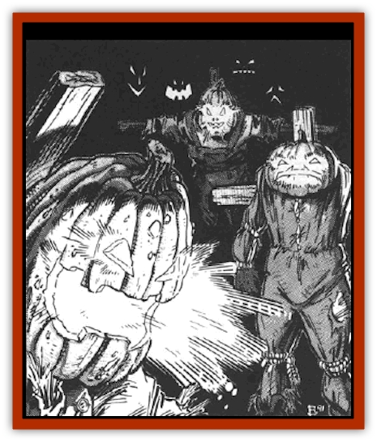

# Scarecrow - Ravenloft

| Statistic | **Scarecrow (Ravenloft)** |
| --- | --- |
| **Activity Cycle:** | Night |
| **Alignment:** | Neutral evil |
| **Armor Class:** | 8 |
| **Climate/Terrain:** | Any farmland |
| **Damage/Attack:** | 1d4 or by weapon |
| **Diet:** | None |
| **Frequency:** | Very rare |
| **Hit Dice:** | 3 |
| **Intelligence:** | Non- (0) |
| **Magic Resistance:** | Nil |
| **Morale:** | Fearless (19-20) |
| **Movement:** | 9 |
| **No. Appearing:** | 1 |
| **No. of Attacks:** | 1 |
| **Organization:** | Solitary |
| **Size:** | M (6' tall) |
| **Special Attacks:** | See below |
| **Special Defenses:** | See below |
| **THAC0:** | 17 |
| **Treasure:** | Nil |
| **XP Value:** | 420 |

The Ravenloft [[Scarecrow|scarecrow]] is a magically-animated creature that moves about under the influence of an evil force. Usually found only in agricultural regions, it is often the chosen form of a vengeful farmer's spirit.

The appearance of these creatures varies, since the bodies they enter and animate are all built by different people and reflect the artistic talents and tastes of their creator. As a rule, however, the scarecrow's body is an assemblage of old clothes, stuffed with leaves, straw, or some other filling material and braced up on a wooden support. Some manner of gourd or melon is generally placed atop the body after being hollowed out and carved to resemble a haunting, frightening face. When the creature is animated, the face glows from within as if a candle or lantern were placed inside its hollow head.

Scarecrows are able to speak any language they knew in life. There is even a small chance (10%) that anyone who in life knew the individual whose spirit inhabits the scarecrow will recognize and identify that evil soul when listening to the creature's eerie, haunting voice.

**Combat:** The scarecrow exists only to exact vengeance on those who wronged it in life. As such, it tends to avoid combat with others and will often flee from encounters with those it does not know. When it finally comes across someone it blames for an act committed against it in life, it attacks quickly and savagely - refusing to retreat until either it or its victim is slain.

The scarecrow's main hand-to-hand attack is made with its flailing arms. This attack is only mildly harmful, however, because the creature is not noted for great strength. Each successful attack will inflict but 1d4 points of damage. From time to time, a scarecrow will attack with some manner of farm implement (useally a pitch fork or scythe). In such cases, it does damage according to the weapon employed.

The real danger presented by a scarecrow is the fact that anyone struck for its rather weak blows must save vs. death magic. Failure to make the save will find the victim cursed with an magical odor that draws biting and stinging insects to him from miles away. On the round after the failed saving throw, the victim takes 1d4 points of damage from bites and stings. On the next round, the victim take 2d4 points of damage, then 3d4, and so on. This effect can be negated only by the casting of a *remove curse* spell. In addition to the damage sustained, a cursed character suffers a penalty of -1 on all attack rolls for each die of damage inflicted by the insects on that turn. For example, on the first round in which the character is bitten and stung, he is at -1 on all attacks rolls and takes 1d4 points of damage. Four rounds later, he takes 5d4 points of damage and suffers a -5 on his attack rolls.

Scarecrows are immune to the effects of cold-based spells and take only half damage from all lightning- or electricity-based spells. They suffer full damage from all non-magical fire attacks. All magical flame attacks receive a +1 on their attack roll and a +1 per die on their damage roll. Non-magical weapons can hit them, but they inflict only 1 point of damage per blow landed. Magical weapons not employing fire inflict half damage while those using fire (i.e., a *Flame Tongue*) gain a +1 on all attack rolls and a +1 per die on all damage rolls.

While they are similar to undead creatures, scarecrows cannot be turned. They are, however, immune to *sleep*, *charm*, *hold*, or similar mind-based magical influences.

**Habitat/Society:** The Ravenloft scarecrow is an animated form of the mundane farm construct. The spirit that drives it to commit acts of evil is often that of a local resident who feels that he was wronged by one or more of his neighbors in life. Unable to attain justice while he was alive, his spirit lingers on after his death and becomes a powerful force for evil.

**Ecology:** Ravenloft scarecrows are magically animated constructs. Although they are fashioned out of organic materials, there is no evidence to support a belief that they have any role in the ecosphere around them.

---
## Discovery & Documentation

**Source Publication:** MC10 Ravenloft Appendix I (1989)
**Campaign Setting:** Planescape
**Author(s):** William W. Connors

### Other Creatures Found in This Source Book
   * [[Bastellus|Bastellus]]
   * [[Bat_Ravenloft|Bat (Ravenloft)]]
   * [[Bowlyn|Bowlyn]]
   * [[Broken_One|Broken One]]
   * [[Bussengeist|Bussengeist]]
   * [[Darkling|Darkling]]
   * [[Doom_Guard|Doom Guard]]
   * [[Doppelganger_Plant|Doppelganger Plant]]
   * [[Elemental_Ravenloft|Elemental (Ravenloft)]]
   * [[Ermordenung|Ermordenung]]
   * [[Ghoul_Lord|Ghoul Lord]]
   * [[Goblyn|Goblyn]]
   * [[Golem_III|Golem III]]
   * [[Golem_IV|Golem IV]]
   * [[Golem_Ravenloft|Golem (Ravenloft)]]
   * [[Grim_Reaper|Grim Reaper]]
   * [[Human_Abber_Nomad|Human, Abber Nomad]]
   * [[Human_Ravenloft|Human (Ravenloft)]]
   * [[Imp_Assassin|Imp, Assassin]]
   * [[Impersonator|Impersonator]]
   * [[Lycanthrope_Werebat|Lycanthrope, Werebat]]
   * [[Lycanthrope_Wereraven|Lycanthrope, Wereraven]]
   * [[Mist_Horror|Mist Horror]]
   * [[Mummy_Greater|Mummy, Greater]]
   * [[Quevari|Quevari]]
   * [[Quickwood|Quickwood]]
   * [[Ravenkin|Ravenkin]]
   * [[Reaver|Reaver]]
   * [[Shadow_Fiend|Shadow Fiend]]
   * [[Skeleton_Giant|Skeleton, Giant]]
   * [[Strahd's_Skeletal_Steed|Strahd's Skeletal Steed]]
   * [[Treant_Evil|Treant, Evil]]
   * [[Treant_Undead|Treant, Undead]]
   * [[Valpurgeist|Valpurgeist]]
   * [[Vampire_Dwarf|Vampire, Dwarf]]
   * [[Vampire_Elf|Vampire, Elf]]
   * [[Vampire_Gnome|Vampire, Gnome]]
   * [[Vampire_Halfling|Vampire, Halfling]]
   * [[Vampire_General_Information|Vampire, General Information]]
   * [[Vampire_Kender|Vampire, Kender]]
   * [[Vampyre|Vampyre]]
   * [[Widow_Red|Widow, Red]]
   * [[Wolfwere_Greater|Wolfwere, Greater]]
   * [[Zombie_Lord|Zombie Lord]]
