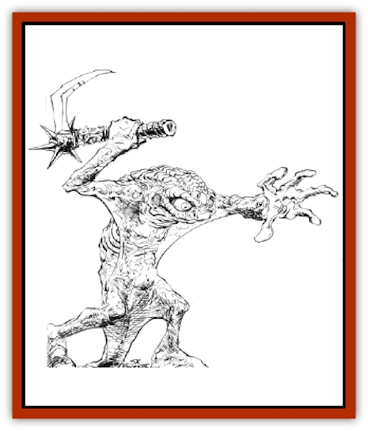

# Scathe

| Statistic | **Larva** | **Scathe** |
| --- | --- | --- |
| **Activity Cycle:** | Night | Night |
| **Alignment:** | Neutral | Chaotic evil |
| **Armor Class:** | 9 | 5 |
| **Climate/Terrain:** | Icy plains | Icy plains |
| **Damage/Attack:** | 1-6 | 1-4/1-4/2-12 |
| **Diet:** | Carnivore (carrion) | Carnivore (carrion) |
| **Frequency:** | Very rare | Rare |
| **Hit Dice:** | 1 | 4+4 |
| **Intelligence:** | Non- (0) | Low (5-7) |
| **Magic Resistance:** | Nil | Nil |
| **Morale:** | Fearless (20) | Champion (16) |
| **Movement:** | 1 | 1, Skating 24 |
| **No. Appearing:** | 2-5 | 4-16 |
| **No. of Attacks:** | 1 | 3 |
| **Organization:** | Nest | Pack |
| **Size:** | T (1-2') | M (5') |
| **Special Attacks:** | Nil | Poison |
| **Special Defenses:** | Nil | Camouflage, Spell Immunity |
| **THAC0:** | 19 | 15 |
| **Treasure:** | Nil | Q&times;5 |
| **XP Value:** | 35 | 975 |

Scathes are a uniform milky-white in color. Their tough, leathery skin is completely hairless. A thin membrane stretches beteen arm and body, ending at the knee. The claws on their feet are quite long, and curve underneath their feet, serving as natural ice skates. Using their arm membranes as sails, they skate rapidly over desolatc arctic plains.

Scathes have excellent infravision, good to a range of 120'. They also have the ability to sense heat emanations from incredible distances, and can locate a warm-blooded body of human size from as far away as a mile.

Scathes are closely related to [[Harrier|harriers]], jungle predators which use their arm membranes to glide from trees.

**Combat:** Scathes are very difficult to detect when they are motionless against a background of ice and snow, giving opponents a -2 penalty on suprise rolls. Even moving, they are difficult to see at night, when they normally hunt. A scathe's body temperature differs only slightly from that of its surroundings, so infravision is almost useless in detecting them. If other sounds, such as howling winds, hide the sounds of their skates on the ice, their opponents are still -2 on surprise rolls.

Adult scathes hunt in packs. They swoop towards their opponents, using their claws and beaks to attack. If a scathe hits with its beak, there is a 25% chance for a burning poison to be injected into the victim. The poison causes an additional 2-12 points of damage, and the pain will cause victims to make attack rolls with a -2 penalty. A successful saving throw vs. poison will halve the damage and eliminate much of the pain effects, leaving the victim at -1 to attack rolls, up to a maximum of -2 for multiple attacks. The effects of the poison last for 5-20 rounds; during this time stricken opponents cannot benefit from any Dexterity bonuses to their Armor Class.

Scathes are immune to all cold-based spells, and to [[Dragon_Chromatic_White|white dragon]] breath.

**Habitat/Society:** These monsters communicate in a rudimentary fashion, using howls and shrieks which others often mistake for the violent arctic winds which whip through the creatures' terrain. They lair in hollows and ravines in icy plains, roaming in packs throughout the territory. A pack leader is male, as are 1-4 other pack members. Each male has a "harem" of 1-4 females.

Pack leaders change with some regularity. The strongest young scathe challenges the pack leader, and the two fight mercilessly for supremacy, often until both are dead and another scathe steps in to lead the pack. The losers' females divide themselves among the remaining male scathes.

Mating season occurs once a year. About a month after mating, a female scathe lays 2-12 eggs in a crude nest in the lair. Only 2-5 of the eggs survive predators, accidents, and snacking. These hatch into larvae, voracious monsters which devour any food they can find. A very few larvae, 1-3, survive the two months needed to develop into small, but fully developed, scathes. When the change from larval stage occurs, they immediately become members of the pack.

Scathes have no true society beyond the pack, and there is no evidence of civilization among them.

**Ecology:** A scathe pack will attack any animal which moves close enough to be detected by them, including large and aggressive creatures such as [[Dragon_General_Information|dragons]]. They will also eat any available carrion, including dead or severely wounded scathes.

A scathe egg or larva might be worth up to 500 gp to a buyer who wants a vicious, unpredictable guard animal. Scathes are virtually untraceable. They become lethargic if taken to warmer environments.

**Larva**

  Scathe larvae are identical to those of the harrier: small, wormlike creatures with mottled brown skin. They have a well-developed, though toothless, beak when they hatch, and this beak grows and develops as they do. A nearly-mature larva has limbs and other organs visible just under its skin. If enough food is available, the larva matures rapidly, shedding its skin after two months.

---
## Discovery & Documentation

**Source Publication:** MC14 Fiend Folio Appendix (1992)
**Campaign Setting:** Fiends Folio
**Author(s):** Don Bingle, John Terra, Wes Nicholson, Tim Beach, Steve Hardinger, Kris Hardinger, Rob Nicholls, Greg Swedberg, Al Boyce, Vince Garcia, Norm Ritchie

### Other Creatures Found in This Source Book
   * [[Aballin|Aballin]]
   * [[Achaierai|Achaierai]]
   * [[Adherer|Adherer]]
   * [[Algoid|Algoid]]
   * [[Al-Mi'raj|Al-Mi'raj]]
   * [[Apparition|Apparition]]
   * [[Caterwaul|Caterwaul]]
   * [[Coffer_Corpse|Coffer Corpse]]
   * [[Crabman|Crabman]]
   * [[Dark_Creeper|Dark Creeper]]
   * [[Dark_Stalker|Dark Stalker]]
   * [[Darter|Darter]]
   * [[Denzelian|Denzelian]]
   * [[Dune_Stalker|Dune Stalker]]
   * [[Dwarf_Urdunnir|Dwarf, Urdunnir]]
   * [[Falcon_Fire|Falcon, Fire]]
   * [[Faux_Faerie|Faux Faerie]]
   * [[Flawder|Flawder]]
   * [[Fyrefly|Fyrefly]]
   * [[Gambado|Gambado]]
   * [[Garbug|Garbug]]
   * [[Giant_Fhoimorien|Giant, Fhoimorien]]
   * [[Gibberling|Gibberling]]
   * [[Gorbel|Gorbel]]
   * [[Grimlock|Grimlock]]
   * [[Hellcat|Hellcat]]
   * [[Ice_Lizard|Ice Lizard]]
   * [[Iron_Cobra|Iron Cobra]]
   * [[Khargra|Khargra]]
   * [[Mantari|Mantari]]
   * [[Penanggalan|Penanggalan]]
   * [[Pernicon|Pernicon]]
   * [[Phantom_Stalker|Phantom Stalker]]
   * [[Retriever|Retriever]]
   * [[Ruve|Ruve]]
   * [[Sheet_Ghoul_Sheet_Phantom|Sheet Ghoul/Sheet Phantom]]
   * [[Shocker|Shocker]]
   * [[Spanner|Spanner]]
   * [[Stwinger|Stwinger]]
   * [[Sussurus|Sussurus]]
   * [[Symbiotic_Jelly|Symbiotic Jelly]]
   * [[Terithran|Terithran]]
   * [[Thunder_Children|Thunder Children]]
   * [[Troll_Ice|Troll, Ice]]
   * [[Tween|Tween]]
   * [[Umpleby|Umpleby]]
   * [[Volt|Volt]]
   * [[Xill|Xill]]
   * [[Xvart|Xvart]]
   * [[Zygraat|Zygraat]]
