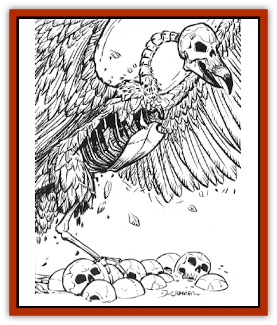

# Scavenger Spawn

| Statistic | **Scavenger Spawn** |
| --- | --- |
| **Activity Cycle:** | Any |
| **Alignment:** | Chaotic evil |
| **Armor Class:** | 5 |
| **Climate/Terrain:** | Special |
| **Damage/Attack:** | 1d8/1d8/1d6 or 1d6 |
| **Diet:** | Carnivore |
| **Frequency:** | Rare |
| **Hit Dice:** | 4+4 |
| **Intelligence:** | Low (7) |
| **Magic Resistance:** | Nil |
| **Morale:** | Elite (14) |
| **Movement:** | 6, Fl 21 (B) |
| **No. Appearing:** | 4d10 |
| **No. of Attacks:** | 3 or 1 |
| **Organization:** | Pack |
| **Size:** | M (5' tall, 10' wingspan) |
| **Special Attacks:** | Slow |
| **Special Defenses:** | +1 or better weapons needed to hit |
| **THAC0:** | 17 |
| **Treasure:** | Nil |
| **XP Value:** | 975 |

Scavenger spawn are grotesque, bony beasts resembling a cross between a human [[Skeleton|skeleton]] and a [[Vulture|vulture]]. The power of the [[Daemonlord|Daemonlord]] generates and animates them from corpses. With their wide, black wings, those watching from a distance can easily mistake them for vultures. Only when they are carefully scrutinized, or when they soar in to attack, is their true nature revealed. Bony skulls form the faces of these hideous creatures, while their cruel talons are made of hiked claws of razor-sharp bone.

**Combat:** When airborne, scavenger spawn can fight whith their powerful claws, inflicting 1d8 points of damage per hit. Their grotesque, fanged mouths can inflict 1d6 points of damage. Furthermore, any victim bitten by one of these horrors must make a saving throw vs. spell. Failure means that the hero is *slowed* for 1d6 turns. Unlike most other types of *slow* attacks, this effect is cumulative, so a second bite and failed saving throw means that the hero's movement and attacks are reduced to � normal. This can continue until the victim is virtually paralyzed, at which point the spawn gleefully gather around for a grisly repast while the horrified victim is still alive.

However, the effects of a single *haste* spell (or a successful *dispel magic*) can negate all the accumulated *slowing* of multiple scavenger spawn wounds. A hero who has been enchanted with *haste* is immune to further *slowing* for the duration of the effect of the spell. Although the hero does not get double movement and attacks, at least he or she can function normally.

**Habitat/Society:** Scavenger spawn are one of the few spawn types created by the Daemonlord that actually eat. However, they take great pains to work their victims over slowly before they actually start eating. Additionally, they are quite willing to share the experience with other scavenger spawn, so no infighting for food ever breaks out among these creatures.

**Ecology:** With their exceptionally keen eyesight, scavenger spawn can spot human-sized objects as far as two or three miles away. They can soar tirelessly in the air and tend to congregate in flocks numbering several dozen.

---
## Discovery & Documentation

**Source Publication:** Chaos Spawn (1999)
**Campaign Setting:** Dragonlance
**Author(s):** Douglas Niles

### Other Creatures Found in This Source Book
   * [[Cedar_Spawn|Cedar Spawn]]
   * [[Daemonlord|Daemonlord]]
   * [[Sand_Spawn|Sand Spawn]]
