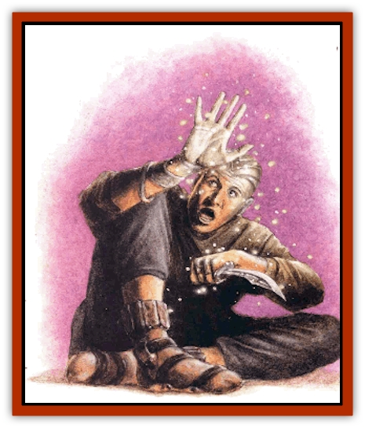

# Scile

| Statistic | **Scile** |
| --- | --- |
| **Activity Cycle:** | Any |
| **Alignment:** | Neutral |
| **Armor Class:** | 0 |
| **Climate/Terrain:** | Quasiplane of Radiance |
| **Damage/Attack:** | Nil |
| **Diet:** | Color |
| **Frequency:** | Common |
| **Hit Dice:** | 1 hp |
| **Intelligence:** | Low to average (7-9) |
| **Magic Resistance:** | Nil |
| **Morale:** | Fanatic (17-18) |
| **Movement:** | Fl 9 (A) |
| **No. Appearing:** | 10d10 |
| **No. of Attacks:** | 0 |
| **Organization:** | Cloud |
| **Size:** | T (1/100&rdquo; long) |
| **Special Attacks:** | Drain color |
| **Special Defenses:** | Struck only by +1 or better weapons, immunities |
| **THAC0:** | 20 |
| **Treasure:** | Nil |
| **XP Value:** | 35 |

*From the journals of Ucec Ordel:*

"Now what do I sodding do? Reide sends me on this berk's errand to the Quasielemental Planes, and I run afoul at the first one I hit. Sure, I knew that the plane of Radiance'd burn my eyes out, but I prepared for that. Rittbon Blese taught me a spell to protect me, and I knew that my sword, *scold*, could stand up to any sodding [[Quasielemental_Positive|radiance elemental]]. I was set.

"Yeah, right.

"Rittbon's spell worked, all right - my eyes didn't burn up - but I could see only a sodding short distance! That's why I never saw them coming until it was too late. Little creatures, little motes of light, swarmed at me in a cloud, almost like tiny glowing locusts. Well, they were more like sodding little sparks, really, but their light didn't flicker - it stayed constant.

"I suppose it didn't matter what the flame they looked like. Like my father always said, if you can see 'em, you're probably already in it too sodding deep. See, these little sparks - a blood in the Cage told me they're called scile or incandescents  - feed on the colors of the quasiplane of Radiance. But they get bored eating the same old thing all the time, so if they run into some poor berk passing through, they eat *his* colors.

"It's not like going to the Gray Waste, either, 'cause they like to eat gray just fine. No, when those motes're done with you, they leave you completely transparent. Folks can see right through you. Doesn't sound so sodding bad? Let me tell you about bad&hellip;"

**Combat:** Whcn preying upon planar travelers, the scile attack in large masses. Individually, they can do little, but in a cloud of 30 or more, these little motes of light can drain the color from a sod in just a few minutes' time. All they need to do is stay within approximately 10 feet of the victim for 1d4 consecutive rounds. At the end of that time, the target gets to make a saving throw versus spell. If he fails the roll, he and his possessions lose their color and become transparent.

Transparency is a bit like invisibility, but the victim can't even see his own body, so he faces a -2 penalty to all die rolls involving physical maneuvers. After all, it's difficult and disorienting for a basher to climb if he can't see his feet or hands, to swing a sword if he can't tell how long it is, or to jump if he can't judge where he's standing. Further, if the sod casts a spell with somatic components, there's a 30% chance that he'll fail to make the proper gestures, thus wasting the spell. Transparent cutters also tend to bump into things, stub their toes, and the like - they lose all awareness of their body.

'Course, it's difficult if not impossible to use transparent items. Whether a basher is visible or color-drained, he suffers a -2 penalty when trying to use a transparent weapon or similarly physical item (transparent berks with transparent items aren't penalized twice). Transparent shields offer no bonus to Armor Class, because the wielder can't see the shield to know where it gives protection and where it doesn't. And magical items that've been rendered transparent by the scile simply fail to function.

Thankfully, the creatures' strange effect can be reversed. The application of a *remove curse* spell or *dust of appearance* restores the color to a transparent person or item, though each sod or object must be treated separately. Of course, mundane means such as paint or dyes work as well, after a fashion.

Incandescents can be struck only by weapons of +1 or greater enchantment. Because they're creatures of energy, they're immune to magic that alters physical forms, such as that which paralyzes, petrifies, polymorphs, or disintegrates. However, *darkness* spells drive scile away, and physical barriers like *walls of force* or *walls of ice* keep them at bay.

**Habitat/Society:** The scile never leave the quasiplane of Radiance, probably because they couldn't survive anywhere else. On their home plane, they have an intricate society based around huge, permanent cloud-clusters. Each community consists of many thousands, if not millions, and each is a completely autonomous collective - all scile are equal. The creatures can communicate via telepathy with any others of their kind in sight.

Scholars don't know how - or if - the scile reproduce. Fact is, chant has it that the number of the creatures is constant. They don't grow old or ill, so the only way for an incandescent to go to the dead-book is through violence. It's a rare occurrence, but when it happens, the lost individual is not replaced. Instead, the entire population of the scile simply decreases by one. Once they're all slain, the race will be no more.

**Ecology:** With all the colors of Radiance, the scile never want for food. Nevertheless, many travel the quasiplane in hunting clouds searching for non-natives, who apparently have colors that differ from those present naturally on the plane. It seems, however, that only an incandescent can notice these subtle differences.

**The Ravagers of Color**

A rare breed of evil scile is said to exist deep within the quasiplane of Radiance. These creatures eat away only certain colors, an act that somehow maliciously changes the victim. Those who know the dark of these wicked incandescents call them the Ravagers of Color.

When these creatures attack, the Dungeon Master should roll on the following table to determine what color they drain and how it affects the sod. The ravagers eat only one color per victim - once drained of that color, the target is safe from further attack. *Dust of appearance* or a *remove curse* spell will restore the lost color and negate the effect. The effect will also cease if the victim is rendered fully transparent by normal scile.

| 1d6 | Lost Color/Effect |
| --- | --- |
| 1 | Blue (serenity). Once per day, victim has a 25% chance to fly into a rage and attack all in sight. |
| 2 | Red (passion). Victim becomes listless and impossible to motivate. He must make a saving throw versus spell to take any course of action. |
| 3 | Yellow (hope). Victim grows depressed, suffering a -2 penalty to all actions. |
| 4 | Green (secrets). Victim becomes unable to lie, and constantly relates information to all around him. |
| 5 | Violet (intelligence). Victim loses 1d2 points of Intelligence. |
| 6 | Orange (vitality). Victim loses 1d2 points of Strength. |

The Ravagers of Color are chaotic evil in alignment and very intelligent. They avoid normal scile for obvious reasons, but resemble them in every way other than the effect of their attack.

---
## Discovery & Documentation

**Source Publication:** Planescape III (1996)
**Campaign Setting:** Planescape
**Author(s):** Monte Cook

### Other Creatures Found in This Source Book
   * [[Animental|Animental]]
   * [[Archomental_Evil|Archomental, Evil]]
   * [[Archomental_Good|Archomental, Good]]
   * [[Belker|Belker]]
   * [[Bzastra|Bzastra]]
   * [[Chososion|Chososion]]
   * [[Darklight|Darklight]]
   * [[Devete|Devete]]
   * [[Devourer_Planescape|Devourer (Planescape)]]
   * [[Dharum_Suhn|Dharum Suhn]]
   * [[Egarus|Egarus]]
   * [[Elemental_Athas_Lesser_Air_Earth|Elemental (Athas), Lesser, Air/Earth]]
   * [[Elemental_Athas_Lesser_Fire_Water|Elemental (Athas), Lesser, Fire/Water]]
   * [[Elemental_Fire_Kin_Salamander_II|Elemental, Fire Kin, Salamander II]]
   * [[Entrope|Entrope]]
   * [[Facet|Facet]]
   * [[Frost_Salamander|Frost Salamander]]
   * [[Fundamental_Air_Earth|Fundamental, Air/Earth]]
   * [[Fundamental_Fire_Water|Fundamental, Fire/Water]]
   * [[Fundamental_All_Elements|Fundamental, All Elements]]
   * [[Garmorm|Garmorm]]
   * [[Homunculus_Elemental|Homunculus, Elemental]]
   * [[Immoth|Immoth]]
   * [[Khargra|Khargra]]
   * [[Klyndes|Klyndes]]
   * [[Magran|Magran]]
   * [[Menglis|Menglis]]
   * [[Nathri|Nathri]]
   * [[Ooze_Sprite|Ooze Sprite]]
   * [[Paraelemental|Paraelemental]]
   * [[Phirblas|Phirblas]]
   * [[Psurlon|Psurlon]]
   * [[Quasielemental_Negative|Quasielemental, Negative]]
   * [[Quasielemental_Positive|Quasielemental, Positive]]
   * [[Rast|Rast]]
   * [[Ravid|Ravid]]
   * [[Ruvoka|Ruvoka]]
   * [[Shad|Shad]]
   * [[Shocker|Shocker]]
   * [[Sislan|Sislan]]
   * [[Suisseen|Suisseen]]
   * [[Terithran|Terithran]]
   * [[Thoqqua|Thoqqua]]
   * [[Trilloch|Trilloch]]
   * [[Tsnng|Tsnng]]
   * [[Ungulosin|Ungulosin]]
   * [[Vacuous|Vacuous]]
   * [[Wavefire|Wavefire]]
   * [[Xag-Ya_Xeg-Yi|Xag-Ya/Xeg-Yi]]
   * [[Xill|Xill]]
