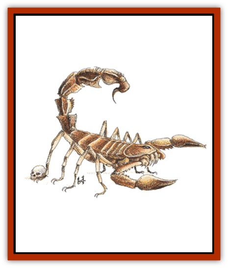

# Scorpion

| Statistic | **Giant** | **Huge** | **Large** |
| --- | --- | --- | --- |
| **Activity Cycle:** | Any | Any | Any |
| **Alignment:** | Neutral | Neutral | Neutral |
| **Armor Class:** | 3 | 4 | 5 |
| **Climate/Terrain:** | Warm wilderness and subterranean areas | Warm wilderness and subterranean areas | Warm wilderness and subterranean areas |
| **Damage/Attack:** | 1-10/1-10/1-4 | 1-8/1-8/1-3 | 1-4/1-4/1 |
| **Diet:** | Carnivore | Carnivore | Carnivore |
| **Frequency:** | Uncommon | Common | Uncommon |
| **Hit Dice:** | 5+5 | 4+4 | 2+2 |
| **Intelligence:** | Non- (0) | Non- (0) | Non- (0) |
| **Magic Resistance:** | Nil | Nil | Nil |
| **Morale:** | Steady (11) | Average (10) | Average (8) |
| **Movement:** | 15 | 12 | 9 |
| **No. Appearing:** | 1-4 | 1-4 | 1-6 |
| **No. of Attacks:** | 3 | 3 | 3 |
| **Organization:** | Swarm | Swarm | Swarm |
| **Size:** | M (5-6' long) | M (4' long) | S (2' long) |
| **Special Attacks:** | Poison sting | Poison sting | Poison sting |
| **Special Defenses:** | Nil | Nil | Nil |
| **THAC0:** | 15 | 15 | 19 |
| **Treasure:** | D | D | D |
| **XP Value:** | 650 | 420 | 175 |

Giant scorpions are vicious predators that live almost anywhere, including relatively cold places such as dungeons, though they favor deserts and warm lands. These creatures are giant versions of the normal 4-inch-long scorpion found in desert climes.

The giant scorpion has a green carapace and yellowish green legs and pincers. The segmented tail is black, with a vicious stinger on the end. There is a bitter smell associated with the scorpion, which probably comes from the venom. They make an unnerving scrabbling sound as they travel across dungeon floors.

**Combat:** The giant scorpion is 95% likely to attack any creature that approaches. The creature has a hard, chitinous carapace that gives it Armor Class 3. This monster attacks by grabbing prey with its two huge pincers, inflicting 1-10 points of damage each, while it lashes forward with its tail to sting. Thus, it can fight three opponents at once. If a giant scorpion manages to grab a victim in a pincer, it will automatically inflict 1-10 points of damage each round until it releases the victim. The victim has but one chance to escape. If he can make his bend bars/lift gates roll, he will escape the claw. However, this can be the character's only action that round and it can be tried only once per combat. If the sting is employed against an untrapped victim, an attack roll is required for a successful attack, but a trapped character is automatically struck by any sting attack directed at him with no attack roll required.

The sting inflicts 1-4 points of damage and the victim must save versus poison or die the next round (type F). Note that scorpions are not immune to their own poison. If a scorpion is reduced to 1 or 2 hit points, it will go into a stinging frenzy, stinging everything in sight, gaining two attempts to hit per round with only the tail. Slain creatures are dragged to the scorpion's burrow to be eaten.

**Habitat/Society:** Giant scorpions live in underground burrows or dungeons. Each lair may (20%) have 5d4 scorpion eggs. These beasts eat any living creature that is unfortunate enough to stray too close to their lair. Any treasure found comes from the bodies of human or demihuman victims that have been dragged here to be consumed. Armor is rarely found intact, since the scorpion will surely have used its pincers to cut up its prey.

**Ecology:** These bizarre insects contribute to the ecosystem by feeding on other giant versions of [[Insect_Giant|insects]] such as [[Spider|spiders]] and [[Ant|ants]]. They themselves are prey for [[Worm|purple worms]] and other huge, subterranean creatures. Alchemists and assassins prize the scorpion's venom because of its potency.

**Large and Huge Scorpions**

  Often found in dungeons and wildernesses, these creatures are merely smaller versions of the giant scorpion. Colors range from tan to brown to black, and rumors persist of rare white scorpions deep underground. All attack with pincers and tail stinger. If struck by the stinger, the victim must save versus poison or die the next round. However, the poison of the large scorpion is weaker than normal (type A, 15/0 points damage), giving the victim a +2 on his saving throw. Huge scorpions have deadly (type F) poison and can pin a victim in a way similar to the giant scorpion, but with the huge scorpion, the victim can still fight back. It is not unusual to see scorpions of various sizes fighting with each other.

---
## Discovery & Documentation

**Source Publication:** MC1 Volume I (w/binder #1) (1991)
**Campaign Setting:** Advanced Dungeons & Dragons 2nd Edition
**Author(s):** Jay Batista, Scott Bennie, Grant Boucher, William W. Connors, Steve Gilbert, Heike Kubasch, James Lowder, David Edward Martin, Bruce Nesmith, Jean Rabe, Rick Swan, John J. Terra, Gary L. Thomas

### Other Creatures Found in This Source Book
   * [[Bat|Bat]]
   * [[Bear|Bear]]
   * [[Behir|Behir]]
   * [[Boar|Boar]]
   * [[Bookworm|Bookworm]]
   * [[Brownie|Brownie]]
   * [[Bugbear|Bugbear]]
   * [[Carrion_Crawler|Carrion Crawler]]
   * [[Cat_Great|Cat, Great]]
   * [[Catoblepas|Catoblepas]]
   * [[Dragon_General_Information|Dragon, General Information]]
   * [[Dragonfish|Dragonfish]]
   * [[Elemental_Air_Kin_Aerial_Servant|Elemental, Air Kin, Aerial Servant]]
   * [[Elemental_Earth_Kin_Sandling|Elemental, Earth Kin, Sandling]]
   * [[Elephant|Elephant]]
   * [[Gnoll|Gnoll]]
   * [[Hobgoblin|Hobgoblin]]
   * [[Homunculus|Homunculus]]
   * [[Hornet_Giant|Hornet, Giant]]
   * [[Horse|Horse]]
   * [[Hyena|Hyena]]
   * [[Jackal|Jackal]]
   * [[Jackalwere|Jackalwere]]
   * [[Korred|Korred]]
   * [[Lich|Lich]]
   * [[Lizard|Lizard]]
   * [[Lizard_Man|Lizard Man]]
   * [[Lycanthrope_General_Information|Lycanthrope, General Information]]
   * [[Lycanthrope_Seawolf|Lycanthrope, Seawolf]]
   * [[Lycanthrope_Werebear|Lycanthrope, Werebear]]
   * [[Lycanthrope_Weretiger|Lycanthrope, Weretiger]]
   * [[Lycanthrope_Werewolf|Lycanthrope, Werewolf]]
   * [[Manticore|Manticore]]
   * [[Medusa|Medusa]]
   * [[Mind_Flayer|Mind Flayer]]
   * [[Minotaur|Minotaur]]
   * [[Mudman|Mudman]]
   * [[Mummy|Mummy]]
   * [[Nixie|Nixie]]
   * [[Nymph|Nymph]]
   * [[Ogre|Ogre]]
   * [[Ooze_Slime_Jelly_I|Ooze/Slime/Jelly I]]
   * [[Ooze_Slime_Jelly_II|Ooze/Slime/Jelly II]]
   * [[Orc|Orc]]
   * [[Owl|Owl]]
   * [[Owlbear_I|Owlbear I]]
   * [[Pegasus|Pegasus]]
   * [[Piercer|Piercer]]
   * [[Pudding_Deadly|Pudding, Deadly]]
   * [[Rakshasa|Rakshasa]]
   * [[Rat|Rat]]
   * [[Ray|Ray]]
   * [[Remorhaz|Remorhaz]]
   * [[Satyr|Satyr]]
   * [[Selkie|Selkie]]
   * [[Shadow|Shadow]]
   * [[Skeleton|Skeleton]]
   * [[Skunk|Skunk]]
   * [[Snake|Snake]]
   * [[Spectre|Spectre]]
   * [[Spider|Spider]]
   * [[Sprite|Sprite]]
   * [[Toad_Giant|Toad, Giant]]
   * [[Treant|Treant]]
   * [[Troll|Troll]]
   * [[Umber_Hulk|Umber Hulk]]
   * [[Unicorn|Unicorn]]
   * [[Vampire|Vampire]]
   * [[Wight|Wight]]
   * [[Will_O'Wisp|Will O'Wisp]]
   * [[Wolf|Wolf]]
   * [[Wolfwere|Wolfwere]]
   * [[Wraith|Wraith]]
   * [[Wyvern|Wyvern]]
   * [[Yeti|Yeti]]
   * [[Yuan-ti|Yuan-ti]]
   * [[Zombie|Zombie]]
