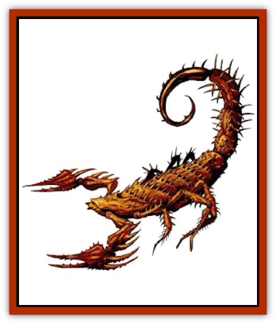

# Scorpion - Athas

| Statistic | **Barbed** | **Gold** |
| --- | --- | --- |
| **Activity Cycle:** | Any | Any |
| **Alignment:** | Neutral | Neutral |
| **Armor Class:** | 1 | 6 |
| **Climate/Terrain:** | Any | Any |
| **Damage/Attack:** | 1d12/1d12/1d6 | 1-2/1-2/1 |
| **Diet:** | Carnivore | Carnivore |
| **Frequency:** | Uncommon | Common |
| **Hit Dice:** | 9+5 | 2+2 |
| **Intelligence:** | Non- (0) | Non- (0) |
| **Magic Resistance:** | Nil | Nil |
| **Morale:** | Steady (12) | Average (10) |
| **Movement:** | 9 | 6 |
| **No. Appearing:** | 1-4 (1d4) | 1-4 (1d4) |
| **No. of Attacks:** | 3 | 3 |
| **Organization:** | Swarm | Swarm |
| **Size:** | M (8-12' long) | S (1-2') long) |
| **Special Attacks:** | Poison sting | Poison sting |
| **Special Defenses:** | Barbs | Nil |
| **THAC0:** | 11 | 19 |
| **Treasure:** | D | D |
| **XP Value:** | 3,000 | 175 |

Barbed [[Scorpion|scorpions]] are incredibly large creatures that prey on any living thing they find. They make their homes in caves among the rocky badlands, but are found all over Athas, living wherever they can find enough food to exist.

Barbed scorpions average 10 feet long from pincher to tail. Their carapace is a dull gray to a dusty tan. They are covered with large, sharp, protruding barbs that can cause terrible damage to anyone who gets close to these creatures. Their long, segmented tail is as long as their body and arcs overhead with a venomous stinger the size of a short sword. They make a terrible clacking noise as they move about.

**Combat:** A barbed scorpion attacks any living being that approaches it. It moves about, wildly attacking with both of its pinchers and its tail in each round. Attacks by its pinchers cause 1.12 (1d12) points of damage and captures opponents within its grip. Once captured, victims can break free only by making a successful Bend Bars/Lift Gates roll. If the attempt fails, the barbed scorpion stings the victim the next round. If the barbed scorpion does not have a victim in its grasp, it makes a regular attack with its stingers.

The barbed scorpion's hard, chitinous carapace provides it with AC 1. Anyone attempting to attack the barbed scorpion with short or medium length melee weapons must make a Dexterity roll at -3 each round to avoid receiving 2-8 (2d4) additional points of damage from running into the moving creature's barbs while attacking it.

Their stinger causes 1.6 (1d6) points of damage and injects venom into the wound. The victim must successfully save vs. poison (type C) or within 2-5 minutes the victim suffers 25 points of damage. If the save is successful, the victim suffers only 2-8 (2d4) points of damage. The barbed scorpion is not immune to its own venom.

**Habitat/Society:** Barbed scorpions travel and hunt for food either alone or in small swarms.

**Ecology:** Barbed scorpions prey on wild animals and weary travelers. Their dens often contain the undigestible remains of former prey, including some valuables that might still be intact. There is a 60% chance of finding type D treasure.

**Gold Scorpion**

  Gold scorpions are small scorpions found throughout Athas. Their name comes from their gold carapace that shines brigthtly in the sun. Because of their size, they can crawl into anything and are often unnoticed until it is too late.

They attack three times each round, once with each pincher, each causing 1-2 points of damage, and with their stinger that causes 1 point of damage and injects the strongest venom (type D) known into the victim. The victim must make a successful save vs. poison at -3 or suffer 30 points of damage. If the save is successful, the victim suffers 2-12 (2d6) points of damage.

---
## Discovery & Documentation

**Source Publication:** Dark Sun Appendix II - Terrors Beyond Tyr (1991)
**Campaign Setting:** Dark Sun
**Author(s):** Jim Atkiss, Steve Brown, Timothy B. Brown, Andrew P. Morris, Bruce Nesmith, Wes Nicholson, Bill Slavicsek

### Other Creatures Found in This Source Book
   * [[Aarakocra_Athas|Aarakocra (Athas)]]
   * [[Animal_Domestic_Athas_II|Animal, Domestic (Athas) II]]
   * [[Aviarag|Aviarag]]
   * [[Baazrag|Baazrag]]
   * [[Baazrag_Boneclaw|Baazrag, Boneclaw]]
   * [[Bloodgrass|Bloodgrass]]
   * [[Cactus_Hunting|Cactus, Hunting]]
   * [[Cactus_Rock|Cactus, Rock]]
   * [[Cilops|Cilops]]
   * [[Crodlu|Crodlu]]
   * [[Dagorran|Dagorran]]
   * [[Dhaot|Dhaot]]
   * [[Drake_Lesser_Athas_General_Information|Drake, Lesser (Athas), General Information]]
   * [[Drake_Lesser_Athas_Magma|Drake, Lesser (Athas), Magma]]
   * [[Drake_Lesser_Athas_Rain|Drake, Lesser (Athas), Rain]]
   * [[Drake_Lesser_Athas_Silt|Drake, Lesser (Athas), Silt]]
   * [[Drake_Lesser_Athas_Sun|Drake, Lesser (Athas), Sun]]
   * [[Dray|Dray]]
   * [[Drik|Drik]]
   * [[Dune_Reaper|Dune Reaper]]
   * [[Dwarf_Athas|Dwarf (Athas)]]
   * [[Elemental_Beast_Athas_Air|Elemental Beast (Athas), Air]]
   * [[Elemental_Beast_Athas_Earth|Elemental Beast (Athas), Earth]]
   * [[Elemental_Beast_Athas_Fire|Elemental Beast (Athas), Fire]]
   * [[Elemental_Beast_Athas_Water|Elemental Beast (Athas), Water]]
   * [[Elf_Athas|Elf (Athas)]]
   * [[Fael|Fael]]
   * [[Feylaar|Feylaar]]
   * [[Fordorran|Fordorran]]
   * [[Giant_Half-giant|Giant, Half-giant]]
   * [[Giant_Shadow|Giant, Shadow]]
   * [[Golem_Athas_Magma|Golem (Athas), Magma]]
   * [[Golem_Athas_Salt|Golem (Athas), Salt]]
   * [[Golem_Athas_General_Information|Golem (Athas), General Information]]
   * [[Gorak|Gorak]]
   * [[Halfling_Athas|Halfling (Athas)]]
   * [[Human_Athas|Human (Athas)]]
   * [[Jhakar|Jhakar]]
   * [[Kaisharga|Kaisharga]]
   * [[Kes'trekel|Kes'trekel]]
   * [[Klar|Klar]]
   * [[Krag|Krag]]
   * [[Kragling|Kragling]]
   * [[Lirr|Lirr]]
   * [[Mastyrial|Mastyrial]]
   * [[Meorty|Meorty]]
   * [[Mul|Mul]]
   * [[Nikaal|Nikaal]]
   * [[Paraelemental_Beast_General_Information|Paraelemental Beast, General Information]]
   * [[Paraelemental_Beast_Magma|Paraelemental Beast, Magma]]
   * [[Paraelemental_Beast_Rain|Paraelemental Beast, Rain]]
   * [[Paraelemental_Beast_Silt|Paraelemental Beast, Silt]]
   * [[Paraelemental_Beast_Sun|Paraelemental Beast, Sun]]
   * [[Pakubrazi|Pakubrazi]]
   * [[Psionocus|Psionocus]]
   * [[Psurlon|Psurlon]]
   * [[Raaig|Raaig]]
   * [[Retriever_Obsidian|Retriever, Obsidian]]
   * [[Ruktoi|Ruktoi]]
   * [[Ruvoka_Athas|Ruvoka (Athas)]]
   * [[Sand_Howler|Sand Howler]]
   * [[Seed_Brain|Seed, Brain]]
   * [[Silt_Horror_Black|Silt Horror, Black]]
   * [[Silt_Horror_Magma|Silt Horror, Magma]]
   * [[Silt_Horror_Red|Silt Horror, Red]]
   * [[Silt_Spawn|Silt Spawn]]
   * [[Slig|Slig]]
   * [[Spider_Athas|Spider (Athas)]]
   * [[Spinewyrm|Spinewyrm]]
   * [[Ssurran|Ssurran]]
   * [[Stalking_Horror|Stalking Horror]]
   * [[Tarek|Tarek]]
   * [[Tari|Tari]]
   * [[Thri-kreen|Thri-kreen]]
   * [[T'liz|T'liz]]
   * [[Tohr-kreen_II|Tohr-kreen II]]
   * [[Tohr-kreen_III|Tohr-kreen III]]
   * [[Trin|Trin]]
   * [[Tul'k|Tul'k]]
   * [[Undead_Athas_General_Information|Undead (Athas), General Information]]
   * [[Wraith_Athas|Wraith (Athas)]]
   * [[Xerichou|Xerichou]]
   * [[Zombie_Thinking|Zombie, Thinking]]
