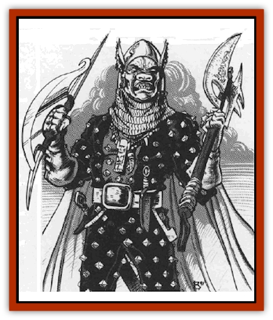

# Scro

| Statistic | **Scro** |
| --- | --- |
| **Activity Cycle:** | Any |
| **Alignment:** | Lawful evil |
| **Armor Class:** | 4 (8) |
| **Climate/Terrain:** | Any |
| **Damage/Attack:** | 1d6, or by weapon |
| **Diet:** | Omnivore |
| **Frequency:** | Very rare |
| **Hit Dice:** | 3 |
| **Intelligence:** | Highly (13-14) |
| **Magic Resistance:** | 10% |
| **Morale:** | Elite (15) |
| **Movement:** | 9 (12) |
| **No. Appearing:** | 30-120 |
| **No. of Attacks:** | 1 |
| **Organization:** | Tribal |
| **Size:** | M to L (5-8' tall) |
| **Special Attacks:** | See below |
| **Special Defenses:** | Nil |
| **THAC0:** | 18 |
| **Treasure:** | Z (J,K,M,Q) |
| **XP Value:** | 270 / Sergeant/guard (4 HD): 420 / Captain/bodyguard (6 HD): 975 / Warpriest (5 HD): 975 / Almighty Leader (8 HD): 2,000 |

The highly militaristic scro are a violent goblinoid race that has only recently appeared. They are still rarely encountered, but if present trends continue, wildspace travellers will unfortunately see much more of them.

The scro resemble musclebound [[Orc|orcs]], fully armored and armed to the teeth. Scro have the orc's characteristic pig-like snout; however, the scro stand proud and erect, and their high foreheads resemble humanity's. Scro have large canine teeth that they sharpen to a fine point; they decorate teeth and ears with tribal mini-totems. Scro eyes appear human, but they glow a sickly phosphorescent green in dim light. Hide color ranges from slate gray, burnt orange, light tan, and moss green, to jet black and even, in rare cases, albino white.

Scro armor is well oiled, well maintained studded leather with each stud filed to a sharp point. The armor is always jet black, though the studs are painted different colors. Their numerous weapons are just as well maintained. Scro often complete their wardrobe with a night-blue cloak.

Scro carry no standards, but each scro wears an insignia that identifies its tribe. This is worn either as a shoulder patch or on the left side of the chest.

The scro speak a distant variant of the orcish tongue. Curiously, some speak fluent elvish, for they have fanatically preserved the language of their worst enemies - so that when the scro slaughter the [[Elf|elven race]], the marauding humanoids can tell their victims, in their own tongue, who is doing this to them.

**Combat:** The scro live for combat. They have raised it to the highest form of expression in their society. They fight easily in any environment and are well disciplined. Though the scro can be just as bloodthirsty as orcs, they have tempered their savagery with pragmatism and strategic and tactical cunning. Scro actually obey most of the civilized rules of warfare and do not fire on messengers or truce-bearers.

For every four scro encountered, there is one sergeant. For every ten scro encountered, there is one captain and one war priest. Only the largest gatherings of scro include an Almighty Leader.

Sco use the following weapons: longword and dagger (15% of the time); scimitar (10%); arquebus and hand axe (25%); arquebus and starwheel (5%); spear and hand axe (15%); polearm and dagger (10%); shortbow and shortsword (15%); and crossbow and battleaxe (5%). Captains and bodyguards may also possess a starwheel firearm (75% chance). Almighty Leaders almost always carry a starwheel. War priests, multi-classed 5th-level cleric/mages, have one weapon with an enchantment between +2 and +4, plus 1d4 miscellaneous magical items usable by priests and wizards.

Sergeants and war priests get three melee attacks every two rounds; captains and Almighty Leaders get two melee attacks per round. These attacks are usable only with melee weapons or fists, not missile weapons or firearms. Optonally, scro with two melee weapons may be trained in two-weapon fighting (see *The Complete Fighter's Handbook* for details).

The vast majority (95%) of scro warriors specialize in unarmed combat, which gives them two punches per round at +1 to hit, doing 1d3 damage per punch plus Strength bonus. (Most adult scro have at least Strength 16 and Constitution 15.) In addition,some (30%) scro use a spiked leather glove that does an extra +1 hp damage in unarmed combat attacks.

Scro armor spikes cause 1d4 damage to any foe that the scro smashes against. Some nasty scro coat their armor's studs and spike with a Type D poison (5% chance); the poison's onset takes one minute and does 30 hp damage (save vs. poison for 2d6 damage).

If all else fails, a scro bites with its powerful teeth for 1d3 damage. If a scro kills an opponent with its teeth, the triumphant warrior affixes a small gem or bauble on one of its oversized canines. It then takes a tooth from the opponent and puts it on a necklace called a *toregkh*. This necklace is prized as a totem of strength. If it is stolen, the warrior flies into a berserk rage against the offender (+2 to hit and damage, +4 penalty to AC, number of attacks per round doubled).

Strangely, the scro are notably articulate. They prefer to begin combat by shouting long, literate insults against their opponents, to show that they hold their enemies in contempt. The mere sight of a goblinoid spouting offensive alliterations might disorient the most battle-hardened veteran long enough to let the scro gain initiative in combat.

Direct sunlight does not affect scro combat ability.

**Habitat/Society:** Scro live in a regimented society, based on a complex system of laws and customs that call for unswerving loyalty and obedience. Each scra is a valued member of society and has a duty to fulfill.

Leaders are respected and obeyed unless they show obvious cowardice in battle. In that case, it is the strongest scro's duty to overthrow the coward's authority and lead the troops in glorious battle.

The scro homeworld's location is unknown. Thus far, they have seldom ventured into civilized areas, preferring to keep out of sight until they are truly ready. On the homeworld, Dukagsh, the scro live in well-planned, spartan cities with stout towers, strong fortresses, and efficient shipyards. Though the place is no garden spot, neither is it smoky, ugly, or garbage-strewn. Each city has 10,000 to 100,000 scro.

Each of Dukagsh's 24 tribes is led by an Almighty Leader. The entire planet is ruled by the Ultimate High Overlord, a 16 HD scro who is guarded by 24 Captains, one from each tribe. Each tribe has a social rank, with those of lower rank subordinate to the higher tribes.

Scro soldiers train in non-weapon proficiencies and normally have three of these skills: Armorer, Blindfighting, Endurance, land-based Riding, Reading/Writing, Rope Use, Running, Tracking, and Weaponsmithing. Sergeants have four of these proficiencies; captains have five; war priests have four, plus Healing, Herbalism, Religion, and Spellcraft.

Scro are not interested in conquering the multiverse. Their sole purpose is to drive all groundling human, demi-human, and humanoid races out of wildspace for good. The war priests see this, not planetary conquest, as their holy mission. As for the races native to wildspace&hellip; well, the scro will need slave labor, and those pitiful races will do quite nicely. The scro are merely waiting for the right moment to strike.

**Ecology:** The scro have an "us against the whole multiverse" philosophy that is sure to produce plenty of enemies when they make their presence felt. Thus far, the scro know much about the other space-faring races, but those races are unaware of the scro's existence, save for a few rumors from unreliable sources.

Like their orcish forebears, scro are fecund. They produce litters of 1d4+1 offspring, most with an excellent chance of survival beyond infancy. Unlike their orcish ancestors, the scro live for an average of 80 years.

**History**

  The scro trace their ancestry back to the orc tribes that fought and lost the Unhuman Wars. Some crews and troops of the few surviving orc vessels made their way to a remote but habitable planet and settled down. This ragtag band was led by a huge orc called Dukgash, who appointed himself the first Almighty Leader.

By orc standards, Dukagsh was a visionary. He recognized that the orcs lost the Unhuman Wars because of their one-dimensional ideas and outmoded tactics. Brutality for its own sake had gotten them nowhere. Dukagsh realized that the orcs needed to fight in an organized way, and that each soldier must realize his full potential.

In the ensuing years, Dukagsh whipped his people into shape, making sure that they learned fighting, survival, and even culture. To make sure no one forgot who caused the orcs' misfortune, each orc had to learn fluent elvish.

Sometime, the orcs salvaged equipment from drifting space junk, the remains of human, elven, dwarven, and goblinoid ships from the Unhuman War battles. Occasionally they found books, and Dukagsh made his people read them.

Before Dukagsh died, he declared that his people were on the path to success. The old ways were dead, he claimed, and a new race was born, a race that was more than any orc could ever be. He named them the scro.

At his death, his grateful followers named their homeworld in his honor. Dukagsh's tomb now floats over the homeworld's north pole, so that the deceased leader may look down on his people and watch their progress.

---
## Discovery & Documentation

**Source Publication:** MC9 Spelljammer Appendix II (1991)
**Campaign Setting:** Planescape
**Author(s):** Scott Davis, Newton Ewell, John Terra

### Other Creatures Found in This Source Book
   * [[Alchemy_Plant|Alchemy Plant]]
   * [[Allura|Allura]]
   * [[Aperusa|Aperusa]]
   * [[Autognome|Autognome]]
   * [[Bionoid|Bionoid]]
   * [[Bloodsac|Bloodsac]]
   * [[Buzzjewel|Buzzjewel]]
   * [[Constellate|Constellate]]
   * [[Contemplator|Contemplator]]
   * [[Dohwar|Dohwar]]
   * [[Dragon_Moon|Dragon, Moon]]
   * [[Dragon_Stellar|Dragon, Stellar]]
   * [[Dragon_Sun|Dragon, Sun]]
   * [[Dreamslayer|Dreamslayer]]
   * [[Dweomerborn|Dweomerborn]]
   * [[Fal|Fal]]
   * [[Feesu|Feesu]]
   * [[Fire_Bat|Fire Bat]]
   * [[Firebird|Firebird]]
   * [[Firelich|Firelich]]
   * [[Flowfiend|Flowfiend]]
   * [[Gadabout|Gadabout]]
   * [[Gammaroid|Gammaroid]]
   * [[Gonn|Gonn]]
   * [[Gossamer|Gossamer]]
   * [[Grav|Grav]]
   * [[Great_Dreamer|Great Dreamer]]
   * [[Greatswan|Greatswan]]
   * [[Grell_Colonial|Grell, Colonial]]
   * [[Gullion|Gullion]]
   * [[Insectare|Insectare]]
   * [[Lhee|Lhee]]
   * [[Mercurial_Slime|Mercurial Slime]]
   * [[Meteorspawn|Meteorspawn]]
   * [[Monitor|Monitor]]
   * [[Owl_Space|Owl, Space]]
   * [[Pristatic|Pristatic]]
   * [[Selkie_Star|Selkie, Star]]
   * [[Silatic|Silatic]]
   * [[Skullbird|Skullbird]]
   * [[Sleek|Sleek]]
   * [[Sluk|Sluk]]
   * [[Space_Swine|Space Swine]]
   * [[Sphinx_Astro-|Sphinx, Astro-]]
   * [[Spirit_Warrior|Spirit Warrior]]
   * [[Starfly_Plant|Starfly Plant]]
   * [[Stargazer|Stargazer]]
   * [[Undead_Stellar|Undead, Stellar]]
   * [[Witchlight_Marauder|Witchlight Marauder]]
   * [[Xixchil|Xixchil]]
   * [[Yitsan|Yitsan]]
   * [[Zurchin|Zurchin]]
