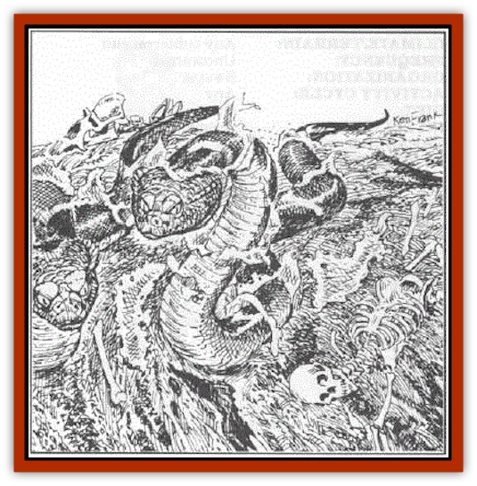

# Scryxull

| Statistic | **Scryxull** |
| --- | --- |
| **Activity Cycle:** | Any |
| **Alignment:** | Neutral |
| **Armor Class:** | 5 |
| **Climate/Terrain:** | Any |
| **Damage/Attack:** | 2-8 |
| **Diet:** | None |
| **Frequency:** | Rare |
| **Hit Dice:** | 4+8 |
| **Intelligence:** | Non- (0) |
| **Magic Resistance:** | Nil |
| **Morale:** | Special |
| **Movement:** | 12 |
| **No. Appearing:** | 1-6 |
| **No. of Attacks:** | 1 |
| **Organization:** | Solitary |
| **Size:** | L (15-20' long) |
| **Special Attacks:** | Strength drain, spittle |
| **Special Defenses:** | See below |
| **THAC0:** | 17 |
| **Treasure:** | Nil |
| **XP Value:** | 975 |

The scryxull can best be described as a [[Zombie|zombie]] [[Snake|snake]]. They are created by evil clerics and magic users to serve as guardians in vile and loathesome places.

Scryxulls resemble normal snakes, but have been observed in sizes up to 20 feet long. Their most distinguishing characteristic is their skin, which varies in color according to the snake's original appearance. What makes their skin unusual and instantly recognizable is that it appears to be covered by a layer of dust. Closer inspection reveals, however, that this is not dust, but a crusty layer of dead skin.

A scryxull's eyes can also give it away as a zombie snake. Recently created scryxull have solid black eyes, regardless of their original color. They maintain a sheen for up to six months, after which the eyes begin to dry and become dull. Eventually, the eyes drop out altogether.

**Combat:** The scryxull are fierce fighters and always battle to the death. They never retreat. They attack automatically when encountered, but can be called off by a command word from their master.

Scryxull always attack using their bite first. Their length allows them to rise off the ground much like a cobra, allowing them to attack face to face. Many people find this unnerving, and the weak of heart are overcome by fear. Non-adventurers have a 50% chance of succumbing to fear: at 0 level, a 10% chance: at 1st level, a 5% chance: and at 2nd level, a 2% chance.

When the scryxull makes a successful bite attack, it inflicts 2-8 hp and drains 1-3 points of strength.

If the scryxull is wounded or somehow prevented from striking with its bite, it will use its spit weapon. Once every four rounds, the scryxull can spit (THAC0 15) an oily glob of dust at its victim, aiming for areas of exposed flesh, especially the face. The spittle acts as a strong topical anesthetic and eventually paralyzes the victim at the following rate:

| Round | Effect |
| --- | --- |
| 1st round | Area of contact feels numb |
| 2nd round | Area begins to stiffen: victim attacks at -4 penalty. |
| 3rd round | Area becomes stiff; if face, arm, or hand affected, victim drops weapon. Vision and speech impaired if the face was affected; victim attacks at -4 penalty if leg affected. |
| 4th round | Victim can no longer stand if leg was affected: breathing is labored if face was affected: arm is completely stiff and useless if affected. |
| 5th round | No change for arm or leg: victim falls unconscious if face was affected. |

Characters are allowed a saving throw vs. paralysis to avoid the effects of the spittle. Armor, clothing, and weapons suffer no ill effects from the spittle. If the spittle is washed off with ordinary water, the effects do not progress beyond that round. If washed off with holy water, the symptoms are removed completely.

If a victim is struck in the torso, follow the effects as if struck in the face. The paralysis will affect the chest muscles, making breathing difficult.

If a victim is a spellcaster, paralysis will limit or prohibit casting. If struck in the face, the spellcaster may not use any spells, but may speak the command word of a magic item on the first round only. If a spellcaster's hand(s) is affected, spells requiring somatic components may not be used after the first round. The DM must rule whether a spellcaster may reach material components, depending on the injury (and whether one hand remains useful).

Scryxull are immune to *sleep*, *charm*, *fear*, *hold*, death magic, poisons, and cold-based spells. Holy water inflicts 2-8 points of damage upon striking. They may be turned by priests as zombies.

**Habitat/Society:** Scryxull may be created anywhere a snake body may be found. The scryxull are typically created as guardians for evil temples, but may also be found in dungeons or the laboratories of evil mages. Scryxull will obey up to six brief commands (attack, halt, be still) spoken by their master.

**Ecology:** None, since the scryxull is created artificially.

---
## Discovery & Documentation

**Source Publication:** WGA1 Falcon's Revenge (1989)
**Campaign Setting:** Greyhawk
**Author(s):** Richard W and Anne Brown

### Other Creatures Found in This Source Book
   * [[Carpet_Snake|Carpet Snake]]
   * [[Grythok|Grythok]]
