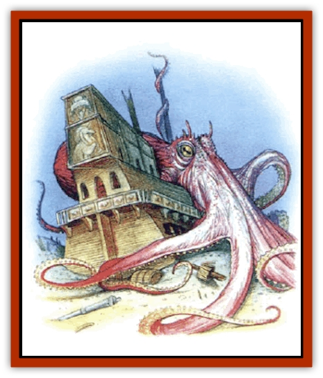

# Sea Demon

| Statistic | **Greater** | **Lesser** |
| --- | --- | --- |
| **Activity Cycle:** | Any | Any |
| **Alignment:** | Chaotic evil | Chaotic evil |
| **Armor Class:** | 0 | 2 |
| **Climate/Terrain:** | Tropical ocean depths | Tropical ocean |
| **Damage/Attack:** | 1d10&times;10/5d6 | 1d8&times;8/5d4 |
| **Diet:** | Carnivore | Carnivore |
| **Frequency:** | Very rare | Very rare |
| **Hit Dice:** | 16+16 | 12+12 |
| **Intelligence:** | High (13-14) | Very (11-12) |
| **Magic Resistance:** | 30% | 15% |
| **Morale:** | Fearless (19-20) | Fanatic (17-18) |
| **Movement:** | 9, Sw 18 | 6, Sw 15 |
| **No. Appearing:** | 1 | 1 |
| **No. of Attacks:** | 11 (6 on land) | 9 (5 on land) |
| **Organization:** | Solitary | Solitary |
| **Size:** | H (40' tentacles) | H (30' tentacles) |
| **Special Attacks:** | Constriction, whirlpool | Constriction, whirlpool |
| **Special Defenses:** | Ink | Ink |
| **THAC0:** | 5 | 9 |
| **Treasure:** | Nil (H) | Nil (D) |
| **XP Value:** | 15,000 | 9,000 |

The sea demon resembles a [[Octopus_Giant|giant octopus]], but is much larger. The smaller version of the sea demon has ten tentacles, averaging 30 feet long, and a body diameter of 15 to 18 feet.

**Combat:** On land, the sea demon attacks with half its tentacles, slithering along the ground upon the rest. At sea, two tentacles anchor the creature, while the rest attack. The initial tentacle attack inflicts 1d8 points of damage. No attack roll is required thereafter, the tentacle constricts for 2d8 points of damage per round. Two rounds after prey has been seized, it is dragged to the creature's great beak, which inflicts 5d4 points of damage.

A tentacle grips with a Strength equivalent of 18/76; a creature with at least this Strength can avoid the crushing damage, but will not be free of the tentacle. A tentacle can take 12 points of slashing damage before being severed; damage to its tentacles does not count against the sea demon's hit points. If half the attacking tentacles are severed or incapacitated, the sea demon withdraws. In water, it discharges an inky cloud that fills a volume of 40x60x60 feet. All within are blinded while they remain within the cloud and for 1d4 rounds after they emerge; the cloud also deadens sound- and pressure-sensing organs so they are useless for 2d4 turns.

The sea demon attacks ships that venture too close to its lair. (Multiply the surface distance in miles from the ship to the lair by 20% for the chance the ship will *not* be attacked). The sea demon takes two turns to get to a shallow depth, then 2 to 12 turns, depending on the distance, to catch the ship.

A ship seized by the sea demon comes to a stop in one turn. The creature will try to sink the ship, attacking whatever prey comes within tentacle reach. As long as six tentacles grasp the ship, the sea demon can reduce its seaworthiness by 2-8% per round (2d4). If four or more tentacles are severed (but no more than half the total number of tentacles), the sea demon retreats to 500 feet below the ship (or half the distance to the bottom in shallower water). It then begins to spin; after one turn, a giant whirlpool forms. Unless the ship is mobile and attempts immediate flight before the whirlpool forms, it will be caught in the whirlpool for 1d4 turns before it can try to escape. Escape requires the ship to be able to move - enough oars and crew to man them or sails and wind to fill them - and a successful seaworthiness check. A failure to escape means the ship is destroyed. The sea demon cannot maintain the whirlpool for more than five turns, nor will it pursue after creating one, for it must rest a full day. The sea demon will recognize an escaped ship on a later day; it can sense such a ship up to 10 miles away (double the normal distance), and will immediately attack and try to destroy it.

**Habitat/Society:** The sea demon may be encountered at sea or in coastal areas. Its lair is usually in the sea, but may be on land if the climate is humid and either subtropical or tropical. It will nearly always be found alone, for it hates all other life, especially other sea demons. The creature is 80% likely to be in or near its lair when encountered.

A sea demon that has lost tentacles can regenerate them at a rate of 3 feet per tentacle per week. A sea demon will not attack a ship if its wounded tentacles are less than half healed.

**Ecology:** The sea demon eats whatever it can catch, preying mainly on giant marine life, small [[Whale|whales]], and the like. It may come ashore to hunt, especially if the food in the surrounding seas has been depleted. Perhaps sea demons first attacked ships because a ship's hull somewhat resembles a whale when viewed from below, but the creatures have learned that ship crews are prey, also.

**Greater Sea Demon**

This creature is in most ways similar to its smaller cousin, but has twelve tentacles (ten of which it uses to attack). It is larger, having a diameter of 20 to 25 feet and its tentacles grow to 40 feet in length. A greater sea demon is found mainly in the deeps; its lair is nearly always below a depth of 1,000 feet.

A greater sea demon tentacle has an effective Strength of 18/91, and requires 20 points of damage to sever. Its beak inflicts 5d6 points of damage, and is strong enough to crush coral, or crack the shell of a [[Clam_Giant|giant clam]]. The creature can reduce a ship's seaworthiness by 4-16% per round (4d4) and crush small boats with ease. Severed tentacles regrow at the rate of four feet per tentacle per week. Its cloud measures 60x80x80 feet.

*Note:* If the optional ship damage system from *Ships and the Sea* is used, the lesser sea demon inflicts 1d4 points of hull damage per round, and the greater sea demon inflicts 2d4.

---
## Discovery & Documentation

**Source Publication:** Monstrous Compendium, 1997 Annual, Volume 4 (1995)
**Campaign Setting:** Advanced Dungeons & Dragons 2nd Edition
**Author(s):** Jon Pickens

### Other Creatures Found in This Source Book
   * [[Anemone_Giant_Sea|Anemone, Giant Sea]]
   * [[Asperii|Asperii]]
   * [[Bainligor|Bainligor]]
   * [[Beast_of_Chaos|Beast of Chaos]]
   * [[Blindheim|Blindheim]]
   * [[Bloodsipper_Far_Realm|Bloodsipper (Far Realm)]]
   * [[Bulette_Gohlbrorn|Bulette, Gohlbrorn]]
   * [[Child_of_the_Sea|Child of the Sea]]
   * [[Clockwork_Horror|Clockwork Horror]]
   * [[Clockwork_Swordsman|Clockwork Swordsman]]
   * [[Coral|Coral]]
   * [[Darklore|Darklore]]
   * [[Dharculus|Dharculus]]
   * [[Dolphin_Athas|Dolphin (Athas)]]
   * [[Dragon_Neutral_Moonstone|Dragon, Neutral, Moonstone]]
   * [[Dragon_Prismatic|Dragon, Prismatic]]
   * [[Dream_Stalker|Dream Stalker]]
   * [[Dragon-kin_Albino_Wyrm|Dragon-kin, Albino Wyrm]]
   * [[Echyan|Echyan]]
   * [[Firestar|Firestar]]
   * [[Firetail|Firetail]]
   * [[Fish_Ascallion|Fish, Ascallion]]
   * [[Fish_Deep_Ocean|Fish, Deep Ocean]]
   * [[Fish_Tropical|Fish, Tropical]]
   * [[Fish_Vurgens|Fish, Vurgens]]
   * [[Fogwarden|Fogwarden]]
   * [[Fraal|Fraal]]
   * [[Giant_Crag|Giant, Crag]]
   * [[Gibberling_Brood|Gibberling, Brood]]
   * [[Glutton_Sea|Glutton, Sea]]
   * [[Golden_Ammonite|Golden Ammonite]]
   * [[Golem_Brass_Minotaur|Golem, Brass Minotaur]]
   * [[Golem_Gemstone|Golem, Gemstone]]
   * [[Golem_Maggot|Golem, Maggot]]
   * [[Groundling|Groundling]]
   * [[Hermit_Sea|Hermit, Sea]]
   * [[Hound_of_Law|Hound of Law]]
   * [[Human_Amazon|Human, Amazon]]
   * [[Human_Pygmy|Human, Pygmy]]
   * [[Inquisitor|Inquisitor]]
   * [[Kercpa|Kercpa]]
   * [[Kreel|Kreel]]
   * [[Lycanthrope_Lythari|Lycanthrope, Lythari]]
   * [[Mercurial|Mercurial]]
   * [[Mold_Chromatic|Mold, Chromatic]]
   * [[Mummy_Bog|Mummy, Bog]]
   * [[Neh-thalggu|Neh-thalggu]]
   * [[Nymph_Grain|Nymph, Grain]]
   * [[Nymph_Unseelie|Nymph, Unseelie]]
   * [[Octopus_Octo-Jelly|Octopus, Octo-Jelly]]
   * [[Puddingfish|Puddingfish]]
   * [[Shade|Shade]]
   * [[Shadowrath|Shadowrath]]
   * [[Shark_Athas|Shark (Athas)]]
   * [[Siren_Ravenloft|Siren (Ravenloft)]]
   * [[Skeleton_Variant|Skeleton, Variant]]
   * [[Skyfish|Skyfish]]
   * [[Spectral_Scion|Spectral Scion]]
   * [[Spyder_Fiend|Spyder Fiend]]
   * [[Squid_Squark|Squid, Squark]]
   * [[Tanar'ri_Lesser_Uridezu|Tanar'ri, Lesser, Uridezu]]
   * [[Troll_Mutate|Troll Mutate]]
   * [[Vaati|Vaati]]
   * [[Vampire_Cerebral|Vampire, Cerebral]]
   * [[Varkha|Varkha]]
   * [[Wizshade|Wizshade]]
   * [[Worm_Lukhorn|Worm, Lukhorn]]
   * [[Wyste|Wyste]]
   * [[Yugoloth_Lesser_Gacholoth|Yugoloth, Lesser, Gacholoth]]
   * [[Zombie_Mud|Zombie, Mud]]
