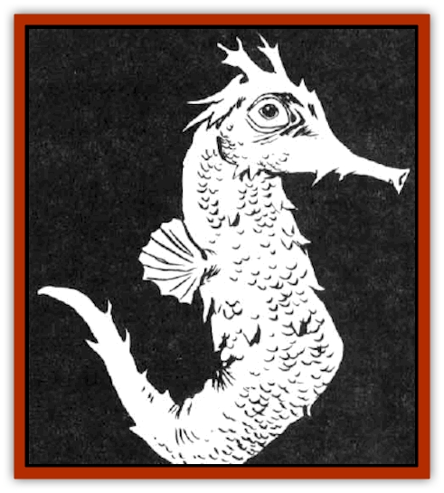

# Sea Horse - Giant

| Statistic | **Sea Horse, Giant** |
| --- | --- |
| **Activity Cycle:** | Any |
| **Alignment:** | Neutral |
| **Armor Class:** | 7 |
| **Climate/Terrain:** | All except arctic/Ocean |
| **Damage/Attack:** | 1-4, 2-5, or 2-8 |
| **Diet:** | Herbivore |
| **Frequency:** | Common |
| **Hit Dice:** | 2-4 |
| **Intelligence:** | Semi- (2-4) |
| **Magic Resistance:** | Nil |
| **Morale:** | Average (10) |
| **Movement:** | Sw 21 |
| **No. Appearing:** | 1-20 |
| **No. of Attacks:** | 1 |
| **Organization:** | Schools |
| **Size:** | L (8-12' long) |
| **Special Attacks:** | Constriction |
| **Special Defenses:** | Nil |
| **THAC0:** | 2 HD: 19 / 3-4 HD: 17 |
| **Treasure:** | Nil |
| **XP Value:** | 2 HD: 35 / 3 HD: 65 / 4 HD: 120 |

Giant sea horses are simply a huge species of the more common sea horse. They have the characteristic horse-like heads and tapering tails of all sea horses.

**Combat:** A sea horse can normally attack only with a head butt, but a sea horse trained by [[Locathah|locathah]] or [[Elf_Aquatic|aquatic elves]] as a steed can also use its long, curling tail to constrict and restrain enemies. The sea horse must be ridden in order to properly obey the command to constrict and then must make a successful attack roll. A captured opponent can free itself with a successful open doors roll, with a -1 penalty. The tail of a giant sea horse is so long that it can attack the same opponent that the head butts, or the one its rider is attacking, without penalty. The length of the tail also constricts the entire body of any creature man-sized or smaller, making spellcasting or melee fighting impossible for constricted creatures. The constriction causes no damage, but the sea horse can still choose to butt the helpless victim if so desired.

Note that underwater combat is three-dimensional and sea horses instinctively use this advantage against creatures that are obviously out of their environment, like men. Sea horse riders take great pains to develop this instinct in their mounts and take advantage of their sea horses' ability to move vertically as well as forward and back and from side to side. Treat sea horses in water as Maneuverability Class A flying creatures in air.

All sea horses have 120-foot infravision and acute senses; it is a foolish rider who fails to take notice of his sea horse mount's warnings.

**Habitat/Society:** In their natural environment, sea horses congregate in schools, feeding off small plankton and seaweed. They have school leaders and follow the prevailing currents. They are generally shy and avoid contact except with other sea horses.

Sea horses can be found in any marine setting except the coldest arctic depths. They prefer tropical to subtropical depths as these provide the greatest variety of foods.

Sea horses are not the brightest of beasts and can be lured into traps and cages if the bait is attractive enough. Aquatic elves and locathah have honed the activity of capturing sea horses to a fine art and acquire all the sea horses they need.

**Ecology:** Sea horses are preyed upon by the usual assortment of ocean-based predators. namely [[Shark|sharks]], [[Squid_Giant|giant squids]], and a [[Squid_Giant|kraken]] or two. They only have one special predator, the vicious [[Sahuagin|sahuagin]]. Unfortunately for sea horses, sahuagin will eat anything at least once and they found that giant sea horses were indeed a great delicacy. A small and profitable industry in every sahuagin city is the market guild, and the greatest commodity is sea horse flesh. Many noble houses specialize in hunting down and herding up these peaceful creatures. Sahuagin choose not to cultivate sea horses as they believe the open ocean makes the horses tougher and tastier.

Fortunately for the species, sea horses mate all the time and like most [[Fish|fish]] they grow very rapidly. There is little chance of sending the sea horse population to extinction. For now at least, they remain one of the larger members of the food chain and valued for defense and prestige in both the locathah and aquatic elven communities.

Rumors of a smaller, freshwater species of giant sea horse remain unconfirmed and the tales of gargantuan sea horses over 60 feet in length have been decisively discounted by most reputable marine authorities. However, only the races that live below the sea can say for certain what mysteries yet remain to someday be discovered by men.

---
## Discovery & Documentation

**Source Publication:** MC2 Volume II (1993)
**Campaign Setting:** Advanced Dungeons & Dragons 2nd Edition
**Author(s):** Jay Batista, Scott Bennie, Grant Boucher, William W. Connors, Steve Gilbert, Heike Kubasch, James Lowder, David Edward Martin, Bruce Nesmith, Jean Rabe, Rick Swan, John J. Terra, Gary L. Thomas

### Other Creatures Found in This Source Book
   * [[Ant|Ant]]
   * [[Ant_Lion_Giant|Ant Lion, Giant]]
   * [[Ape_Carnivorous|Ape, Carnivorous]]
   * [[Baboon|Baboon]]
   * [[Badger|Badger]]
   * [[Barracuda|Barracuda]]
   * [[Beetle_Giant|Beetle, Giant]]
   * [[Bulette|Bulette]]
   * [[Bullywug|Bullywug]]
   * [[Dwarf_Duergar|Dwarf, Duergar]]
   * [[Dwarf_Gully|Dwarf, Gully]]
   * [[Eagle|Eagle]]
   * [[Eel|Eel]]
   * [[Elemental_Air_Kin|Elemental, Air Kin]]
   * [[Elemental_Water_Kin|Elemental, Water Kin]]
   * [[Elemental_Water_Kin_Water_Weird|Elemental, Water Kin, Water Weird]]
   * [[Firestar|Firestar]]
   * [[Firetail|Firetail]]
   * [[Fish_Giant|Fish, Giant]]
   * [[Frog|Frog]]
   * [[Gorgon|Gorgon]]
   * [[Hawk|Hawk]]
   * [[Heucuva|Heucuva]]
   * [[Hippocampus|Hippocampus]]
   * [[Hippogriff|Hippogriff]]
   * [[Kelpie|Kelpie]]
   * [[Kenku|Kenku]]
   * [[Killmoulis|Killmoulis]]
   * [[Kuo-Toa|Kuo-Toa]]
   * [[Lamia|Lamia]]
   * [[Lammasu|Lammasu]]
   * [[Lamprey|Lamprey]]
   * [[Leech|Leech]]
   * [[Leprechaun|Leprechaun]]
   * [[Leucrotta|Leucrotta]]
   * [[Locathah|Locathah]]
   * [[Lycanthrope_Wereboar|Lycanthrope, Wereboar]]
   * [[Lycanthrope_Werefox|Lycanthrope, Werefox]]
   * [[Mammal_Minimal|Mammal, Minimal]]
   * [[Mammal_Small|Mammal, Small]]
   * [[Mimic|Mimic]]
   * [[Morkoth|Morkoth]]
   * [[Muckdweller|Muckdweller]]
   * [[Myconid|Myconid]]
   * [[Naga|Naga]]
   * [[Obliviax|Obliviax]]
   * [[Octopus_Giant|Octopus, Giant]]
   * [[Otyugh|Otyugh]]
   * [[Piranha|Piranha]]
   * [[Plant_Dangerous_I|Plant, Dangerous I]]
   * [[Plant_Intelligent|Plant, Intelligent]]
   * [[Poltergeist|Poltergeist]]
   * [[Porcupine|Porcupine]]
   * [[Rat_Osquip|Rat, Osquip]]
   * [[Roc|Roc]]
   * [[Roper|Roper]]
   * [[Rot_Grub|Rot Grub]]
   * [[Rust_Monster|Rust Monster]]
   * [[Sahuagin|Sahuagin]]
   * [[Sea_Lion|Sea Lion]]
   * [[Shambling_Mound|Shambling Mound]]
   * [[Shark|Shark]]
   * [[Sphinx|Sphinx]]
   * [[Squid_Giant|Squid, Giant]]
   * [[Stirge|Stirge]]
   * [[Swanmay|Swanmay]]
   * [[Tarrasque|Tarrasque]]
   * [[Tasloi|Tasloi]]
   * [[Triton|Triton]]
   * [[Troglodyte|Troglodyte]]
   * [[Urchin|Urchin]]
   * [[Urd|Urd]]
   * [[Weasel|Weasel]]
   * [[Wolverine|Wolverine]]
   * [[Yellow_Musk_Creeper|Yellow Musk Creeper]]
