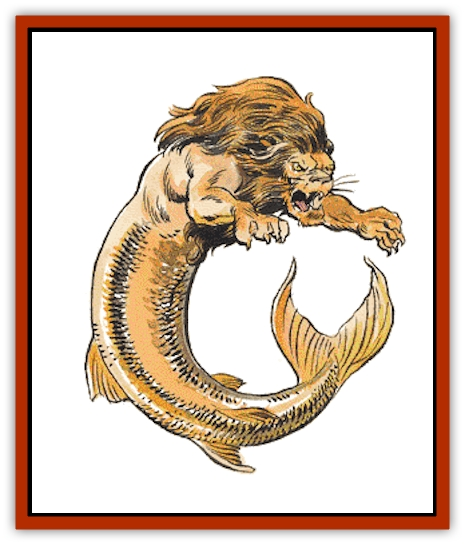

# Sea Lion

| Statistic | **Sea Lion** |
| --- | --- |
| **Activity Cycle:** | Day |
| **Alignment:** | Neutral |
| **Armor Class:** | 5/3 |
| **Climate/Terrain:** | Coastal marine |
| **Damage/Attack:** | 1-6/1-6/2-12 |
| **Diet:** | Carnivore |
| **Frequency:** | Uncommon |
| **Hit Dice:** | 6 |
| **Intelligence:** | Semi- (2-4) |
| **Magic Resistance:** | Nil |
| **Morale:** | Steady (12) |
| **Movement:** | Sw 18 |
| **No. Appearing:** | 3-12 |
| **No. of Attacks:** | 3 |
| **Organization:** | Packs |
| **Size:** | L (15' long with tail) |
| **Special Attacks:** | Mauling |
| **Special Defenses:** | Nil |
| **THAC0:** | 15 |
| **Treasure:** | B |
| **XP Value:** | 420 |

A sea lion is a fearsome creature with the head and forepaws of a [[Cat_Great|lion]] and the body and tail of a [[Fish|fish]].

**Combat:** Sea lions are ferocious and difficult to deal with. They are very territorial and usually attack anything that enters their domains, no matter what the size. Their vicious teeth and huge paws are a match even for most [[Shark|sharks]], which they hate above all other creatures. Sea lions must attack the same opponent with paws and teeth and cannot divide attacks. Any creature hit by both paw attacks in the same round is being mauled. Mauled creatures cannot attack if they have not already done so that round and must roll a successful open doors roll to free themselves. When mauling a creature, the lion follows up with a bite attack with a +4 bonus to the attack roll, causing double damage if successful.

The head of a sea lion, with its thick mane, is treated as AC 5, while the rest of its scaly body is AC 3.

Sea lions are very difficult to raise in captivity, but can become the best and most loyal of steeds. In fact, they are arguably the most powerful mountable creature beneath the waves. They are very useful as guarding and hunting beasts, since their tremendous roar can be heard for up to 10 miles underwater, providing ample time to prepare for an attack or to send help. They are not as skillful swimmers as are [[Sea_Horse_Giant|sea horses]] - they are the underwater equivalents of Maneuverability Class B creatures.

**Habitat/Society:** Sea horses and sea lions almost never encounter one another as sea lions prefer to dwell in the shallow coastal regions, while sea horses delve the deeps. This is primarily due to their respective dietary differences. Sea horses eat plankton, while sea lions eat any type of meat, be it a fish, [[Dinosaur_Aquatic|dinosaur]], or wandering herd animals caught drinking at the water's edge. Sea lions are not afraid of land and it is not unheard of for sea lions to drag themselves a few dozen yards up the beach in search of meals. While these attacks are rare indeed, the reports of sea lions in the vicinity does tend to foster more fear among the general populace than a simple shark attack does. But in a world of [[Squid_Giant|krakens]], dinosaurs, and [[Vampire_General_Information|vampires]], sea lions are a relatively minor threat.

Sea lions roam the seas in packs, what might be called a pride of lions on land. The strongest one (usually with maximum hit points) is the leader. In a sea lion pack, both sexes hunt and care for young, but the males are superior hunters, something that differentiates them from their land-based cousins.

While sea lions rarely travel anywhere with specific goals in mind, they do sometimes team up to aid other packs of lions, usually when they roam close enough to hear the collective bellowing of their comrades. But territoriality comes into play immediately after the kill is made, and rarely does the reigning leader allow the helpful newcomers to share in the spoils of the victory. Often a new battle for power ensues between the two leaders. If the resident leader wins, the newcomers leave without a taste of meat. If the newcomer wins, he and his pack remain just long enough to take first choice of flesh, and then depart for home. The remaining leader, vanquished and weakened before his peers, rarely lives long enough to enjoy the spoils.

**Ecology:** Sea lions hate sharks, often going to great lengths to hunt them down. The taste of sharks is apparently abhorrent to sea lions and they always leave the carcass uneaten, so it is something of a mystery why this rivalry exists. Some sages claim that it is the result of conflicts between the lesser deities of nature, but it is more likely two strong predators vying for supremacy of the seas.

Because of the water-proofing qualities of their thick scales, sea lions can remain out of water for up to 24 hours before their gills dry out and become incapable of removing oxygen from the water. If a sea lion is fed a constant source of water into its mouth, it can survive for an entire week before disease enters the cracking scales and starvation takes its toll. It is theoretically possible to keep a sea lion in captivity but, like most aquatic carnivores, the restriction of space is often psychologically too much for the creature and death slowly takes the once-proud beast.

---
## Discovery & Documentation

**Source Publication:** MC2 Volume II (1993)
**Campaign Setting:** Advanced Dungeons & Dragons 2nd Edition
**Author(s):** Jay Batista, Scott Bennie, Grant Boucher, William W. Connors, Steve Gilbert, Heike Kubasch, James Lowder, David Edward Martin, Bruce Nesmith, Jean Rabe, Rick Swan, John J. Terra, Gary L. Thomas

### Other Creatures Found in This Source Book
   * [[Ant|Ant]]
   * [[Ant_Lion_Giant|Ant Lion, Giant]]
   * [[Ape_Carnivorous|Ape, Carnivorous]]
   * [[Baboon|Baboon]]
   * [[Badger|Badger]]
   * [[Barracuda|Barracuda]]
   * [[Beetle_Giant|Beetle, Giant]]
   * [[Bulette|Bulette]]
   * [[Bullywug|Bullywug]]
   * [[Dwarf_Duergar|Dwarf, Duergar]]
   * [[Dwarf_Gully|Dwarf, Gully]]
   * [[Eagle|Eagle]]
   * [[Eel|Eel]]
   * [[Elemental_Air_Kin|Elemental, Air Kin]]
   * [[Elemental_Water_Kin|Elemental, Water Kin]]
   * [[Elemental_Water_Kin_Water_Weird|Elemental, Water Kin, Water Weird]]
   * [[Firestar|Firestar]]
   * [[Firetail|Firetail]]
   * [[Fish_Giant|Fish, Giant]]
   * [[Frog|Frog]]
   * [[Gorgon|Gorgon]]
   * [[Hawk|Hawk]]
   * [[Heucuva|Heucuva]]
   * [[Hippocampus|Hippocampus]]
   * [[Hippogriff|Hippogriff]]
   * [[Kelpie|Kelpie]]
   * [[Kenku|Kenku]]
   * [[Killmoulis|Killmoulis]]
   * [[Kuo-Toa|Kuo-Toa]]
   * [[Lamia|Lamia]]
   * [[Lammasu|Lammasu]]
   * [[Lamprey|Lamprey]]
   * [[Leech|Leech]]
   * [[Leprechaun|Leprechaun]]
   * [[Leucrotta|Leucrotta]]
   * [[Locathah|Locathah]]
   * [[Lycanthrope_Wereboar|Lycanthrope, Wereboar]]
   * [[Lycanthrope_Werefox|Lycanthrope, Werefox]]
   * [[Mammal_Minimal|Mammal, Minimal]]
   * [[Mammal_Small|Mammal, Small]]
   * [[Mimic|Mimic]]
   * [[Morkoth|Morkoth]]
   * [[Muckdweller|Muckdweller]]
   * [[Myconid|Myconid]]
   * [[Naga|Naga]]
   * [[Obliviax|Obliviax]]
   * [[Octopus_Giant|Octopus, Giant]]
   * [[Otyugh|Otyugh]]
   * [[Piranha|Piranha]]
   * [[Plant_Dangerous_I|Plant, Dangerous I]]
   * [[Plant_Intelligent|Plant, Intelligent]]
   * [[Poltergeist|Poltergeist]]
   * [[Porcupine|Porcupine]]
   * [[Rat_Osquip|Rat, Osquip]]
   * [[Roc|Roc]]
   * [[Roper|Roper]]
   * [[Rot_Grub|Rot Grub]]
   * [[Rust_Monster|Rust Monster]]
   * [[Sahuagin|Sahuagin]]
   * [[Sea_Horse_Giant|Sea Horse, Giant]]
   * [[Shambling_Mound|Shambling Mound]]
   * [[Shark|Shark]]
   * [[Sphinx|Sphinx]]
   * [[Squid_Giant|Squid, Giant]]
   * [[Stirge|Stirge]]
   * [[Swanmay|Swanmay]]
   * [[Tarrasque|Tarrasque]]
   * [[Tasloi|Tasloi]]
   * [[Triton|Triton]]
   * [[Troglodyte|Troglodyte]]
   * [[Urchin|Urchin]]
   * [[Urd|Urd]]
   * [[Weasel|Weasel]]
   * [[Wolverine|Wolverine]]
   * [[Yellow_Musk_Creeper|Yellow Musk Creeper]]
