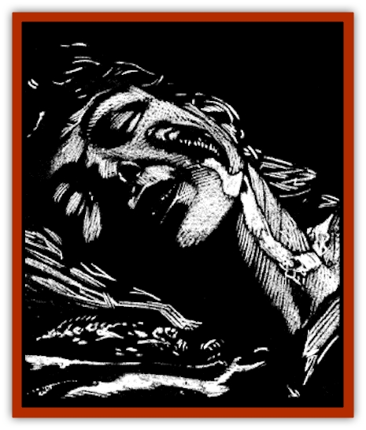

# Sea Spawn - Minion

| Statistic | **Sea Spawn, Minion** |
| --- | --- |
| **Activity Cycle:** | Any |
| **Alignment:** | Lawful evil |
| **Armor Class:** | 5 |
| **Climate/Terrain:** | Coastal (Sea of Sorrows) |
| **Damage/Attack:** | 1 point of damage |
| **Diet:** | Carnivore |
| **Frequency:** | Rare |
| **Hit Dice:** | 1 |
| **Intelligence:** | Low (5-7) |
| **Magic Resistance:** | Nil |
| **Morale:** | Steady (11-12) |
| **Movement:** | 3, Sw 3 |
| **No. Appearing:** | 3-18 (3d6) |
| **No. of Attacks:** | 1 |
| **Organization:** | Group |
| **Size:** | T (6&rdquo; long) |
| **Special Attacks:** | See below |
| **Special Defenses:** | See below |
| **THAC0:** | 19 |
| **Treasure:** | Nil |
| **XP Value:** | 35 |

The minions of the [[Sea_Spawn_Master|sea spawn]] are tiny creatures that seek to inhabit the skull of a coastal villager and control his will and body. Their sole purpose is to provide living flesh for their horrid master.

The minions look like disgusting, slimy, six-inch-long slugs. Unlike their landborn cousins, the minions have a circular mouth, much like that of a [[Lamprey|lamprey]], which they use to bore into their victim's flesh. Their skin is much thicker than that of normal slugs as well, probably as a means of keeping out the salt of the water that would kill regular slugs.

Sea spawn slugs do not speak, but are in constant telepathic contact with their masters.

**Combat:** The only physical attack that sea spawn minions possess is their bite. By itself, this inflicts an insignificant wound and causes only 1 point of damage. However, the bite of the minion injects a powerful poison that renders a victim paralyzed for 1d4 turns unless a saving throw vs. paralyzation is made. Long before the paralysis has worn off, the spawn will bore a tunnel for itself through the soft flesh behind and below the skull of the victim. The gruesome thing then coils around the brain stem and takes control of the host's higher functions.

A sea spawn host retains all memories, spell abilities, and proficiencies, and can use these powers normally. The only noticeable difference is in personality. A spawn's victim becomes detached from his family and friends. Indeed, the thing is waiting for its slimy brothers to come in the following nights and dominate the rest of the town.

Removing a spawn minion is difficult and requires the magical touch of a priest. *Cure* spells have no effect except to heal the spawn and its host of normal damage. *Cure disease* or *restoration* are the only spells that will force the creature out of the victim, though even this will cause 3d6 points of damage as the thing writhes and chews its way back out.

Each day that a slug spends in the skull of a victim lowers that person's Intelligence score by 1 point. If the creature is driven out of its host, the newly liberated mind will be far less alert than it was previously. Nothing short of a *wish* spell will repair this damage.

The sea spawn minions have a telepathic link with all other slugs produced by the same master, so the moment one of them becomes cornered or harmed it will summon 3-18 (3d6) other hosts to help it. The things also have mental contact with the sea spawn master, so it too might send allies to the minion's aid.

Most hosts are villagers with 1 Hit Die. Occasionally the things will find more powerful victims. There is a 25% chance that the spawn have found adventurers generated from the rules presented in the *Monstrous Manual*.

**Habitat/Society:** When a sea spawn master spies a coastal village it thinks will provide it with fresh fodder, it ejects 3d6 minions. These foul creatures make their way to the shore. From that time until an entire village has become dominated, the spawn master will continue to release its slimy children once per night. While at sea, the slugs swim like [[Eel|eels]]. On shore, they are forced to slither like worms or snakes. The slime that coats their bodies is sticky, allowing them to climb up walls and ceilings to drop down on their victims. From there the spawn bite and paralyze their prey, bore into the skull and take up residence in the brain. In this manner, the creatures gradually take control of whole communities.

Not all of a sea spawn's slugs will reach the shore. About 1 in 10 of them are swept out to sea by currents and the like. Most of these die, but about 1% of them grow to become sea spawn masters after about a year.

Sea spawn begin feeding their master mere hours after inhabiting their first victim. Their preferred method is to abduct the young or helpless from the homes of their hosts and toss them into the sea by cover of night. Their malicious master waits greedily for the tender flesh of surface dwellers. If this isn't possible, one of the minions will deliver its own host to the master to sate its hunger for a time.

**Ecology:** Sea spawn minions are born in a sack above the master's gut. From there they are spewed into the sea and forced to swim ashore. Once on the land, they seek out places where they can lurk undiscovered and strike without fear of detection.

The things mature inside their hosts, feeding on brain tissue. Each day that passes sees the mind of the victim partially destroyed by the hunger of the sea spawn. Their life span is short, however, for when the entire village is taken over, they hurl their hosts into the sea where both parties are consumed by the sea spawn master.

---
## Discovery & Documentation

**Source Publication:** Ravenloft Appendix III (1991)
**Campaign Setting:** Ravenloft
**Author(s):** Kirk Botulla

### Other Creatures Found in This Source Book
   * [[Akikage|Akikage]]
   * [[Animator_Common|Animator, Common]]
   * [[Animator_Greater|Animator, Greater]]
   * [[Animator_Minor|Animator, Minor]]
   * [[Animator_General_Information|Animator, General Information]]
   * [[Bakhna_Rakhna|Bakhna Rakhna]]
   * [[Baobhan_Sith|Baobhan Sith]]
   * [[Beetle_Scarab|Beetle, Scarab]]
   * [[Boneless|Boneless]]
   * [[Boowray|Boowray]]
   * [[Bruja|Bruja]]
   * [[Carrionette|Carrionette]]
   * [[Carrion_Stalker|Carrion Stalker]]
   * [[Cat_Midnight|Cat, Midnight]]
   * [[Cat_Skeletal|Cat, Skeletal]]
   * [[Cloaker_Resplendent|Cloaker, Resplendent]]
   * [[Cloaker_Shadow|Cloaker, Shadow]]
   * [[Cloaker_Undead|Cloaker, Undead]]
   * [[Corpse_Candle|Corpse Candle]]
   * [[Death's_Head_Tree|Death's Head Tree]]
   * [[Doppelganger_Ravenloft|Doppelganger (Ravenloft)]]
   * [[Familiar_Pseudo-|Familiar, Pseudo-]]
   * [[Familiar_Undead|Familiar, Undead]]
   * [[Feathered_Serpent|Feathered Serpent]]
   * [[Fenhound|Fenhound]]
   * [[Figurine_Ceramic|Figurine, Ceramic]]
   * [[Figurine_Crystal|Figurine, Crystal]]
   * [[Figurine_Ivory|Figurine, Ivory]]
   * [[Figurine_Obsidian|Figurine, Obsidian]]
   * [[Figurine_Porcelain|Figurine, Porcelain]]
   * [[Figurine_General_Information|Figurine, General Information]]
   * [[Fleas_of_Madness|Fleas of Madness]]
   * [[Furies|Furies]]
   * [[Geist|Geist]]
   * [[Ghost_Animal|Ghost, Animal]]
   * [[Golem_Flesh_Ravenloft|Golem, Flesh (Ravenloft)]]
   * [[Golem_Mist_Ravenloft|Golem, Mist (Ravenloft)]]
   * [[Golem_Wax_Ravenloft|Golem, Wax (Ravenloft)]]
   * [[Gremishka|Gremishka]]
   * [[Hag_Spectral|Hag, Spectral]]
   * [[Head_Hunter|Head Hunter]]
   * [[Hearth_Fiend|Hearth Fiend]]
   * [[Hebi-No-Onna|Hebi-No-Onna]]
   * [[Hound_Phantom|Hound, Phantom]]
   * [[Hound_Skeletal|Hound, Skeletal]]
   * [[Imp_Wishing|Imp, Wishing]]
   * [[Ivy_Crawling|Ivy, Crawling]]
   * [[Jack_Frost|Jack Frost]]
   * [[Jolly_Roger|Jolly Roger]]
   * [[Kizoku|Kizoku]]
   * [[Lashweed|Lashweed]]
   * [[Leech_Magical|Leech, Magical]]
   * [[Leech_Psionic|Leech, Psionic]]
   * [[Lich_Defiler|Lich, Defiler]]
   * [[Lich_Drow|Lich, Drow]]
   * [[Lich_Elemental|Lich, Elemental]]
   * [[Lich_Psionic|Lich, Psionic]]
   * [[Living_Tattoo|Living Tattoo]]
   * [[Lycanthrope_Loup-garou|Lycanthrope, Loup-garou]]
   * [[Lycanthrope_Werejackal|Lycanthrope, Werejackal]]
   * [[Lycanthrope_Werejaguar_Ravenloft|Lycanthrope, Werejaguar (Ravenloft)]]
   * [[Lycanthrope_Wereleopard|Lycanthrope, Wereleopard]]
   * [[Lycanthrope_Wereray|Lycanthrope, Wereray]]
   * [[Mist_Ferryman|Mist Ferryman]]
   * [[Moor_Man|Moor Man]]
   * [[Obedient|Obedient]]
   * [[Odem|Odem]]
   * [[Paka|Paka]]
   * [[Plant_Blood_Rose|Plant, Blood Rose]]
   * [[Plant_Fearweed|Plant, Fearweed]]
   * [[Radiant_Spirit|Radiant Spirit]]
   * [[Recluse|Recluse]]
   * [[Remnant_Aquatic|Remnant, Aquatic]]
   * [[Rushlight|Rushlight]]
   * [[Sea_Spawn_Master|Sea Spawn, Master]]
   * [[Shadow_Asp|Shadow Asp]]
   * [[Shattered_Brethren|Shattered Brethren]]
   * [[Skeleton_Archer|Skeleton, Archer]]
   * [[Skeleton_Insectoid|Skeleton, Insectoid]]
   * [[Skin_Thief|Skin Thief]]
   * [[Spirit_Psionic|Spirit, Psionic]]
   * [[Strahd_Skeleton|Strahd Skeleton]]
   * [[Strahd_Zombie|Strahd Zombie]]
   * [[Unicorn_Shadow|Unicorn, Shadow]]
   * [[Vampire_Drow|Vampire, Drow]]
   * [[Vampire_Nosferatu|Vampire, Nosferatu]]
   * [[Vampire_Oriental|Vampire, Oriental]]
   * [[Virus_General_Information|Virus, General Information]]
   * [[Virus_I|Virus I]]
   * [[Virus_II|Virus II]]
   * [[Virus_III|Virus III]]
   * [[Vorlog|Vorlog]]
   * [[Will_O'Dawn|Will O'Dawn]]
   * [[Will_O'Deep|Will O'Deep]]
   * [[Will_O'Mist|Will O'Mist]]
   * [[Will_O'Sea|Will O'Sea]]
   * [[Zombie_Cannibal|Zombie, Cannibal]]
   * [[Zombie_Desert|Zombie, Desert]]
   * [[Zombie_Wolf|Zombie Wolf]]
   * [[Zombie_Fog|Zombie Fog]]
