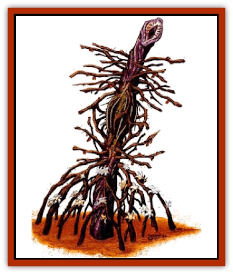
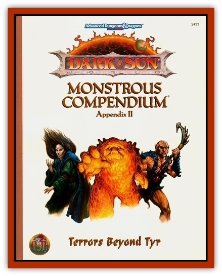

# Seed - Brain

| Statistic | **Seed, Brain** |
| --- | --- |
| **Activity Cycle:** | Day |
| **Alignment:** | Neutral |
| **Armor Class:** | 8 |
| **Climate/Terrain:** | Forest Ridge and mudflats |
| **Damage/Attack:** | 1d6 |
| **Diet:** | Carnivore |
| **Frequency:** | Rare |
| **Hit Dice:** | 3 |
| **Intelligence:** | Very (11-12) |
| **Magic Resistance:** | Nil |
| **Morale:** | Average (8-10) |
| **Movement:** | Nil |
| **No. Appearing:** | 1 |
| **No. of Attacks:** | 3 |
| **Organization:** | Solitary |
| **Size:** | L (9-10' tall) |
| **Special Attacks:** | See below |
| **Special Defenses:** | Nil |
| **THAC0:** | 17 |
| **Treasure:** | Nil |
| **XP Value:** | 270 |

**Psionics Summary**

| Level | Dis/Sci/Dev | Attack/Defense | Score | PSPs |
| --- | --- | --- | --- | --- |
| 5 | 2/3/10 | EW,II,MT/MB,MBk,TS | 10 | 40 |

**Psychometabolism -** *Science:* life detection; *Devotions:* displacement, flesh armor, immovability.

**Telepathy -** *Sciences:* domination, mind link; *Devotions:* attraction, contact, ego whip, id insinuation, mind thrust, phobia amplification.

The brain seed is a rare and cunning plant with strong psionic abilities. The plant has a deep-seated hatred for wizards, especially defilers.

The brain seed is a large sentient plant with a purple hue to its stalks. The plant's white and yellow flowers are always in bloom. The center stalk has a large "bulb" in the center that houses the brain of the plant. At the end of this stalk is the brain seed's mouth.

**Combat:** The brain seed locates and attracts prey using its seeds. The plant releases thousands of seeds each week.

Beings walking within 200 yards of a brain seed plant must make a successful save vs. breath weapon at +2, or become infected with a seed. Potential victims who make Wisdom checks notice the seeds and can remove them before any harm is done. A seed that comes into contact with the flesh and goes unnoticed will plant short roots into the skin within 1d6 rounds. This allows the brain seed to establish contact using its psionic abilities. Normal psionic combat rules apply to all brain seed psionic attacks.

Once contact has been made, the plant attempts to use its domination ability to take control of its victim. If its victim is with a small group (one to three individuals), it uses the dominated individual to lure the party to the main plant. When the group arrives, the brain seed commands its victim to attack the party. The plant uses its life draining ability to attack as well. When the rest of the party has been defeated, the brain seed drains the life force from its dominated victim and any others still alive. With a large party, the brain seed commands the dominated individual to slip away when he is least likely to be noticed. The plant brings the victim to its location to be killed.

If physically threatened, the brain seed uses its psionic abilities of flesh armor and displacement to lower its effective AC. Then it uses three whip-like reeds to attack its adversary. These tails each cause 1-6 (1d6) points of damage.

**Habitat/Society:** The brain seed is native to the Forest Ridge and the mudflats. It is a solitary being that reproduces using the same seeds used to dominate its victims. It does not communicate with other brain seeds. If another begins to grow near an existing adult, the adult brain seed uses its next victim to destroy the seedling.

The brain seed fears and hates wizards, particularly defilers. If a defiler is among those infected with a seed, the plant attempts to dominate him before any other. If this fails, the brain seed dominates another and attacks the defiler.

**Ecology:** The brain seed is carnivorous and feeds upon any creature it can dominate and lure to it. While it is not prey to any creatures on Athas, it is extremely susceptible to defiling magic. If the plant is within the defiler's radius of destruction on any spell of 3rd level or higher, the spell kills the master plant.

---
## Discovery & Documentation

**Source Publication:** Dark Sun Appendix II - Terrors Beyond Tyr (1991)
**Campaign Setting:** Dark Sun
**Author(s):** Jim Atkiss, Steve Brown, Timothy B. Brown, Andrew P. Morris, Bruce Nesmith, Wes Nicholson, Bill Slavicsek

### Other Creatures Found in This Source Book
   * [[Aarakocra_Athas|Aarakocra (Athas)]]
   * [[Animal_Domestic_Athas_II|Animal, Domestic (Athas) II]]
   * [[Aviarag|Aviarag]]
   * [[Baazrag|Baazrag]]
   * [[Baazrag_Boneclaw|Baazrag, Boneclaw]]
   * [[Bloodgrass|Bloodgrass]]
   * [[Cactus_Hunting|Cactus, Hunting]]
   * [[Cactus_Rock|Cactus, Rock]]
   * [[Cilops|Cilops]]
   * [[Crodlu|Crodlu]]
   * [[Dagorran|Dagorran]]
   * [[Dhaot|Dhaot]]
   * [[Drake_Lesser_Athas_General_Information|Drake, Lesser (Athas), General Information]]
   * [[Drake_Lesser_Athas_Magma|Drake, Lesser (Athas), Magma]]
   * [[Drake_Lesser_Athas_Rain|Drake, Lesser (Athas), Rain]]
   * [[Drake_Lesser_Athas_Silt|Drake, Lesser (Athas), Silt]]
   * [[Drake_Lesser_Athas_Sun|Drake, Lesser (Athas), Sun]]
   * [[Dray|Dray]]
   * [[Drik|Drik]]
   * [[Dune_Reaper|Dune Reaper]]
   * [[Dwarf_Athas|Dwarf (Athas)]]
   * [[Elemental_Beast_Athas_Air|Elemental Beast (Athas), Air]]
   * [[Elemental_Beast_Athas_Earth|Elemental Beast (Athas), Earth]]
   * [[Elemental_Beast_Athas_Fire|Elemental Beast (Athas), Fire]]
   * [[Elemental_Beast_Athas_Water|Elemental Beast (Athas), Water]]
   * [[Elf_Athas|Elf (Athas)]]
   * [[Fael|Fael]]
   * [[Feylaar|Feylaar]]
   * [[Fordorran|Fordorran]]
   * [[Giant_Half-giant|Giant, Half-giant]]
   * [[Giant_Shadow|Giant, Shadow]]
   * [[Golem_Athas_Magma|Golem (Athas), Magma]]
   * [[Golem_Athas_Salt|Golem (Athas), Salt]]
   * [[Golem_Athas_General_Information|Golem (Athas), General Information]]
   * [[Gorak|Gorak]]
   * [[Halfling_Athas|Halfling (Athas)]]
   * [[Human_Athas|Human (Athas)]]
   * [[Jhakar|Jhakar]]
   * [[Kaisharga|Kaisharga]]
   * [[Kes'trekel|Kes'trekel]]
   * [[Klar|Klar]]
   * [[Krag|Krag]]
   * [[Kragling|Kragling]]
   * [[Lirr|Lirr]]
   * [[Mastyrial|Mastyrial]]
   * [[Meorty|Meorty]]
   * [[Mul|Mul]]
   * [[Nikaal|Nikaal]]
   * [[Paraelemental_Beast_General_Information|Paraelemental Beast, General Information]]
   * [[Paraelemental_Beast_Magma|Paraelemental Beast, Magma]]
   * [[Paraelemental_Beast_Rain|Paraelemental Beast, Rain]]
   * [[Paraelemental_Beast_Silt|Paraelemental Beast, Silt]]
   * [[Paraelemental_Beast_Sun|Paraelemental Beast, Sun]]
   * [[Pakubrazi|Pakubrazi]]
   * [[Psionocus|Psionocus]]
   * [[Psurlon|Psurlon]]
   * [[Raaig|Raaig]]
   * [[Retriever_Obsidian|Retriever, Obsidian]]
   * [[Ruktoi|Ruktoi]]
   * [[Ruvoka_Athas|Ruvoka (Athas)]]
   * [[Sand_Howler|Sand Howler]]
   * [[Scorpion_Athas|Scorpion (Athas)]]
   * [[Silt_Horror_Black|Silt Horror, Black]]
   * [[Silt_Horror_Magma|Silt Horror, Magma]]
   * [[Silt_Horror_Red|Silt Horror, Red]]
   * [[Silt_Spawn|Silt Spawn]]
   * [[Slig|Slig]]
   * [[Spider_Athas|Spider (Athas)]]
   * [[Spinewyrm|Spinewyrm]]
   * [[Ssurran|Ssurran]]
   * [[Stalking_Horror|Stalking Horror]]
   * [[Tarek|Tarek]]
   * [[Tari|Tari]]
   * [[Thri-kreen|Thri-kreen]]
   * [[T'liz|T'liz]]
   * [[Tohr-kreen_II|Tohr-kreen II]]
   * [[Tohr-kreen_III|Tohr-kreen III]]
   * [[Trin|Trin]]
   * [[Tul'k|Tul'k]]
   * [[Undead_Athas_General_Information|Undead (Athas), General Information]]
   * [[Wraith_Athas|Wraith (Athas)]]
   * [[Xerichou|Xerichou]]
   * [[Zombie_Thinking|Zombie, Thinking]]
