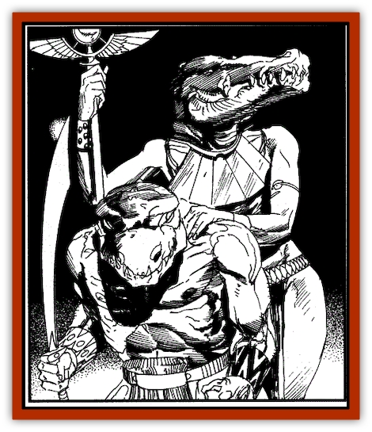
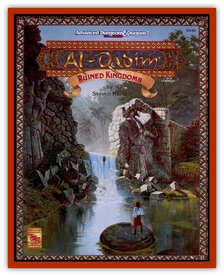

# Segarran

| Statistic | **Greater** | **Lesser** |
| --- | --- | --- |
| **Activity Cycle:** | Any | Any |
| **Alignment:** | Chaotic evil | Chaotic evil |
| **Armor Class:** | - 2 | 1 |
| **Climate/Terrain:** | Tropical/forests | Any |
| **Damage/Attack:** | By weapon type +6 or 3d6 (bite)/2d10 (tail) | By weapon type +2 or 2d8 (bite) |
| **Diet:** | Carnivore | Carnivore |
| **Frequency:** | Very rare | Rare |
| **Hit Dice:** | 9+18 | 5+5 |
| **Intelligence:** | Very to genius (11-18) | Average (8-10) |
| **Magic Resistance:** | 20% | 10% |
| **Morale:** | Champion (16) | Fearless (20) |
| **Movement:** | 12 (as human) or 9, Sw 12 (Fl 18, D) | 9 |
| **No. Appearing:** | 1 | 1-20 (or more) |
| **No. of Attacks:** | 1 (as human) or 2 | 1 |
| **Organization:** | Solitary | Cadres |
| **Size:** | M (6' tall) or H(30' long) | M (6' tall) |
| **Special Attacks:** | See below | Fight and save as 5th-level warriors |
| **Special Defenses:** | See below | Nil |
| **THAC0:** | As priest | 16 |
| **Treasure:** | A | Nil |
| **XP Value:** | 8,000+1,000 per level above 12 | 1,400 |

Segarrans are special minions of Ragarra, an ancient, evil goddess of the jungle, typhoons, and revenge, once openly worshipped in the Ruined Kingdoms.

A lesser segarran has the head and tail of a [[Crocodile|crocodile]] but the stocky, heavily muscled body of a [[Human|human]] or humanoid. Lesser segarrans are usually created from devoted followers, but they also can be created from infant crocodiles using a spell granted only to Ragarra's priestesses. These lesser servants have average human intelligence and can communicate in Midani or any of the dead tongues of the Ruined Kingdoms.

**Combat:** Lesser segarrans fight using the tactics and weapons of 5th-level human warriors, though their supernatural strength lends them a +2 bonus on damage. If unarmed, they attack by biting for 2-16 (2d8) points of damage. All lesser segarrans have 10% magic resistance.

**Habitat/Society:** Once, when the powers of Ragarra were great, even her lesser servants could assume human form and walk the city streets unnoticed; now they are limited to their half-reptile form. They are found primarily in the Ruined Kingdoms and Zakhara's eastern jungles, but they sometimes can be encountered mingling with human society at night, when they can hide their monstrosity through careful disguise. More often they are used as defenders for Ragarra's few shrines or as protectors for her chosen few.

**Ecology:** All segarrans are voracious carnivores. Though they usually subsist on animal meat, they ritually devour their enemies' remains at the end of every battle. When slain, they return to their original (human or baby crocodile) form.

**Greater Segarran**

Only Ragarra's most favored high-level priestesses become greater segarrans as a result of powerful magic. Once transformed, they retain their original human form. Furthermore, they can also assume a towering reptilian shape at will, with the transformation taking but a single round. This reptilian form depends on the personality or whim of the priestess, but usually includes at least the head and tail of a giant crocodile. At 16th level, a greater segarran's reptile form can also include a pair of giant bat wings, permitting her to fly at a rate of 18.

**Combat:** While in human form, Ragarra's chosen fight using the tactics, magical items, and weapons of priests, though their supernatural strength lends them a +6 bonus on damage. They never wear armor, though they may use magical items (such as a *ring of protection*) to enhance their Armor Class. All greater segarrans have 20% magic resistance.

Although they retain most of their priest spells from before the transformation, greater segarrans cannot memorize the highest level spells to which they are normally allowed (for instance, a 13th-level priestess, while a greater segarran, cannot memorize or cast her 6thlevel spells).

In her reptilian form, a greater segarran can attack with her massive jaws (3d6 points of damage) and swipe up to 3 opponents standing beside or behind her with her powerful tail (2d10 points of damage). At 16th level, a segarran's bat wings can also be used for two wing buffets instead of flight, each inflicting 2d6 points of damage. All victims of a tail swipe or wing buffet must save vs. paralyzation or be stunned for 1-4 rounds.

**Habitat/Society:** In addition to the loss of her most powerful spells, a priestess of Ragarra must have a Wisdom of 17 and be at least 12th level to complete the exhausting ceremony that transforms her into a greater segarran.

In return for such power, the priestess must swear to undertake a difficult quest or perform a dangerous service for her goddess. Those few who disappoint Ragarra are punished with a painful demise and suffer an eternity of undeath. More details about the cult of Ragarra can be found in Chapter Three of the Campaign Guide.

**Ecology:** Greater segarrans can easily infiltrate human society. The only clue to their monstrous nature is their craving for raw meat. They must eat the flesh of their fallen enemies as a tribute to Ragarra.

---
## Discovery & Documentation

**Source Publication:** Ruined Kingdoms (1994)
**Campaign Setting:** Al-Qadim (Forgotten Realms)
**Author(s):** Steven Kurtz, Richard Pike-Brown, John D. Rateliff

### Other Creatures Found in This Source Book
   * [[Snake_Serpent|Snake, Serpent]]
