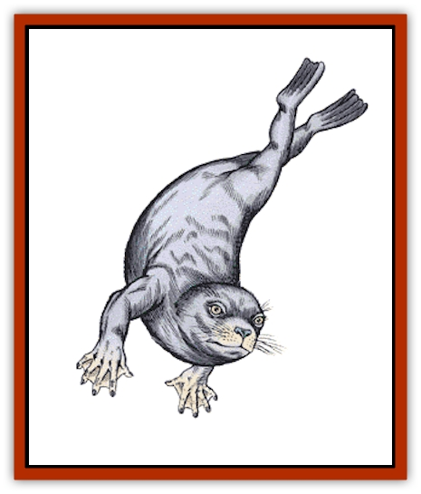

# Selkie

| Statistic | **Selkie** |
| --- | --- |
| **Activity Cycle:** | Any |
| **Alignment:** | Neutral (good) |
| **Armor Class:** | 5 (10 base in human form) |
| **Climate/Terrain:** | Cold to subarctic waters |
| **Damage/Attack:** | 1-6 or by weapon type |
| **Diet:** | Omnivore |
| **Frequency:** | Very rare |
| **Hit Dice:** | 3+3 |
| **Intelligence:** | Average to exceptional (8-16) |
| **Magic Resistance:** | Nil |
| **Morale:** | Steady (11-12) |
| **Movement:** | 12, Sw 36 |
| **No. Appearing:** | 1 or 12-30 |
| **No. of Attacks:** | 1 |
| **Organization:** | Solitary or tribal |
| **Size:** | M (5-6' in either form) |
| **Special Attacks:** | Nil |
| **Special Defenses:** | Can change into human form |
| **THAC0:** | 17 |
| **Treasure:** | A (magic only), R |
| **XP Value:** | 175 / Leader: 420 |

Selkies are seal-like beings that have the ability to change into human form for a few days at a time.

When in their true, seal-like forms, they are nearly indistinguishable from normal seals. Close inspection of their arms, however, will reveal the presence of slightly webbed hands instead of fore flippers and legs instead of a tapering body and rear flippers. Once a month, each selkie is able to assume human form for about a week. Usually selkies prefer to briefly visit the realm of men (which they call the "overworld") out of curiosity, but sometimes they are ordered to go forth and purchase desperately needed supplies or information. When in human form, selkies are very attractive indeed and their fine looks have broken more than a few overworlders' hearts. Their eyes are particularly noticeable as they are always either a bright emerald green or startling light blue. Since the selkie transformation is not a spell or magical effect, only spells like *true seeing* will reveal a selkie's true nature, although their peculiar mannerisms and predilection for seafood also might.

**Combat:** Since selkies are unable to swim quickly while carrying weapons, 90% of selkies encountered underwater will be unarmed. They use their sharp teeth whenever they are cornered but prefer to use their impressive speed underwater to escape superior odds. If encountered on land, selkies are wise enough to bear human weapons, most likely swords scavenged from the wrecks of ships (see below).

**Habitat/Society:** Selkie communities are divided between male and female, with females usually outnumbering males, as male selkies are the hunter/gatherers throughout the often dangerous waters nearby. However, both aspects of selkie "community" (domestic and provider) are equally respected within the lair, and no sex is accorded undue privileges.

Selkies inhabit only colder waters and there are both saltwater and freshwater varieties. Selkies almost always build their lairs in huge, underwater caverns and grottos containing both air and water-filled regions - selkie young must be raised in an air-filled environment for about their first year.

As mentioned earlier, selkies often find and explore wrecks of sunken treasure. Most selkie communities have hoarded at least some booty (especially pearls), keeping those otherwise useless trinkets only for purposes of trade with the overworld. Only selkies who have visited the overworld many times have ever acquired a taste for ornamenting themselves like overworlders, and can be distinguished from more traditional selkies immediately. For obvious reasons, these more experienced selkies are often the best representatives to deal with if one is an overworlder. Selkies can be hired and have a limited knowledge of overworlder customs. All magical treasure recovered by selkies is immediately commandeered for the good of the community and the lair's defense.

**Ecology:** Selkies are omnivorous, preferring to eat fish, shellfish, crustaceans, and various forms of seaweed. Those that have visited the surface are often partial to human fare as well. Selkies are particularly susceptible to fine wine, which is to be expected since these intoxicants are unknown below the seas.

Selkies are sensitive about their environment and harvest only what they need to survive. It is worth noting that selkie representatives lobby heavily whenever local overworlder environmental issues threaten selkie existence. Most selkie communities have learned the value of dropping a few pearls here and there in order to get what they want from men.

While selkies in human form are quite beautiful, they are fortunate indeed that their pelts have little value in overworlder markets. They are, therefore, without any special enemies besides those common to seals and all ocean dwelling beings.

**Selkie Leader**

  Each venerable leader of a selkie community can cast the following spells once per day, one spell per round: *augury*, *cure light wounds*, and *cure disease*. Leaders can also cast *weather summoning* and *control weather* once per week. Selkies fear the wrath of the sea should they ever use their powers for ill.

---
## Discovery & Documentation

**Source Publication:** MC1 Volume I (w/binder #1) (1991)
**Campaign Setting:** Advanced Dungeons & Dragons 2nd Edition
**Author(s):** Jay Batista, Scott Bennie, Grant Boucher, William W. Connors, Steve Gilbert, Heike Kubasch, James Lowder, David Edward Martin, Bruce Nesmith, Jean Rabe, Rick Swan, John J. Terra, Gary L. Thomas

### Other Creatures Found in This Source Book
   * [[Bat|Bat]]
   * [[Bear|Bear]]
   * [[Behir|Behir]]
   * [[Boar|Boar]]
   * [[Bookworm|Bookworm]]
   * [[Brownie|Brownie]]
   * [[Bugbear|Bugbear]]
   * [[Carrion_Crawler|Carrion Crawler]]
   * [[Cat_Great|Cat, Great]]
   * [[Catoblepas|Catoblepas]]
   * [[Dragon_General_Information|Dragon, General Information]]
   * [[Dragonfish|Dragonfish]]
   * [[Elemental_Air_Kin_Aerial_Servant|Elemental, Air Kin, Aerial Servant]]
   * [[Elemental_Earth_Kin_Sandling|Elemental, Earth Kin, Sandling]]
   * [[Elephant|Elephant]]
   * [[Gnoll|Gnoll]]
   * [[Hobgoblin|Hobgoblin]]
   * [[Homunculus|Homunculus]]
   * [[Hornet_Giant|Hornet, Giant]]
   * [[Horse|Horse]]
   * [[Hyena|Hyena]]
   * [[Jackal|Jackal]]
   * [[Jackalwere|Jackalwere]]
   * [[Korred|Korred]]
   * [[Lich|Lich]]
   * [[Lizard|Lizard]]
   * [[Lizard_Man|Lizard Man]]
   * [[Lycanthrope_General_Information|Lycanthrope, General Information]]
   * [[Lycanthrope_Seawolf|Lycanthrope, Seawolf]]
   * [[Lycanthrope_Werebear|Lycanthrope, Werebear]]
   * [[Lycanthrope_Weretiger|Lycanthrope, Weretiger]]
   * [[Lycanthrope_Werewolf|Lycanthrope, Werewolf]]
   * [[Manticore|Manticore]]
   * [[Medusa|Medusa]]
   * [[Mind_Flayer|Mind Flayer]]
   * [[Minotaur|Minotaur]]
   * [[Mudman|Mudman]]
   * [[Mummy|Mummy]]
   * [[Nixie|Nixie]]
   * [[Nymph|Nymph]]
   * [[Ogre|Ogre]]
   * [[Ooze_Slime_Jelly_I|Ooze/Slime/Jelly I]]
   * [[Ooze_Slime_Jelly_II|Ooze/Slime/Jelly II]]
   * [[Orc|Orc]]
   * [[Owl|Owl]]
   * [[Owlbear_I|Owlbear I]]
   * [[Pegasus|Pegasus]]
   * [[Piercer|Piercer]]
   * [[Pudding_Deadly|Pudding, Deadly]]
   * [[Rakshasa|Rakshasa]]
   * [[Rat|Rat]]
   * [[Ray|Ray]]
   * [[Remorhaz|Remorhaz]]
   * [[Satyr|Satyr]]
   * [[Scorpion|Scorpion]]
   * [[Shadow|Shadow]]
   * [[Skeleton|Skeleton]]
   * [[Skunk|Skunk]]
   * [[Snake|Snake]]
   * [[Spectre|Spectre]]
   * [[Spider|Spider]]
   * [[Sprite|Sprite]]
   * [[Toad_Giant|Toad, Giant]]
   * [[Treant|Treant]]
   * [[Troll|Troll]]
   * [[Umber_Hulk|Umber Hulk]]
   * [[Unicorn|Unicorn]]
   * [[Vampire|Vampire]]
   * [[Wight|Wight]]
   * [[Will_O'Wisp|Will O'Wisp]]
   * [[Wolf|Wolf]]
   * [[Wolfwere|Wolfwere]]
   * [[Wraith|Wraith]]
   * [[Wyvern|Wyvern]]
   * [[Yeti|Yeti]]
   * [[Yuan-ti|Yuan-ti]]
   * [[Zombie|Zombie]]
