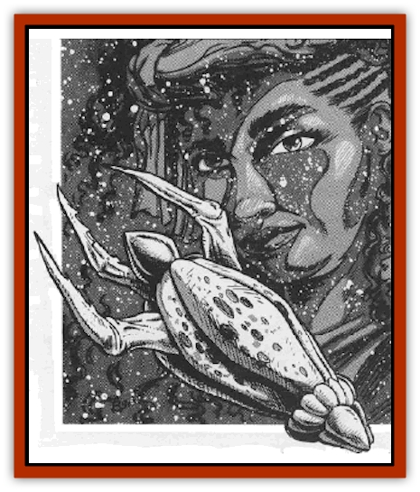

# Selkie - Star

| Statistic | **Selkie, Star** |
| --- | --- |
| **Activity Cycle:** | Any |
| **Alignment:** | Neutral good |
| **Armor Class:** | 2 (prow -2), 10 in human form |
| **Climate/Terrain:** | Wildspace/phlogiston |
| **Damage/Attack:** | 1d2 hull points or by weapon |
| **Diet:** | Carnivore |
| **Frequency:** | Very rare |
| **Hit Dice:** | 4 |
| **Intelligence:** | Average to genius (8-18) |
| **Magic Resistance:** | Nil |
| **Morale:** | Elite (13-14) |
| **Movement:** | Fly 12 (B), SR 5 |
| **No. Appearing:** | 1 or 10-20 |
| **No. of Attacks:** | 1 |
| **Organization:** | Solitary or tribal |
| **Size:** | M (5-8' in either form) |
| **Special Attacks:** | Nil |
| **Special Defenses:** | Change to human form |
| **THAC0:** | 17 |
| **Treasure:** | A (magic only), R |
| **XP Value:** | 270 |

Star selkies, though large and carnivorous, are actually an ethereal, shape-changing humanoid race. In their human form, they are kind, gentle, individuals of remarkable beauty. Like [[Selkie|terrestrial selkies]], they have striking green, blue, or black eyes, with irises that sparkle with an inner light. Though somewhat absentminded, they are highly intelligent and well-versed in the lore of wildspace.

Selkies may retain their human form for up to two weeks at a time. In human form, the selkie communicate in both its own language and Common. In flight, selkies understand spoken language, but communicate among themselves in an unspoken tongue that is as yet unknown.

It is said that star selkies originated from a group of Ptah worshippers whose colony barge crashed on a barren asteroid. In answer to their prayers of salvation, Ptah turned them into the graceful, space-adapted selkies. However, there is only circumstantial evidence of this legend.

**Combat:** In flight, star selkies are savage, deadly fighters. Their armored, bullet-shaped bodies have razor-sharp guide fins and a prow sheathed in natural armor (AC 2). This armored prow does 1d2 hull points of damage. As high-speed battering rams, they impale their prey. The selkie then extrudes ten tentacles that automatically hit impaled victims. These tentacles, tipped with [[Lamprey|lamprey]]-like mouths, attach to the victims and drain 1 hit point per round. A successful Bend Bars/Lift Gates roll destroys one tentacle. A victim can roll to destroy a tentacle once per round.

Star selkies use an inborn ability similar to a fly spell to move in any direction, as slowly as a walking human (MV 12) or as fast as a seasoned spelljammer (SR 5).

**Habitat/Society:** Star selkie communities resemble their terrestrial counterparts. Both sexes hunt and gather food and share responsibilities for child-rearing. If anything, star selkies are more gregarious than their sea-going kin, occasionally even settling larger human habitations in selkie enclaves. The selkie predilection for scavenging space wrecks has proven to be very useful to them. A number of selkie merchants deal in "reclaimed goods".

Though primarily carnivorous, selkies consider eating humanoid flesh an act of cannibalism. They prefer to eat the wildlife of wildspace, and do not normally attack spelljamming ships (except in self defense). On the contrary, star selkies sometimes help lost travelers, leading them to safe, well-charted areas.

The selkie leaders can cast the following spells once per day: *create air*, *charm monster*, *cure critical wounds*, and *sunray*. They also have an ability similar to a modified *stone shape* spell that allows them to construct their enclaves. The leader casts these spells as a 8th-level wizard.

**Ecology:** Though the star selkie is a carnivore, it is sensitive to over-hunting of its habitat. Trade with ground dwellers supplements its diet. The star selkie population has increased slightly, but their birthrate is still low.

Star selkies have a special gland that produces oxygen, allowing them to travel in space as long as there is food to eat. This gland does not function properly until the selkie's third year of life, so selkie habitats (called "enclaves") must be air-filled.

Star selkies occasionally attract and take human mates. Offspring of such a pairing breed true as selkies. Such mixed colonies are easy to spot, for the enclaves sport intricate freeform surface dwellings to accommodate the human mates. These surface dwellings tend to be large Egyptian-style structures, lending further credence to the theory of Ptah-worshipping ancestry.

---
## Discovery & Documentation

**Source Publication:** MC9 Spelljammer Appendix II (1991)
**Campaign Setting:** Planescape
**Author(s):** Scott Davis, Newton Ewell, John Terra

### Other Creatures Found in This Source Book
   * [[Alchemy_Plant|Alchemy Plant]]
   * [[Allura|Allura]]
   * [[Aperusa|Aperusa]]
   * [[Autognome|Autognome]]
   * [[Bionoid|Bionoid]]
   * [[Bloodsac|Bloodsac]]
   * [[Buzzjewel|Buzzjewel]]
   * [[Constellate|Constellate]]
   * [[Contemplator|Contemplator]]
   * [[Dohwar|Dohwar]]
   * [[Dragon_Moon|Dragon, Moon]]
   * [[Dragon_Stellar|Dragon, Stellar]]
   * [[Dragon_Sun|Dragon, Sun]]
   * [[Dreamslayer|Dreamslayer]]
   * [[Dweomerborn|Dweomerborn]]
   * [[Fal|Fal]]
   * [[Feesu|Feesu]]
   * [[Fire_Bat|Fire Bat]]
   * [[Firebird|Firebird]]
   * [[Firelich|Firelich]]
   * [[Flowfiend|Flowfiend]]
   * [[Gadabout|Gadabout]]
   * [[Gammaroid|Gammaroid]]
   * [[Gonn|Gonn]]
   * [[Gossamer|Gossamer]]
   * [[Grav|Grav]]
   * [[Great_Dreamer|Great Dreamer]]
   * [[Greatswan|Greatswan]]
   * [[Grell_Colonial|Grell, Colonial]]
   * [[Gullion|Gullion]]
   * [[Insectare|Insectare]]
   * [[Lhee|Lhee]]
   * [[Mercurial_Slime|Mercurial Slime]]
   * [[Meteorspawn|Meteorspawn]]
   * [[Monitor|Monitor]]
   * [[Owl_Space|Owl, Space]]
   * [[Pristatic|Pristatic]]
   * [[Scro|Scro]]
   * [[Silatic|Silatic]]
   * [[Skullbird|Skullbird]]
   * [[Sleek|Sleek]]
   * [[Sluk|Sluk]]
   * [[Space_Swine|Space Swine]]
   * [[Sphinx_Astro-|Sphinx, Astro-]]
   * [[Spirit_Warrior|Spirit Warrior]]
   * [[Starfly_Plant|Starfly Plant]]
   * [[Stargazer|Stargazer]]
   * [[Undead_Stellar|Undead, Stellar]]
   * [[Witchlight_Marauder|Witchlight Marauder]]
   * [[Xixchil|Xixchil]]
   * [[Yitsan|Yitsan]]
   * [[Zurchin|Zurchin]]
